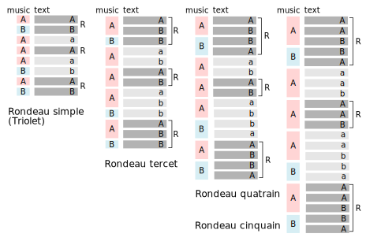
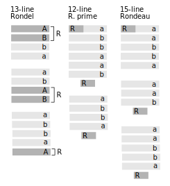

.. TODO: research terzanelle 

.. _syntagmics:

----------
Syntagmics
----------

.. epigraph::

    | When Ajax strives, some Rock's vast Weight to throw,
    | The Line too labours, and the Words move slow:

    -- `Essay on Man`_, Alexander Pope

Formalization
-------------

**Prior Definitions**

Given below are existing definitions of poetical devices. 

.. topic:: Definition: Feet
    
    - Iamb: One unstressed syllable followed by a stressed syllable.
    - Spondee: A stressed syllable followed by a stressed syllable. Employed to slow down the pace of a line.
    - Dactyl: A stressed syllable followed by two unstressed syllables. Employed to create a sense of falling or release.
    - Trochee: A stressed syllable folowed by an unstressed syllable. Employed to emphasize urgency or directness.
    - Anapest: Two unstressed syllables followed by a stressed syllable. Employed to create a sense of building momentum.
    - Pyrrchic: Two unstressed syllables. 
    - Amphibrach: An unstressed syllable followed by a stressed syllable and then another unstressed syllable.
    - Bacchius: An unstressed syllable followed by two stressed syllables. 
    - Antibacchius: Two stressed syllables followed by an unstressed syllable.

.. topic:: Definition: Lines

    - Dimeter: A line with two feet.
    - Trimeter: A line with three feet.
    - Tetrameter: A line with four feet.
    - Pentameter: A line with five feet.
    - Hexmeter: A line with six feet.
    - Heptameter: A line with seven feet.
    - Octameter: A line with eight feet. 
    - Hendecasyllable: A line consisting of eleven syllables. 

.. topic:: Definitions: Stanzas

    - Couplet: A stanza with two lines.
    - Tercet: A stanza with three lines
    - Quatrain: A stanza with four lines
    - Cinquain: A stanza with five lines
    - Sestet: A stanza with six lines.
    - Septet: A stanza with seven lines.
    - Octet: A stanza with eight lines.
    - Nonet: A stanza with nine lines.
    - Decastich: A stanza with ten lines.
    - Envoi: A short, concluding stanza.

**Constants**

1. Uppercase English letters (A, B, C, ... ): Fixed lines.
2. Uppercase Coptic letters (Ⲁ, Ⲃ, Ⲅ , ... ): Fixed words.
3. Uppercase Greek letters (Α, Β, Γ, ): Fixed syllables.
4. The lowercase English letter n is reserved for natural numbers.
5. The lowercase Fraktur letter 𝔦 is reserved for iambs.
6. The lowercase Fraktur letter 𝔱 is reserved for trochees.
7. The lowercase Fraktur letter 𝔰 is reserved for spondees. 
8. The lowercase Fraktur letter 𝔞 is reserved for anapests.
9. The lowercase Fraktur letter 𝔡 is reserved for dactyls.
10. The mathematical symbol ∅ is reserved for the pause (caesura). 
11. The ampersand & represents blank newlines. 
   
**Variables**

1. Lowercase English letters (a, b, c, ... ): Indeterminate rhymed lines.
    a. The lowercase English letters u, v, w are reserved for indeterminate lines, not necessarily rhymed. 
2. The lowercase Greek letters φ, χ, ψ are reserved for indeterminate rhymed words.
    a. The lowercase Greek letter λ is reserved for indetermine words, not necessarily rhymed.
3. The Coptic letters ⲡ, Ⲡ are reserved for indeterminate syllables. 
4. The lowercase Fraktur letter 𝔵 is reserved for indeterminate meters.
5. The lowercase Greek letter ς is reserved for indeterminate stanzas.
6. The lowercase English letters p and q are reserved for indeterminate poems. 

.. important::

    Upper English letters are meant to denote particular lines, whereas lowercase English letters are meant to denote indeterminate lines that are related through their rhyme scheme. 

.. note::

    The choice of ⲡ and Ⲡ to represent syllables mirrors the unstressed and stressed syllables of verses. In other words, ⲡ is meant to represent indeterminate unstressed syllables, whereas Ⲡ is meant to represent indeterminate stressed syllables. 

The variables will sometimes be referred to as *syntagmic variables*, or *signs*. 

Uppercase-lowercase pairs of English letters are understood to be rhymes. The difference in the symbolism is the *fixed* nature of the denotation. For example, the expression *A.a.a.A* denotes one fixed line, a rhyming couplet and then the fixed line again,

    | The cat on the mat
    | Got large and fat
    | So-and-so such that 
    | The cat on the mat

The intent behind defining p and q as "*poetic*" variables is to formalize the schema of a certain fixed poetic forms through operations performed on word and syllabic variables. "*Poetic*" variables can be seen as the well-formed formulae that emerge through the calculus that governs the lower levels of the syntagmic hierarchy.

**Notation**

1. x.y (**Succession**): Successive signs.
2. x-y (**Concatenation**): Concatenated signs.
3. x:y (**Delimitation**): Delimited signs.
4. x ∨ y (**Disjunction**): A sign that is either x or y.
5. x + y (**Separation**): Separated signs.
6. x∝λ : Sign containing a word. 
7. x(λ) : A sign ending in a word.  
8. (λ)x: A sign beginning with a word. 
9. x(ⲡ): A sign ending in a syllable.
10. (ⲡ)x: A sign starting with a syllable
11. x.y.x | x = z: Substitute z for x in the sign "x.y.x"

Brackets, [], are used to group operations within expressions by precedence.

To see what is meant by the distinction between *separation* and *succession*, let x = "*the fish in the dish*" and y = "*the dog on a jog*". Then x.y means,

    | the fish in the dish
    | the dog on a jog

Where as x + y means,

    | the fish in the dish
    | 
    | the dog on a jog

From this, it can be see the operation of *successions* inserts a new line after the first line, whereas the operation of *separation* inserts a new line after the first line *and* before the second line, to create a blank line between them. In effect, the operation of *separation* creates stanzas, whereas the operation of *succession* creates lines. 

**Examples**

a.b.a
    A tercet where the first and third lines rhyme. 

A.b.A 
    A tercet where the first and third lines are the same. 

a.b.a + a.b.a 
    Two rhyming tercets.

a.b.[b ∨ a]
    A tercet where the last line rhymes with either the first line or the second line.

**Scope**

The *scope* of a rhyme is denoted with a bar. Any line variable of the same character that feels under the scope of a bar rhymes, whereas the same variable used outside of the scope of the bar is not required to rhyme with the variable under the bar. An example will help clear this up. Consider the differences that separate the two poetical propositions, :math:`p` and :math:`q`,

.. math::

   p = \overline{a.b.a} + \overline{a.b.a}

.. math::

   q = \overline{a.b.a + a.b.a}

In the case of *p*, the line variable *a* in the first stanza is not required to rhyme with the line variable *a* in the second stanza. In the case of *q*, the line variable *a* in both the first and second stanza must rhyme. For example, the following values of *p* and *q* satisfy these definitions. For *p*,

    | the dog is brown 
    | the cat is green.
    | the fish does drown. 
    |
    | the dog is blue. 
    | the cat is red. 
    | the fish eats you. 

Whereas for *q*,

    | the dog is brown 
    | the cat is green 
    | the fish does drown
    |
    | the dog does frown.
    | the cat is mean. 
    | the fish gets down. 

If the bar is omitted from an expression, it is implied to extend over the entire proposition.

**Provisional Notation**

1. #x: A lengthened sign. 
2. ♭x: A shortened sign.  

Virelais require alternating rhymes to shorten and length across stanzas. The signs "#x" and "♭x" are here provisionally offered as a symbolic way of capturing this form. However, further research needs to be done on the exact syntactical rules of these signs. 

**Shorthand**

1. Summation: The connotation of the "+" symbol is leveraged to extend the symbolism to the "*Σ*" symbol, i.e.,

.. math::

    \sum_1^{n} x_i

Is meant to denote a series of signs separated by blank lines. 

2. Delimitation: A *delimitation* is mainly used in reference to words or syllables, and can be seen as a shorthand for excessive concatenation. *Delimitation* denotes the insertion of *pauses* (delimiters) in between words,

    Ⲁ:Ⲃ:Ⲅ = Ⲁ-∅-Ⲃ-∅-Ⲅ

**Propositions**
    
1. All stanzas are made of lines. 

.. math::
    
    \forall \varsigma: \exists x: \varsigma = x

.. note:: 

    This is not quite right. Need some way to expressing "*atleast*", i.e. there exists some lines such that a stanza has atleast that many lines. 

1. All poems are made of stanzas. 

.. math::

    \forall p: \exists n: p  = \sum_1^{n} \varsigma_i  

**Theorems**

1. The scope of a poem is not equal to the scope of its stanzas. 

.. math::

    \forall p: \forall n: \sum_1^{n} \overline{\varsigma_i} \neq \overline{ \sum_1^{n} \varsigma_i }

.. note:: 

    This is also not quite right. Need some way of expressing "*necessarily*". The scope of rhymes over the entire poem isn't *necessarily* equivalent to the scope of the rhymes within the stanzas. 

**Meter**

𝔦 = ⲡ-Ⲡ
    The definition of an **iamb**

𝔱 = Ⲡ-ⲡ
    The definition of a **trochee**

𝔰 = Ⲡ-Ⲡ
    The definition of a **spondee**

𝔡 = Ⲡ-ⲡ-ⲡ
    The definition of **dactyl**

𝔞 = ⲡ-ⲡ-Ⲡ
    The definition of a **anapest**

.. topic:: Definition: Meters

    :math:`a/\mathfrak{x}_n` denotes a line in :math:`\mathfrak{x}` n-meter. 

For example, 

.. math::

    (a/\mathfrak{i}_4).(b/\mathfrak{i}_3).(a/\mathfrak{i}_4)

Refers to a tercet where the first and third line are written in iambic tetrameter, whereas the second line is written in iambic trimeter. In other words,

.. math::

    (a/\mathfrak{i}_4) = \pi_1 - \Pi_1 - \pi_2 - \Pi_2 - \pi_3 - \Pi_3 - \pi_4 - \Pi_4

Note in this example the first and third line rhyme. 
The scope of a meter extends to everything contained in the parenthesis it marks. For example,

.. math::

    (a.a/\mathfrak{i}_4)

Denotes a rhyming couplet where each line is written in iambic tetrameter. 

.. _schemes:

Schemes
-------

.. _ballad:

Ballad
^^^^^^

.. topic:: Schema

    .. math::

        \sum_1^{n} \overline{(a/\mathfrak{i}_4).(b/\mathfrak{i}_3).(a ∨ c/\mathfrak{i}_4).(b/\mathfrak{i}_3)}

**References**

- `A tragical ballad of the unfortunate loves of Lord Thomas and fair Eleanor`_, Frances James Child
- `The Ballad of the Goodly Fere`_, Ezra Pound
- `The Ballad of Sir Patrick Stern`_, W. Scott
- `La Belle Dame sans Merci`_, John Keats
- `Lord Thomas and Annet`_, Old English Ballad
- `Tam Lin`_, Old Scottish Ballad

.. _ballade: 

Ballade
^^^^^^^

.. topic:: Schema
    
    .. math::

        a.b.a.b.b.c.b.C + a.b.a.b.b.c.b.C + a.b.a.b.b.c.b.C + b.c.b.C

.. topic:: Schema (Ballade Royal)

    .. math::

        [a.b.a + b.b + c.c] \lor [a.b.a.b + b.c.c]

.. topic:: Schema (Chant Royal)

    .. math::

        \sum_1^{5} \overline{a.b.a.b.c.c.d.d.e.d.E + d.d.e.d.E \lor c.c.d.d.e.d.E}

**References**

None yet found. 

.. _kyrielle:

Kyrielle
^^^^^^^^

.. topic:: Schema 

    .. math::

        \sum_1^{n} [ a.a.b.B \lor a.A.b.b ]

**References**

- `A Lark in the Mesh`_, John Payne
- `A Lenten Hymn`_, Thomas Campion

.. _ode:

Ode
^^^

No fixed schema.

.. list-table:: 
    
  * - Greek
    - ᾠδή
  * - Latin
    - oda
  * - French
    - ode
  * - English
    - ode

**References**

- `Ode on a Grecian Urn`_, John Keats
- `Ode to a Nightingale`_, John Keats
- `Ode to the West Wind`_, Percy Blysse Shelely

.. _ottava:

Ottava
^^^^^^

.. topic:: Schema (ottava siciliana)

    .. math::
        
        \overline{a.b.a.b.a.b.a.b}

.. topic:: Schema (strambotto)

    .. math::

        \overline{a.b.a.b.c.c.d.d}

Each line in a *ottava siciliana* or *strambotto* is a hendecasyllable.

.. topic:: Schema (ottava rima)

    .. math::

        \overline{(a.b.a.b.a.b.c.c/\mathfrak{i}_5)

**References**

None yet found.

.. _pantoum:

Pantoum
^^^^^^^

.. topic:: Schema

    A.B.C.D + B.E.D.F + E.G.F.H + ... + x.y.C.A

**References**

- `Pantoum of the Great Depression`_, Donald Justice

.. _rondeau:

Rondeau
^^^^^^^

**Medieval Rondeaus**

The following diagram shows the different schemata for the rondeau form in 14th-century France,

.. topic:: Rondeau Schema (Medieval)

    1. Couplet: A.B.a.A.a.b.A.B
    2. Tercet: A.B.B.a.b.A.B.a.b.b.A.B.B
    3. Quatrain: A.B.B.A.a.b.A.B.a.b.b.a.A.B.B.A
    4. Cinquain: A.A.B.B.A.a.a.b.A.A.B.a.a.b.b.a.A.A.B.B.A

    This schema can be rewritten to emphasize the *refrain R* within in the form using substitution notation,

    5. Couplet: R.a.A.a.b.R | R = A.B 
    6. Tercet: R.a.b.A.B.a.b.b.R | R = A.B.B
    7. Quatrain: R.a.b.A.B.a.b.b.a.R | R = A.B.B.A 
    8. Cinquain: R.a.a.b.A.A.B.a.a.b.b.a.R | R = A.A.B.B.A

Note that a *Rondeau Couplet* is simply a :ref:`triolet`. 

**Renaissance Rondeaus**

The following diagrams shows the different schemata for the rondeau form duing the Renaissance, 

.. topic:: Rondeau Schema (Renaissance)

    1. Rondel: A.B.a.b + a.b.A.B + a.b.b.a.A
    2. Rondeau Prime: R-a.b.b.a.a.b.R + a.b.b.a.R
    3. Rondeau: R-a.a.b.b.a + a.a.b + a.a.b.b.a.R

**Roundel**

.. topic:: Roundel Schema 

    a.b.a.R + b.a.b + a.b.a.R 

**References**

- `In Flanders Field`_, John McCrae
- `We Wear the Mask`_, Paul Laurence Dunbar

.. _sestina:

Sestina
^^^^^^^

Six sestets followed by a tercet envoi.

.. topic:: Schema

   u(Ⲁ).v(Ⲃ).w(Ⲅ).x(Ⲇ).y(Ⲉ).z(Ⲋ) + 
   u(Ⲋ).v(Ⲁ).w(Ⲉ).x(Ⲃ).y(Ⲇ).z(Ⲅ) + 
   u(Ⲅ).v(Ⲋ).w(Ⲇ).x(Ⲁ).y(Ⲃ).z(Ⲉ) +
   u(Ⲉ).v(Ⲅ).w(Ⲃ).x(Ⲋ).y(Ⲁ).z(Ⲇ) +
   u(Ⲇ).v(Ⲉ).w(Ⲁ).x(Ⲅ).y(Ⲋ).z(Ⲃ) +
   u(Ⲃ).v(Ⲇ).w(Ⲋ).x(Ⲉ).y(Ⲅ).z(Ⲁ) + 
   [u∝Ⲁ.v∝Ⲃ.w∝Ⲅ] ∨ [u∝Ⲅ.v∝Ⲇ.w∝Ⲉ] ∨ [u∝Ⲋ.v∝Ⲃ.w∝Ⲇ]

**References**

- `Sestina (Bishop)`_, Elizabeth Bishop
- `Sestina of the Tramp-Royal`_, Rudyard Kipling
- `Sestina, Travel Notes`_, 

.. _sonnet:

Sonnet
^^^^^^

.. topic:: Schema (Petrachan)

    a.b.b.a.a.b.b.a + c.d.e.c.d.e ∨ c.d.c.d.c.d
   
.. topic:: Schema (Shakespearan)

   .. math::

        ([\sum_i^{3} \overline{a.b.a.b}] + a.a/\mathfrak{i}_5)

.. topic:: Schema (Spenserian)

    .. math::

        \overline{(a.b.a.b + b.c.b.c + c.d.c.d + e.e/\mathfrak{i}_5)}

**References**

- `Batter My Heart, Three Person'd God`_, John Donne
- `Death Be Not Proud`_, John Donne
- `On the Grasshopper and Cricket`_, John Keats
- `When I Have Seen By Times Fell Hand Defac'd`_, William Shakespeare

.. _terza:

Terza
^^^^^

.. topic:: Schema

    .. math::

        \overline{a.b.a + b.c.b + c.d.c + d.e.d +  ... }

**References**

None yet found.

.. _triolet:

Triolet
^^^^^^^

.. topic:: Schema

    .. math::

        \overline{(A.B.a.A.a.b.A.B/\mathfrak{i}_4)}

**References**

- `Birds at Winter Nightfall`_, Thomas Hardy
- `How Great My Grief`_, Thomas Hardy

.. _virelai:

Virelai
^^^^^^^

.. topic:: Schema (Ancien)
    
    .. math::
        
        \overline{a.a.♭b.a.a.♭b.a.a.♭b + b.b.♭c.b.b.♭c.b.b.♭c + ... }

.. topic:: Schema (Nouveau)

    .. math::

        \overline{A_1.b.b.a.A_2 + B_1.c.c.b.B_2 +  ... }
    
**References**

- `July`_, Henry Austin Dobson
- `Spring Sadness`_, John Payne

.. _villanelle:

Villanelle
^^^^^^^^^^

.. topic:: Schema 

    A :sub:`1`.b.A :sub:`2` + a.b.A :sub:`1` + a.b.A:sub:`2` + a.b.A :sub:`1` + a.b.A :sub:`2` + a.b.A :sub:`1` .A :sub:`2`

**References**

- `Do Not Go Gentle into That Good Night`_, Dylan Thomas
- `Mad Girl's Love Song`_, Sylvia Plath
- `One Art`_, Elizabeth Bishop
- `Song`_, John Fuller
- `The Waking`_, Theodore Roethke
  
