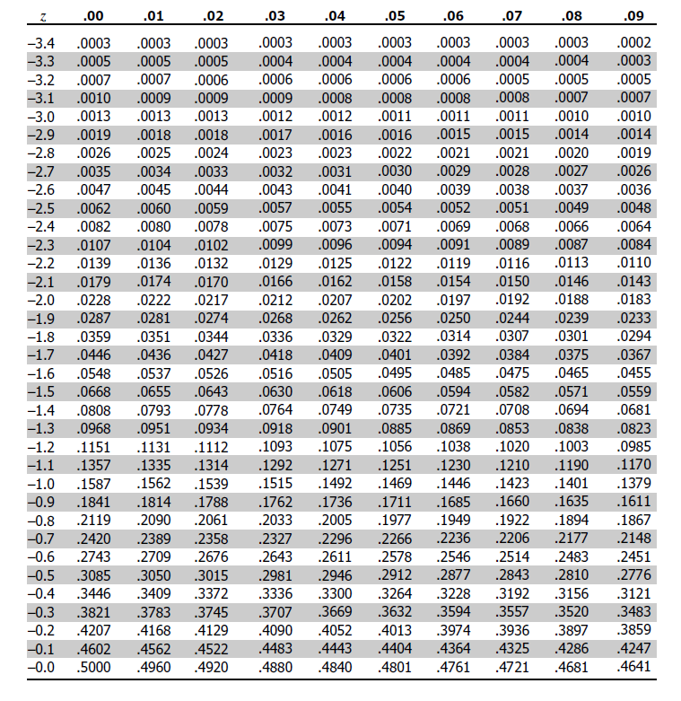
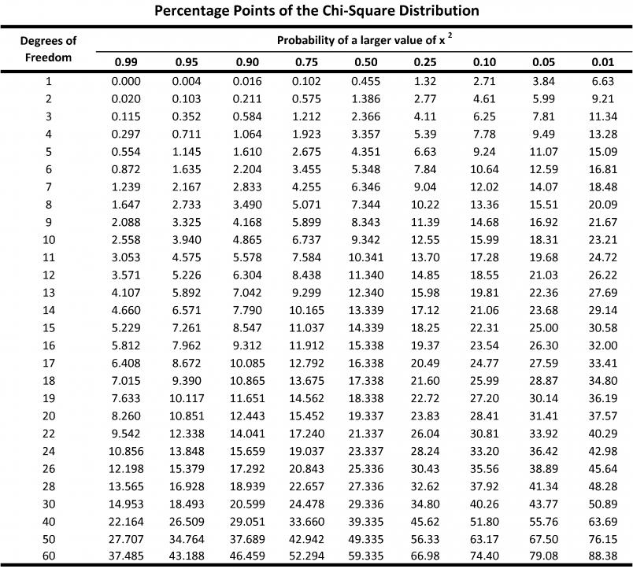
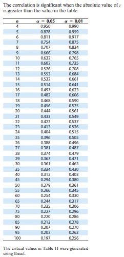

.. _tabula:

Tabula
======

.. _random-digits:

-------------
Random Digits
-------------

.. _z-table:

-------
Z Table
-------

Negative Z Values
-----------------

Postive Z Values 
----------------

.. image:: ../_static/img/math/tables/table_positive_z.png
    :align: center
    :alt: Positive Z Table

.. _chi-squared-table:

--------------------
:math:`\chi^2` Table 
--------------------

.. _t-table:

-------
T Table
-------

.. image:: ../_static/img/math/tables/table_t.jpg
    :align: center
    :alt: Student's T Table

.. _pearson-correlation-table:

-------------------------------------
Pearson Correlation Coefficient Table
-------------------------------------

