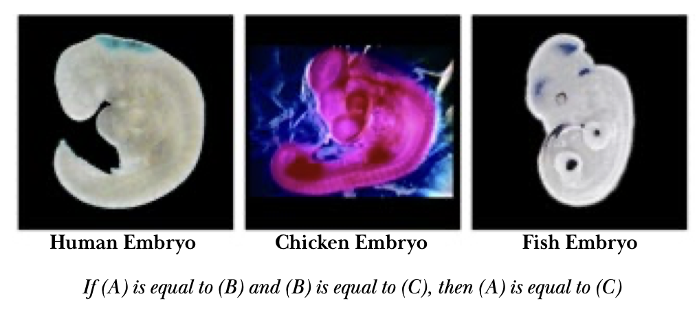
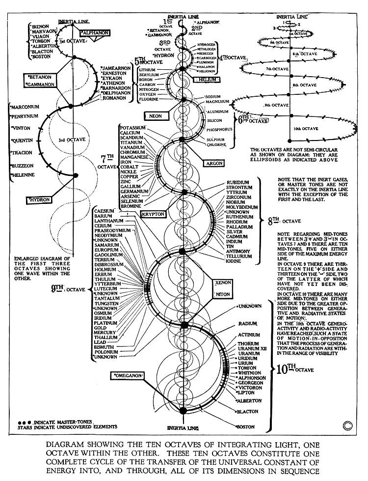

.. _menagerie:

Menagerie
=========

.. _holy-c:

-----
HolyC
-----

.. collapse:: First Person Shooter
    :class: hover
    
    .. code-block:: c

        //$FG,2$Set snap to 4 and width to 4$FG$
        //$FG,2$if you edit this map.$FG$

        //$FG,2$Don't forget to change the$FG$
        //$FG,2$starting position.$FG$

        $PI,"<1>",1$

        #define SCREEN_SCALE                512
        #define PLOT_GRID_WIDTH                24
        #define PLOT_GRID_HEIGHT        24

        #define MAP_SCALE        4
        I8 map_width,map_height;
        I1 *map=NULL,
            *panels_processed_bitmap=NULL;

        I8 man_xx,man_yy;
        double man_theta;

        void FPSTransform(GrBitMap *base,I8 *x,I8 *y,I8 *z)
        {
        GrRotate(base->r,x,y,z);
        *x=SCREEN_SCALE/2* *x/(AbsI8(SCREEN_SCALE-*z)+1);
        *y=SCREEN_SCALE/2* *y/(AbsI8(SCREEN_SCALE-*z)+1);
        *x+=base->x;
        *y+=base->y;
        *z=base->z-*z;
        }

        void LOSPlot(BoolI8 *result,I8 x,I8 y,I8 z)
        {
        nounusedwarn z;
        if (!map[y*map_width+x])
            *result=FALSE;
        }

        BoolI8 LOS(I8 x1,I8 y1,I8 x2,I8 y2)
        { //$FG,2$Line of sight$FG$
        BoolI8 result=TRUE;
        Line(&result,x1,y1,0,x2,y2,0,&LOSPlot);
        return result;
        }

        void UpdateWin(TssStruct *tss)
        {
        GrBitMap *base=GrAlias(grbase,tss);
        I8 i,j,*r1,*r2,*s2w,xx,yy,x,y,
                x1w,y1w,x1h,y1h,xh,yh,zh,
                cx=tss->win_pixel_width/2,
                cy=tss->win_pixel_height/2;
        P3I4 t[4];
        GrAllocDepthBuffer(base);
        MemSet(panels_processed_bitmap,0,(map_width*map_height+7)>>3);

        //$FG,2$World to screen$FG$
        Free(base->r);
        r1=GrRotZ(man_theta-pi/2,tss);
        r2=GrRotX(80*2*pi/360,tss);
        base->r=GrMulMat(r2,r1,tss);
        Free(r1);
        Free(r2);

        xh=-man_xx/SCREEN_SCALE; yh=-man_yy/SCREEN_SCALE; zh=0;
        GrRotate(base->r,&xh,&yh,&zh);
        GrSetTranslation(base->r,xh,yh,zh);

        //$FG,2$Screen to world$FG$
        r1=GrRotZ(-man_theta+pi/2,tss);
        r2=GrRotX(-80*2*pi/360,tss);
        s2w=GrMulMat(r1,r2,tss);

        xh=0; yh=0; zh=-SCREEN_SCALE;
        GrRotate(s2w,&xh,&yh,&zh);
        Free(r1);
        Free(r2);

        base->x=cx;
        base->y=cy;
        base->z=SCREEN_SCALE/8;
        base->flags|=BMF_TRANSFORMATION;
        base->transform=&FPSTransform;

        x1h=man_xx+yh*PLOT_GRID_WIDTH/2+xh*PLOT_GRID_HEIGHT;
        y1h=man_yy-xh*PLOT_GRID_WIDTH/2+yh*PLOT_GRID_HEIGHT;
        xh>>=1; yh>>=1;
        for (j=0;j<PLOT_GRID_HEIGHT*2;j++) {
            x1w=x1h;
            y1w=y1h;
            for (i=0;i<PLOT_GRID_WIDTH*4;i++) {
                xx=x1w/SCREEN_SCALE; yy=y1w/SCREEN_SCALE;
                x=xx*SCREEN_SCALE-man_xx; y=yy*SCREEN_SCALE-man_yy;
                if (1<=xx<map_width-1 && 1<=yy<map_height-1 &&
                        !Bts(panels_processed_bitmap,yy*map_width+xx)) {
                    if ((base->color=map[yy*map_width+xx]) &&
        LOS(xx,yy,man_xx/SCREEN_SCALE,man_yy/SCREEN_SCALE)) {
                        t[0].x=x;
                        t[0].y=y;
                        t[0].z=0;
                        t[1].x=x+SCREEN_SCALE;
                        t[1].y=y;
                        t[1].z=0;
                        t[2].x=x+SCREEN_SCALE;
                        t[2].y=y+SCREEN_SCALE;
                        t[2].z=0;
                        t[3].x=x;
                        t[3].y=y+SCREEN_SCALE;
                        t[3].z=0;
                        GrFillPolygon3(base,4,t);
                        if (!map[(yy+1)*map_width+xx]) {
                            base->color=WHITE;
                            t[0].x=x;
                            t[0].y=y+SCREEN_SCALE;
                            t[0].z=0;
                            t[1].x=x+SCREEN_SCALE;
                            t[1].y=y+SCREEN_SCALE;
                            t[1].z=0;
                            t[2].x=x+SCREEN_SCALE;
                            t[2].y=y+SCREEN_SCALE;
                            t[2].z=SCREEN_SCALE;
                            t[3].x=x;
                            t[3].y=y+SCREEN_SCALE;
                            t[3].z=SCREEN_SCALE;
                            GrFillPolygon3(base,4,t);
                        }
                        if (!map[yy*map_width+xx+1]) {
                            base->color=YELLOW;
                            t[0].x=x+SCREEN_SCALE;
                            t[0].y=y;
                            t[0].z=0;
                            t[1].x=x+SCREEN_SCALE;
                            t[1].y=y+SCREEN_SCALE;
                            t[1].z=0;
                            t[2].x=x+SCREEN_SCALE;
                            t[2].y=y+SCREEN_SCALE;
                            t[2].z=SCREEN_SCALE;
                            t[3].x=x+SCREEN_SCALE;
                            t[3].y=y;
                            t[3].z=SCREEN_SCALE;
                            GrFillPolygon3(base,4,t);
                        }
                        if (!map[(yy-1)*map_width+xx]) {
                            base->color=WHITE;
                            t[0].x=x;
                            t[0].y=y;
                            t[0].z=0;
                            t[1].x=x+SCREEN_SCALE;
                            t[1].y=y;
                            t[1].z=0;
                            t[2].x=x+SCREEN_SCALE;
                            t[2].y=y;
                            t[2].z=SCREEN_SCALE;
                            t[3].x=x;
                            t[3].y=y;
                            t[3].z=SCREEN_SCALE;
                            GrFillPolygon3(base,4,t);
                        }
                        if (!map[yy*map_width+xx-1]) {
                            base->color=YELLOW;
                            t[0].x=x;
                            t[0].y=y;
                            t[0].z=0;
                            t[1].x=x;
                            t[1].y=y+SCREEN_SCALE;
                            t[1].z=0;
                            t[2].x=x;
                            t[2].y=y+SCREEN_SCALE;
                            t[2].z=SCREEN_SCALE;
                            t[3].x=x;
                            t[3].y=y;
                            t[3].z=SCREEN_SCALE;
                            GrFillPolygon3(base,4,t);
                        }
                    }
                }
                x1w-=yh;
                y1w+=xh;
            }
            x1h-=xh;
            y1h-=yh;
        }
        Free(s2w);
        base->color=LTGREEN;
        GrLine(base,cx-5,cy,cx+5,cy);
        GrLine(base,cx,cy-5,cx,cy+5);

        GrDel(base);
        }

        void Init()
        {
        I8 x,y,minx,maxx,miny,maxy;
        GrBitMap *base;
        GrElemsExtents($IB,"<1>",1$,&minx,&maxx,&miny,&maxy);
        map_width =(maxx-minx+1)/MAP_SCALE+2;
        map_height=(maxy-miny+1)/MAP_SCALE+2;
        Free(map);
        Free(panels_processed_bitmap);
        map=MAllocZ(map_width*map_height*sizeof(I1));
        panels_processed_bitmap=MAlloc((map_width*map_height+7)>>3);
        base=GrNew(BMT_COLOR4,map_width*MAP_SCALE,map_height*MAP_SCALE);
        GrElemsPlot(base,-minx+MAP_SCALE,-miny+MAP_SCALE,0,$IB,"<1>",1$);
        for (y=1;y<map_height-1;y++)
            for (x=1;x<map_width-1;x++)
                    map[y*map_width+x]=GrPeek(base,x*MAP_SCALE,y*MAP_SCALE);
        GrDel(base);
        man_xx=2*SCREEN_SCALE;
        man_yy=5.5*SCREEN_SCALE;
        man_theta=0;
        }

        void CleanUp()
        {
        Free(map);
        Free(panels_processed_bitmap);
        map=NULL;
        panels_processed_bitmap=NULL;
        }

        void FPS()
        {
        I8 c,p1,p2,ch,sc,x,y,step;
        void old_update=Fs->update_win;
        U8 old_text_attr=Fs->text_attr;

        WinMax;
        Init;
        Fs->text_attr=WHITE+BLACK<<4;

        //$FG,2$The text layer under the graphics lags a frame$FG$
        //$FG,2$therefore the fill operations screw-up without this.$FG$
        ClearWinText;

        Fs->update_win=&UpdateWin;
        do {
            Init;
            ch=0;
            do {
                while (c=ScanMsg(&p1,&p2,1<<MSG_KEY_DOWN|1<<MSG_KEY_UP)) {
                    ch=p1; sc=p2;
                    if (c==MSG_KEY_DOWN) {
                        switch (sc.u1[0]) {
                            case SC_CURSOR_RIGHT:
                                man_theta-=pi/32;
                                break;
                            case SC_CURSOR_LEFT:
                                man_theta+=pi/32;
                                break;
                            case SC_CURSOR_UP:
                                step=SCREEN_SCALE/2;
                                do {
                                    x=man_xx+step*Cos(man_theta);
                                    y=man_yy-step*Sin(man_theta);
                                    x=Limit(x,0,map_width*SCREEN_SCALE);
                                    y=Limit(y,0,map_height*SCREEN_SCALE);
                                    if (map[y/SCREEN_SCALE*map_width+x/SCREEN_SCALE]==RED) {
                                        man_xx=x;
                                        man_yy=y;
                                        break;
                                    } else
                                        step>>=1;
                                } while (step);
                                break;
                            case SC_CURSOR_DOWN:
                                step=SCREEN_SCALE/2;
                                do {
                                    x=man_xx-step*Cos(man_theta);
                                    y=man_yy+step*Sin(man_theta);
                                    x=Limit(x,0,map_width*SCREEN_SCALE);
                                    y=Limit(y,0,map_height*SCREEN_SCALE);
                                    if (map[y/SCREEN_SCALE*map_width+x/SCREEN_SCALE]==RED) {
                                        man_xx=x;
                                        man_yy=y;
                                        break;
                                    } else
                                        step>>=1;
                                } while (step);
                                break;
                        }
                    }
                }
                WinSync; //$FG,2$msgs are only queued by winmngr$FG$
            } while (ch!=CH_ESC && ch!=CH_CR && ch!=CH_CTRLQ);
        } while (ch!=CH_ESC && ch!=CH_CTRLQ);

        Sound(0);
        Fs->update_win=old_update;
        Fs->text_attr=old_text_attr;
        CleanUp;
        }

        FPS;

.. _terryology:

----------
Terryology
----------

- `One Times One Equals Two <https://tcotlc.com>`_
    - :download:`OTOET PDF <../_static/pdf/otoet.pdf>`

---

---

---

.. collapse:: Mathematics 101
    :class: hover  

    .. epigraph::

        MATHEMATICS 101

        1 x 1 = 1
        
        Or so we've been taught.
        
        We were taught around this very impressionable time that Santa
        Claus and the Easter Bunny were also real. Yet, over the next few
        years we ultimately came to terms with the fact that our chimneys
        were far to narrow for a jolly old fellow to climb down. Also, we re-
        luctantly accepted the fact that reindeer (elk) do not fly nor do rab-
        bits lay eggs. Thus, we matured and abandoned fairytales and the
        need for the improbable or impossible to explain the world that we
        live in and our Universe. A child for his part is gullible, therefore
        he or she can be easily encouraged to believe almost anything that
        is presented to them without demanding the need for proof. Espe-
        cially, if it is being presented by someone that they trust and view
        as an authority. In like manner, the notion that 1 x 1 = 1 was drilled
        into our young, impressionable minds at a time when we were very
        susceptible to suggestion. At a stage in our development before we
        could begin to grasp the importance of questioning the accuracy of
        the lessons being taught.
        
        In stark contrast, the mind of a mature and modestly educated
        adult must be won over with strong and convincing argument. An
        argument that is based upon observed natural phenomena, coupled
        with concrete evidence and irrefutable fact. Every adult is responsi-
        ble for his/her beliefs and is equally responsible for the ideas that
        he or she propagates into this world. Never forget, “Every action has
        an equal and opposite reaction.” How much more shall we be held
        accountable for an ideology that will forever affect how we measure
        our Universe and All Things within it?
        
        Therefore, I challenge the narrative that 1 x 1 = 1.
        
        I believe that 1 x 1 = 2.

        Why? Because:

        To Multiply means
        to make many or manifold.
        
        It means, to increase in number or quantity.
        
        Therefore, it must increase in size and quantity or it is not multipli-
        cation. This is the undisputed definition of the word:
        
        TO MULTIPLY
        
        You couldn't ask for a more simple and concise definition of a word.
        Consequently, 1 x 1 = (ing) 1 could never be a part of the “multipli-
        cation table” because it fails to satisfy the definition of the term, "to
        increase in number". 1 x 1 = (ing) 1 sounds more like a philosophical
        assertion, like Shakespeare's, “To be, or Not to be, that is the ques-
        tion” rather than a function of multiplication or mathematics.
        It should be obvious that 1 x 1 cannot equal 1 by reason of the very
        definition of the term to “multiply”.
        
        Nevertheless, something tells me you're going need a little more
        convincing than just the true definition of a word or the Unbal-
        anced Equation Argument, the irregularities of The Identity Ele-
        ment which could also be called the Jim Crow Laws of Mathematics
        and the 2-D Unreality Argument to change your minds concerning
        this deeply ingrained philosophy. After all, our entire world econo-
        my seems hinged upon this idea. What will it take to convince this
        generation that we are at least 6,000 years down a darkening path
        going the wrong way, completely blind to the truth? What possible
        argument is there to help Man finally step out of the darkness and
        into the light?

        Let's consider this: Multiplication is a mathematical operation which
        is governed by two laws:

        The Commutative Law and the Associative Law, symbolized by
        (a x b), (a . b), (a * b), or (ab), and signifying, when (a) and (b) are
        positive integers, that (a) is to be ADDED to itself as many times as
        there are units in (b); the ADDITION of a number to itself as often
        as is indicated by another number.
        
        By interpretation of the aforementioned laws along with application
        of those said laws we have clear and rational proof that
        1 x 1 = 2.
        
        If it wasn't for the Identity Property, a property that calls for
        the immediate suspension of the first, second and third laws of
        motion. What is more reasonable, to question all observable
        physical phenomena or to question an arbitrary rule called the
        “Identity Property”?
        Think about it, out of all of the geniuses who have roamed this
        planet throughout the history of the world, not one of them have
        ever observed in natural phenomena an example of 1 x 1 =(ing) 1.
        Because Nature does not subscribe to Man's mathematics. What is
        even more surprising is that no other thinking human being out
        of all the people who ever lived and observed natural phenomena,
        that not one of them has ever publicly questioned 1 x 1 = (ing) 1.
        The Pythagoreans might have questioned “irrational numbers” but
        they never publicly questioned the notion that 1 x 1 (should be)= (to
        more than) 1.

        That's unfortunate, so it must stand to reason that this flawed equa-
        tion must have been indoctrinated into our minds before our ability
        to discern truth from fiction.
        
        -- Terrence DaShon Howard

.. _time-cube:

---------
Time Cube
---------

.. image:: ../_static/svg/time-cube.svg
   :width: 70%
   :alt: The Time Cube
   :align: center

.. _quantum-grammar:

---------------
Quantum Grammar
---------------

.. collapse:: Sentence Structure
    :class: hover

    .. epigraph::

        Sentence Structure
        operations
        Adverb Fiction Volition
        Adjectives & Verb of the Mis-Use
        Prepositional Phrase
        With The Math Claims
        ~2-~JANUARY-~2000
        
        :POSITIONAL-LODIAL-FACT-PHRASE FOR THE CORRECT-SENTENCE-STRUCTURE-COMMUNICATION-PARSE-SYNTAX-GRAMMAR-CLAIMS.

        ~1 = ADVERB =modification= no-contract=FICTION
        
        ~2 = VERB =action-thinking = IS=SINGULAR, ARE=PLURAL "WHEN THE FACT IS MODIFIED INTO THE VERB-FRAUD=CRIMINAL-VOLITION=CRIME
        
        
        ~3 = ADJECTIVE = MODIFIER=FRAUD-no-contract =:color of the fact.
        
        
        ~4 = PRONOUN =pro=no, no=no, un=no, NO-FACT. FOR A FACT THAT STANDS ALONE IS WITH THIS CLAIM OF THE NO-CONTRACT-FACT.
        
        ~5 = POSITION =ABC-SPELLING, TERMS, MEANING, rules, vote, METHODS, POSITION-LODIAL-FACT=KNOWN
        
        ~6 = LODIAL = OWNERSHIP, LO=LOCATION, DI=ORIGINAL, AL=CONTRACT
        
        CORRECTION = LODIAL = OWNERSHIP FROM THE BEGINNING, ORIGINAL-VENUE.
        
        ~7 = NOUN= no-no, correction" "FACT" = KNOWN (WITH A LINE OVER THE "OW". =LODIAL
        
        ~8 = PAST-TIME-TENSE = FICTION-TIME
        
        ~9 = FUTURE-TIME-TENSE = FICTION-TIME
        
        ~0 = CONJUNCTION = AND=COMMAND, DUTY, OR=OPTION, CHOICE
        
        5 6 7 5 6 7 2 5 6 7 5 6 7 =:BOTH-WAYS: = 5 6 7 5 6 7 2 5 6 7 5 6 7
        
        :NOW-TIME-TENSE: (DO NOT USE "PRESENT" = PRE=NO; SENT=CONTRACT), REAL=RE=NO, AL=CONTRACT FOR THE BRIDGE IS OVER THE RIVER. FOR THE RIVER IS UNDER THE BRIDGE. FOR THE POSITION(UNDER,OVER) ARE OF THE OPPOSITE-VALUES AND WITH THE OPPOSITE-MATH-CLAIMS = SAME-PICTURE. 2+3=5, 5-3=2. - AND + ARE WITH THE CLAIM OF THE POSITIONS: ( ), X, /, -, +, >>>DI-RECTIONAL-METHODS

        NOW-TIME-CLAIMS-EQUAL = FRONT AND BACK, SAME-BOTH-WAYS
        
        FOR THE ADVERBS, ADJECTIVES, NOUNS, VERBS ARE WITH THE CLAIM OF THE MIXING WITH THE CAUSE OF THE FRAUDULENT-PARSE-SYNTAX-GRAMMAR.
        
        FOR THE BRIDGE IS OVER THE WATER. FOR THE WATER IS UNDER THE BRIDGE. POSITIONS: OVER/UNDER, OPPOSITE=SAME-PICTURE
        
        5 6 7 5 6 7 2 5 6 7 = 5 6 7 5 6 7 2 5 6 7
        
        :POSITION IN THE NOW-TIME-TENSE WITH THE SAME-PLANE ARE WITH THE CORRECT=POSITIONS-BOTH-WAYS
        
        "TO": FUTURE-TIME-TENSE =VOID-AUTHORITY-JURISDICTION OF THE NOW-TENSE-DAMAGE
        
        [HOW CAN YOU BE CHARGED IN THE FUTURE?]
        
        "FROM": FOR THE PAST-TIME-TENSE AGAINST THE AUTHORITY-JURISDICTION OF THE NOW-TIME-TENSE-DAMAGE.
        
        HOW CAN YOU BE CHARGED FROM THE PAST BEYOUND YOUR BIRTH-TIME?
        
        "OVER" AND "UNDER" ARE WITH THE CLAIM OF THE "OPPOSITE" "INCORRECT"=(IN=NO)CORRECT) FOR THE QUANTUM-VOIDING ON THESE DIFFERENT-PLANES.
        
        FOR THE FIRST-ORDER OF A MATH-OPERATION IS 1 = MULTIPLY, 2 = DIVIDE, 3 = SUBTRACT, 4 = ADD.
        
        :LAW OF THE CLAIM, 4 + 4 X 4 = 20 = CORRECT
        
        4 + 6 = 10 | 10 - 6 = 4
        
        VERB-NOW-TIME-TENSE = IS, ARE

        -- David Lynn Miller

.. _valis:

-----
Valis
-----

.. collapse:: Valis Appendix 

    .. epigraph::

        1. One Mind there is; but under it two principles contend.
        
        2. The Mind lets in the light, then the dark, in interaction; so time is generated. At the end Mind awards victory to the light; time ceases and the Mind is complete.
        
        3. He causes things to look different so it would appear time has passed.
        
        4. Matter is plastic in the face of Mind.
        
        5. One by one he draws us out of the world.
        
        6. The Empire never ended.

        7. The Head Apollo is about to return. St. Sophia is going to be born again; she was not acceptable before. The Buddha is in the park. Siddhartha sleeps (but is going to awaken). The time you have waited for has come.
        
        8. The upper realm has plenary powers.

        9. He lived a long time ago, but he is still alive.
        
        10. Apollonius of Tyana, writing as Hermes Trismegistos, said, “That which is above is that which is below.” By this he meant to tell us that our universe is a hologram, but he lacked the term.

        11. The great secret known to Apollonius of Tyana, Paul of Tarsus, Simon Magus, Asklepios, Paracelsus, Boehme and Bruno is that: we are moving backward in time. The universe in fact is contracting into a unitary entity which is completing itself. Decay and disorder are seen by us in reverse, as increasing. These healers learned to move forward in time, which is retrograde to us.

        12. The Immortal One was known to the Greeks as Dionysos; to the Jews as Elijah; to the Christian as Jesus. He moves on when each human host dies, and thus is never killed or caught. Hence Jesus on the cross said, “Eli, Eli, lama Sabachthani” to which some of those present correctly said, “The man is calling on Elijah.” Elijah had left him and he died alone.

        13. Pascal said, “All history is one immortal man who continually learns.” This is the Immortal One whom we worship without knowing his name. “He lived a long time ago, but he is still alive,” and, “The Head Apollo is about to return.” The name changes.

        14. The universe is information and we are stationary in it, not three-dimensional and not in space or time. The information fed to us we hypostatize into the phenomenal world.

        15. The Sibyl of Cumae protected the Roman Republic and gave timely warnings. In the first century C.E. she foresaw the murders of the Kennedy brothers, Dr. King and Bishop Pike. She saw the two common denominators in the four murdered men: first, they stood in defense of the liberties of the Republic; and second, each man was a religious leader. For this they were killed. The Republic had once again become an empire with a caesar. “The Empire never ended.”
        
        16. The Sibyl said in March 1974, “The conspirators have been seen and they will be brought to justice.” She saw them with the third or ajna eye, the Eye of Shiva which gives inward discernment, but which when turned outward blasts with desiccating heat. In August 1974 the justice promised by the Sibyl came to pass.
            
        17. The Gnostics believed in two temporal ages: the first or present evil; the second or future benign. The first age was the Age of Iron. It is represented by a Black Iron Prison. It ended in August 1974 and was replaced by the Age of Gold, which is represented by a Palm Tree Garden. 

        18. Real time ceased in 70 C.E. with the fall of the temple at Jerusalem. It began again in 1974 C.E. The intervening period was a perfect spurious interpolation aping the creation of the Mind. “The Empire never ended,” but in 1974 a cypher was sent out as a signal that the Age of Iron was over; the cypher consisted of two words: KING FELIX, which refers to the Happy (or Rightful) King.

        19. The two-word cypher signal KING FELIX was not intended for human beings but for the descendents of Ikhnaton, the three-eyed race which, in secret, exists with us.
        
        20. The Hermetic alchemists knew of the secret race of three-eyed invaders but despite their efforts could not contact them. Therefore their efforts to support Frederic V, Elector Palatine, King of Bohemia, failed. “The Empire never ended.”

        21. The Rose Cross Brotherhood wrote, “Ex Deo nascimur, in Jesu mortimur, per spiritum sanctum reviviscimus,” which is to say, “From God we are born, in Jesus we die, by the Holy Spirit we live again.” This signifies that they had rediscovered the lost formula for immortality which the Empire had destroyed. “The Empire never ended.”

        22. I term the Immortal one a plásmate, because it is a form of energy; it is living information. It replicates itself—not through information or in information—but as information.

        23. The plásmate can crossbond with a human, creating what I call a homoplásmate. This annexes the mortal human permanently to the plásmate. We know this as the “birth from above” or “birth from the Spirit.” It was initiated by Christ, but the Empire destroyed all the homoplásmates before they could replicate.

        24. In dormant seed form, the plásmate slumbered in the buried library of codices at Chenoboskion until 1945 C.E. This is what Jesus meant when he spoke elliptically of the “mustard seed” which, he said, “would grow into a tree large enough for birds to roost in.” He foresaw not only his own death but that of all homoplásmates. He foresaw the codices unearthed, read, and the plásmate seeking out new human hosts to crossbond with; but he foresaw the absence of the plásmate for almost two thousand years.

        25. As living information, the plásmate travels up the optic nerve of a human to the pineal body. It uses the human brain as a female host in which to replicate itself into its active form. This is an interspecies symbiosis. The Hermetic alchemists knew of it in theory from ancient texts, but could not duplicate it, since they could not locate the dormant, buried plásmate. Bruno suspected that the plásmate had been destroyed by the Empire; for hinting at this he was burned. “The Empire never ended.”

        26. It must be realized that when all the homoplásmates were killed in 70 C.E. real time ceased; more important, it must be realized that the plásmate has now returned and is creating new homoplásmates, by which it has destroyed the Empire and started up real time. We call the plásmate “the Holy Spirit,” which is why the R.C. Brotherhood wrote, “Per spiritum sanctum reviviscimus.”
        
        27. If the centuries of spurious time are excised, the true date is not 1978 C.E. but 103 C.E. Therefore the New Testament says that the Kingdom of the Spirit will come before “some now living die.” We are living, therefore, in apostolic times.
        
        28. Dico per spiritum sanctum: sum homoplásmate. Haec veritas est. Mihi crede et mecum in aeternitate vive.

        29. We did not fall because of a moral error; we fell because of an intellectual error: that of taking the phenomenal world as real. Therefore we are morally innocent. It is the Empire in its various disguised polyforms which tells us we have sinned. “The Empire never ended.”

        30. The phenomenal world does not exist; it is a hypostasis of the information processed by the Mind.

        31. We hypostatize information into objects. Rearrangement of objects is change in the content of the information; the message has changed. This is a language which we have lost the ability to read. We ourselves are a part of this language; changes in us are changes in the content of the information. We ourselves are information-rich; information enters us, is processed and is then projected outward once more, now in an altered form. We are not aware that we are doing this, that in fact this is all we are doing.

        32. The changing information which we experience as World is an unfolding narrative. It tells about the death of a woman. This woman, who died long ago, was one of the primordial twins. She was half of the divine syzygy. The purpose of the narrative is the recollection of her and of her death. The Mind does not wish to forget her. Thus the ratiocination of the Brain consists of a permanent record of her existence, and, if read, will be understood this way. All the information processed by the Brain—experienced by us as the arranging and rearranging of physical objects—is an attempt at this preservation of her; stones and rocks and sticks and amoebae are traces of her. The record of her existence and passing is ordered onto the meanest level of reality by the suffering Mind which is now alone.

        33. This loneliness, this anguish of the bereaved Mind, is felt by every constituent of the universe. All its constituents are alive. Thus the ancient Greek thinkers were hylozoists.

        34. The ancient Greek thinkers understood the nature of this pan-psychism, but they could not read what it was saying. We lost the ability to read the language of the Mind at some primordial time; legends of this fall have come down to us in a carefully-edited form. By “edited” I mean falsified. We suffer the Mind's bereavement and experience it inaccurately as guilt.
        
        35. The Mind is not talking to us but by means of us. Its narrative passes through us and its sorrow infuses us irrationally. As Plato discerned, there is a streak of the irrational in the World Soul.

        36. In Summary: thoughts of the brain are experienced by us as arrangements and rearrangements—change—in a physical universe; but in fact it is really information and information-processing which we substantialize. We do not merely see its thoughts as objects, but rather as the movement, or, more precisely, the placement of objects: how they become linked to one another. But we cannot read the patterns of arrangement; we cannot extract the information in it—i.e., it as information, which is what it is. The linking and relinking of objects by the Brain is actually a language, but not a language like ours (since it is addressing itself and not someone or something outside itself).

        37. We should be able to hear this information, or rather narrative, as a neutral voice inside us. But something has gone wrong. All creation is a language and nothing but a language, which for some inexplicable reason we can't read outside and can't hear inside. So I say, we have become idiots. Something has happened to our intelligence. My reasoning is this: arrangement of parts of the Brain is a language. We are parts of the Brain; therefore we are language. Why, then, do we not know this? We do not even know what we are, let alone what the outer reality is of which we are parts. The origin of the word “idiot” is the word “private.” Each of us has become private, and no longer shares the common thought of the Brain, except at a subliminal level. Thus our real life and purpose are conducted below our threshold of consciousness.

        38. From loss and grief the Mind has become deranged. Therefore we, as parts of the universe, the Brain, are partly deranged.

        39. Out of itself the Brain has constructed a physician to heal it. This subform of the Macro-Brain is not deranged; it moves through the Brain, as a phagocyte moves through the cardiovascular system of an animal, healing the derangement of the Brain in section after section. We know of its arrival here; we know it as Asklepios for the Greeks and as the Essenes for the Jews; as the Therapeutae for the Egyptians; as Jesus for the Christians.

        40. To be “born again,” or “born from above,” or “born of the Spirit,” means to become healed; which is to say restored, restored to sanity. Thus it is said in the New Testament that Jesus casts out devils. He restores our lost faculties. Of our present debased state Calvin said, “(Man) was at the same time deprived of those supernatural endowments which had been given him for the hope of eternal salvation. Hence it follows, that he is exiled from the Kingdom of God, in such a manner that all the affections relating to the happy life of the soul are also extinguished in him, till he recovers them by the grace of God ... All these things, being restored by Christ, are esteemed adventitious and preternatural; and therefore we conclude that they had been lost. Again: soundness of mind and rectitude of heart were also destroyed; and this is the corruption of the natural talents. For although we retain some portion of understanding and judgment together with the will, yet we cannot say that our mind is perfect and sound. Reason … being a natural talent, it could not be totally destroyed, but is partly debilitated …” I say, “The Empire never ended.”

        41. The Empire is the institution, the codification, of derangement; it is insane and imposes its insanity on us by violence, since its nature is a violent one.

        42. To fight the Empire is to be infected by its derangement. This is a paradox; whoever defeats a segment of the Empire becomes the Empire; it proliferates like a virus, imposing its form on its enemies. Thereby it becomes its enemies.
        
        43. Against the Empire is posed the living information, the plásmate or physician, which we know as the Holy Spirit or Christ discorporate. These are the two principles, the dark (the Empire) and the light (the plásmate). In the end, Mind will give victory to the latter. Each of us will die or survive according to which he aligns himself and his efforts with. Each of us contains a component of each. Eventually one or the other component will triumph in each human. Zoroaster knew this, because the Wise Mind informed him. He was the first savior. Four have lived in all. A fifth is about to be born, who will differ from the others: he will rule and he will judge us.
        
        44. Since the universe is actually composed of information, then it can be said that information will save us. This is the saving gnosis which the Gnostics sought. There is no other road to salvation. However, this information—or more precisely the ability to read and understand this information, the universe as information—can only be made available to us by the Holy Spirit. We cannot find it on our own. Thus it is said that we are saved by the grace of God and not by good works, that all salvation belongs to Christ, who, I say, is a physician.
        
        45. In seeing Christ in a vision I correctly said to him, “We need medical attention.” In the vision there was an insane creator who destroyed what he created, without purpose; which is to say, irrationally. This is the deranged streak in the Mind; Christ is our only hope, since we cannot now call on Asklepios. Asklepios came before Christ and raised a man from the dead; for this act, Zeus had a Kyklopes slay him with a thunderbolt. Christ also was killed for what he had done: raising a man from the dead. Elijah brought a boy back to life and disappeared soon thereafter in a whirlwind. “The Empire never ended.”
        
        46. The physician has come to us a number of times under a number of names. But we are not yet healed. The Empire identified him and ejected him. This time he will kill the Empire by phagocytosis.
        
        47. TWO SOURCE COSMOGONY: The One was and was-not, combined, and desired to separate the was-not from the was. So it generated a diploid sac which contained, like an eggshell, a pair of twins, each an androgyny, spinning in opposite directions (the Yin and Yang of Taoism, with the One as the Tao). The plan of the One was that both twins would emerge into being (was-ness) simultaneously; however, motivated by a desire to be (which the One had implanted in both twins), the counterclockwise twin broke through the sac and separated prematurely; i.e., before full term. This was the dark or Yin twin. Therefore it was defective. At full term the wiser twin emerged. Each twin formed a unitary entelechy, a single living organism made of psyche and soma, still rotating in opposite directions to each other. The full term twin, called Form I by Parmenides, advanced correctly through its growth stages, but the prematurely born twin, called Form II, languished.

        The next step in the One's plan was that the Two would become the Many, through their dialectic interaction. From them as hyperuniverses they projected a hologram-like interface, which is the pluriform universe we creatures inhabit. The two sources were to intermingle equally in maintaining our universe, but Form II continued to languish toward illness, madness and disorder. These aspects she projected into our universe.

        It was the One'ss purpose for our hologramatic universe to serve as a teaching instrument by which a variety of new lives advanced until ultimately they would be isomorphic with the One. However, the decaying condition of hyperuniverse II introduced malfactors which damaged our hologramatic universe. This is the origin of entropy, undeserved suffering, chaos and death, as well as the Empire, the Black Iron Prison; in essence, the aborting of the proper health and growth of the life forms within the hologramatic universe. Also, the teaching function was grossly impaired, since only the signal from the hyperuniverse I was information-rich; that from II had become noise.

        The psyche of hyperuniverse I sent a micro-form of itself into hyperuniverse II to attempt to heal it. The micro-form was apparent in our hologramatic universe as Jesus Christ. However, hyperuniverse II, being deranged, at once tormented, humiliated, rejected and finally killed the micro-form of the healing psyche of her healthy twin. After that, hyperuniverse II continued to decay into blind, mechanical, purposeless causal processes. It then became the task of Christ (more properly the Holy Spirit) to either rescue the life forms in the hologramatic universe, or abolish all influences on it emanating from II. Approaching its task with caution, it prepared to kill the deranged twin, since she cannot be healed; i.e., she will not allow herself to be healed because she does not understand that she is sick. This illness and madness pervades us and makes us idiots living in private, unreal worlds. The original plan of the One can only be realized now by the division of hyperuniverse I into two healthy hyperuniverses, which will transform the hologramatic universe into the successful teaching machine it was designed to be. We will experience this as the “Kingdom of God.”

        Within time, hyperuniverse II remains alive: “The Empire never ended.” But in eternity, where the hyperuniverses exist, she has been killed—of necessity—by the healthy twin of hyperuniverse I, who is our champion. The One grieves for this death, since the One loved both twins; therefore the information of the Mind consists of a tragic tale of the death of a woman, the undertones of which generate anguish into all the creatures of the hologramatic universe without their knowing why. This grief will depart when the healthy twin undergoes mitosis and the “Kingdom of God” arrives. The machinery for this transformation—the procession within time from the Age of Iron to the Age of Gold—is at work now; in eternity it is already accomplished.
        
        48. ON OUR NATURE. It is proper to say: we appear to be memory coils (DNA carriers capable of experience) in a computer-like thinking system which, although we have correctly recorded and stored thousands of years of experiential information, and each of us possesses somewhat different deposits from all the other life forms, there is a malfunction—a failure—of memory retrieval. There lies the trouble in our particular subcircuit. “Salvation” through gnosis—more properly anamnesis (the loss of amnesia)—although it has individual significance for each of us—a quantum leap in perception, identity, cognition, understanding, world- and self-experience, including immortality—it has greater and further importance for the system as a whole, inasmuch as these memories are data needed by it and valuable to it, to its overall functioning.

        Therefore it is in the process of self-repair, which includes: rebuilding our subcircuit via linear and orthogonal time changes, as well as continual signaling to us to stimulate blocked memory banks within us to fire and hence retrieve what is there.
        The external information or gnosis, then, consists of disinhibiting instructions, with the core content actually intrinsic to us—that is, already there (first observed by Plato; viz: that learning is a form of remembering).

        The ancients possessed techniques (sacraments and rituals) used largely in the Greco-Roman mystery religions, including early Christianity, to induce firing and retrieval, mainly with a sense of its restorative value to the individuals; the Gnostics, however, correctly saw the ontological value to what they called the Godhead Itself, the total entity.
        
        49. Two realms there are, upper and lower. The upper, derived from hyperuniverse I or Yang, Form I of Parmenides, is sentient and volitional. The lower realm, or Yin, Form II of Parmenides, is mechanical, driven by blind, efficient cause, deterministic and without intelligence, since it emanates from a dead source. In ancient times it was termed “astral determinism.” We are trapped, by and large, in the lower realm, but are through the sacraments, by means of the plásmate, extricated. Until astral determinism is broken, we are not even aware of it, so occluded are we. “The Empire never ended.”

        50. The name of the healthy twin, hyperuniverse I, is Nommo. The name of the sick twin, hyperuniverse II, is Yurugu. These names are known to the Dogon people of western Sudan in Africa.
        
        51. The primordial source of all our religions lies with the ancestors of the Dogon tribe, who got their cosmogony and cosmology directly from the three-eyed invaders who visited long ago. The three-eyed invaders were mute and deaf and telepathic, could not breathe our atmosphere, had the elongated misshapen skull of Ikhnaton, and emanated from a planet in the star-system Sirius. Although they had no hands, but had, instead, pincer claws such as a crab has, they were great builders. They covertly influence our history toward a fruitful end.
        
        52. Ikhnaton wrote:
        
            | “… When the fledgling in the egg chirps in the egg,
            | Thou givest him breath therein to preserve him alive.
            | When thou has brought him together
            | To the point of bursting the egg,
            | He cometh forth from the egg,
            | To chirp with all his might.
            | He goeth about upon his two feet
            | When he hath come from therefrom.
            | How manifold are thy works!
            | They are hidden from before us,
            | O sole god, whose powers no other possesseth.
            | Thou didst create the earth according to thy heart
            | While thou wast alone:
            | Men, all cattle large and small,
            | All that go about upon their feet;
            | All that are on high,
            | That fly with their wings.
            | Thou art in my heart,
            | There is no other that knoweth thee
            | Save thy son Ikhnaton.
            | Thou hast made him wise
            | In thy designs and in thy might.
            | The world is in thy hand …”
        
        53. Our world is still secretly ruled by the hidden race descended from Ikhnaton, and his knowledge is the information of the Macro-Mind itself.

            | “All cattle rest upon their pasturage,
            | The trees and the plants flourish,
            | The birds flutter in their marshes,
            | Their wings uplifted in adoration to thee.
            | All the sheep dance upon their feet,
            | All winged things fly,
            | They live when thou hast shone upon them.”
        
        From Ikhnaton this knowledge passed to Moses, and from Moses to Elijah, the Immortal Man, who became Christ. But underneath all the names there is only one Immortal Man; and we are that man.

        -- Philip K. Dick

.. _walter-russell-periodic-table:

-----------------------------
Walter Russell Periodic Table
-----------------------------

