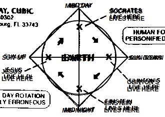

.. _menagerie:

Menagerie
=========

.. _holy-c:

-----
HolyC
-----

.. code-block:: c 

    //$FG,2$Set snap to 4 and width to 4$FG$
    //$FG,2$if you edit this map.$FG$

    //$FG,2$Don't forget to change the$FG$
    //$FG,2$starting position.$FG$

    $PI,"<1>",1$

    #define SCREEN_SCALE                512
    #define PLOT_GRID_WIDTH                24
    #define PLOT_GRID_HEIGHT        24

    #define MAP_SCALE        4
    I8 map_width,map_height;
    I1 *map=NULL,
        *panels_processed_bitmap=NULL;

    I8 man_xx,man_yy;
    double man_theta;

    void FPSTransform(GrBitMap *base,I8 *x,I8 *y,I8 *z)
    {
    GrRotate(base->r,x,y,z);
    *x=SCREEN_SCALE/2* *x/(AbsI8(SCREEN_SCALE-*z)+1);
    *y=SCREEN_SCALE/2* *y/(AbsI8(SCREEN_SCALE-*z)+1);
    *x+=base->x;
    *y+=base->y;
    *z=base->z-*z;
    }

    void LOSPlot(BoolI8 *result,I8 x,I8 y,I8 z)
    {
    nounusedwarn z;
    if (!map[y*map_width+x])
        *result=FALSE;
    }

    BoolI8 LOS(I8 x1,I8 y1,I8 x2,I8 y2)
    { //$FG,2$Line of sight$FG$
    BoolI8 result=TRUE;
    Line(&result,x1,y1,0,x2,y2,0,&LOSPlot);
    return result;
    }

    void UpdateWin(TssStruct *tss)
    {
    GrBitMap *base=GrAlias(grbase,tss);
    I8 i,j,*r1,*r2,*s2w,xx,yy,x,y,
            x1w,y1w,x1h,y1h,xh,yh,zh,
            cx=tss->win_pixel_width/2,
            cy=tss->win_pixel_height/2;
    P3I4 t[4];
    GrAllocDepthBuffer(base);
    MemSet(panels_processed_bitmap,0,(map_width*map_height+7)>>3);

    //$FG,2$World to screen$FG$
    Free(base->r);
    r1=GrRotZ(man_theta-pi/2,tss);
    r2=GrRotX(80*2*pi/360,tss);
    base->r=GrMulMat(r2,r1,tss);
    Free(r1);
    Free(r2);

    xh=-man_xx/SCREEN_SCALE; yh=-man_yy/SCREEN_SCALE; zh=0;
    GrRotate(base->r,&xh,&yh,&zh);
    GrSetTranslation(base->r,xh,yh,zh);

    //$FG,2$Screen to world$FG$
    r1=GrRotZ(-man_theta+pi/2,tss);
    r2=GrRotX(-80*2*pi/360,tss);
    s2w=GrMulMat(r1,r2,tss);

    xh=0; yh=0; zh=-SCREEN_SCALE;
    GrRotate(s2w,&xh,&yh,&zh);
    Free(r1);
    Free(r2);

    base->x=cx;
    base->y=cy;
    base->z=SCREEN_SCALE/8;
    base->flags|=BMF_TRANSFORMATION;
    base->transform=&FPSTransform;

    x1h=man_xx+yh*PLOT_GRID_WIDTH/2+xh*PLOT_GRID_HEIGHT;
    y1h=man_yy-xh*PLOT_GRID_WIDTH/2+yh*PLOT_GRID_HEIGHT;
    xh>>=1; yh>>=1;
    for (j=0;j<PLOT_GRID_HEIGHT*2;j++) {
        x1w=x1h;
        y1w=y1h;
        for (i=0;i<PLOT_GRID_WIDTH*4;i++) {
            xx=x1w/SCREEN_SCALE; yy=y1w/SCREEN_SCALE;
            x=xx*SCREEN_SCALE-man_xx; y=yy*SCREEN_SCALE-man_yy;
            if (1<=xx<map_width-1 && 1<=yy<map_height-1 &&
                    !Bts(panels_processed_bitmap,yy*map_width+xx)) {
                if ((base->color=map[yy*map_width+xx]) &&
    LOS(xx,yy,man_xx/SCREEN_SCALE,man_yy/SCREEN_SCALE)) {
                    t[0].x=x;
                    t[0].y=y;
                    t[0].z=0;
                    t[1].x=x+SCREEN_SCALE;
                    t[1].y=y;
                    t[1].z=0;
                    t[2].x=x+SCREEN_SCALE;
                    t[2].y=y+SCREEN_SCALE;
                    t[2].z=0;
                    t[3].x=x;
                    t[3].y=y+SCREEN_SCALE;
                    t[3].z=0;
                    GrFillPolygon3(base,4,t);
                    if (!map[(yy+1)*map_width+xx]) {
                        base->color=WHITE;
                        t[0].x=x;
                        t[0].y=y+SCREEN_SCALE;
                        t[0].z=0;
                        t[1].x=x+SCREEN_SCALE;
                        t[1].y=y+SCREEN_SCALE;
                        t[1].z=0;
                        t[2].x=x+SCREEN_SCALE;
                        t[2].y=y+SCREEN_SCALE;
                        t[2].z=SCREEN_SCALE;
                        t[3].x=x;
                        t[3].y=y+SCREEN_SCALE;
                        t[3].z=SCREEN_SCALE;
                        GrFillPolygon3(base,4,t);
                    }
                    if (!map[yy*map_width+xx+1]) {
                        base->color=YELLOW;
                        t[0].x=x+SCREEN_SCALE;
                        t[0].y=y;
                        t[0].z=0;
                        t[1].x=x+SCREEN_SCALE;
                        t[1].y=y+SCREEN_SCALE;
                        t[1].z=0;
                        t[2].x=x+SCREEN_SCALE;
                        t[2].y=y+SCREEN_SCALE;
                        t[2].z=SCREEN_SCALE;
                        t[3].x=x+SCREEN_SCALE;
                        t[3].y=y;
                        t[3].z=SCREEN_SCALE;
                        GrFillPolygon3(base,4,t);
                    }
                    if (!map[(yy-1)*map_width+xx]) {
                        base->color=WHITE;
                        t[0].x=x;
                        t[0].y=y;
                        t[0].z=0;
                        t[1].x=x+SCREEN_SCALE;
                        t[1].y=y;
                        t[1].z=0;
                        t[2].x=x+SCREEN_SCALE;
                        t[2].y=y;
                        t[2].z=SCREEN_SCALE;
                        t[3].x=x;
                        t[3].y=y;
                        t[3].z=SCREEN_SCALE;
                        GrFillPolygon3(base,4,t);
                    }
                    if (!map[yy*map_width+xx-1]) {
                        base->color=YELLOW;
                        t[0].x=x;
                        t[0].y=y;
                        t[0].z=0;
                        t[1].x=x;
                        t[1].y=y+SCREEN_SCALE;
                        t[1].z=0;
                        t[2].x=x;
                        t[2].y=y+SCREEN_SCALE;
                        t[2].z=SCREEN_SCALE;
                        t[3].x=x;
                        t[3].y=y;
                        t[3].z=SCREEN_SCALE;
                        GrFillPolygon3(base,4,t);
                    }
                }
            }
            x1w-=yh;
            y1w+=xh;
        }
        x1h-=xh;
        y1h-=yh;
    }
    Free(s2w);
    base->color=LTGREEN;
    GrLine(base,cx-5,cy,cx+5,cy);
    GrLine(base,cx,cy-5,cx,cy+5);

    GrDel(base);
    }

    void Init()
    {
    I8 x,y,minx,maxx,miny,maxy;
    GrBitMap *base;
    GrElemsExtents($IB,"<1>",1$,&minx,&maxx,&miny,&maxy);
    map_width =(maxx-minx+1)/MAP_SCALE+2;
    map_height=(maxy-miny+1)/MAP_SCALE+2;
    Free(map);
    Free(panels_processed_bitmap);
    map=MAllocZ(map_width*map_height*sizeof(I1));
    panels_processed_bitmap=MAlloc((map_width*map_height+7)>>3);
    base=GrNew(BMT_COLOR4,map_width*MAP_SCALE,map_height*MAP_SCALE);
    GrElemsPlot(base,-minx+MAP_SCALE,-miny+MAP_SCALE,0,$IB,"<1>",1$);
    for (y=1;y<map_height-1;y++)
        for (x=1;x<map_width-1;x++)
                map[y*map_width+x]=GrPeek(base,x*MAP_SCALE,y*MAP_SCALE);
    GrDel(base);
    man_xx=2*SCREEN_SCALE;
    man_yy=5.5*SCREEN_SCALE;
    man_theta=0;
    }

    void CleanUp()
    {
    Free(map);
    Free(panels_processed_bitmap);
    map=NULL;
    panels_processed_bitmap=NULL;
    }

    void FPS()
    {
    I8 c,p1,p2,ch,sc,x,y,step;
    void old_update=Fs->update_win;
    U8 old_text_attr=Fs->text_attr;

    WinMax;
    Init;
    Fs->text_attr=WHITE+BLACK<<4;

    //$FG,2$The text layer under the graphics lags a frame$FG$
    //$FG,2$therefore the fill operations screw-up without this.$FG$
    ClearWinText;

    Fs->update_win=&UpdateWin;
    do {
        Init;
        ch=0;
        do {
            while (c=ScanMsg(&p1,&p2,1<<MSG_KEY_DOWN|1<<MSG_KEY_UP)) {
                ch=p1; sc=p2;
                if (c==MSG_KEY_DOWN) {
                    switch (sc.u1[0]) {
                        case SC_CURSOR_RIGHT:
                            man_theta-=pi/32;
                            break;
                        case SC_CURSOR_LEFT:
                            man_theta+=pi/32;
                            break;
                        case SC_CURSOR_UP:
                            step=SCREEN_SCALE/2;
                            do {
                                x=man_xx+step*Cos(man_theta);
                                y=man_yy-step*Sin(man_theta);
                                x=Limit(x,0,map_width*SCREEN_SCALE);
                                y=Limit(y,0,map_height*SCREEN_SCALE);
                                if (map[y/SCREEN_SCALE*map_width+x/SCREEN_SCALE]==RED) {
                                    man_xx=x;
                                    man_yy=y;
                                    break;
                                } else
                                    step>>=1;
                            } while (step);
                            break;
                        case SC_CURSOR_DOWN:
                            step=SCREEN_SCALE/2;
                            do {
                                x=man_xx-step*Cos(man_theta);
                                y=man_yy+step*Sin(man_theta);
                                x=Limit(x,0,map_width*SCREEN_SCALE);
                                y=Limit(y,0,map_height*SCREEN_SCALE);
                                if (map[y/SCREEN_SCALE*map_width+x/SCREEN_SCALE]==RED) {
                                    man_xx=x;
                                    man_yy=y;
                                    break;
                                } else
                                    step>>=1;
                            } while (step);
                            break;
                    }
                }
            }
            WinSync; //$FG,2$msgs are only queued by winmngr$FG$
        } while (ch!=CH_ESC && ch!=CH_CR && ch!=CH_CTRLQ);
    } while (ch!=CH_ESC && ch!=CH_CTRLQ);

    Sound(0);
    Fs->update_win=old_update;
    Fs->text_attr=old_text_attr;
    CleanUp;
    }

    FPS;

.. _time-cube:

---------
Time Cube
---------

