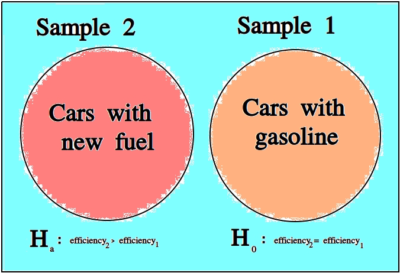

==================
Hypothesis Testing
==================

Once we have data to analyze, we apply the *statistical inference* to see what it tells us. 

*Statistical inference* is the process of using a sample of data to reach new conclusions about the population from which it was drawn. 

Null and Alternate Hypotheses
=============================

Usually in statistics we are concerned with *hypotheses* and whether or not, based on the available data, there is sufficient evidence to reject one hypothesis in favor of another.

For example, we might like to know whether a new type of fuel is cleaner and more efficient than standard gasoline. In this case, we would start by assuming the *null hypothesis* that the efficiency of the new fuel is the same as standard gasoline. We would then establish an experiment designed to test this hypothesis against the *alternate hypothesis* that the new fuel is more efficient than standard gasoline.

.. topic:: Null Hypothesis

    .. math::

        H_{ \varnothing }

    The *null hypothesis* is the prior assumption we bring to the *experiment*. It represents the "*status quo*". 

    The term "*null*" in *null hypothesis* means "*none*" or "*empty*", as in nothing has been accomplished with the *null hypothesis*. It represents "*no change to the state of our knowledge about the world*"

.. topic:: Alternate Hypothesis

    .. math::

        H_a

    The *alternate hypothesis* is the theory we would like to test with the experiment. It represents the "*overturning of the status quo*" in favor of a new explanation. 

We assume the *null hypothesis* in order to test the validity of the *alternate hypothesis*. If we find sufficient evidence the *null hypothesis* is not true, we reject it in favor of the *alternate hypothesis*.

.. important::

    We never *prove* the null hypothesis true. It is always *assumed* true in order to determine whether there is sufficient evidence to conclude it is false.

Controls 
--------

In the example of testing the efficiency of a new type of fuel against standard gasoline, notice we are asking a question about two different populations: the population of cars that use the new type of fuel and the population of cars that use standard gasoline. Specifically, we are asking if there is a *statistically significance* difference between the efficiency of either group. 

The first group is referred to as the *test* group, the sample to which a *treatment* has been applied and whose efficacy we would like to test.

The second group is referred to as the *control group*, the sample to which no *treatments* have been applied and which acts as a baseline against which we can judge the effects of the *treatment*.

.. _confounding-variables:

Confounding Variables
---------------------

Let us continue to consider the example experiment of testing the efficiency of a new type of fuel against standard gasoline. 

To truly isolate the experiment from any *confounding variables*, we should restrict our populations to certain *makes* and *models* of cars. Otherwise, we would not be sure if the results of our experiments were due to the efficiency of the new fuel, or variations in the engine running the fuel. 

A *confounding variable* is a variable that affects the experiment, but is not measured, whether due to poor experimental design or due to the nature of the interaction. 

To see what is meant by "*due to the nature of the interaction*", suppose the new type of fuel whose efficiency is being tested loses some of its potency at higher elevations (due to the effects of gravity on its chemical composition, let's say). If some of the data we collect from the cars using the new fuel type is collected from high-altitude locations, then the data will show the effects of this dependence, without our being aware. We might then erroneously conclude the new fuel does not possess the anticipated efficiency gains, call the experiment a wash and go home sad. 

For this reason, we must be very careful to always consider what variables for which we haven't accounted might be influencing the samples we observe. In other words, we must always be mindful of *confounding variables* and their effects. 

Decisions
=========

TODO

.. _type-i-errors:

Type I Errors
-------------

TODO

.. topic:: Type I Error

	A *Type I Error* is **rejecting** the null hypothesis when it is **true**. 

.. _type-ii-errors:

Type II Errors
--------------

TODO

.. topic:: Type II Error

	A *Type II Error** is **not rejecting** the null hypothesis when it is **false**.
