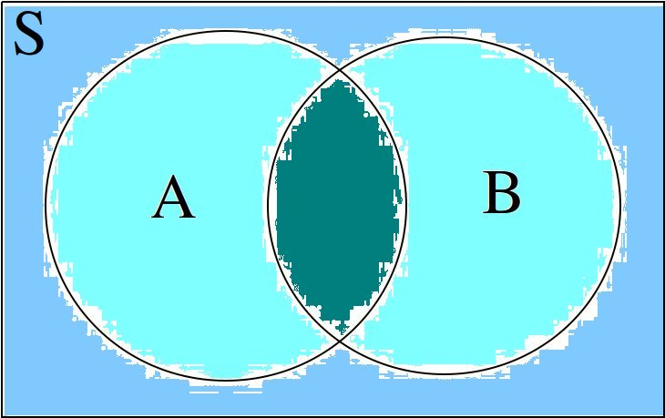

.. _set-theory: 

==========
Set Theory
==========

Definitions
===========

.. _domain-of-discourse:

-------------------
Domain of Discourse
-------------------

Definition
    The *domain of discourse* is subject matter we are treating. 

.. _elements:

--------
Elements
--------

Symbolic Expression
    :math:`x,y,x` (*lowercase letters*)
    
    :math:`x_1, x_2, ... , x_n` (*lowercase letters with subscripts*)

Definition   
    The individuals, or objects, in the *domain of discourse*; The "*things*" being counted.

.. _sets:

----
Sets
----

Symbolic Expression
    :math:`A,B,C` (*upper case letters*)

    :math:`A_1, A_2, ... , A_n` (*uppercase letters with subscripts*)

Definition 
    Groups of elements that share a common property. 

.. note:: 

    *Sets* are sometimes referred to as *classes* or *collections*.

.. _cardinality:

-----------
Cardinality
-----------

Symbolic Expression
    :math:`n(A)`

Definition 
    The number of *distinct* elements in a set.

.. _universal-set:

-------------
Universal Set 
-------------

Symbolic Expression
    :math:`S`

Definition
    The universal set *S* is set of all elements in the *domain of discourse*. 

.. _null-set:

--------
Null Set
--------

Symbolic Expression
    :math:`\varnothing`

Definition
    The unique set which contains nothing, i.e. no elements. 

.. _natural-numbers:

---------------
Natural Numbers
---------------

Symbolic Expresison
    :math:`\mathbb{N}`

Definition
    The set of all counting numbers starting at :math:`1, 2, 3, ...`

.. _real-numbers:

------------
Real Numbers
------------

Symbolic Expression
    :math:`\mathbb{R}`

Definition
    The set of all decimal numbers, :math:`1, 1.01, 1.001, ...`

Notation
========

.. _list-notation:

-------------
List Notation
-------------

.. math:: 

    A = \{ a, b, c, ... \}

In *list notation*, all of the elements that belong to **A** are *explicitly* written between a pair of brackets with commas separating each element. 

.. _quantifier-notation:

-------------------
Quantifier Notation 
-------------------

.. math:: 
    
    A = \{ \forall x: F(x) \}

In *quantifier notation*, all of the elements that belong to **A** are *implicitly* written between a pair of brackets with a formula that specifies the conditions for membership.

*Quantifier notation* is sometimes referred to as *set builder notation*.

.. _set-corollaries:

Corollaries
===========

:math:`n(\varnothing)=0`

	The number of elements in the *null set* (the *cardinality* of the *null set*) is 0.

:math:`\forall x: x \notin \varnothing`

	Nothing belongs to the *null set*

:math:`\forall x: x \in S`

	Everything belongs to the *unverisal set*

.. _venn-diagrams:

Venn Diagrams
=============

A *Venn Diagram* is a visual representation of sets and the relations between them. The universal set is represent as rectangle and sets are represented as circles within this rectangle. The simplest *Venn Diagram* is a graphic of a single set **A** shown against the universal set **S**, 

You will sometimes set *Venn Diagrams* with the elements of the sets written in, as in the following picture,

*Venn Diagrams* are useful for visualizing :ref:`set-relations`. For this reason, we will see more complex examples of *Venn Diagrams* in the next section.

.. _set-relations:

Relations
=========

.. _subset:

------
Subset
------
 
.. topic:: Subset

	.. math::
     
		A \subseteq B

**A** is a subset of **B** if all of **A**'s elements are contained in **B**. 

To say the same thing in a different way, if the element *x* belongs to **A**, then the element *x* also belongs to **B**

.. math::
    
	\forall x : x \in A \implies x \in B

The relation of *subset* can be seen in the following *Venn Diagram*, 

This diagram represents the relationship :math:`A \subseteq B`.

.. _proper-subset:

-------------
Proper Subset 
-------------

.. topic:: Proper Subset

	.. math:: 
		A \subset B

**A** is a subset of **B** and :math:`A \neq B`. To say the same thing in a different way, **A** is wholly contained in **B**.

.. math::
    
	\forall x: x \in A \implies x \in B \text{ and } A \neq B 

An equivalent way of defining a *proper subset* is given by,

.. math::
    
	\forall x: x \in A \implies x \in B \text{ and } n(A) < n(B)

This is an equivalent formulation because saying cthe cardinality of **A** is less than the cardinality of **B** *and* all members of **A** are members of **B**" is logically equivalent to saying "**A** is not identical to **B** *and* all members of **A** are members of **B**".

.. _set-equivalence:

-----------
Equivalence
-----------

.. topic:: Equivalence

	.. math::
    
	        A \equiv B
    
Two sets **A** and **B** are *equivalent* if the number of elements in **A** is equal to the number of elements **B**, i.e.,

.. math:: 

	n(A) = n(B) \implies A \equiv B

.. _set-equality:

--------
Equality
--------

.. topic:: Equality

	.. math::

		A = B

Two sets **A** and **B** are *equal* if they contain the same elements. In other words, two sets are equal if they are the same set.

.. math:: 

	\forall x: x \in A \implies x \in B \text{ and } x \in B \implies x \in A

An equivalent way of defining the equality of sets is given by,

.. math:: 

	A \subseteq B \text { and } B \subseteq A 

In other words, if **A** is wholly contained in **B** and **B** is wholly contained in **A**, then the only way this can occur is if :math:`A = B`.

*Equality* is a stricter condition than *equivalence*. Two sets that are equal are equivalent, but two sets that equivalent are not necessarily equal. Consider the sets,

.. math::

    	A = \{ \text{dog}, \text{cat} \}

.. math:: 

    	B = \{ \text{Vietnam War}, \text{Russo-Japanese War} \}

Both of these sets are equivalent because :math:`n(A) = n(B) = 2`, but they are not equal. If we add **C** to the mix,

.. math::

    	C = \{ \text{cat}, \text{dog} \}

Then not only do we have :math:`n(A) = n(C) = 2`, but we also have :math:`C = A`, since they both contain the same elements. 

In order words, from equality we can infer equivalence, but from equivalence, we *cannot* infer equality. 

.. math::

    	A = B \implies A \equiv B

.. math:: 
    	A \equiv B \not \Rightarrow A = B 

.. _set-operations:

Operations
==========

.. _complement:

----------
Complement
----------

.. topic:: Complement

	.. math::

		A^c

	.. math::

		\sim  A

The set containing elements that do not belong to the set **A**. 

.. math:: 

	A^c = \{ \forall x: x \notin A \}

The complement can be visualized with the following *Venn Diagram*,

.. image:: ../../_static/img/math/sets/sets-complement.jpg

.. tip:: 

    The complement of a set corresponds to the English word "*not*". 
    
    **Example**
    
	Let **S** be the set of animals and let **A** be the set of dogs. Then :math:`A^c` is the set of animals that are *not* dogs.

.. note::

	The complement is always taken *relative to the universal set*. In other words, you cannot find the complement if you do not have the universal set. 

**Example** 

	.. math::

		S = \{ \text{ red }, \text{ blue }, \text{ green } \}

	.. math::

		A = \{ \text{ blue } \}

	.. math::

		A^c = \{ \text{ red }, \text{ green } \}

.. _union:

-----
Union
-----

.. topic:: Union
	
	.. math::

        	A \cup B

The set containing elements that belong to either the set **A** or the set **B**.

.. math:: 

	A \cup B = \{ \forall x: x \in A \text{ or } x \in B \}

We have to be careful with *Venn Diagrams* that represent unions, because the two sets **A** and **B** might have elements in common, or they may not have elements in common. 

The first case, where the two sets have no elements in common is shown below,

.. image:: ../../_static/img/math/sets/sets-union-disjoint.jpg

The union would be represented by *both* circles. Notice the circles do not touch. Sets that have no elements in common are called *disjoint*. 

The second case, where the two sets have elements in common is shown in the next diagram,

The union would be represented by the entire area of both circles. Notice the circles share some elements in this case. Sets that have elements in common, but are not subsets in either direction (i.e. neither :math:`A \subseteq B` nor :math:`B \subseteq A`), are called *overlapping*.

.. tip:: 
    
    The union of two sets corresponds to the English "*or*". 
    
    **Example**
    
	Let **A** be the set of calculators. Let **B** represent the set of *pencils*. Then :math:`A \cup B` represents the set of *calculators* or *pencils*.

**Example** 

	.. math:: 

		A = \{ a, b, c \} 

	.. math::

		B = \{ b, c, d \}

	.. math::

		A \cup B = \{ a, b, c, d \}

.. _intersection:

------------
Intersection
------------

.. topic:: Intersection

	.. math::
        
		A \cap B

The set containing elements that to both the set **A** and the set **B**. 

.. math:: 

	A \cap B = \{ \forall x: x \in A \text{ and } x \in B \}

As in the union, there are two cases we need to consider when representing the interesection of two sets with a *Venn Diagram*. Either the sets have elements in common, or they do not. 

The first case, where the two sets have elements in common is shown in the next diagram,

The intersection is represented by where the circles meet. In the case of *overlapping* sets, this is non-empty,

.. math:: 

	A \cap B \neq \varnothing

The second case, where the two sets have no elements in common is shown below,

.. image:: ../../_static/img/math/sets/sets-union-disjoint.jpg

The intersection is represented by where the circles meet. In the case of *disjoint sets*, the circles do not meet. Thus, 

.. math:: 

	A \cap B = \varnothing

.. tip:: 

	The intersection of two sets corresponds to the English "*and*". 

	**Example**
	
		Let **A** be the set of United States Senators. Let **B** the set of people over the age of 70. Then, :math:`A \cap B` represents the set of people who are both United States Senators and over the age of 70.

**Example **

	.. math::

		A = \{ a, b, c \}

	.. math:: 

		B = \{ b, c, d \}

	.. math::

		A \cap B = \{ b, c \}

.. _set-difference:

----------
Difference
----------

TODO

The operation of subtracting a set :math:`B` from a set :math:`A` is equivalent to taking the intersection the sets :math:`A` and :math:`B^c`,

.. math:: 

	A - B = A \cap B^c

.. _set-theorems:

Theorems
========

All of the theorems of Set Theory can be proven in one of two ways:

1. By drawing a :ref:`Venn Diagram <venn-diagrams>` of the sets in question and working out the relations between them graphically.

2. Writing example sets in :ref:`list-notation` and then applying the definitions of :ref:`set-operations` to both sides of the equation. 

.. note:: 

	Most of the set theorems can be phrased in terms of sets, or in terms of cardinalities. We can do this because all of the following theorems are theorems about *equality* of sets. Recall that from equality we can infer equivalence, 

	.. math::

		A = B \implies A \equiv B
    
	This will be important when we apply these ideas to :ref:`probability`. For this reason, we will give two versions of each theorem, when possible. One version will be phrased in terms of sets and the other version will be phrased in terms of cardinalities.

.. _basic-theorems:

--------------
Basic Theorems
--------------

.. _zero-property-of-intersections:

Zero Property of Intersections
------------------------------

.. topic:: Zero Property of Intersections

	.. math:: 

		A \cap \varnothing = \varnothing

	Or equivalently, 

	.. math:: 

	        n(A \cap \varnothing) = n(\varnothing)

The intersection of any set **A** with the empty set is the empty set. 

.. note:: 

	Notice the resemblance to *zero property of multiplication*,

	.. math:: 
        
		a \cdot 0 = 0

.. _zero-property-of-unions:

Zero Property of Unions
-----------------------

.. topic:: Zero Property of Unions

	.. math:: 

		A \cup \varnothing = A

	Or equivalently, 

	.. math::

		n(A \cup \varnothing) = n(A)

The union of any set **A** with the empty set is itself. 

.. note:: 

	Notice the resembalnce to the *identity property of addition*,

	.. math::

		a + 0 = a

.. _first-identity-property-of-intersections:

First Identity Property of Intersections
----------------------------------------

.. topic:: Identity Property of Intersections

	.. math:: 

		A \cap S = A 

	Or equivalently, 

	.. math::

		n(A \cap S) = n(A)

The intersection of any set **A** with the universal set is itself.

.. note:: 

	Notice the resemblance to the *identity property of multiplication*,

	.. math::

		a \cdot 1 = a

.. _second-identity-property-of-intersetions:

Second Identity Property of Intersections
-----------------------------------------

Symbolic Expression
    .. math:: 

        A \cap A = A

The intersection of any set **A** with itself is itself.

.. _first-identity-property-of-unions:

First Identity Property of Unions
---------------------------------

.. topic:: Identity Property of Unions

    	.. math:: 

		A \cup S = S 

	Or equivalently, 

	.. math::

		n(A \cup S) = n(S)

The union of any set **A** with the universal set is the universal set.

.. note:: 

	This theorem does not have an analogous algebraic property. This is where *set theory* starts to diverge from ordinary algebra. 

.. _second-identity-property-of-unions:

Second Identity Property of Unions
----------------------------------

Symbolic Expression
    .. math:: 

        A \cup A = A 

The union of any set **A** with itself is itself. 

.. _subset-theorems:

---------------
Subset Theorems
---------------

.. _subset-theorem-one:

Theorem 1
---------

.. math::

	A \cap B \subseteq A 

Or equivalently, 

.. math::
	n(A \cap B) <= n(A)

The intersection of **A** and **B** is a subset of **A**.

.. _subset-theorem-two:

Theorem 2
---------

.. math::
	
	A \subseteq A \cup B

Or equivalently,

.. math::
	n(A) <= n(A \cup B)

**A** is a subset of the union of **A** and **B**.

.. _subset-theorem-three:

Theorem 3
---------

.. math::

	A \cap B \subseteq A \cup B

Or equivalently,

.. math::

	n(A \cap B) <= n(A \cup B)

The intersection of two sets **A** and **B** is a subset of the union of those same two sets.

.. _subset-theorem-four:

Theorem 4
---------

.. math::

	A \subseteq B \implies A \cap B = A

Or equivalently,

.. math:: 
	
	A \subseteq B \implies n(A \cap B) = n(A)

If **A** is a subset of **B**, then the intersection of **A** and **B** is equal to **A**. 

The hypothesis of this theorem, that **A** is a subset of **B**, cannot be written simply in terms of cardinalities. To see why, consider the sets,

.. math:: 

    A = \{ \text{red}, \text{blue}, \text{yellow} \}

.. math::

    B = \{ \text{red}, \text{blue} \}

.. math::

    C = \{ \text{orange}, \text{black} \}

Here we have,

.. math::
    
    B \subseteq A

From this and the theorem taken together, we are able to infer the intersection of **B** and **A** is **B**,

.. math::

    B \cap A = \{ \text{red}, \text{blue} \} = B

If we try to apply the same logic to **C** and **A**, we run into a problem. Namely, 

.. math:: 

    C \nsubseteq A

However, we do have, 

.. math::

    n(C) <= n(A)

But this doesn't help us, because from it, we **cannot** infer,

.. math:: 

    n(C \cap A) = n(C)

In fact, not only can we *not* infer it, it's *not* true. In this example, 

.. math::

    C \cap A = \varnothing

So, 

.. math::

    n(C \cap A) = 0

Whereas, 

.. math::

    n(A) = 3 \neq 0

The lesson here is: the relation of "*less than or equal to*" between cardinalities does not equate to the relation of "*subset of*" between two sets. While the concepts are related, this theorem illustrates they must regarded as separate *ideas*. 

.. _subset-theorem-five:

Theorem 5
---------

.. math::

	A \subseteq B \implies A \cup B = B

If **A** is a subset of **B**, then the union of **A** and **B** is equal to **B**

.. _law-of-syllogism:

Law of Syllogism
----------------

.. math:: 

	A \subseteq B \text{ and } B \subset C \implies A \subseteq C

If **A** is a subset of **B** and **B** is a subset of **C**, then **A** is a subset of **C**. 

.. note::
    
    Refer to the :ref:`knowledge` section for more details on *syllogisms*.

.. _complement-theorems:

-------------------
Complement Theorems
-------------------

.. _law-of-double-negation:

Law of Double Negation
----------------------

.. math::

	(A^c)^c = A 

The complement of a set **A**'s complement is the set **a**. 

.. tip::

	If a crayon isn't *not red*, then it *is* red. 

.. admonition:: Example

	.. math::

		S = \{ 1, 2, 3 \}

	.. math::

		A = \{ 1, 2 \}

	.. math::

		A^c = \{ 3 \}

	.. math::

		(A^c)^c = \{ 1, 2 \}

.. _law-of-excluded-middle:

Law Of Excluded Middle
----------------------

.. topic:: Law of Excluded Middle

	.. math::

        	A \cup A^c = S

	Or equivalently, 

	.. math::
	
		n(A \cup A^c) = n(S)

The union of a set **A** with its complement is the universal set.

.. admonition:: Example 

	.. math::

		S = \{ \text{ heads }, \text{ tails } \}

	.. math::

		A = \{ \text{ heads } \}

	.. math::

		A^c = \{ \text{ tails } \}

	.. math::

		A \cup A^c = \{ \text{ heads }, \text{ tails } \} = S 

.. _law-of-noncontradiction:

Law of Non-Contradiction
------------------------

.. topic:: Law of Non-Contradiction

	.. math::

        	A \cap A ^c = \varnothing

The intersection of a set **A** its complement is the empty set.

**Example** 

	.. math::

		S = \{ \text{jack}, \text{queen}, \text{king}, \text{ace} \}

	.. math::

		A = \{ \text{jack}, \text{queen}, \text{king} \}

	.. math::

		A^c = \{ \text{ace} \}

	.. math:: 

		A \cap A^c = \{ \} = \varnothing

.. _counting-theorems:

-----------------
Counting Theorems 
-----------------

.. _law-of-unions:

Law of Unions
-------------

.. topic:: Law of Unions

	.. math::
    
    		n(A \cup B) = n(A) + n(B) - n(A \cap B)

The number of elements in **A** or **B** is equal to the number of elements in **A** plus the number of elements in **B**, minus the elements **A** and **B** have in common.

This is another theorem most easily understood by considering the following :ref:`venn diagram <venn-diagrams>`,

The area encompassed by both circles is the union :math:`A \cup B`. The overlap in the circles is intersection :math:`A \cap B`. 

Consider how we count up elements in **A** or **B**. We first count up the elements in **A**, including the elemetns in the overlap. We then count up the elements in **B**, which includes the overlap again. In other words, by calculating :math:`n(A) + n(B)`, we have counted up the elements in :math:`A \cap B` *twice*. To fix this overcount, we need to subtract the number elements of in :math:`A \cap B`. Whence we arrive at the theorem.

.. admonition:: Example

	.. math::

		A = \{ \text{ google }, \text{ facebook }, \text{ apple } \}

	.. math:: 

		n(A) = 3 

	.. math::

		B = \{ \text{ banana }, \text{ apple } \}

	.. math::

		n(B) = 2

    	Note, when the elements of **A** are totaled, ``apple`` is counted once. When the elements of **B** are totaled, the element ``apple`` is counted again. We have thus doubled-counted this element, which is exactly the intersection :math:`A \cap B`,

	.. math::
	
		A \cap B = \{ text{ apple } \}

	.. math::

		n(A \cap B) = 1

	.. math::

		A \cup B = \{ \text{ google }, \text{ facebook }, \text{ apple }, \text{ banana } \}

	.. math::

		n(A \cup B) = 4

	.. math::

		n(A) + n(B) - n(A \cap B) = 2 + 3 - 1 = 4

.. _law-of-complements:

Law of Complements
******************

.. topic:: Law of Complements

	.. math::
    
		n(A) + n(A^c) = n(S)

The number of elements in any set **A** plus the number of elements in its complement is equal to the number of elements in the univeral set.

This theorem follows from the :ref:`venn diagram <venn-diagrams>` of a set with its complement,

.. image:: ../../_static/img/math/sets/sets-complement.jpg 
	:align: center

It can proved formally as follows,

.. admonition:: Proof

	By :ref:`law-of-noncontradiction`, 

	.. math::

		A \cap A^c = \varnothing

	By definition,

	.. math::

		n(\varnothing) = 0

	So, it follows, 

	.. math::

		n(A \cap A ^c) = 0

	By :ref:`law-of-unions`,

	.. math::

		n(A \cup A^c) = n(A) + n(A^c) - n(A \cap A^c)

	But, as noted, the last term on the righthand side of this equation is ``0``, so

	.. math::

		n(A \cup A^c) = n(A) + n(A^c)

	On the other hand, by :ref:`law-of-excluded-middle`,

	.. math::

		A \cup A^c = S

	So, it follows, 

	.. math::

		n(A \cup A^c) = n(S)

	Putting it altogether,

	.. math::

		n(S) = n(A) + n(A^c)

.. _square-of-opposition:

Aristotle's Square of Opposition
================================

The *square of opposition* is a famous logical device for remembering how different propositions involving sets are related to one another. To be more specific, the *square of opposition* shows how negation affects sets. Before we show you the *square of opposition*, let us take a look at the logic behidn it.

In ordinary *first-order* logic, the *negation* of proposition simply means negating its truth value. For example, the negation of the proposition,

	p = it is raining

Can be found by inserting the word "*not*",

	~ p = it is not raining

However, when we are talking about sets, it is more complicated, because we must *quantify* over which elements in the set proposition is true.

----------
Derivation
----------

Consider the algebraic proposition,

.. math:: 

	2 \cdot x = x + x

This type of statement is obviously true no matter what we insert for *x*. Whatever number we plug into the equation, a true statement will always result. Symbolically, we can express this idea with the :math:`\forall` symbol,

.. math:: 

	\forall x \in \mathbb{R}: 2 \cdot x = x + x 

We read this is as, "for all x, doubling x is equal to adding x twice".

Contrast this against the proposition,

.. math::

	2x + 1 = 5

We are not free to plug just any value of *x* into this equation. Only a *particular* value of *x* will satisfy it, i.e. make it true (in this case :math:`x = 2`). Anything else we plug into the equation will result in a *contradiction*, a statement that is obviously not true (try plugging in :math:`x = 3` and see what you get). We can express this idea with the :math:`\exists` symbol,

.. math::

	exists x \in \mathbb{R}: 2x + 1 = 5

We read this as, "there exists an *x* such that :math:`2x +1 = 5`" or "some *x* satisifies :math:`2x + 1 = 5`.

When dealing with sets, we have two types of propositions to consider, *universal* propositions, denoted by the :math:`\forall` symbol, and *existential* propositions, denoted by the :math:`\exists` symbol.

Then, in order to understand negation with respect to sets, we must answer to questions:

	1. How do we negate a *universal* proposition? 
	
	2. How do we negate an *existential* proposition?

In order to answer these question, we have to break each case into two further cases: the *positive* case and the *negative* case. 

For universal propositions: In the *positive* case, we take a universal proposition that asserts something of all elements in a set. In the *negative* case, we take a universal proposition that denies something of all elements in a set.

For existential propositions: In the *positive* case, we take an exisential proposition that asserts something of some element in a set. In the *negative* case, we take an existential proposition that denies something of some element in a set.

Universal Positive Case
-----------------------

Consider the proposition

	All dogs are brown.

In order to show this proposition is false, it would be sufficient to show at least one dog existed that was not brown. For, if all dogs are brown, then it cannot be the case there is one dog that is not brown. Therefore, the negation of this proposition is,

	Some dog is not brown.

To express this symbollically, let **D** represent the set of dogs and let **B** represent the set of brown things. Then the first proposition can be represented as,

.. math::
    
	\forall x \in D: x \in B

.. note::

	This is equivalent to saying,

	.. math::

		D \subseteq B

In order to negate this, we must show there is some element in D that is *not* in B. In other words, we switch the :math:`\forall` to a :math:`\exists` and negate the proposition being quantified,

.. math::

	\exists x \in D: x \notin B

Thus, we arrive at the formal definition of the negativion of a universal affirmative proposition,

.. math::

	( \text{ not } \forall x \in A: x \in B) \equiv (\exists x \in A: x \notin B)

Universal Negative Case
-----------------------

Consider the proposition,

	Some cars are fast. 

In order to negative this we must show *all* cars are *not*fast. It is *not* sufficient to show *only* some cars are *not* fast, because there may exist cars in the *some* we have not considered that may yet be fast, which would coincide with the truth of the original proposition. Therefore, the negation of this proposition is,

	All cars are not fast.

To express this symbollically, let **C** be the set of all cars and let **F** be the set of all fast things. Then, the original proposition can be written with the :math:`\exists` symbol,

.. math::

	\exists x \in C: x \in F

To negate this, we switch the :math:`\exists` to a :math:`\forall` and negate the quantified proposition,

.. math::

	\forall x \in C: x \notin F

Thus, we arrive at the formal definition of the negation of a *universal negative proposition*,

.. math::

	(\exists x \in C: x \in F) \equiv (\text {not} \forall x \in C: \notin F)

Existential Positive Case
-------------------------

TODO 

Existential Negative Case
-------------------------

TODO 

--------------------
Square of Opposition
--------------------

Finally, we come to the *square of opposition*, a visual device for remembering everything that has been covered in this section. 

The *square of opposition* is constructed by first drawing a table,

+-------------+--------------+----------------+
|             |  existential |    universal   |
+-------------+--------------+----------------+
|  positive   |              |                |
+-------------+--------------+----------------+
|  negative   |              |                |
+-------------+--------------+----------------+

In the entries of this table, you draw :ref:`venn-diagrams` that represent the intersection of the row and column. Putting the results together, we get the following picture,

.. image:: ../../_static/img/math/sets/square-of-opposition.jpg

Notice the diagonals of the picture, the line that connects the top left to the bottom right and the line that connects the top right to the bottom left, form the contradictory pairs of propositions, namely,

.. math::

	\text{universal positive} \nrightarrow \text{existential negative}

.. math::

	\text{universal negative} \nrightarrow \text{existential positive}

