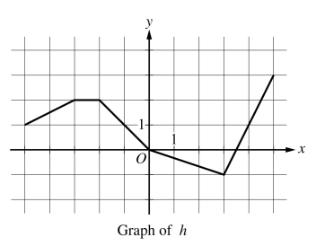
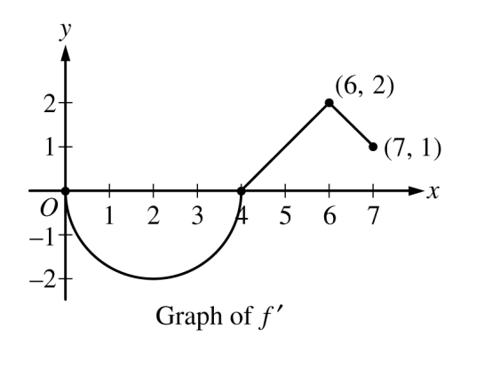
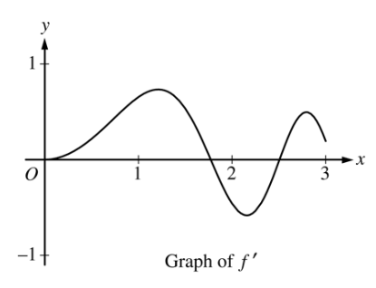
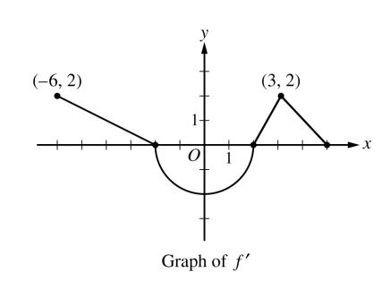
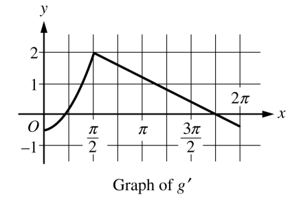

.. _chain-rule-problems:

----------
Chain Rule 
----------

.. topic:: Composite Functions

	.. math::
	
		f \circ g (x) = f( g(x) )
		
.. topic:: The Chain Rule

	.. math::
	
		\frac{d}{dx}( f \circ g (x) ) = f^{\prime}(g(x)) \cdot g^{\prime} (x)

1. **The Gaussian Function**

The Normal density function, sometimes called the *Gaussian* function in honor of Johann Carl Friedrich Gauss who discovered its formula, is an important function in statistics. 

Graphically, the Normal density curve is a *bell curve*. Roughly speaking, the value of the *Gaussian* function at a point :math:`x` represents the *probability* of making an observation :math:`x`, when the observation is randomly selected from a population of values whose arithmetical average is :math:`\mu`.

The *Gaussian* function is given by,

.. math::

	\rho ( x ) = \frac{ 1 }{ \sqrt{2 \cdot \pi \cdot \sigma^2} } \cdot e ^ { - \frac{ (x-\mu)^2  }{ 2 \cdot \sigma^2} }
	
The constants, :math:`\mu` and :math:`\sigma`, are *parameters* of the density function. These parameters determine the shape and curvature of the bell curve. They are *known* quantities; in other words, they may be held constant and treated as numbers. 

Use the Normal density function to answer the following questions.

a. Find :math:`\frac{d}{dx}(\rho (x) )`

b. Find :math:`\frac{d^2}{{dx}^2}(\rho (x))`

c. Find the value of :math:`x` where :math:`\frac{d}{dx}(\rho (x) ) = 0`. Solve symbolically in terms of :math:`\mu` and :math:`\sigma`.

.. hint::

     :math:`e^x` never equals 0!

d. Find the **values** of :math:`x` where :math:`\frac{d^2}{{dx}^2}(\rho (x)) = 0`. What is the value of :math:`\rho^{\prime}(x)` at these points? Solve symbolically in terms of :math:`\mu` and :math:`\sigma`.

e. Suppose :math:`\mu=10` and :math:`\sigma=2`. Use a graphing utility (`Desmos is good for this <https://desmos.com>`_) to plot the Normal density function. Draw vertical lines at the values of :math:`x` found in *part c* and *part d*. 

f. Suppose :math:`\mu=10` and :math:`\sigma=2`. Find the **equation** of the tangent line at the following points (yes, all of them). Round to four decimal places where appropriate.

	i. :math:`x = 17`
	
	ii. :math:`x = 15`
	
	iii. :math:`x = 13`
	
	iv. :math:`x = 11`
	
	v. :math:`x = 9`
	
	vi. :math:`x = 7`
	
	vii. :math:`x = 5` 
	
	viii. :math:`x = 3`

g. Plot the tangent lines on top of the Normal density function using the same graphing utility as *part e*. 

h. Find the value of :math:`\rho^{\prime \prime}(x)` at each point in *part f*.

i. Suppose :math:`\mu=10` and :math:`\sigma=2`. Plot the first and second derivative of the given Normal density curve on the same graph as *part e*. 

j. What happens to the Normal density function at the point found in *part c*?

k. What happens to the Normal density function at the points found in *part d*?

.. hint:: 

	What happens to the *direction* of the tangent line at each of the *critical points* found in *part d*? Look at the tangent lines plotted in *part g*!

2. **Deriving the Quotient Rule**

Recall the *Product Rule* and *Quotient Rule* for differentiation,
	
.. topic:: The Product Rule

	.. math:: 
		
		\frac{d}{dx}(f(x) \cdot g(x)) = f^{\prime}(x) \cdot g(x) + f(x) \cdot g^{\prime} (x) 
		
.. topic:: The Quotient Rule

	.. math:: 
	
		\frac{d}{dx}( \frac{f(x)}{g(x)} ) = \frac{ f^{\prime}(x) \cdot g(x) - f(x) \cdot g^{\prime} (x) } { (g(x))^2 }

The *Product Rule* is simpler to remember than the *Quotient Rule*. Moreover, the *Quotient Rule* can be *derived* from the *Product Rule* using the *Chain Rule*, if we recall one simple rule of exponents,

.. math::

	\frac{1}{a} = a ^ {-1}
	
In this problem, we will show how to apply this property of exponents to get the *Quotient Rule* from the *Product* and *Chain Rule*. 

a. Write the quotient :math:`\frac{f(x)}{g(x)}` as a product using a negative exponent. 

b. Take the derivative of the expression in *part a* by applying the *Product Rule* and then the *Chain Rule*.

c. Find a common denominator and simplify the expression in *part b*. 

3. **2005, Free Response Form B, #3**

A particle moves along the x-axis so that its velocity v at time t, for :math:`0 \leq t \leq 5`, is given by

.. math::

	v(t) = \ln(t^2 - 3t +3)
	
The particle is at position :math:`x=8` at time :math:`t=0`.

a. Find the acceleration of the particle at time t = 4.

b. Find all times t in the open interval :math:`0 < t < 5` at which the particle changes direction. During which time intervals, for :math:`0 \leq t \leq 5`, does the particle travel to the left?

c. Find the position of the particle at time :math:`t = 2`.

d. Find the average speed of the particle over the interval :math:`0 \leq t \leq 2`

4. **2023, Free Response, #5**

+-----------------------+--------------------+---------+-----+----+
|          x            |        0           |     2   |  4  |  7 |
+-----------------------+--------------------+---------+-----+----+
| :math:`f(x)`          |       10           |     7   |  4  | 5  |
+-----------------------+--------------------+---------+-----+----+
| :math:`f^{\prime}(x)` | :math:`\frac{3}{2}`|    -8   | 3   |  6 |
+-----------------------+--------------------+---------+-----+----+
| :math:`g(x)`          |          1         |    2    |  -3 | 0  |
+-----------------------+--------------------+---------+-----+----+
| :math:`g^{\prime}(x)` |       5            |    4    |  2  | 8  |
+-----------------------+--------------------+---------+-----+----+

The functions :math:`f` and :math:`g` are twice differentiable. The table shown gives the values of the functions and their first derivatives at selected values of x.

a. Let :math:`h` be the function defined by :math:`h(x)=f(g(x))`. Find :math:`h^{\prime}(7)`. Show the work that leads to your answer.

b. Let :math:`k` be a differentiable function such that :math:`k^{\prime}=(f(x))^2 \cdot g(x)`. Is the graph of :math:`k` concave up or down at the point where :math:`x = 4`? Give a reason for your answer.

5. **2016, Free Response, #6**

+-------+--------------+-----------------------+--------------+-----------------------+
|   x   | :math:`f(x)` | :math:`f^{\prime}(x)` | :math:`g(x)` | :math:`g^{\prime}(x)` |
+-------+--------------+-----------------------+--------------+-----------------------+
|   1   |     -6       |           3           |       2      |        8              |
+-------+--------------+-----------------------+--------------+-----------------------+
|   2   |     2        |           -2          |       -3     |        0              |
+-------+--------------+-----------------------+--------------+-----------------------+
|   3   |     8        |          7            |        6     |        2              |
+-------+--------------+-----------------------+--------------+-----------------------+
|  6    |    4         |          5            |       3      |        -1             |
+-------+--------------+-----------------------+--------------+-----------------------+

The function :math:`f` and `g` have continuous second derivatives. The table above gives values of the functions and their derivatives at selected values of :math:`x`.

a. Let :math:`k(x) = f(g(x)))`. Write an equation for the line tangent to the graph of :math:`k` at :math:`x=3`.

b. Let :math:`h(x) = \frac{g(x)}{f(x)}`. Find :math:`h^{\prime}(1)`.

6. **2017, Free Response, #6**

	
+-------+--------------+-----------------------+
|   x   | :math:`g(x)` | :math:`g^{\prime}(x)` |
+-------+--------------+-----------------------+
|  -5   |     10       |          -3           |
+-------+--------------+-----------------------+
|  -4   |     5        |           -1          |
+-------+--------------+-----------------------+
|  -3   |     2        |          4            |
+-------+--------------+-----------------------+
|  -2   |    3         |          1            |
+-------+--------------+-----------------------+
|  -1   |    1         |         -2            |
+-------+--------------+-----------------------+
|  0    |     0        |          -3           |
+-------+--------------+-----------------------+

Let :math:`f` be the function defined by :math:`f(x)=\cos{2x} + e^{\sin(x)}`.

Let :math:`g` be a differentiable function. The table above gives values of :math:`g` and its derivative :math:`g^{\prime}` at selected values of :math:`x`.

Let :math:`h` be the function whose graph, consisting of five line segments, is shown in the figure above.

a. Find the slope of the line tangent to the graph of :math:`f` at :math:`x = \pi`.

b. Let :math:`k` be the function defined by :math:`k(x)=h(f(x))`. Find :math:`k^{\prime}(\pi)`.

c. Let :math:`m` be the function defined by :math:`m(x) = g(-2x) \cdot h(x)`. Find :math:`m^{\prime}(2)`.

d. Is there a number :math:`c` in the closed interval :math:`[-5, -3]` such that :math:`g^{\prime}(c) = -4`? Justify your answer.

.. _implicit-differentiation-problems:

------------------------
Implicit Differentiation
------------------------

1. **Introduction**

For each of the following problems:

- Find :math:`y^{\prime}` by solving the equation for :math:`y` and differentiating directly.
- Find :math:`y^{\prime}` by implicit differentiation.
- Check the derivatives obtained through both methods are the same.

a. :math:`\frac{x}{y^3} = 1`

b. :math:`x^2 + y^3 = 4`

2. **Applications**

Use implicit differentiation to solve the following problems:

a. :math:`2 \cdot y^3 + 4 \cdot x^2 - y = x^6` 

b. :math:`7 \cdot y^2 + \sin(3x) = 12 - y^4`

c. :math:`e^x - \sin(y) = x`

d. :math:`\cos(x^2 + 2y) + x \cdot e^{y^2} = 1`

e. :math:`\tan(x^2 \cdot y^4) = 3x + y^2`

3. **A Pointless Problem**

.. important::

	Take time to appreciate the pun here. If you don't get it yet, you will.

Consider the function :math:`f(x,y)`,

.. math::

	x^2 + y^2 = 9

a. Plot this function in the x-y plane. (`Desmos is good for this <https://desmos.com>`_). What kind of graph is this?

.. important::

	Do you get it now?!
	
b. Use implicit differentiation to find :math:`\frac{dy}{dx}`. Express the answer as a function of :math:`x` only.

c. Find the equation of the tangent line at the points :math:`(\pm \frac{3 \cdot \sqrt{2}}{2}, \pm \frac{3 \cdot \sqrt{2}}{2})`

d. Plot the tangent lines on top of the graph you created in *part a*. 

e. Find the points :math:`(x,y)` where the tangent lines found in *part c* intersect. 

f. Plot the points found in *part e* on top of the graphs you created in *part a* and *part d*.

g. What is the *area* of the quadrilateral formed by the tangent lines in *part c*? 

4. **Natural Log Derivative**

The formula for the derivative of the natural log, :math:`ln(x)`, can be derived with *implicit differentiation*. To do so, recall the differentiaion rule for exponential functions,

.. topic:: Exponential Derivative

	.. math::
	
		\frac{d}{dx}(e^x) = e^x
		
Then define *y* as,

.. math::

	y = \ln(x)
	
Use *implicit differentiation* to derive the formula for,

.. math::
	
	\frac{d}{dx}(ln(x)) = \frac{1}{x}
	
.. hint::
	
	Solve for :math:`x` and then apply the *Chain Rule*.
	
5. **Inverse Trigonometric Derivatives**

In class we used *implicit differentiation* to derive, 

.. math::

	\frac{d}{dx}( \arcsin(x) ) = \frac{1}{\sqrt{1-x^2}}
	
Using a similar process, find the derivatives of the following inverse trigonometric functions,

a. :math:`f(x) = \arccos(x)`

b. :math:`f(x) = \arctan(x)`

.. hint::

	Remember to draw a diagram of the unit circle. Express *x* and *y* in terms of lengths and angles!
	
6. **2005, Free Response Form B, #5**

Consider the curve given by,

.. math::

	y ^2 = 2 + xy
	
a. Show that

.. math:: 

	\frac{dy}{dx} = \frac{y}{2y -x}

b. Find all points :math:`(x,y)` on the curve where the line tangent to the curve has slope :math:`\frac{1}{2}`.

c. Show that there are no points :math:`(x,y)` on the curve where the line tangent to the curve is horizontal.

d. Let x and y be functions of time t that are related by the equation :math:`y^2 = 2 + xy` . At time :math:`t = 5`, the value
of :math:`y` is 3 and :math:`\frac{dy}{dt} = 6`. Find the value of :math:`\frac{dx}{dt}` at time :math:`t = 5`.

7. **2023, Free Response, #6**

Consider the curve given by the equation, 

.. math::

	6xy = 2 + y^3
	
a. Show that,

.. math::

	\frac{dy}{dx} = \frac{2y}{y^2 - 2x}
	
b. Find the coordinates of a point on the curve at which the line tangent to the curve is horizontal, or explain why no such point exists.

c. Find the coordinates of a point on the curve at which the line tangent to the curve is vertical, or explain why no such point exists.

d. A particle is moving along the curve. At the instance when the particle is at the point :math:`(\frac{1}{2}, -2)`, its horizontal position is increasing at a rate of :math:`\frac{dx}{dt}=\frac{2}{3}` units per second. What is the value of :math:`\frac{dy}{dt}`, the rate of change of the particle's vertical position, at that instant?

8. **2015, Free Response, #6**

Consider the curve given by the equation :math:`y^3 - xy = 2`. It can be shown that :math:`\frac{dy}{dx} = \frac{y}{3y^2 - x}`.

a. Write an equation for the line tangent to the curve at the point :math:`(-1, 1)`.

b. Find the coordinates of all points on the curve at which the line tangent to the curve at that point is vertical. 

c. Evaluate :math:`\frac{d^2 y}{dx^2}` at the point on the curve where :math:`x = -1` and :math:`y = 1`. 

.. _graphing-problems:

========
Graphing
========

1. **2023, Free Response, #5**

+-----------------------+--------------------+---------+-----+----+
|          x            |        0           |     2   |  4  |  7 |
+-----------------------+--------------------+---------+-----+----+
| :math:`f(x)`          |       10           |     7   |  4  | 5  |
+-----------------------+--------------------+---------+-----+----+
| :math:`f^{\prime}(x)` | :math:`\frac{3}{2}`|    -8   | 3   |  6 |
+-----------------------+--------------------+---------+-----+----+
| :math:`g(x)`          |          1         |    2    |  -3 | 0  |
+-----------------------+--------------------+---------+-----+----+
| :math:`g^{\prime}(x)` |       5            |    4    |  2  | 8  |
+-----------------------+--------------------+---------+-----+----+

The functions :math:`f` and :math:`g` are twice differentiable. The table shown gives the values of the functions and their first derivatives at selected values of x.

a. Let :math:`h` be the function defined by :math:`h(x)=f(g(x))`. Find :math:`h^{\prime}(7)`. Show the work that leads to your answer.

b. Let :math:`k` be a differentiable function such that :math:`k^{\prime}=(f(x))^2 \cdot g(x)`. Is the graph of :math:`k` concave up or down at the point where :math:`x = 4`? Give a reason for your answer.

2. **2021, Free Response, #5**

Consider the function :math:`y=f(x)` whose curve is given by the equation :math:`2y^2 - 6 = y \sin{x}` for :math:`y > 0`.

a. Show that :math:`\frac{dy}{dx}=\frac{y \cos{x}}{4y - \sin{x}}`.

b. Write an equation for the line tangent to the curve at the point :math:`(0, \sqrt{3})`.

c. For :math:`0 \leq x \leq \pi` and :math:`y > 0`, find the coordinates of the point where the line tangent to the curve is horizontal.

d. Determine whether :math:`f` has a relative minimum, a relative maximum, or neither at the point found in *part c*. Justify your answer.

3. **2005, Free Response, #4**

+-------------------------------+----+-------------------+---+-------------------+-----+-------------------+----+-------------------+
|      x                        |  0 | :math:`0 < x < 1` | 1 | :math:`1 < x < 2` |  2  | :math:`2 < x < 3` | 3  | :math:`3 < x < 4` |   
+-------------------------------+----+-------------------+---+-------------------+-----+-------------------+----+-------------------+
| :math:`f(x)`                  | -1 | Negative          | 0 |     Positive      |  2  |     Positive      | 0  |     Negative      |
+-------------------------------+----+-------------------+---+-------------------+-----+-------------------+----+-------------------+
| :math:`f^{\prime}(x)`         |  4 | Positive          | 0 |     Positive      | DNE |     Negative      | -3 |     Negative      |
+-------------------------------+----+-------------------+---+-------------------+-----+-------------------+----+-------------------+
| :math:`f^{\prime}{\prime}(x)` | -2 | Negative          | 0 |     Positive      | DNE |     Negative      | 0  |     Positive      |
+-------------------------------+----+-------------------+---+-------------------+-----+-------------------+----+-------------------+

Let f be a function that is continuous on the interval :math:`[0, 4)` . The function f is twice differentiable except at :math:`x = 2`. The function f and its derivatives have the properties indicated in the table above, where DNE indicates that the derivatives of f do not exist at x = 2.

a. For :math:`0 < x < 4`, find all values of x at which f has a relative extremum. Determine whether f has a relative maximum or a relative minimum at each of these values. Justify your answer.

b. Sketch the graph of a function that has all the characteristics of f .

4. **2023, Free Response, #4**

The function :math:`f` is defined on the closed interval :math:`[-2, 8]` and satisfies :math:`f(2) = 1`. The graph of :math:`f^{\prime}`, the derivative of :math:`f` , consists of two line segments and a semicircle, as shown in the figure below,

	
a. Does f have a relative minimum, a relative maximum, or neither at :math:`x = 6`? Give a reason for your answer.

b. On what open intervals, if any, is the graph of f concave down? Give a reason for your answer.

c. Find the value of

.. math::

	\lim_{x \to 2} \frac{6 \cdot f(x) - 3x}{x^2 - 5x + 6}

or show that it does not exist. Justify your answer.

d. Find the absolute minimum value of f on the closed interval :math:`[-2, 8]` . Justify your answer.

5. **2022, Free Response, #3**

	
Let :math:`f` be a differentiable function with :math:`f(4) = 3` . On the interval :math:`0 \leq x \leq 7`, the graph of :math:`f^{\prime}`, the derivative of :math:`f`, consists of a semicircle and two line segments, as shown in the figure above.

a. Find :math:`f(0)` and :math:`f(5)`.

b. Find the :math:`x`-coordinates of all points of inflection of the graph of :math:`f` for :math:`0 < x < 7` . Justify your answer.

c. Let :math:`g` be the function defined by :math:`g(x) = f(x) - x`. On what intervals, if any, is :math:`g` decreasing for :math:`0 \leq x \leq 7`? Show the analysis that leads to your answer.

d. For the function :math:`g` defined in *part c*, find the absolute minimum value on the interval :math:`0 \leq x \leq 7`. Justify your answer.

6. **2021, Free Response, #5**

Consider the function :math:`y = f (x)` whose curve is given by the equation :math:`2y^2 - 6 = y \cdot \sin(x)` for :math:`y > 0`.

a. Show that

.. math::

	\frac{dy}{dx} = \frac{y \cdot \cos(x)}{4y - \sin(x)}

b. Write an equation for the line tangent to the curve at the point :math:`(0, \sqrt{3})`

c. For :math:`0 \leq x \leq \pi` and :math:`y \geq 0`, find the coordinates of the point where the line tangent to the curve is horizontal.

d. Determine whether f has a relative minimum, a relative maximum, or neither at the point found in *part c*. Justify your answer.

7. **2006, Free Response, Form B, #2**

Let :math:`f`` be the function defined for :math:`x \geq 0` with :math:`f (0) = 5` and :math:`f^{\prime}` the first derivative of :math:`f`, given by :math:`f^{\prime}( x ) = e ^{ - \frac{x}{4} } \cdot \sin{x^2}`. The graph of :math:`y = f^{\prime}( x )` is shown above.

a. Use the graph of :math:`f^{\prime}` to determine whether the graph of :math:`f` is concave up, concave down, or neither on the interval :math:`1.7 < x < 1.9`. Explain your reasoning.

b. On the interval :math:`0 \leq x \leq 3`, find the value of x at which f has an absolute maximum. Justify your answer.

c. Write an equation for the line tangent to the graph of :math:`f` at :math:`x = 2`.

8. **2006, Free Response, Form B, #3**

The figure above is the graph of a function of x, which models the height of a skateboard ramp. The function meets the following requirements.

	i. At :math:`x = 0`, the value of the function is 0, and the slope of the graph of the function is 0.
	ii. At :math:`x = 4`, the value of the function is 1, and the slope of the graph of the function is 1.
	iii. Between :math:`x = 0` and :math:`x = 4`, the function is increasing.

a. Let :math:`f(x) = a x ^ 2` , where :math:`a` is a nonzero constant. Show that it is not possible to find a value for a so that :math:`f` meets requirement *ii* above.

b. Let :math:`g(x) = cx^3 - \frac{x^2}{16}`, where :math:`c` is a nonzero constant. Find the value of :math:`c` so that g meets requirement *ii* above. Show the work that leads to your answer.

c. Using the function :math:`g` and your value of :math:`c` from part *b*, show that :math:`g` does not meet requirement *iii* above.

d. Let :math:`h(x) = \frac{x^n}{k}`, where :math:`k` is a nonzero constant and :math:`n` is a postive integer. Find the values of :math:`k` and :math:`n` so that :math:`h` meets requirement *ii* above. Show that *h* also meets requirements *i* and *ii* above.

9. **2017, Free Response, #3**

	
The function :math:`f` on the closed interval :math:`[-6, 5]` and satisfies :math:`f(-2)=7`. The graph of :math:`f^{\prime}`, the derivative of :math:`f`, consists of a semicircle and three line segments, as shown in the figure above.

a. Find the values of :math:`f(-6)` and :math:`f(5)`.

b. On what intervals is :math:`f` increasing? Justify your answer.

c. Find the absolue minimum value of :math:`f` on the closed interval :math:`[-6, 5]`. Justify your answer.

d. For each of :math:`f^{\prime \prime}(-5)` and :math:`f^{\prime}{\prime}(3)`, find the value or explain why it does not exist.

10. **2018, Free Response, #5**

Let :math:`f` be the function defined by :math:`f(x) = e^{x} \cos{x}`.

a. Find the average rate of change of :math:`f` on the interval :math:`0 \leq x \leq \pi`.

b. What is the slope of the line tangent to the graph at :math:`x = \frac{3 \pi}{2}`?

c. Find the absolute minimum value of :math:`f` on the interval :math:`0 \leq x \leq 2 \pi`. Justify your answer.

d. Let :math:`g` be a differentiable function such that :math:`g(\frac{\pi}{2})=0`. The graph of :math:`g^{\prime}`, the derivatibve of :math:`g`, is shown below. Find the value of :math:`\lim_{x \to \frac{\pi}{2}} \frac{f(x)}{g(x)}` or state that it does not exist. Justify your answer. 

.. _related-rates-problems:

-------------
Related Rates
-------------

1. Water is draining out of the bottom of a 5000-gallon tank. The volume *V* of the water (in gallons) remaining in the tank after *t* minutes is given by the following formula:

.. math::

	V = 5000 (1 - \frac{t}{40})^2
	
a. Find a formula for :math:`\frac{dV}{dt}` in terms of *t*.

b. How quickly is the water initially draining from the tank?

c. How quickly is the water draining from the tank at :math:`t = 30 \text{minutes}`?

2. In the theory of electrical circuits, *Ohm's Law* describe the relationship between the voltage *V* across a resistor, the electrical current *I* passing through the resistor, and a quantity *R* known as the resistance. The law can be written as follows:

.. math::

	V = IR
	
Usually voltage is measured in volts, current is measured in amperes (amps), and resistance is measured in ohms, where :math:`1 \text{ohm}=\frac{1 \text{volt}}{\text{amp}}`. In a circuit with variable resistance, the quantities *V*, *I* and *R*, all depend on time.

a. Take the derivative of *Ohm's Law* to find an equation relating :math:`\frac{dV}{dt}`, :math:`\frac{dI}{dt}` and :math:`\frac{dR}{dt}`.

b. Suppose the current is increasing at a rate of :math:`0.3 \frac{\text{amps}}{\text{sec}}`, while the resistance is holding steady at 4 ohms. How quickly is the voltage across the resistor increasing?

c. Now suppose the voltage across the resistor is held constant at 20 volts, while the resistance is steadily increased at a rate of :math:`0.4 \frac{\text{ohms}}{\text{sec}}`. What is the current through the resistor when the resistance reaches 10 ohms?

d. In the same scenario as *part c*, at what rate is the current changing at that time? Is it increasing or decreasing?

3. Boat A is sailing north away from a dock, while boat B is sailing west towards the same dock:

	
a. Find an equation that relates :math:`\frac{dA}{dt}`, :math:`\frac{dB}{dt}` and :math:`\frac{dL}{dt}`.

b. Is :math:`\frac{dA}{dt}` positive or negative? What about :math:`\frac{dB}{dt}`? Explain.

c. Suppose that boat A is 30 kilometers north of the dock, and is sailing north at a rate of :math:`10 \frac{\text{km}}{\text{hour}}`. Meanwhile, boat B is 40 kilometers east of the dock and is sailing west at a rate of :math:`15 \frac{\text{km}}{\text{hour}}`. What is the present distance between the two boats?

d. In the same scenario as *part c*, what is :math:`\frac{dA}{dt}`?? What is :math:`\frac{dB}{dt}`?

c. In the same scenario as *part c* and *part d*, how quickly is the distance between the boats changing? Is the distance increasing or decreasing? 

4. A positively charged particle is flying in the vicinity of a charged conductor. The electric potential energy of the particle is given by the formula,

.. math::
	
	E = k_{e} \cdot \frac{qQ}{r}
	
Where *q* is the charge of the particle, *Q* is the charge on the conductor and *r* is the distance between them. :math:`k_{e}` is an electrical field constant with a known value of :math:`k_{e} = 0.90 cm \cdot \frac{J}{{\mu C}^2}`.

a. Assuming *q* and *Q* are constant, find a formula for :math:`\frac{dE}{dt}` in terms of *q*, *Q*, :math:`k_e`, *r* and :math:`\frac{dr}{dt}`.

b. At a certain instant, a particle with a charge of :math:`1.5 \mu C` is 20 centimeters away from a conductor, and is flying directly towards the conductor at a rate of :math:`2 \frac{\text{cm}}{\text{s}}`. Given that the conductor has a charge of :math:`4.0 \mu C`, how quickly is the electrical potential energy of the particle increasing?

5. *Boyle's Law* states that when a sample gas is compressed at a constant temperature, the pressure *P* and volume *V* satisfy the equation :math:`PV = c`, where *c* is a constant. Suppose that at a certain instant, the volume is 600 cubic centimeters, the pressure is *150 kPA* (*kilo-pascals*) and the pressure is increasing at a rate of :math:`20 \frac{\text{kPA}}{\text{min}}`. At what rate is the volume decreasing at this instant?

.. _optimization_classwork:

============
Optimization
============

1. Find two positive numbers whose sum is 300 and whose product is a maximum.

2. Find two positive numbers whose product is 750 and for which the sum of one and 10 times the other is a minimum.

3.  **Box Volume Problem**

You have a :math:`5 m^2` sheet of cardboard on hand and you want to make a box with the largest possible volume. In order to create the box, you will cut an equal amount *x* from each corner and then fold the flaps. See figure below. 

.. note::

    :math:`s^2 = 5 m^2`

a. In order to maximize the volume, how many inches should you cut from each corner?

b. What are the dimensions of the box that has the maximum volume?

4. **Box Cost Problem**

To show your appreciation for the wealth of mathematical knowledge conferred upon you, you are planning to buy a custom-made box for Mr. Moore's next birthday. The box will have a square base. The sides and bottom will be made out of mahogany, which costs 30 cents per square inch. The top will be made out of maple, which costs 50 cents per square inch. You have $60 to spend on the present and wants to get a box with the largest volume possible. What dimensions should the box be?

4. **Can Problem**

a. An aluminum soft drink can has a volume of :math:`128 \cdot \pi` cubic centimeters. In order to conserve resources, a soda company wants to minimize the amount of aluminum needed for a single can. What dimension should they make their cans? 

b. The soda company realizes that they need to use stronger aluminum for the tops and bottoms of the cans, and this stronger aluminum costs 3 times as much as the aluminum used for the sides. If the company wants to minimize the cost of each can, what dimensions should the can be?

5. **Fence Problem**

A farmer has 40 feet of fencing, and he wants to fence off a rectangular pen next to his barn. The barn will be one side of the pen, so that side needs no fencing. In order for the cow to be able to turn around in the pen, the pen needs to be at least 5 feet long and 5 feet wide. What is the largest area the pen could have?

6. **A Different Fence Problem**

A fence 8 ft tall runs parallel to a tall building at a distance of 4 ft from the building. What is the length of the shortest ladder that will reach from the ground over the fence to the wall of the building?

7. **Current Problem**

When a critically damped RLC circuit is connected to a voltage source, the current **I** in the circuit varies with time according to the equation,

.. math::

    I = (\frac{V}{L})te^{- \frac{Rt}{2L} }

where **V** is the applied voltage, **L** is the inductance and **R** is the resistance, all of which are constant.

Suppose an **RLC** circuit with a resistance of :math:`30 \frac{\text{volt}}{\text{amp}}` and an inductance of :math:`0.4 \frac{
text{volt sec}}{\text{amp}}` is attached to a 12 voltage source. Find the maximum current that will occur in the circuit.

8. **League of Legends Problem**

In *League of Legends*, a player's Effective Health when defending against phsyical damage is given by,

.. math:: 

    E = \frac{H \cdot (100+A)}{100}

where **H** is health and **A** is armor.

Health costs 2.5 gold per unit and Armor costs 18 gold per unit. You have 3600 gold, and you need to optimize the effectiveness of your health and armor to survive as long as possible against enemy team's attack. How much of each should you buy?

9. **River Problem**

You are standing at the edge of a slow-moving river which is one mile wide and wish to return to your campground on the opposite side of the river. See figure below.

You can swim at 2 mph and walk at 3 mph. You must first swim across the river to any point on the opposite bank. From there walk to the campground, which is two miles from the point directly across the river from where you start your swim. What route will take the least amount of time?

10. **Orchard Problem**

There are 50 apple trees in an orchard. Each tree produces 800 apples. For each additional tree planted in the orchard, the output per tree drops by 10 apples. How many trees should be added to the existing orchard in order to maximize the total output of trees ?

.. _theorem-problems:

========
Theorems
========

.. topic:: Intermediate Value Theorem

    Let :math:`f(x)` be *continuous* on the interval :math:`[a,b]`. There exists a *c* between *a* and *b* such that

    .. math::

        f(a) \leq f(c) \leq f(b)

.. topic:: Mean Value Theorem

    Let :math:`f(x)` be *continuous* on the interval :math:`[a,b]`. There exists a *c* between *a* and *b* such that

    .. math::

        f^{\prime} (c) = \frac{f(b) - f(a)}{b-a}

.. topic:: Extreme Value Theorem

    Let :math:`f(x)` be *continuous* on the interal :math:`[a,b]`. Then :math:`f(x)` has at least one  maximum value and a minimum value on the interval :math:`[a,b]`.

1. **2007, Free Response, #3**

+-----------+--------------+-----------------------+--------------+-----------------------+
| :math:`x` | :math:`f(x)` | :math:`f^{\prime}(x)` | :math:`g(x)` | :math:`g^{\prime}(x)` |
+-----------+--------------+-----------------------+--------------+-----------------------+
|     1     |     6        |         4             |      2       |      5                |
+-----------+--------------+-----------------------+--------------+-----------------------+
|     2     |     9        |         2             |       3      |      1                |
+-----------+--------------+-----------------------+--------------+-----------------------+
|     3     |    10        |        -4             |       4      |      2                |
+-----------+--------------+-----------------------+--------------+-----------------------+
|     4     |    -1        |         3             |       6      |       7               |
+-----------+--------------+-----------------------+--------------+-----------------------+

The functions f and g are differentiable for all real numbers, and g is strictly increasing. The table above gives values of the functions and their first derivatives at selected values of x. The function h is given by :math:`h ( x ) = f ( g ( x ) ) - 6`.

a. Explain why there must be a value :math:`r` for :math:`1 < r < 3` such that :math:`h ( r ) = - 5`.

b. Explain why there must be a value :math:`c`` for :math:`1 < c < 3`` such that :math:`h^{\prime} ( c ) = - 5`.

2. **2018, Free Response, #4**

+-----------------------+-------+---+----+----+----+
| t (years)             |  2    | 3 |  4 | 5  |  6 |
+-----------------------+-------+---+----+----+----+
| :math:`H(t)` (meters) |  1.5  | 2 |  6 | 11 | 15 |
+-----------------------+-------+---+----+----+----+

The hieght of a tree at time :math:`t` is given by a twice-differentiable function :math:`H`, where :math:`H(t)` is measured in meters and :math:`t` is measured in years. Selected values of :math:`H(t)` are given in the table above.

a. Use the data in the table to estimate :math:`H^{\prime}(6)`. Using correct units, interpret the meaning of :math:`H^{\prime}(6)` in the context of the problem.

b. Explain why there must be at least one time :math:`t`, for :math:`2 < t < 10`, such that :math:`H^{\prime}(t) = 2`.

