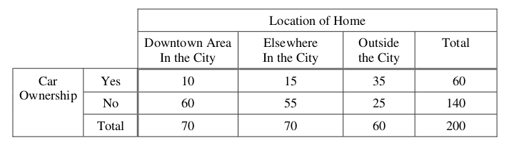

.. _probability-problems:

-----------
Probability 
-----------

.. _probability-sample-space-and-events-problems:

Sample Spaces and Events
------------------------

1. Describe the sample spaces of the following experiments with a set using :ref:`list-notation`

	a. Flipping a coin two times

	b. Flipping a coin three times.	

	c. Rolling a six-sided die

	d. Rolling two six-sided dice

	e. Flipping a two-sided coin and if it lands on heads rolling a six-sided die.

2. Two dice are rolled. Let **E** be the event the sum of the outcomes is odd. Let **F** be the event of at least one *1* appearing on one of the die. Describe the elements of the following events in :ref:`list-notation` and interpret the meaning of each event.

	a. :math:`E \cap F`

	b. :math:`E^c \cap F`

	c. :math:`E^c \cap F^c`
	    
	d. :math:`E \cup F`

	e. :math:`E \cup F^c`

3. Three red balls and one green ball are placed into a box. 

.. hint:: 

	Let *r* :sub:`1`, *r* :sub:`2` and *r* :sub:`3` represent the *outcome* of drawing each of the respective red balls. 

Describe the sample spaces of the following experiments with a set using :ref:`list-notation`.

	a. Selecting one ball at random.

	b. Selecting two balls at random and :ref:`with replacement <replacement>` (i.e. putting the ball you drew back into the back after you draw it).

	c. Selecting two balls at random and :ref:`without replacement <replacement>` (i.e. *not* putting the ball back after you draw it)

4. A deck of six cards consists of three black cards numbered *1*, *2*, *3* and three red cards numbered *1*, *2*, *3*. You draw two cards :ref:`without replacement <replacement>`. Let **A** be the event the second card has a larger number than the first card. Let **B** be the event the first card has a larger number than the second card.
   
	a. Are **A** and **B** mutually exclusive?

	b. Are **A** and **B** complements?

5. At a certain university, every year eight of the 12 professors are granted University Merit Awards. This year among the nominated faculty are Dr. Jones, Dr. Smith and Dr. Brown. Let **A**, **B** and **C** denote the events, resepctively, that these professors will be given awards. In terms of **A**, **B** and **C**, find a symbolic expression for each of the following compound events,
 
 	a. The award goes only to Dr. Jones.
 
	b. Atleast one of the three get the award.
 
	c. None of the three get the award.
 	
 	e. Exactly two of them get the award.
 
 	d. Exactly one of them get the award.
 	
 	f. Dr. Jones or Dr. Smith get the award, but not both.
 
6. Define a sample space for the experiment of drawing two coins from a purse that contains two quarters, three nickels, one dime and four pennies. For the same experiment, describe the following events:
 
 	a. drawing 26 cents.
 	
 	b. drawing more than 9 cents but less than 25 cents.
 	
 	c. drawing 29 cents.
 	
 
.. _probability-classical-definition-problems:

Classical Definition
--------------------

1. You roll two dice. Find the probability of the following events. 
   
	a. The sum of the numbers rolled is 7.

	b. The sum of the numbers rolled on the dice is 3 or 5.

	c. The numbers rolled are both even. 

	d. One of the numbers rolled is even.

	e. Neither of the numbers rolled are even.

	f. Is part *e* the complement of part *c* or part *d*?

2. A box contains three red balls and five blue balls. 

	a. Define a sample space for the experiment of selecting three balls that are drawn from the box, one by one, with replacement.

	b. Find the probability of selecting all red balls. 

	c. Find the probability of selecting atleast one red ball.

	d. Find the probability of selecting no red balls.

	e. What do you notice about parts *c* and *d*? Of what is this an example?

	f. Find the probability of selecting two blue balls and one red ball. 

3. You have a standard deck of 52 playing cards. You shuffle the cards into a random order and deal yourself exactly one card. Find the probabilities of the following events,

	a. The card is a king.

	b. The card is a spade.

	c. The card is a king or spade.

	d. The card is a 4 or Jack.

	e. The card is black. 

	f. The card is black or a queen. 
	    
	g. The card is neither nor a queen.

4. You select a number randomly between 1 and 1000. 

    a. What is the probability the number selected is divisible by 3?

    b. What is the probability the number selected is divisible by 5?

    c. What is the probability the number selected is divisible by 15?

    d. What is the probability the number selected is divisible by 3 or 5?

.. hint:: 

    Use the Law of Unions for *part d*

5. Among 33 students in a class, 17 of them earned A's on the midterm exam, 14 earned A's on the final exam and 11 did not earn A's on either examination. What is the probability that a randomly selected student from this class earned an A on both exams?

6. Suppose that the probability a student at a school is a male and skips at least one day of school during the school year is 0.12. Suppose the corresponding probability for a female is 0.06. What is the probability of randomly selecting a student at this school who will skip at least one day of school during the next 12 months?

7. Suppose that 75% of all investor invest in the stock market and 45% of them in invest in fixed income bonds. If 85% of investors invest in the stock market or fixed income bonds, what percentage invest in both?

8. Suppose at the next Comic-Con, you sample 400 super nerds. 300 of them like *Star Wars* or *Star Trek* or both, 160 of them like *Star Trek*, and 120 of them like *Star Wars* and *Star Trek*. What is the probability that a super nerd selected at random from this sample likes *Star Wars*?
               
9. The coefficients of the quadratic equation :math:`x^2 + bx + c = 0` are determined by tossing a fair die twice. The first outcome is *b* and the second outcome is *c*. Find the probability the equation has real roots.

.. _probability-proof-problems:

Proofs
------

1. **Basic Proofs**

Prove the following theorems using the :ref:`axioms-of-probability`,

	a. **Complement Theorem** For any event **A**, :math:`P(A^c) = 1 - P(A)`
	
	b. **Difference Theorem** If :math:`A \subseteq B`, then :math:`P(B - A) = P(B \cap A^c) = P(B) - P(A)`.
	
	c. **Inequality Theorem** If :math:`A \subseteq B`, then :math:`P(A) \leq P(B)`.
	
	d. **Union Theorem** For any events **A** and **B**, :math:`P(A \cup B) = P(A) + P(B) - P(A \cap B)`.

2. **Advanced Proofs**

a. Let **A** and **B** be two events, not necessarily mutually exclusive. Prove the following inequality

.. math:: 

    P(A \cap B) \geq P(A) + P(B) - 1

.. hint::

	Use the :ref:`probability-law-of-unions` and :ref:`probability-axiom-1`

b. Let **A** and **B** be two events, not necessarily mutually exclusive. The event,
    
.. math:: 

    (A - B) \cap (B - A)

is called the *symmetric difference of* **A** *and* **B**. Prove the probability of the *symmetric difference of* **A** *and* **B** is equal to,

.. math:: 

    P(A) + P(B) - 2 \cdot P(A \cap B)

.. hint:: 

	Draw a :ref:`Venn Diagram <venn-diagrams>` of **A** and **B**, assuming the events are *not* mutually exclusive. Label the area that correspodned to the *symmetric difference of* **A** *and* **B**. 

.. hint::
	
	Recall the :ref:`set-difference` operation :math:`A - B = A \cap B^C`

Challenge Problem
-----------------

1.  **2012, Practice Exam, #23** 

A local company is interested in supporting environmentally friendly initiatives such as carpooling among employees. The company surveyed all of the 200 employees at the downtown offices. Employees responded as to whether or not they own a car and to the location of the home where they live. The results are shown in the table below.

Which of the following statements about a randomly chosen person from these 200 employees is true?

    (A) If the person owns a car, he or she is more likely to live elsewhere in the city than to live in the downtown area in the city.

    (B) If the person does not own a car, he or she is more likely to live outside the city than to live in the city (downtown area or elsewhere).

    (C) The person is more likely to own a car if he or she lives in the city (downtown area or elsewhere) than if he or she lives outside the city.

    (D) The person is more likely to live in the downtown area in the city than elsewhere in the city.

    (E) The person is more likely to own a car than not to own a car.
