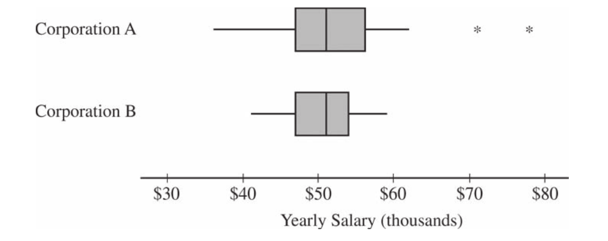
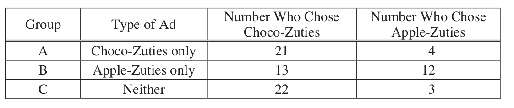

.. _statistics-problems:

----------
Statistics
----------

.. _statistics-graphical-representations-problems:

Graphical Representations
-------------------------

.. topic:: Instructions

    Start a fresh page in your classwork notebook. Write today's date in the margin of the page. Clearly label and solve each of the following. Show your work and circle the anwer. 

Electric Vehicle Distribution
^^^^^^^^^^^^^^^^^^^^^^^^^^^^^

The United States Government General Services Administration maintains a huge database of public available information. One of the datasets they publish is the `Battery Electric Vehicles (BEVs) and Plug-in Hybrid Electric Vehicles (PHEVs) that are currently registered through Washington State Department of Licensing <https://catalog.data.gov/dataset/electric-vehicle-population-data>`_

A random sample of 18 eletric vehicles was selected from this dataset and the *make* of the car was recorded. The resuls are given below,

    BMW, FORD, CHEVROLET, TESLA, FORD, BMW, VOLVO, TESLA, TESLA, NISSAN, CHEVROLET, BMW, TESLA, NISSAN, CHEVROLET, TESLA, TESLA, CHEVROLET

1. What is the population being sampled in this experiment?
   
2. Construct a relative frequency distribution and histogram for this sample of data. Label the axes. What is the most common (frequent) electric vehicle make in this sample of data?

3. Based on this sample, can we conclude your answer to #2 is the most common eletric vehicle make in the United States? Why or why not? 

.. note:: 

    We will come back and examine this dataset in :ref:`project-one`.

Twitter by Tweets and Followers
^^^^^^^^^^^^^^^^^^^^^^^^^^^^^^^

.. important:: 

    The data will be downloaded directly onto the your calculator in class via a cable link. 

    If you want to try out the dataset in **Python** at any point, you can download the full dataset `here <../../_static/csv/datasets/cultural/celebrity-twitter-data.csv>`_

The following table lists the top 20 **Twitter** users by follower count (as of 2022).

`Source: Kaggle <https://www.kaggle.com/datasets/ahmedshahriarsakib/top-1000-twitter-celebrity-tweets-embeddings>`_

+-----------------------+---------------------+-----------------------+-----------------+
|   Twitter Username    |      Name           |    Followers Count    |   Tweet Count   |
+-----------------------+---------------------+-----------------------+-----------------+
|      BarackObama      |     Barack Obama    |       13444655        |      16467      |
+-----------------------+---------------------+-----------------------+-----------------+
|      justinbieber     |     Justin Bieber   |       114357427       |       31399     |
+-----------------------+---------------------+-----------------------+-----------------+
|        katyperry      |     KATY PERRY      |       108900656       |       11625     |
+-----------------------+---------------------+-----------------------+-----------------+
|         rihanna       |      Rihanna        |       106201663       |       10630     |
+-----------------------+---------------------+-----------------------+-----------------+
|       Cristiano       |  Cristiano Ronaldo  |       99274403        |        3780     |
+-----------------------+---------------------+-----------------------+-----------------+
|      taylorswift13    |     Taylor Swift    |        90373941       |         716     |
+-----------------------+---------------------+-----------------------+-----------------+
|        ladygaga       |     The Countess    |        84576292       |        9744     |
+-----------------------+---------------------+-----------------------+-----------------+
|        elonmusk       |       Elon Musk     |       82898543        |        17487    |
+-----------------------+---------------------+-----------------------+-----------------+
|      TheEllenShow     |   Ellen DeGeneres   |      77595645         |       23819     |
+-----------------------+---------------------+-----------------------+-----------------+
|     KimKardashian     |   Kim Kardashian    |      72170641         |       35405     |
+-----------------------+---------------------+-----------------------+-----------------+
|      selenagomez      |     Selena Gomez    |        65791273       |        5388     |
+-----------------------+---------------------+-----------------------+-----------------+
|       jtimberlake     |   Justin Timberlake |       63231222        |        4348     |
+-----------------------+---------------------+-----------------------+-----------------+
|       BillGates       |      Bill Gates     |        58128522       |        3848     |
+-----------------------+---------------------+-----------------------+-----------------+
|        neymarjr       |       Neymar Jr     |        56508547       |       42181     |
+-----------------------+---------------------+-----------------------+-----------------+
|      britneyspears    |   Britney Spears    |        55863848       |        5632     |
+-----------------------+---------------------+-----------------------+-----------------+
|        ddlovato       |      Demi Lovato    |        54260759       |        17793    |
+-----------------------+---------------------+-----------------------+-----------------+
|        shakira        |       Shakira       |        52803100       |        7805     |
+-----------------------+---------------------+-----------------------+-----------------+
|        jimmyfallon    |     jimmy fallon    |        51467139       |      14098      |
+-----------------------+---------------------+-----------------------+-----------------+
|        KingJames      |     LeBron James    |        51182528       |       8347      |
+-----------------------+---------------------+-----------------------+-----------------+
|        imVkohli       |       Virat Kohli   |         47768699      |        2593     |
+-----------------------+---------------------+-----------------------+-----------------+

Use this information to answer the following questions.

1. Construct a frequency distribution for the *follower count* of the top twenty Twitter users. Use 8 classes for this sample of data.

    a. Find the class width. 

    b. Find the class limits. 

    c. Find the class frequencies. 

    d. Using the frequency distribution, create a histogram of the sample. Sketch the histogram in your classwork notebook. Make sure to label the axes and classes.

    e. What is the shape of this distribution? What does this tell you about this sample? 

2. Construct a cumulative frequency distribution for the 8 classes.

    a. Using the *cumulative* frequency distribution, create a histogram of the sample. Sketch the cumulative histogram in your classwork notebook. Make sure to label the axes and classes.

    b. Based on this histogram and distribution, what percent of the distribution is below the seventh class? Justify your answer.

    c. Based on this histogram and distribution, estimate the median of this distribution. Justify your answer.

    d. Based on this histogram and distribution, estimate the 25 :sup:`th` percentile of this distribution, i.e. find the class where at least 25 percent of the distribution is *below* it.  

3. Construct a boxplot using the *follower count* for the top twenty Twitter users. 

    a. Sketch the boxplot in your classwork notebook. Be sure to label the axes. In addition, label the points on the graph that correspond to the five-number summary: minimum, 1 :sup:`th` quartile, median, 2 :sup:`nd` quartile, maximum. 

    b. Based on this boxplot, what is the *75* :sup:`th` percentile of this distribution?

    c. Based on this box plot, what is the *25* :sup:`th` percentile of this distribution?

    d. Compare your answers in part *a* and *b* with your answers to *#2b* and *#2d*. Why are these answers different? Which answer is more accurate? Why?

    e. Is the median of this distribution closer to the minimum value of the sample or the maximum value of the sample?

4. Using *follower count* as the *response variable* and *tweet count* as the *indicator variable*, create a scatter plot of *follower count* vs. *tweet count*.

    a. Sketch the scatter plot in your classwork notebook. Label your axes. 

    b. Describe the type of correlation seen in this graph. What does this tell you about the relationship between *follower count* and *tweet count*?

Problems 
^^^^^^^^

1. **2021, Free Response, #5a-b** 

A research center conducted a national survey about teenage behavior. Teens were asked whether they had consumed a soft drink in the past week. The following table shows the counts for three independent random samples from major cities.

+-------+-----------+---------+-----------+-------+
|       | Baltimore | Detroit | San Diego | Total |
+-------+-----------+---------+-----------+-------+
| Yes   | 727       | 1,232   | 1,482     | 3,441 |
+-------+-----------+---------+-----------+-------+
| No    | 177       | 431     | 798       | 1,406 |
+-------+-----------+---------+-----------+-------+
| Total | 904       | 1,663   | 2,280     | 4,847 |
+-------+-----------+---------+-----------+-------+

    a. Suppose one teen is randomly selected from each city's sample. A researcher claims that the likelihood of selecting a teen from Baltimore who consumed a soft drink in the past week is less than the likelihood of selecting a teen from either one of the other cities who consumed a soft drink in the past week because Baltimore has the least number of teens who consumed a soft drink. Is the researcher's claim correct? Explain your answer.

    b. Consider the values in the table. Construct a segmented bar chart of relative frequencies based on the information in the table. 
    
    c. Which city had the smallest proportion of teens who consumed a soft drink in the previous week? Determine the value of the proportion.

2. **2018, Free Response #5** 
   
The following histograms summarize the teaching year for the teachers at two high schools, A and B.

.. image:: ../../_static/img/problems/2018-apstats-frp-05.png
    :align: center

Teaching year is recorded as an integer, with first-year teachers recorded as 1, second-year teachers recorded as 2, and so on. Both sets of data have a mean teaching year of 8.2, with data recorded from 200 teachers at High School A and 221 teachers at High School B. On the histograms, each interval represents possible integer values from the left endpoint up to but not including the right endpoint.

    a. The median teaching year for one high school is 6, and the median teaching year for the other high school is 7. Identify which high school has each median and justify your answer.

    b. An additional 18 teachers were not included with the data recorded from the 200 teachers at High School A. The mean teaching year of the 18 teachers is 2.5. What is the mean teaching year for all 218 teachers at High School A?

3. **2015, Free Response, #1**

Two large corporations, A and B, hire many new college graduates as accountants at entry-level positions. In 2009 the starting salary for an entry-level accountant position was $36,000 a year at both corporations. At each corporation, data were collected from 30 employees who were hired in 2009 as entry-level accountants and were still employed at the corporation five years later. The yearly salaries of the 60 employees in 2014 are summarized in the boxplots below.

a. Write a few sentences comparing the distributions of the yearly salaries at the two corporations.

b. Suppose both corporations offered you a job for $36,000 a year as an entry-level accountant. Based on the boxplots, give one reason why you might choose to accept the job at corporation A.

c. Suppose both corporations offered you a job for $36,000 a year as an entry-level accountant. Based on the boxplots, give one reason why you might choose to accept the job at corporation B.

4. **2016, Free Response, #2**

Product advertisers studied the effects of television ads on children's choices for two new snacks. The advertisers used two 30-second television ads in an experiment. One ad was for a new sugary snack called Choco-Zuties, and the other ad was for a new healthy snack called Apple-Zuties.

For the experiment, 75 children were randomly assigned to one of three groups, A, B, or C. Each child individually watched a 30-minute television program that was interrupted for 5 minutes of advertising. The advertising was the same for each group with the following exceptions.

- The advertising for group A included the Choco-Zuties ad but not the Apple-Zuties ad.
- The advertising for group B included the Apple-Zuties ad but not the Choco-Zuties ad.
- The advertising for group C included neither the Choco-Zuties ad nor the Apple-Zuties ad.

After the program, the children were offered a choice between the two snacks. The table below summarizes their choices.

Use this information to answer the following questions.

	a. Do the data provide convincing statistical evidence that there is an association between type of ad and children's choice of snack among all children similar to those who participated in the experiment?

	b. Write a few sentences describing the effect of each ad on children's choice of snack.

5. **2009, Free Response Form B, #1**

.. image:: ../../_static/img/problems/2009-apstats-frp-formb-01.png
    :align: center
    
As gasoline prices have increased in recent years, many drivers have expressed concern about the taxes they pay on gasoline for their cars. In the United States, gasoline taxes are imposed by both the federal government and by individual states. The boxplot above shows the distribution of the state gasoline taxes, in cents per gallon, for all 50 states on January 1, 2006.

a. Based on the boxplot, what are the approximate values of the median and the interquartile range of the distribution of state gasoline taxes, in cents per gallon? Mark and label the boxplot to indicate how you found the approximated values.

b. The federal tax imposed on gasoline was 18.4 cents per gallon at the time the state taxes were in effect. The federal gasoline tax was added to the state gasoline tax for each state to create a new distribution of combined gasoline taxes. What are approximate values, in cents per gallon, of the median and interquartile range of the new distribution of combined gasoline taxes? Justify your answer.

