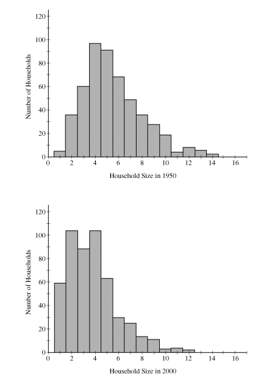
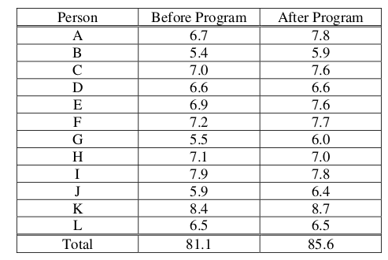

.. _inference-problems:

---------
Inference
---------

.. _inference-experimental-design-problems:

Experimental Design
-------------------

1. **2006, Free Response, #5** 
   
When a tractor pulls a plow through an agricultural field, the energy needed to pull that plow is called the draft. The draft is affected by environmental conditions such as soil type, terrain, and moisture. 

A study was conducted to determine whether a newly developed hitch would be able to reduce draft compared to the standard hitch. (A hitch is used to connect the plow to the tractor.) Two large plots of land were used in this study. It was randomly determined which plot was to be plowed using the standard hitch. As the tractor plowed that plot, a measurement device on the tractor automatically recorded the draft at 25 randomly selected points in the plot.

After the plot was plowed, the hitch was changed from the standard one to the new one, a process that takes a substantial amount of time. Then the second plot was plowed using the new hitch. Twenty-five measurements of draft were also recorded at randomly selected points in this plot.

	a. What was the response variable in this study?
	 
	b. Identify the treatments.
	 
	c. What were the experimental units?

	d. Given that the goal of the study is to determine whether a newly developed hitch reduces draft compared to the standard hitch, was randomization used properly in this study? Justify your answer.

	e. Given that the goal of the study is to determine whether a newly developed hitch reduces draft compared to the standard hitch, was replication used properly in this study? Justify your answer.

	f. Plot of land is a confounding variable in this experiment. Explain why. 

2. **2007, Free Response, #2**

As dogs age, diminished joint and hip health may lead to joint pain and thus reduce a dog’s activity level. Such a reduction in activity can lead to other health concerns such as weight gain and lethargy due to lack of exercise. A study is to be conducted to see which of two dietary supplements, glucosamine or chondroitin, is more effective in promoting joint and hip health and reducing the onset of canine osteoarthritis. Researchers will randomly select a total of 300 dogs from ten different large veterinary practices around the country. All of the dogs are more than 6 years old, and their owners have given consent to participate in the study. Changes in joint and hip health will be evaluated after 6 months of treatment.

	a. What would be an advantage to adding a control group in the design of this study?

	b. Assuming a control group is added to the other two groups in the study, explain how you would assign the 300 dogs to these three groups for a completely randomized design.

	c. Rather than using a completely randomized design, one group of researchers proposes blocking on clinics, and another group of researchers proposes blocking on breed of dog. How would you decide which one of these two variables to use as a blocking variable?

3. **2009, Free Response Form B, #4**

A manufacturer of toxic pesticide granules plans to use a dye to color the pesticide so that birds will avoid eating it. A series of experiments will be designed to find colors or patterns that three bird species (blackbirds, starlings, and geese) will avoid eating. Representative samples of birds will be captured to use in the experiments, and the response variable will be the amount of time a hungry bird will avoid eating food of a particular color or pattern.

	a. Previous research has shown that male birds do not avoid solid colors. However, it is possible that males might avoid colors displayed in a pattern, such as stripes. In an effort to prevent males from eating the pesticide, the following two treatments are applied to the pesticide granules.

		Treatment 1: A red background with narrow blue stripes
		

		Treatment 2: A blue background with narrow red stripes

	To increase the power of detecting a difference in the two treatments in the analysis of the experiment, the researcher decided to block on the three species of birds (blackbirds, starlings, and geese). Assuming there are 100 birds of each of the three species, explain how you would assign birds to treatments in such a block design.

	b. Other than blocking, what could the researcher do to increase the power of detecting a difference in the two treatments in the analysis of the experiment? Explain how your approach would increase the power.

4. **2010, Free Response Form B, #10**

In response to nutrition concerns raised last year about food served in school cafeterias, the Smallville School District entered into a one-year contract with the Healthy Alternative Meals (HAM) company. Under this contract, the company plans and prepares meals for 2,500 elementary, middle, and high school students, with a focus on good nutrition. The school administration would like to survey the students in the district to estimate the proportion of students who are satisfied with the food under this contract.

Two sampling plans for selecting the students to be surveyed are under consideration by the administration. One plan is to take a simple random sample of students in the district and then survey those students. The other plan is to take a stratified random sample of students in the district and then survey those students.

	a. Describe a simple random sampling procedure that the administrators could use to select 200 students from the 2,500 students in the district.

	b. If a stratified random sampling procedure is used, give one example of an effective variable on which to stratify in this survey. Explain your reasoning.

	c. Describe one statistical advantage of using a stratified random sample over a simple random sample in the context of this study.
	
5. **2006, Free Response, #5** 

A biologist is interested in studying the effect of growth-enhancing nutrients an different salinity (salt) levels in water on the growth of shrimps. The biologist has ordered a large shipment of young tiger shrimps from a supply house for use in the study. The experiment is to be conducted in a laboratory where 10 tiger shrimps are placed randomly into each of 12 similar tanks in a controlled environment.

The biologist is planning to use 3 different growth-enhancing nutrients (A, B, and C) and two different
salinity levels (low and high).

	a. List the treatments that the biologist plans to use in this experiment.

	b. Using the treatments listed in part (a), describe a completely randomized design that will allow the biologist to compare the shrimps’ growth after 3 weeks.

	c. Give one statistical advantage to having only tiger shrimps in the experiment. Explain why this is an advantage.

	d. Give one statistical disadvantage to having only tiger shrimps in the experiment. Explain why this is a disadvantage.

.. _inference-bias-problems:

Bias
----
    
1. **2008, Free Response, #2**

A local school board plans to conduct a survey of parents’ opinions about year-round schooling in elementary schools. The school board obtains a list of all families in the district with at least one child in an elementary school and sends the survey to a random sample of 500 of the families. The survey question is provided below.

	A proposal has been submitted that would require students in elementary schools to attend school on a year- round basis. Do you support this proposal? (Yes or No)

The school board received responses from 98 of the families, with 76 of the responses indicating support for year-round schools. Based on this outcome, the local school board concludes that most of the families with at least one child in elementary school prefer year-round schooling.

	a. What is a possible consequence of nonresponse bias for interpreting the results of this survey?

	b. Someone advised the local school board to take an additional random sample of 500 families and to use the combined results to make their decision. Would this be a suitable solution to the issue raised in *part a* ? Explain.

	c. Suggest a different follow-up step from the one suggested in part (b) that the local school board could take to address the issue raised in *part a*.

2. **2004, Free Response, Form B, #2**

At a certain university, students who live in the dormitories eat at a common dining hall. Recently, some students have been complaining about the quality of the food served there. The dining hall manager decided to do a survey to estimate the proportion of students living in the dormitories who think that the quality of the food should be improved. One evening, the manager asked the first 100 students entering the dining hall to answer the following question.

Many students believe that the food served in the dining hall needs improvement. Do you think that the quality of food served here needs improvement, even though that would increase the cost of the meal plan?
	
	- Yes
	- No
	- No Opinion

Use this information to answer the following questions,

	a. In this setting, explain how bias may have been introduced based on the way this convenience sample was selected and suggest how the sample could have been selected differently to avoid that bias.

	b. In this setting, explain how bias may have been introduced based on the way the question was worded and suggest how it could have been worded differently to avoid that bias.

.. _inference-hypothesis-testing-problems:

Hypothesis Testing
------------------

1. **Titelbaum, 2022, Chapter 5**

Suppose it is now 1 pm on a Monday. Mr. Moore informs you that over the weekend, he found a coin from a foreign country. Despite being foreign, one side of the coin is clearly the "Heads" side and the other is "Tails". Mr. Moore also tells you that he flipped the coin today at noon.

Let **H** be the event the noon coin flip landed heads. Consider each of the propositions below one at a time, and decide what the probability in **H** would be if that proposition were *all** you knew about the coin in addition to the information in the previous paragraph:

	**E1**: After discovering the coin, Mr. Moore spent the good part of his weekend flipping it, and out of the 100 weekend coin clips, 64 of them came up heads.
	
	**E2**: The coin was produced in a factory that advertises its coins as fair, but is currently embroiled in many lawsuits alleging its coin are actually unfair. Several of these lawsuits have already settled out of court.
	
	**E3**: The coin is fair.
	
	**E4**: Sejal witnessed Mr. Moore flip the coin at noon and, like, totally swears it was heads, *for real*.
	 
2. **Devore & Berk, 2007, Chapter 9.1 #6**

Many older homes have electrical systems that use fuses rather than circuit breakers. A manufacturer of 40-amp fuses wants to make sure that the mean amperage at which its fuses burn out is in fact 40. If the mean amperage is lower than 40, customers will complain because the fuses require replacement too often. If the mean amperage is higher than 40, the manufacturer might be liable for damage to an electrical system due to fuse malfunction. To verify the amperage of the fuses, a sample of fuses is to be selected and inspected.

	a. If a hypothesis test were to be performed, what null and alternate hypotheses would be of interest to the manufacturer?
	
	b. Describe the Type I and Type II errors in this situation.
	
3. **Devore & Berk, 2007, Chapter 9.1 #7**

Water samples are taken from water used for cooling as it is being discharged from a power plant into a river. It has been determined that as long as the mean temperature of the discharged water is at most :math:`150^{\circ} \text{F}`, there will be no negative effects on the river's ecosystem. To investigate whether the plant is in compliance with the regulations that prohibit a mean discharge water temperature of above :math:`150^{\circ} \text{F}`, 50 water samples will be taken at randomly selected times, and the temperature of each sample recorded.

	a. State the null and alternate hypotheses that could be used to test whether the company was in violation of the regulation.
	
	b. Describe what a Type I and a Type II error would be in the context of this problem. 
	
	c. Which error would you consider more serious? Explain.
	
4. **Devore & Berk, 2007, Chapter 9.1 #9**

Two different companies have applied to provide cable television service in a certain region. Let *p* denote the proportion of all potential subscribers who favor the first company over the second. Consider testing the null hypothesis,

.. math::

	H_0: p = 0.5
		
versus the alternate hypothesis,

.. math::

	H_a: p \neq 0.5
	
Suppose you select a random sample of 25 individuals. Let :math:`\mathcal{X}` denote the number in the sample who favor the first company and ``x`` represent the observed value of :math:`\mathcal{X}`.

	a. Which of the following rejection regions is most appropriate and why?
	
		.. math::
	
			R_1 = \{ x \mid x \leq 7 \text{ or } x \geq 18 \}
		
		.. math::
		
			R_2 = \{ x \mid x \leq 8 \}
			
		.. math::
		
			R_3 = \{ x \mid x \geq 17 \}
	
	b. In the context of this problem, describe what Type I and Type II errors would be.
	
	c. What is the probability distribution of the test statistic :math:`\mathcal{X}` when :math:`H_0` is true? Use it to compute the probability of a Type I error.
	
	d. Compute the probability of a type II error for the selected region when :math:`p = 0.3, 0.4, 0.6, 0.7`. 
	
	e. Using the selected region, what would you conclude if 6 of the 25 queried customers favored the first company?

5. **2007, Free Response, #5**

Researchers want to determine whether drivers are significantly more distracted while driving when using a cell phone than when talking to a passenger in the car. In a study involving 48 people, 24 people were randomly assigned to drive in a driving simulator while using a cell phone. The remaining 24 were assigned to drive in the driving simulator while talking to a passenger in the simulator. Part of the driving simulation for both groups involved asking drivers to exit the freeway at a particular exit. In the study, 7 of the 24 cell phone users missed the exit, while 2 of the 24 talking to a passenger missed the exit.

	a. Would this study be classified as an experiment or an observational study? Provide an explanation to support your answer.

	b. State the null and alternative hypotheses of interest to the researchers.

	c. One test of significance that you might consider using to answer the researchers’ question is a two-sample z-test. State the conditions required for this test to be appropriate. Then comment on whether each condition is met.

	d. Using an advanced statistical method for small samples to test the hypotheses in *part b*, the researchers report a p-value of 0.0683. Interpret, in everyday language, what this p-value measures in the context of this study and state what conclusion should be made based on this p-value.

6. **2008, Free Response Form B, #4**

A researcher wants to conduct a study to test whether listening to soothing music for 20 minutes helps to reduce diastolic blood pressure in patients with high blood pressure, compared to simply sitting quietly in a noise-free environment for 20 minutes. One hundred patients with high blood pressure at a large medical clinic are available to participate in this study.

	a. Propose a design for this study to compare these two treatments.

	b. The null hypothesis for this study is that there is no difference in the mean reduction of diastolic blood pressure for the two treatments and the alternative hypothesis is that the mean reduction in diastolic blood pressure is greater for the music treatment. If the null hypothesis is rejected, the clinic will offer this music therapy as a free service to their patients with high blood pressure. Describe Type I and Type II errors and the consequences of each in the context of this study, and discuss which one you think is more serious.

7. **2009, Free Response, #1**

A simple random sample of 100 high school seniors was selected from a large school district. The gender of each student was recorded, and each student was asked the following questions.

.. topic:: Survey Questions

	1. Have you ever had a part-time job?
	2. If you answered yes to the previous question, was your part-time job in the summer only?
	
The responses are summarized in the table below.

+------------------------------------------------+------+--------+---------+
| Job Experience                                 | Male | Female | Total   |
+------------------------------------------------+------+--------+---------+
| Never had a part-time job                      |  21  |   31   |   52    |
+------------------------------------------------+------+--------+---------+
| Had a part-time job during summer only         |  15  |   13   |   28    |
+------------------------------------------------+------+--------+---------+
| Had a part-time job but not only during summer |  12  |   8    |   20    |
+------------------------------------------------+------+--------+---------+
| Total                                          | 48   |  52    |   100   |
+------------------------------------------------+------+--------+---------+

Use this information to answer the following questions.

	a. Construct a graphical display that represents the association between gender and job experience for the students in the sample.

	b. Write a few sentences summarizing what the display in *part a* reveals about the association between gender and job experience for the students in the sample.
	
	c. Which test of significance should be used to test if there is an association between gender and job experience for the population of high school seniors in the district? State the null and alternative hypotheses for the test, but do not perform the test.
	
8. **2009, Free Response, #5**

For many years, the medically accepted practice of giving aid to a person experiencing a heart attack was to have the person who placed the emergency call administer chest compression (CC) plus standard mouth-to-mouth resuscitation (MMR) to the heart attack patient until the emergency response team arrived. However, some researchers believed that CC alone would be a more effective approach.

In the 1990s a study was conducted in Seattle in which 518 cases were randomly assigned to treatments: 278 to CC plus standard MMR and 240 to CC alone. A total of 64 patients survived the heart attack: 29 in the group receiving CC plus standard MMR, and 35 in the group receiving CC alone. A test of significance was conducted on the following hypotheses.

	:math:`H_0`: : The survival rates for the two treatments are equal.

	:math:`H_a`: : The treatment that uses CC alone produces a higher survival rate.

This test resulted in a p-value of 0.0761.

	a. Interpret what this p-value measures in the context of this study.

	b. Based on this p-value and study design, what conclusion should be drawn in the context of this study? Use a significance level of α = 0.05.

	c. Based on your conclusion in *part b*, which type of error, Type I or Type II, could have been made? What is one potential consequence of this error?

9. **2012, Free Response, #5**

A recent report stated that less than 35 percent of the adult residents in a certain city will be able to pass a physical fitness test. Consequently, the city’s Recreation Department is trying to convince the City Council to fund more physical fitness programs. The council is facing budget constraints and is skeptical of the report. The council will fund more physical fitness programs only if the Recreation Department can provide convincing evidence that the report is true.

The Recreation Department plans to collect data from a sample of 185 adult residents in the city. A test of significance will be conducted at a significance level of :math:`\alpha = 0.05` for the following hypotheses.

	:math:`H_0`:  :math:`p = 0.35`

	:math:`H_a`: :math:`p < 0.35`
	
where *p* is the proportion of adult residents in the city who are able to pass the physical fitness test.

	a. Describe what a Type II error would be in the context of the study, and also describe a consequence of making this type of error.

	b. The Recreation Department recruits 185 adult residents who volunteer to take the physical fitness test. The test is passed by 77 of the 185 volunteers, resulting in a *p-value* of 0.97 for the hypotheses stated above. If it was reasonable to conduct a test of significance for the hypotheses stated above using the data collected from the 185 volunteers, what would the p-value of 0.97 lead you to conclude?

	c. Describe the primary flaw in the study described in *part b*, and explain why it is a concern.

10. **2022, Free Response, #5**

Studies have shown that foods rich in compounds known as flavonoids help lower blood pressure. Researchers conducted a study to investigate whether there was a greater reduction in blood pressure for people who consumed dark chocolate, which contains flavonoids, than people who consumed white chocolate, which does not contain flavonoids. Twenty-five healthy adults agreed to participate in the study and add 3.5 ounces of chocolate to their daily diets. Of the 25 participants, 13 were randomly assigned to the dark chocolate group and the rest were assigned to the white chocolate group. All participants had their blood pressure recorded, in millimeters of mercury ( mmHg ), before adding chocolate to their daily diets and again 30 days after adding chocolate to their daily diets.

The reduction in blood pressure (before minus after) for each of the participants in the two groups is shown in the dotplots below.

Use this information to answer the following question.

	a. Determine and compare the medians of the reduction in blood pressure for the two groups.
	
The researchers found the mean reduction in blood pressure for those who consumed dark chocolate is :math:`\bar{x}_\text{dark} = 6.08 \text{mmHg}` and the mean reduction in blood pressure for those who consumed white chocolate is :math:`\bar{x}_\text{white} = 0.42 \text{mmHg}`.

	b. One researcher indicated that because the difference in sample means of 5.66 mmHg is greater than 0 there is convincing statistical evidence to conclude that the population mean blood pressure reduction for those who consume dark chocolate is greater than for those who consume white chocolate. Why might the researcher’s conclusion, based only on the difference in sample means of 5.66 mmHg , not necessarily be true?
	
A simulation was conducted to investigate whether there is a greater reduction of blood pressure for those who consume dark chocolate than for those who consume white chocolate. The simulation was conducted under the assumption that no difference exists. The results of 120 trials of the simulation are shown in the following dotplot.

.. image:: ../../_static/img/problems/2022-apstats-frp-05b.png
    :align: center
    
Use this information to answer the following question.

	c. Use the results of the simulation to determine whether the results from the 25 participants in the study provide convincing statistical evidence, at a 5 percent level of significance, that adding dark chocolate to a daily diet will result in a greater reduction in blood pressure, on average, than adding white chocolate to a daily diet. Justify your answer.
	
11. **2012, Free Response, #3**

Independent random samples of 500 households were taken from a large metropolitan area in the United States for the years 1950 and 2000. Histograms of household size (number of people in a household) for the years are shown below.

    
Use this information to answer the following questions.

	a. Compare the distributions of household size in the metropolitan area for the years 1950 and 2000.

	b. A researcher wants to use these data to construct a confidence interval to estimate the change in mean household size in the metropolitan area from the year 1950 to the year 2000. State the conditions for using a two-sample t-procedure, and explain whether the conditions for inference are met.

.. _inference-population-mean-problems:

Population Mean
---------------

1. **2009, Free Response Form B, #5**

A bottle-filling machine is set to dispense 12.1 fluid ounces into juice bottles. To ensure that the machine is filling accurately, every hour a worker randomly selects four bottles filled by the machine during the past hour and measures the contents. If there is convincing evidence that the mean amount of juice dispensed is different from 12.1 ounces or if there is convincing evidence that the standard deviation is greater than 0.05 ounce, the machine is shut down for recalibration. It can be assumed that the amount of juice that is dispensed into bottles is normally distributed.

During one hour, the mean number of fluid ounces of four randomly selected bottles was 12.05 and the standard deviation was 0.085 ounce.

	a. Perform a test of significance to determine whether the mean amount of juice dispensed is different from 12.1 fluid ounces. Assume the conditions for inference are met.

To determine whether this sample of four bottles provides convincing evidence that the standard deviation of the amount of juice dispensed is greater than 0.05 ounce, a simulation study was performed. In the simulation study, 300 samples, each of size 4, were randomly generated from a normal population with a mean of 12.1 and a standard deviation of 0.05. The sample standard deviation was computed for each of the 300 samples. The dotplot below displays the values of the sample standard deviations.

Use this information to answer the following question.
	
	b. Use the results of this simulation study to explain why you think the sample provides or does not provide evidence that the standard deviation of the juice dispensed exceeds 0.05 fluid ounce.

2. **2006, Free Response Form B, #4**

The developers of a training program designed to improve manual dexterity claim that people who complete the 6-week program will increase their manual dexterity. A random sample of 12 people enrolled in the training program was selected. A measure of each person’s dexterity on a scale from 1 (lowest) to 9 (highest) was recorded just before the start of and just after the completion of the 6-week program. The data are shown in the table below.

	
Can one conclude that the mean manual dexterity for people who have completed the 6-week training program has significantly increased? Support your conclusion with appropriate statistical evidence.

3. **2007, Free Response, #4**

Investigators at the U.S. Department of Agriculture wished to compare methods of determining the level of E. coli bacteria contamination in beef. Two different methods (A and B) of determining the level of contamination were used on each of ten randomly selected specimens of a certain type of beef. The data obtained, in millimicrobes/liter of ground beef, for each of the methods are shown in the table below.

+----------+------+------+------+------+------+------+------+------+------+-------+
| Specimen | 1    | 2    | 3    | 4    | 5    | 6    | 7    | 8    | 9    | 10    |
+----------+------+------+------+------+------+------+------+------+------+-------+
| Method A | 22.7 | 23.6 | 24.0 | 27.1 | 27.4 | 27.8 | 34.4 | 35.2 | 40.4 | 46. 8 |
+----------+------+------+------+------+------+------+------+------+------+-------+
| Method B | 23.0 | 23.1 | 23.7 | 26.5 | 26.6 | 27.1 | 33.2 | 35.0 | 40.5 | 47.8  |
+----------+------+------+------+------+------+------+------+------+------+-------+

Is there a significant difference in the mean amount of E. coli bacteria detected by the two methods for this type of beef? Provide a statistical justification to support your answer.

4. **2011, Free Response, #4**

High cholesterol levels in people can be reduced by exercise, diet, and medication. Twenty middle-aged males with cholesterol readings between 220 and 240 milligrams per deciliter (mg/dL) of blood were randomly selected from the population of such male patients at a large local hospital. Ten of the 20 males were randomly assigned to group A, advised on appropriate exercise and diet, and also received a placebo. The other 10 males were assigned to group B, received the same advice on appropriate exercise and diet, but received a drug intended to reduce cholesterol instead of a placebo. After three months, posttreatment cholesterol readings were taken for all 20 males and compared to pretreatment cholesterol readings. The tables below give the reduction in cholesterol level (pretreatment reading minus posttreatment reading) for each male in the study.

.. topic:: Group A (placebo)

	+----------------------+---+----+---+---+----+---+----+---+----+---+
	| Reduction (in mg/dL) | 2 | 19 | 8 | 4 | 12 | 8 | 17 | 7 | 24 | 1 |
	+----------------------+---+----+---+---+----+---+----+---+----+---+
	
	Mean Reduction: 10.20
	
	Standard Deviation of Reduction: 7.66
	
.. topic:: Group B (cholestrol drug)

	+----------------------+----+----+----+----+----+----+----+----+---+----+
	| Reduction (in mg/dL) | 30 | 19 | 18 | 17 | 20 | -4 | 23 | 10 | 9 | 22 |
	+----------------------+----+----+----+----+----+----+----+----+---+----+
	
	Mean Reduction: 16.40
	
	Standard Deviation of Reduction: 9.40
	
Do the data provide convincing evidence, at the :math:`\alpha = 0.01` level, that the cholesterol drug is effective in producing a reduction in mean cholesterol level beyond that produced by exercise and diet?

5. **2018, Free Response, #4**

The anterior cruciate ligament (ACL) is one of the ligaments that help stabilize the knee. Surgery is often recommended if the ACL is completely torn, and recovery time from the surgery can be lengthy. A medical center developed a new surgical procedure designed to reduce the average recovery time from the surgery. To test the effectiveness of the new procedure, a study was conducted in which 210 patients needing surgery to repair a torn ACL were randomly assigned to receive either the standard procedure or the new procedure.

	a. Based on the design of the study, would a statistically significant result allow the medical center to conclude that the new procedure causes a reduction in recovery time compared to the standard procedure, for patients similar to those in the study? Explain your answer.

+-------------------+-------------+---------------------------+-----------------------------------------+
| Type of Procedure | Sample Size | Mean Recovery Time (Days) | Standard Deviation Recovery Time (Days) |
+-------------------+-------------+---------------------------+-----------------------------------------+
|     Standard      |    110      |        217                |                   34                    |
+-------------------+-------------+---------------------------+-----------------------------------------+
|       New         |    100      |        186                |                   29                    |
+-------------------+-------------+---------------------------+-----------------------------------------+

Use this table to answer the following question.

	b. Summary statistics on the recovery times from the surgery are shown in the above table. Do the data provide convincing statistical evidence that those who receive the new procedure will have less recovery time from the surgery, on average, than those who receive the standard procedure, for patients similar to those in the study?

6. **2018, Free Response, #6**

Systolic blood pressure is the amount of pressure that blood exerts on blood vessels while the heart is beating. The mean systolic blood pressure for people in the United States is reported to be 122 millimeters of mercury (mmHg) with a standard deviation of 15 mmHg.

The wellness department of a large corporation is investigating whether the mean systolic blood pressure of its employees is greater than the reported national mean. A random sample of 100 employees will be selected, the systolic blood pressure of each employee in the sample will be measured, and the sample mean will be calculated.

Let :math:`\mu` represent the mean systolic blood pressure of all employees at the corporation. Consider the following hypotheses.

.. math::

	H_0 : \mu = 122
	
.. math::

	H_a : \mu > 122
	
Use these hypotheses to answer the following questions.

	a. Describe a Type II error in the context of the hypothesis test.

	b. Assume that :math:`\sigma`, the standard deviation of the systolic blood pressure of all employees at the corporation, is 15 mmHg. If :math:`\mu = 122`, the sampling distribution of :math:`\bar{x}` for samples of size 100 is approximately normal with a mean of 122 mmHg and a standard deviation of 1.5 mmHg. What values of the sample mean :math:`\bar{x}` would represent sufficient evidence to reject the null hypothesis at the significance level of :math:`\alpha = 0.05` ? 

The actual mean systolic blood pressure of all employees at the corporation is 125 mmHg, not the hypothesized value of 122 mmHg, and the standard deviation is 15 mmHg.

	c. Using the actual mean of 125 mmHg and the results from *part b*, determine the probability that the null hypothesis will be rejected.
	
	d. What statistical term is used for the probability found in *part c*?

	e. Suppose the size of the sample of employees to be selected is greater than 100. Would the probability of rejecting the null hypothesis be greater than, less than, or equal to the probability calculated in *part c*? Explain your reasoning.
	
7. **2007, Free Response Form B, #5**

A serum cholesterol level above 250 milligrams per deciliter (mg/dl) of blood is a risk factor for cardiovascular disease in humans. At a medical center in St. Louis, a study to test the effectiveness of a new cholesterol-lowering drug was conducted. One hundred people with cholesterol levels between 250 mg/dl and 300 mg/dl were available for this study. Fifty people were assigned at random to each of two treatment groups. One group received the standard cholesterol-lowering medication and the other group received the new drug. After taking the drug for three weeks, the 50 subjects who received the standard treatment had a mean decrease in cholesterol level of 10 mg/dl with a standard deviation of 8 mg/dl, and the 50 subjects who received the new drug had a mean decrease of 18 mg/dl with a standard deviation of 12 mg/dl.

Does the new drug appear to be more effective than the standard treatment in lowering mean cholesterol level? Give appropriate statistical evidence to support your conclusion.

.. _inference-population-proportion-problems:

Population Proportion
---------------------

1. **2003, Free Response, #5**

A random sample of 200 students was selected from a large college in the United States. Each selected student was asked to give his or her opinion about the following statement.

    “The most important quality of a person who aspires to be the President of the United States is a knowledge of foreign affairs.”

Each response was recorded in one of five categories. The gender of each selected student was noted. The data are summarized in the table below.

.. image:: ../../_static/img/problems/2003-apstats-frp-05.png
    :align: center

Is there sufficient evidence to indicate that the response is dependent on gender? Provide statistical evidence to support your conclusion.

2. **2009, Free Response Form B, #3**

A French study was conducted in the 1990s to compare the effectiveness of using an instrument called a cardiopump with the effectiveness of using traditional cardiopulmonary resuscitation (CPR) in saving lives of heart attack victims. Heart attack patients in participating cities were treated with either a cardiopump or CPR, depending on whether the individual’s heart attack occurred on an even-numbered or an odd-numbered day of the month. Before the start of the study, a coin was tossed to determine which treatment, a cardiopump or CPR, was given on the even-numbered days. The other treatment was given on the odd-numbered days. In total, 754 patients were treated with a cardiopump, and 37 survived at least one year; while 746 patients were treated with CPR, and 15 survived at least one year.

a. The conditions for inference are satisfied in the study. State the conditions and indicate how they are satisfied.

b. Perform a statistical test to determine whether the survival rate for patients treated with a cardiopump is significantly higher than the survival rate for patients treated with CPR.

3. **2012, Free Response, #4**

A survey organization conducted telephone interviews in December 2008 in which 1,009 randomly selected adults in the United States responded to the following question.

	At the present time, do you think television commercials are an effective way to promote a new product?

Of the 1,009 adults surveyed, 676 responded “yes.” In December 2007, 622 of 1,020 randomly selected adults in the United States had responded “yes” to the same question. Do the data provide convincing evidence that the proportion of adults in the United States who would respond “yes” to the question changed from December 2007 to December 2008?
