Images
======

----------
Animations
----------

Aristotle's Square of Opposition
--------------------------------

.. note::

    Gemini Model 2.5
    

.. collapse:: XML Markup

  .. literalinclude:: ../../_static/svg/square-of-opposition.svg
    :language: xml
    :caption: Aristotle's Square of Opposition

Set Relations
-------------

.. note::

  Gemini Model 2.5 

.. collapse:: XML Markup
  
  .. literalinclude:: ../../_static/svg/set-relations.svg
    :language: xml
    :caption: Aristotle's Square of Opposition
