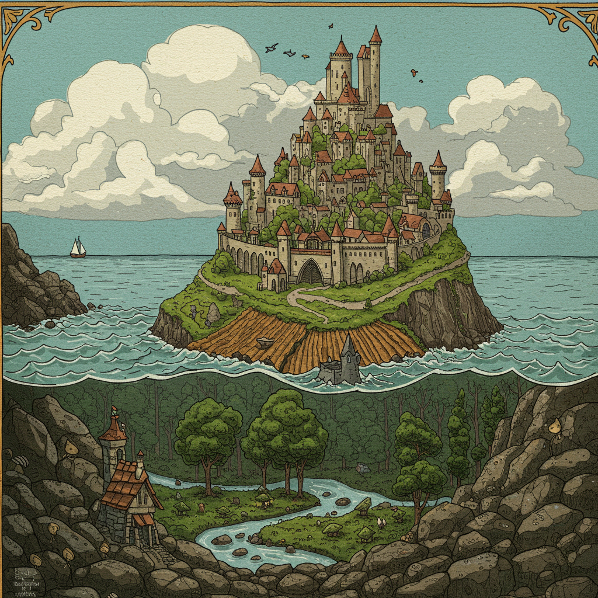
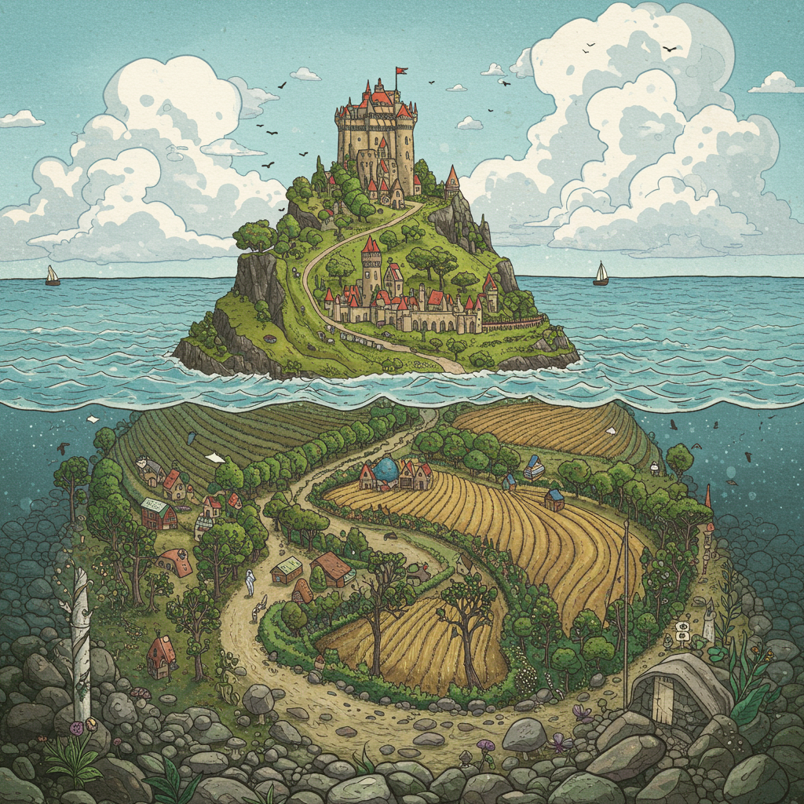

Visual
======

----------
Animations
----------

Aristotle's Square of Opposition
--------------------------------

.. collapse:: SVG Markup

  :download:`Download Markup <../../_static/svg/square-of-opposition.svg>`

  .. literalinclude:: ../../_static/svg/square-of-opposition.svg
    :language: xml
    :caption: SVG Markup for Aristotle's Square of Opposition

.. figure:: ../../_static/svg/square-of-opposition.svg
  :width: 80%
  :alt: Aristotle's Square of Opposition
  
  Markup by Gemini Pro 2.5

Set Relations
-------------

.. collapse:: SVG Markup

  :download:`Download Markup <../../_static/svg/set-relations.svg>`

  .. literalinclude:: ../../_static/svg/set-relations.svg
    :language: xml
    :caption: SVG Markup for Aristotle's Square of Opposition

.. figure:: ../../_static/svg/set-relations.svg
  :width: 80%
  :alt: Aristotle's Square of Opposition
  
  Markup by Gemini Pro 2.5

------
Images
------

The Ballad of the Isle
----------------------

:ref:`the-ballad-of-the-isle`

  Image by Imagen 3.0 v002

  Image by Imagen 3.0 v002