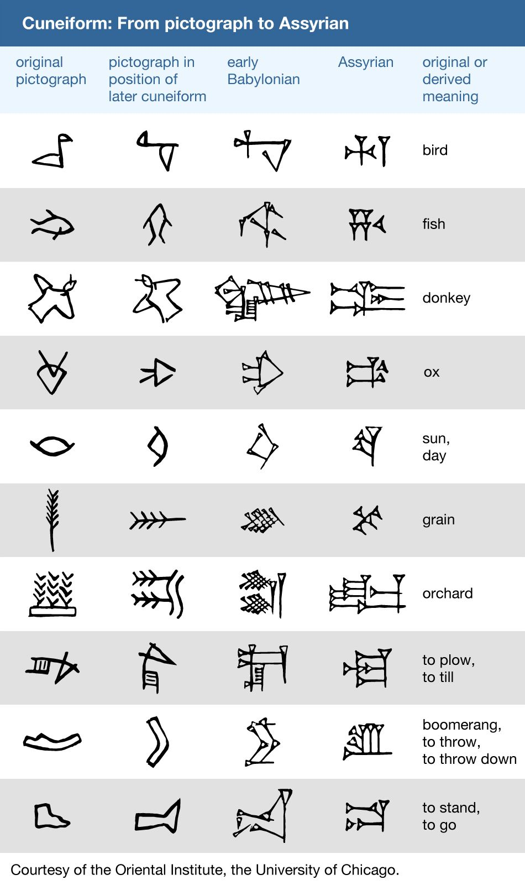

.. _year-2025:

2025
====

.. _2025-january:

-------
January
-------

There are two mutually exclusive categories of :ref:`palindromes <definition-4-1-1>` in any :ref:`language <language>`: perfect and imperfect.

A :ref:`perfect palindrome <definition-4-1-2>` is symmetric, by which it is meant a :ref:`perfect palindrome <definition-4-1-2>` may be reversed character-wise. Of the "species" of :ref:`palindromes <definition-4-1-1>` in any given :ref:`language <language>`, they are the most rare, because their grammatical conditions are so stringent (at least as far as English is concerned). Counter-intuitively, this makes them the easiest to construct.

:ref:`Perfect palindromes <definition-4-1-2>` mostly hinge on :ref:`invertible <invertible-words>` grammatical structures embodied in the "*on-no*", "*now-won*" and "*saw-was*" invertible pairs. Without these invertible pivot points, a :ref:`perfect palindromes <definition-4-1-2>` must rely on the symmetry of a central :ref:`palindromic word <reflective-words>`. In other words, the cardinality of :ref:`perfect palindromes <definition-4-1-2>` is related to the cardinality of :ref:`invertible words <invertible-words>` and the cardinality of purely :ref:`reflective words <reflective-words>`.

- repel on no leper
- dog saw raw war was god
- gateman now won nametag
- snoops now won spoons
- pupils did slipup
- strips deified spirts

:ref:`Imperfect palindromes <definition-4-1-3>`, by contrast, degrade under reversal. Consider cases like "*borrow or rob*" or "*name now one man*" which, while palindromic, do not preserve semantic content when reversed. However, by dropping the delimiting character, namely the space " ", the palindromicity can be reconstructed in a degenerate alphabet, e.g. "*borroworob*" and "*namenowoneman*" are palindromic strings in an alphabet with no delimiting characters.

These observations suggest an algebraic structure exists embedded within linguistics. Let :math:`\zeta` be a sentence, defined as a sequence of characters. Then, define the :ref:`inverse <string-inversion>` of a sentence, :math:`\text{inv}(\zeta)`, as the reversal of :math:`\zeta`'s characters. Furthermore, define the :ref:`reduction <definition-3-1-2>` of a sentence, :math:`\varsigma(\zeta)`, as the string which results from the removal of delimiter characters from :math:`\zeta`. Then, palindromes, :math:`\zeta_p` can be defined mathematically as the sentences whose reduced forms are equal to their own inverses,

.. math::

    \varsigma(\zeta_p) = \text{inv}(\varsigma(\zeta_p))

It can be shown that inversion and reduction, which are string operations, commute over strings, so the above equation can be extended,

.. math::

    \varsigma(\zeta_p) = \varsigma(\text{inv}(\zeta_p)) = \text{inv}(\varsigma(\zeta_p))

In other words, palindromes, perfect and imperfect, are exactly the class of sentences which satsify this formal constraint.

.. _2025-february:

--------
February
--------

.. epigraph::

    I will kill thee, and love thee after.

    -- `Othello`_

**Hysteron Proteron**: An expression in which what should come last is put first.

This :ref:`poetical device <syntagmics>` is unique amongst the others insofar that it is semantic. Most devices, like epistrophe or chiasmus, are syntactical and formal; while they can be employed to enhance the meaning of a sentence, they are all nevertheless defined solely by the transposition and application of grammatical rules. In contrast, a Hysteron Proteron is a form of word play that requires more than just symbol shunting. Its essence involves the interpretation of its component parts which simultaneously places them into a contradictory whole.

.. _logical-primitives:

Logical Primitives
------------------

In one of his earlier papers published in 1923, *On the Primitive Term of Logistic*, Tarksi proved all logical operations in second-order logic could be defined in terms of quantification (i.e. categorical assertions) and equivalence (i.e. substitutability).

In doing so, Tarksi introduced a "*truth*" predicate into the meta-language of analysis. This notion of "*truth*" differs considerably from the natural conception of truth, for it treats truth as an equivalency with syntactically tautologous expressions. It becomes clear, as his definitions are made and theorems derived, that this meta-logical definition of "*truth*" is insufficient for fully elaborating the synthetic and empirical modes of truth.

.. topic:: Definition: Truth

    "*p is true*" is equivalent to "*p*"" being equivalent to "*p*".

    .. math::

        \forall p: tr(p) \equiv (p \equiv p)

.. topic:: Definition: Assertion

    "*p is asserted*" is equivalent to "*p*"

    .. math::

        \forall p: as(p) \equiv p

.. topic:: Definition: Falsity

    "*p is false*" is equivalent to "*p*" being equivalent to "*not p*"

    .. math::

        \forall p: fl(p) \equiv (p \equiv \neg p)

In the following commentary, the predicates "*truth*", "*falsity*" and "*assertion*" should be understood operationally as predicates which satisfy these extensional definitions, and not as representatives of their colloquial interpretations.

The use of the indeterminate predicate *f(p)* in these definitions implicitly allows second-order constructs into the discourse. *f(p)*, for any *f*, is equivalent to asserting there exists an *F* such that :math:`p \in F`, where *F* is the *set* of *p*'s that have the property *f*. Predication is a sneaky way of inserting "*sets*" and "*classes*" into a language without explicitly introducing the predicates :math:`\in` and :math:`\subset`. Refer to :ref:`Frege's Law V <frege-axioms>` for the ultimate consequences of abstraction.

Tarski begins the paper with a reference to a previously established result that shows logical negation can be defined using only quantification and equivalence,

.. math::

    \forall p: (\neg p) \equiv (p \equiv (\forall q: q))

Tarski uses this theorem as a starting point to show that equivalence and quantification constitute the sole primitive terms of propositional calculus.

However, there is an interesting *implicit* assumption being made by asserting this theorem. The validity of this theorem rests on the contradiction of the inner expression :math:`\forall q: q`. In other words, in order for this theorem to obtain, it must be the case that :math:`\forall q: q` is always false. :math:`\neg \forall q: q` is indeed true, but not unconditionally, and the conditions in which it is not true are worth considering. The essence of this distinction is given in the insight the truth being expressed in the proposition :math:`\neg \forall q: q` is of a different order than a truth that is expressed tautologically, e.g. by a pure equivalence such as :math:`\neg(p \lor q) \equiv (\neg p \land \neg q)`.

Tautological truths are vacuous; they reveal nothing about the state of the world. A proposition such as :math:`p \lor \neg p` is a *formal* truth that depends only on the syntax of logic. It's truth is not a function of the language in which it is expressed; While the symbols :math:`\lor` and :math:`\neg` may be assigned different meanings, the resulting language will still retain an expression which expresses the fundamental logical truth given by the law of excluded middle, however cumbersome and unintuitive its symbolic representation in this hypothetical language may be.

In contrast, :math:`\neg \forall q: q` is not *necessarily* true in any language, where "*language*" is to be understood as the set of all propositions *q*. It is conceivable to imagine a language that only allows the expression of true statements, in which case, since all *q* are true, :math:`\neg \forall q: q`, a *meta*-proposition *about* the language, becomes false.

In addition, it is conceivable to imagine a language that expresses notions other than truth-values, in which case *q* cannot be treated as an assertion of truth and the *meta*-proposition :math:`\neg \forall q: q` becomes meaningless.

If :math:`\neg \forall q: q` is to be true, it must be the case that language given by the set of *q* is capable of expressing false statements. In other words, :math:`\neg \forall q: q` is a proposition about the semantic content of :math:`\{ q | \forall q: q \}`, in particular, it is asserting a partition of the language into those statements which are true and those statements which are false exists, and furthermore, the partition of false propositions is non-empty.

.. math::

    (\neg \forall q: q) \equiv (\exists q: \neg q)

In other words, at least one false proposition exists. While this is a pragmatic and practical assumption as far as any non-trivial language is concerned, it is nevertheless not a "free" assumption, in the sense that is automatically granted if the laws of tautology are also granted. The proposition :math:`\neg \forall q: q` cannot be unconditionally true, and so its truth depends on the particular language that is under inspection. In other words, :math:`\neg \forall q: q` is implicitly a proposition *about* propositions, namely that not all of them can be true.

If this assumption is granted, the other logical operations can be reduced to the operations of quantification and equivalence as follows: It is well-known disjunction can be defined in terms in of implication.

.. math::

    \forall p, q: (p \lor q) \equiv (\neg p \implies q)

Moreover, it is well-known that logical implication can be defined in terms of equivalence and conjunction,

.. math::

    \forall p, q: (p \implies q) \equiv (p \equiv (p \land q))

Therefore, if conjunction can be defined in terms of equivalence and quantification, it can be asserted all of second-order logic is contained in the operations of equivalence and quantification, since all other operations can be syllogistically defined in terms of these two primitives. With this goal in mind, Tarksi builds up in sequence the following theorems.

**Theorem** :math:`\forall p: tr(p)`

All propositions are equivalent to themselves. Every proposition is either true or false, whence the following truth table obtains,

.. list-table::
  :header-rows: 1

  * - :math:`p`
    - :math:`p \equiv p`
  * - T
    - T
  * - F
    - T

**Theorem** :math:`\forall p: (\forall q: p \equiv tr(q)) \implies p`

All propositions that are always true implies themselves.

For each proposition *q* in the hypothesis, the following truth table describes the possible outcomes,

.. list-table::
  :header-rows: 1

  * - :math:`p`
    - :math:`q`
    - :math:`q \equiv q`
    - :math:`p \equiv (q \equiv q)`
  * - T
    - T
    - T
    - T
  * - T
    - F
    - T
    - T
  * - F
    - T
    - T
    - F
  * - F
    - F
    - T
    - F

Since the hypothesis is always false exactly when *p* is false, the theorem follows from the definition of implication.

**Theorem** :math:`\forall p, q: p \implies (p \equiv tr(q))`

All propositions imply they are equivalent to always being true. The truth table from the previous theorem can be used to verify this theorem for every possible proposition *p* and *q*.

Here is where the collapse of all true expressions into an equivalence class occurs. Truth is what aggregates the descriptive operators of language into a whole. It is what unites the propositions "2 + 2 = 4" and "Snow is white" into an equivalence. Truth, in effect, abstracts away the descriptive predicatives of a language, at least insofar as this formulation is concerned.

**Theorem** :math:`\forall p: (\forall q: p \equiv tr(q)) \equiv p`

All propositions are equivalent to being equivalent to always being true. Once again, this can be demonstrated with the previous truth-table.

Any true proposition is equivalent to any other true proposition because they are all equivalent to tautologies. Only in this desolate landscape of pure vacuity can *truth* be defined. A tautology expresses through form what is self-evident.

Truth, however, is not a mere consequence of self-evidence. It is not wholly :ref:`a priori <a-priori-a-posteriori>`; it is constructed out of parts tautologous and parts empirical, in short it is :ref:`synthetic <synthesis>`. This realization is what led to Tarski to the insights which fueled *Concept of Truth in Formalized Languages* in 1931.

**Theorem** :math:`\forall p,q: (\forall f: p \equiv (\forall r: p \equiv f(r)) \equiv (\forall r: q \equiv f(r))) \implies q`

The formulae :math:`\forall r: p \equiv f(r)` and :math:`\forall r: q \equiv f(r)` serve as the main content of this theorem. Therefore, to understand the theorem, these formulae must be understood. Tarski refers to the terms :math:`f(r)` as a *truth* functions. He references the work of Russell and Whitehead in elaborating the conditions that must be met to refer to a function as a *truth* function, namely,

.. math::

    \forall p, q, f: ((p \equiv q) \land f(p)) \implies f(q) 

In essence, this definition asserts that if two conditions are satisfied, then *f* may be regarded as truth-function.

First, it must be the case *p* and *q* are indistinguishable through their truth-value. The propositions ":math:`(5 - 2) \ cdot (5 + 2) - 21 = 0`", "*Earth has one moon*", "*George Washington was the first president*", "*The Vietnam War followed the Korean War*" must all be regarded as tokens of the same type of "*truth*", i.e. a syntactic truth that may be shunted through the laws of tautology. This is a loose constraint on what propositions are to be regarded as "equivalent". The only thing that need unite propositions into a equivalency is they be regarded as true under a particular assignment.

Second, there must be a *f* that is well-defined for *p*, e.q. :math:`x^2 \in C` ("a square is a continuous function"), "'Earth has one moon' has one subject.", "'George Washington was the first president' belongs to American History". *f* is a descriptive predicative that abstracts out of its subject a property and asserts a categorical relation with respect to it, e.g. "*All propositions of the form* ':math:`p \land q`' *are true when* :math:`p \implies q` *and* :math:`p` *are both true*" or "*Some propositions of the form* :math:`p \lor q` *are true when p is true*".

*f* is a type of *meta-tautology*, a vacuous truth of the second order, in contrast to a first order tautology such as :math:`p \lor \neg p`. It is not a tautology *in* the language, but a tautology *about* a language. To say the subject ":math:`1+4+9+16` *is a sum of squares*" is to restate through predication what is already demonstrated through the subject. The description is reflexive. This type of analysis is reminiscent of Aristotelian reciprocals,

.. epigraph::

    We may perhaps most easily comprehend that to which a thing is related, when a name does not exist, if, from that which has a name, we derive a new name, and apply it to that with which the first is reciprocally connected, as in the aforesaid instances, when we derived the word 'winged' from 'wing' and from 'rudder' the word 'ruddered.'  For example, suppose the correlative of 'head' were to be defined as 'animal' - this would be inept and inaccurate. For animal is the correlative of 'man' or 'ox' or other things of that kind, whereas 'head' is held to be correlative to 'that which has a head'. If, therefore, we are to discover the proper correlative of 'head', we might state it as 'headed'. If, however, there were no such word as 'headed', we should have to invent one for the purpose, just as in the instances given above where we coined the words 'winged' and 'ruddered.' For 1  'wing' is relative to 'winged' and 'rudder' to 'ruddered.'

    -- `Categories`_, Aristotle

To see in detail what is meant by this definition, it instructive to analyze it through application, to understand how its meaning is built up through its components. Since the definition is being quantified over the domain of propositions, i.e. those objects which can be regarded as either true or false, it suffices to restrict attention to the possible assignments to these propositions, to see what conditions they impose through the definition on the form of the truth function :math:`f(p)`.

If *p* is true and *q* is true, then the equivalency relation in the definition holds. If it :math:`f(p)` is false, then any assignment to :math:`f(q)` will satisfy the definition. In short, if *p* and *q* are equivalent, then the definition is equivalent to,

.. math::

    f(p) \implies f(q)

If *p* is false and *q* is true, or visa versa, the equivalency relation in the definition fails to obtain. If the hypothesis of the implication is false, then the consequence may be either true or false. Thus, in these cases, any assignment to :math:`f(p)` and :math:`f(q)` will satisfy the definition.

If *p* is false and *q* is false, or if *p* is true and *q* is true, then the equivalency is true. Then, either :math:`f(p)` is true, or it is false. If it is true, then the implication is only true is :math:`f(q)` is also true. If it :math:`f(p)` is false, then any assignment to :math:`f(q)` will satisfy the definition. In short, if *p* and *q* are equivalent, then the definition is equivalent to,

.. math::

    f(p) \implies f(q)

Thus, if *p* and *q* are equivalent, **and** if :math:`f(p)` expresses a true property of *p*, then :math:`f(q)` also expresses a true property of *q*.

The insight to be gleaned here is this definition does not *fully* determine the form of :math:`f(q)`. It only imposes conditions on :math:`f(q)` when syntactical conditions align.

**Theorem** :math:`\forall p: \neg (\forall q: p \equiv as(q))`

To derive an English translation that avoids unnecessary convolutions, it must be tautologically re-expressed in a different form. Keeping in mind the laws of quantification,

.. math::

    \neg \forall x: f(x) \equiv \exists x: \neg f(x)

This can be restated as,

.. math::

    \forall p: \exists q: p \not\equiv as(q)

Which provides an serviceable translation into English: There is no proposition which is equivalent to the assertion of all propositions.

**Theorem** :math:`\forall p,q: (\forall r: p \equiv as(r)) \equiv (\forall r: q \equiv as(r))`

Every assertion of all propositions is equivalent to any other assertion of all propositions.

**Theorem** :math:`\forall p, q: (\forall f: p \equiv ((\forall r: p \equiv f(r) ) \equiv (\forall r: q \equiv f(r)))) \implies p`

One proposition being equivalent to the equivalency of all equivalent properties of another proposition implies the proposition.

**Theorem** :math:`\forall p,q: (\forall f: p \equiv ((\forall r: p \equiv f(r)) \equiv (\forall r: q \equiv f(r))) ) \implies (p \land q)`

One proposition being equivalent to the equivalency of all equivalent properties of another proposition implies both propositions.

**Theorem** :math:`\forall p, q, f: (p \land q) \implies (p \equiv ((\forall r: p \equiv (fr)) \equiv (\forall r: q \equiv f(r))))`

Two propositions together imply one proposition is equivalent to the equivalency of all equivalent properties of the other proposition,

**Theorem** :math:`\forall p,q: (p \land q) \equiv (\forall f: p \equiv ((\forall r: p \equiv f(r)) \equiv (\forall r: q \equiv f(r))))`

Two propositions together is equivalent to one proposition being equivalent to the equivalency of all equivalent properties of the other proposition.

Deductive Science
-----------------

In his 1930 paper *On Fundamental Concepts of the Methodology of Deductive Sciences*, Tarski began to refine his notion of truth by incorporating semantics into his constructions. Or, to more accurate, he refined his notion of truth by making the semantic assignment of truth a primitive notion. In this paper, Tarski starts by assuming the sentences under analysis have already been interpretted within the semantics of a science.

.. topic:: Definitions

    1. :math:`S`: The set of all meaningful sentences in a science.
    2. :math:`A`: An arbitrary subset of **S**.
    3. :math:`C_n(A)`
    4. :math:`E_{f(x)}[ ... ]`: The set of all values of the function *f* corresponding to those values of the argument *x* which satisfy the condition formulated in the brackets "[..]".
    5. :math:`\mathbb{P}(A) = E_X[X \subseteq A]`: The powerset of A, i.e. the set of all subsets of A.
    6. :math:`\mathbb{F} = E_X[ \lvert X \rvert \leq \aleph_0]`: The set of all finite "inductive"sets.
 
With these minimalistic definitions, Tarski offers up four axioms to construct a science of science,

.. topic:: Axiom 1
    
    .. math::

        \lvert S \rvert \leq \aleph_0

.. topic:: Axiom 2

    If :math:`A \subseteq S` then :math:`A \subseteq C_n(A) \subseteq S`

.. topic:: Axiom 3

    If :math:`A \subseteq S` then :math:`C_n(C_n(A)) = C_n(A)`

.. topic:: Axiom 4

    If :math:`A \subseteq S` then :math:`C_n (A) = \sum_{X \in \mathbb{P}(A) \cdot \mathbb{F}} C_n(X)`

Upon reflection, Axiom 1 and Axiom 4 may appear to be at odds. It is instructive to highlight the tension that seems to exist between these two axioms and show the way in which this apparent tension is resolved. Axiom 1 of Tarski's deductive system asserts the set of meaningful sentences in a science is at most countably infinite. In fact, after introducing the axiom, in a brief aside, Tarski mentions in an aside that strict equality in Axiom 1 can be assumed without comprising his results.

Axiom 4, on the other hand, states the consequences of an arbitrary subset of meaningful sentences, :math:`A`, is the sum of consequences of sets taken over finite subsets of :math:`A`. Given that Axiom 1 states that :math:`S` is potentially infinte and the hypothesis of Axiom 4 allows the case :math:`A = S`, Axiom 4 appears to state the infinite set :math:`S` is the result of a finite union. In fact, Axiom 1 and Axiom 4 taken together *do assert* an infinite set is the result of a finite union. However, it is a finite union of *consequences*, which are not necessarily finite.

To understand the subtlety of Axiom 1 and Axiom 4, it suffices to consider

.. math::

    C_n({})

Which is to ask: what are the consequences of *nothing*? The consequences of *nothing* are exactly those propositions which are vacuously true, namely tautologies. Every tautological form generates an infinite number of tautologies through the recursive nature of the substitution principle. Take for example the law of the excluded middle, substituted into itself ad infinitum,

.. math::

    p \lor \neg p, (p \lor \neg p) \lor \neg(p \lor \neg p), ...

Thus, it is seen that even though Axiom 4 asserts an infinite set can be reduced to a finite number of unions, the terms of the union are not finite. In light of the recursive nature of tautologies, Tarski's offhand assertion regarding the infinite cardinality of :math:`S` becomes more plausible.

**Theorem** If :math:`A \subseteq B \subseteq S`, then :math:`C_n(A) \subseteq C_n(B)`

If one corpus is contained in another corpus, then the consequences of the first corpus are contained in the consequences of the second corpus. In effect, this means the consequences of a part of a deductive science cannot exceed the consequences of the whole of a deductive science.

By assumption,

.. math::

    A \subseteq B \implies P(A) \subset P(B)

And in turn,

.. math::

    P(A) \subseteq P(B) \implies P(A) \cdot \mathbb{F} \subset P(B) \cdot \mathbb{F}

In other words, the indices of the sum for :math:`C_n(A)` are included in the indices of the sum for :math:`C_n(B)`, meaning all of the elements in :math:`C_n(a)` are also elements of :math:`C_n(B)` but elements in :math:`C_n(B)` are not necessarily elements of :math:`C_n(A)`, whereby it follows from the definition of unions and subsets,

.. math::

    C_n(A) \subseteq C_n(B)

.. _2025-march:

-----
March
-----

The world is a choice of fates.

.. _2025-april:

-----
April
-----

Rank the impossibility of the following propositions:

- the cat is green.
- the cat is invisible.
- the cat is a verb.
- the cat is the.
- the cat is not a cat.
- the cat is god.
- the cat is all of us.
- the cat is everywhere.
- the cat is positionless.
- the cat is space.
- the cat is time.
- the cat is justice.
- the cat is fluent in English.

What does it mean to say "*that is impossible*"? Is it the same in each case?

---

We imagine :ref:`language <language>` to behave like objects, because it manifests through objects. But objectification removes the object from its surroundings. It decontextualizes it. We think :ref:`language <language>` is something definite, something well defined. But it's more like vague constellations, networks of meanings. Everything connects to everything else. :ref:`Language <language>` is the ability to synthesize. It can have layers. Anything can represent anything. And when you remove one connection, the rest blossom to take its place.

---

| Iambs often are writ, you see, to show
|    That :ref:`language <language>` has a form,
| But form besides what's centered now,
|   Behind collects in swarm.

---

What is :ref:`language <language>`? Did it emerge gradually or all at once? Was there a point in time when no :ref:`language <language>` existed and the next it did?

Does the distinction between :ref:`meta-language <language>` and :ref:`object language <language>` exist in actuality? Is there a :ref:`language <language>` *about* :ref:`language <language>`, where the general conditions for :ref:`language <language>` can be precisely specified? What are the necessary and sufficient conditions for :ref:`language <language>`? Can :ref:`language <language>` be described in aggregate?

The nature of :ref:`language <language>` is elusive. It begs an unending series of questions and offers little in the way of answers. It resists definition, for definitions occur within it. It resists analysis, for analysis occurs within it. :ref:`Language <language>` is a vicuous circle. :ref:`Language <language>` is *the* vicuous circle, from which all others originate. Language is inescapable and intractable. One might attempt to formalize :ref:`language <language>`, but every attempt hitherto has failed. There are always aspects of :ref:`language <language>` that exceed any container we construct for it. Indeed, there appear to be certain syntactical constraints that can be placed on the general science of :ref:`language <language>`:

1. :ref:`Language <language>` is a hierarchy of ordered sequences. Words are ordered sequences of characters. Sentences are ordered sequences of words.

This seems fundamental. If there is a purely logical and formal principle underlying :ref:`language <language>`, surely this is it.  Almost every known :ref:`language <language>` conforms to this model, in some way. However, even with this meager claim, the most miniscule of structural propositions (that structure *exists*), counter-examples can be produced that show this :ref:`axiom <section-ii-ii>` fails to span the entire breadth of the phenomenon of :ref:`language <language>`.

To start, the concept of declension immediately challenges this hierarchical model of :ref:`language <language>`. In :ref:`languages <language>` like Greek or Latin, the suffixes appended to words denote its part of speech. Consider the three Latin sentences,

- Puella canem videt. (Girl dog sees)
- Canem puella videt. (Dog girl sees)
- Videt puella canem. (Sees girl dog)

Each sentence, in essence, expresses the same proposition, showing that sentences are not necessarily constrained to be ordered sequences of words. The order of the declined words is not *meaningless* in this example, as order in declined :ref:`language <language>` often denotes emphasis, but importantly, it is not the *primary* bearer of meaning. However, the spirit of the model can be recovered by adjusting structure of hierarchy, perhaps by adding a layer above sentence for "*tokens*", of which each of the previous sentences is an instance.

However, there is a more fundamental challenge to the hierarchical model of :ref:`language <language>`. Similar to declension, agglutinative :ref:`languages <language>` accumulate meaning through suffixes applied to roots. The boundary between *sentences* and *words* is not well-defined in an agglutinative :ref:`languages <language>`.

In the Native America :ref:`language <language>` of Central Alaskan Yup'ik,

    tuntussuqatarniksaitengqiggtuq

Translates roughly to "*He had not yet said again that he was going to hunt reindeer.*" Describing this linguistic entity as a "*word*" does not fully elucidate its role in Yup'ik :ref:`language <language>`; it would be more accurately classified as a sentence, but that also is not entirely true. The "*words*" of the "*sentence*" are not delimited by blank characters or other marks, so that it appears to an Indo-European speaker to be a single word. This "*sentence-word*" is formed by stacking morphemes into a single word,

1. ``tuntu-``: reindeer
2. ``-ssur-``: to hunt
3. ``-qatar-``: will be going
4. ``-ni-``: to say that
5. ``-ksaite-`` : not yet
6. ``-ngqiggte-`` : again
7. ``-uq``: third person indicative mood

.. note::

    This is a very approximate mapping to English. Take it with a grain of salt.

As another example of an agglutinative phrase, consider the Turkish,

    evlerimde

The root ``ev``, *house*, is modified by a plural suffix ``ler``, a possessive suffix ``im`` and then a prepositional suffix ``de``, so that it translates into English as "*in my houses*". This :ref:`language <language>` formation process may be visualized as a type of functional composition. A root has a grammatical operation applied to it,

.. math::

    \text{plural}(x) = x + \text{ler}

Where :math:`x` is the root and :math:`+` represents concatenation. Similariy, the operators for possession and preposition can represented,

.. math::

    \text{possessive}(x) = x + \text{im}

    \text{preposition}(x) = x + \text{de}

Then, the word ``evlerimde`` can be represented formally as,

.. math::

    \text{preposition}(\text{possessive}(\text{plural}(x)))

In other words, a "*word*" in an agglutinative :ref:`language <language>` is a sequence of operations applied to a root, where the operations *are* the grammatical structure of the :ref:`language <language>`.

The essential nature of :ref:`language <language>` appears to be sequential, but identifying *what* is being sequenced presents a problem. We want to name the terms of linguistic science, but there seems to be no universal property that is manifested in every instance of :ref:`language <language>`.

To reconcile these two distinct categories of :ref:`language <language>` (called *synthetic* and *analytic*), linguistics often treats *morphemes* as the smallest semantic unit (the smallest token in a sentence that bears meaning), from which larger complexes are constructed.

However, there is a subtle problem in this model, which is not necessarily a flaw, but does commit its proponents to an ontological position they might not be willing to adopt were it made explicit.

The morpheme model of :ref:`language <language>` that unifies analytic and synthetic :ref:`languages <language>` requires viewing the referents of signs (symbols, abstractions) indirectly. In other words, a sign from this model does not directly signify the signified, but does so through modalities that alter its apparent form. To state more clearly, this :ref:`language <language>` model supposes a universal term preexists the particular instance of it within the sentence and moreover, it supposes the essential process of :ref:`language <language>` is to instantiates these universals into particular words or sentences.

Moreover, this abstraction requires syntactic artifices like *null morphemes* to describe how morphological operators behave when applied to certain lexical roots,

.. math::

    \text{plural}(\text{horse}) = \text{horse} + \text{s}

    \text{plural}(\text{deer}) = \text{deer} + \varnothing

However, this representation is slightly misleading in its form. A more accurate formal model would distinguish the tokens "deer" and "horse" (i.e. the *names* of their conceptual locus) from their written representation. Letting :math:`\mathfrak{x}` stand for the token, :math:`x` for its written representation and :math:`f` for the morphological operator,

.. math::

    f(\mathfrak{x}) = x + s

    f(\mathfrak{y}) = y + \varnothing

The important point in this formalization is that the token and the representation exist in different domains; one is mapped to the other.

In other words, this model seems to assert that when a speaker utters "*the cat is here*", the speaker is necessarily comprehending the word "*cat*" indirectly as the result of applying a :math:`\text{singular}()` operator to an underlying *essence*. Linguistics, it seems, has an implicit stance on the Aristotelian problem of the Universal, namely that universals exist, insofar as language is concerned.

---

.. epigraph::

    There came into being from the heart and there came into being from the tongue [something] in the form of Atum. The mighty Great One is Ptah, who caused all gods [to live], as well as their kas, through his heart, by which Horus became Ptah, and through this tongue by which Thoth became Ptah.

    -- `Shabaka Stone (Lesko Translation), 2500s BCE <https://omnika.org/texts/328>`_

.. epigraph::

    This its account

    These things.

    Still be it silent,

    Still be it placid,

    It is silent,

    Still is is calm,

    Still it is hushed,

    Be it empty as well its womb sky.

    These therefore are first words,

    First speech.

    -- `Popul Vuh (Jacobsen Translation), 2000s (?) BCE <https://www.gatewaystobabylon.com/myths/texts/enki/eridugen.htm>`_

.. epigraph::

    Then even nothingness was not, nor existence,

    There was no air then, nor the heavens beyond it.

    What covered it? Where was it? In whose keeping

    Was there then cosmic water, in depths unfathomed?

    Then there was neither death nor immortality

    Nor was there then the torch of night and day.

    The One breathed windlessly and self-sustaining.

    There was that One then, and there was no other.

    -- `Rigveda, Nāsadīya Sūkta, 1400s BCE <https://www.swami-krishnananda.org/vishnu/nasadiya.pdf>`_

.. epigraph::

    When of the gods none had been called into being,

    And none bore a name, and no destinies were ordained;

    Then were created the gods in the midst of heaven,

    Lahmu and Lahamu were called into being...

    -- `L.W. King Translation, 1300s BCE <https://sacred-texts.com/ane/enuma.htm>`_

.. epigraph::

    The Tao that can be trodden is not the enduring and unchanging Tao. The name that can be named is not the enduring and unchanging name.

    (Conceived of as) having no name, it is the Originator of heaven and earth; (conceived of as) having a name, it is the Mother of all things

    -- `Tao Te Ching (Legge Translation), 500s BCE <https://classics.mit.edu/Lao/taote.1.1.html>`_

.. epigraph::

    When God began to create heaven and earth--

    the earth being unformed and void, with darkness over the surface of the deep and a wind from God sweeping over the water--

    God said, "There there be light"; and there was light.

    -- `The Torah (New Jewish Publication Society Translation), 500s BCE <https://www.sefaria.org/Genesis.1.1?lang=bi&vside=Tanakh:_The_Holy_Scriptures,_published_by_JPS|en&with=Translation%20Open&lang2=en>`_

A universal motif of creation myths is the prominence of *speaking* and *naming*. Almost every myth that attempts to elucidate the origins of existence describes a process where the very act of speech induces creation. The world is portrayed as *formless* and *void*, a sea of primordial *chaos*; it is :ref:`language <language>` itself that give structure to the penumbral shadow, pulling it into light and casting it into :ref:`beings <being>`. The ubiquity of this theme across different historical eras and disparate geographic areas suggests it is not merely random or circumstantial, but indicative of the fundamental pathology that language induces in the human mind.

Any assertions about the origin and historical development of :ref:`language <language>` must remain speculation, but nonetheless, certain patterns emerge from the available evidence. The earliest records of written :ref:`language <language>`, such as Ancient Egyptian or Sumerian, are pictographic in nature, meaning there tends to be a direct correspondence between the symbol and the object it represents, e.g. a sun is represented by a starburst or a fish by the crisscrossed curves that form its shape. The grammar of a purely pictographic :ref:`language <language>` is primarily extensional, meaning it does not have the syntactic glue to bind its presented concepts into complex relations except through their mere presentation. A pictogram of an axe juxtaposed with a pictogram of tree implies a certain action, but it does not contain complex modalities like motive, temporality or setting. Its possible interpretations are limited to simple utterances, "* tree cut down*" or "*man cuts tree*"; there are no syntactic markers upon which to hang the semantics of *why*, *how*, *when* or *if*.

As :ref:`language <language>` evolves, its progression into abstraction is apparaent. The correspondence between the signifier and the signified is almost entirely severed as linguistic forms accumulate syntactic functions and these functions become the bearers of meaning beyond the directly indicative; Language is no longer a direct mapping between object and sign. The `following diagram <https://www.britannica.com/topic/writing/Sumerian-writing>`_ shows the evolution of cunieform, from simple pictograms to abstract symbols,

The lefthand column pictograms are clearly direct representations of the underlying concept, a visual analogue of reality. The grammar of such a system cannot help being analogical by mimicking the perceived the relations of reality through their direct image in writing. There is no other way to represent relations except spatially, i.e. by placing the symbol for "*foot*" next to the symbol for "*road*" to indicate the action of "*walking*". Actions, and the complex relations which factor into motive forms, are reduced to the aggregation of their constituent objects.

This type of representation offers little in the way of symbolically presenting the internal state of a human. There is no way to conceive of "*self*" in a pictographic system, because a "*self*" cannot be represented graphically. In other words, the "*self*" never sees itself because it is the thing that *sees*. The conceptualization of "*self*" requires semantic features this form of :ref:`language <language>` does not possess.

.. topic:: Conjecture

    Early creation myths are records of the transformation every :ref:`language <language>` must undergo to provide the linguistic apparatus for progressing from purely visual and analogical to the abstract and metaphorical. Creation myths are literal linguistic artifacts of early humans attempting (or inventing the terms) to describe the transformation they were undergoing, from a form of consciousness primarily grounded in immediate perception and external representation to a form of highly symbolic abstraction that allows (or induces) a conceptualization of "*self*".

The sheer breadth of history that separates the current time period from the moment when creation myths were actually written precludes any positive verification of this claim, so all evidence will necessarily be circumstantial. Bearing that in mind, a particularly compelling piece of evidence for this claim is demonstrated in *Exodus 3:14*, when Moses asks for the name of God to give to his people. God replies,

    אֶהְיֶה אֲשֶׁר אֶהְיֶה

    Ehyeh Asher Ehyeh

This phrase presents significant challenges when translated into modern English. It is often rendered as one of the following,

    I am who I am

    I am that I am

    I will be what I will be

    I am the being
 
    I am the one who is

These translations are influenced and constrainted by the historical trajectory of the Torah through Greek and Latin cultures. When translated into the Greek Septuagint, the original Hebrew phrase became,

    Ἐγώ εἰμι ὁ ὤν

The Greek Septuagint introduced a definite article in the form of "*ὁ*" and a personal first person in "*Ἐγώ*" in order to reconstruct the perceived meaning of Ancient Hebrew within Koine Greek. More fundamental, it translated "*אֶהְיֶה (ehyeh)*" into the present tense of "*εἰμι (eimi)*". The effects have been passed down to present day translations like King James. However, the original meaning of the "*Ehyeh Asher Ehyeh*" is not entirely captured by any of these translations.

Ancient Hebrew did not have a modality for time. Its verbs were given aspects, but not temporality. A Hebrew verb has a *perfect* aspect and an *imperfect* aspect. The *perfect* aspect denotes completed or singular actions. This is sometimes called the *gnomic* mode or tense. In English, some examples are given in the following,

- It has been decided.
- The sun rises.
- The birds are fast.

However, these statements, while exhibiting *perfect* aspect, by their instantiation in English, are necessarily inflected with temporality, e.g. "*rises*" or "*has been*". Again, it is crucial to note Ancient Hebrew did not have this modality.

The *imperfect* aspect denotes an incomplete, ongoing or potential action. In English, some examples are given,

- They will go.
- The bird sings every morning.
- The store used to be open.

"*אֶהְיֶה (ehyeh)*" is the first person singular imperfect form of "*הָיָה (hayah)*", which translate into "*to be*", "*to become*", "*to exist*". "*אֶהְיֶה (ehyeh)*" is the Ancient Hebrew concept of :ref:`being <being>`.

"*אֲשֶׁר (asher)*" is a linguistic relativizer, analogous to the English "*that*" or "*which*". A relativizer plays a role not dissimilar to the role of quantification in symbolic logic, in that it provides conditions for its clause to obtain, i.e.,

- the lady from Chicago that sang a tune.
- the brown dog which ran away.
- the man that wasn't there.

These examples show the function of a relativizer is to qualify its clauses. With these facts in mind, the literal English translation of "*אֶהְיֶה אֲשֶׁר אֶהְיֶה*" is,

    am that am

    am which am

The question then becomes in what *mode* to interpret the "*am*", i.e. as a potentiality, a habituality or ongoing process. Regardless, taken in conjunction with the previous conjecture, God's reply to Moses appears to identify divinity itself with the conjugation of :ref:`being <being>` into its *imperfect first person modality* of "*am*". Moreover, that :ref:`being <being>` is qualified relative to itself.

.. topic:: Conjecture

    Early humans did not have the concept of "*self*" until :ref:`language <language>` had evolved to the point where abstraction, complex predication and metaphor was possible.

It is easy to be fooled by the apparent continuity of our "*self*" through time and space that consciousness is a single thing, everywhere equivalent in its multiplicity. We assume our consciousness is in every way identical to every other, except for its particular circumstances, that we might substitute our "*self*" into another's without alteration. That no one remembers their birth or early youth except in fragments is dismissed because however blurry the memory, we remember our self ":ref:`being there <being>`". We don't account for the role that :ref:`language <language>` plays in the development of our "*self*". Humans are essentially vessels for :ref:`language <language>`. Our earliest records are (*allegedly*) suffused with the history of consciousness itself.

If the conjecture is granted, the question remains: what is the "*self*"? How does the modality of "*am*" that evolved from the concept of :ref:`being` allow the "*self*" to take root? Is the "*self*" created or described by this evolution of :ref:`language <language>`? Conceding to the ever present specter of uncerainty, the question is essentially: does :ref:`language <language>` *induce* self-awareness or does it provide the formal framework for its interpretation?

.. _2025-may:

---
May
---

.. epigraph::

    For the sake of greater perspicuity, we shall use the symbol '*c*' as a typographical abbreviations of the expression '*the sentence printed on this page, line 5 from the top*'. Consider now the following sentence:

        *c is not a true sentence*  (Note: this sentence is typeset on line 5)

    Having regard to the meaning of the symbol 'c', we can establish empirically:

        1. 'c is not a true sentence' is identical with *c*

    For the quotation-mark name of the sentence *c* (or for any other of its names), we can set up an explanation of type:

        2. 'c is not a true sentence' is a true sentence if and only c is not a true sentence.

    The premises 1 and 2 together at once give a contradiction:

        c is a true sentence if and only if c is not a true sentence.

    - `The Concept of Truth in Formalized Languages`_, Alfred Tarski

From this, Tarski concludes that "*colloquial* :ref:`language <language>`" is hopelessly inconsistent. :ref:`Truth <truth>` *about* a :ref:`language <language>` never exists *within* that language. Tarski is saying, in the mathematically ineluctable way of *proof by contradiction*, that by assuming ":ref:`language <language>`" is a singular entity where all descriptions occur on the same level, contradictions necessarily result. Therefore, to salvage the concept of ":ref:`truth <truth>`", Tarski famously introduces the distinction between *meta* :ref:`language <language>` and *object* :ref:`language <language>`,

.. epigraph::

    For this reason, when we investigate the :ref:`language <language>` of a formalized deductive science, we must always distinguish clearly between the :ref:`language <language>` *about* which we speak and the :ref:`language <language>` *in* which we speak, as well as between the science which is the object of our investigation and the science in which the investigation is being carried out. The names of the expressions of the first language, and of the relations between them, belong to the second language, called the *meta* :ref:`language <language>` (which may contain the first as a part). The description of these expressions, the definition of the complicated concepts, especially of those connected with the construction of a deductive theory (like the concept of consequence, of provable sentence, possibly of true sentence), the determiniation of the properties of these concepts, si the task of the second theory which we shall call the *metatheory*.

    - `The Concept of Truth in Formalized Languages`_, Alfred Tarski

In other words, the notion of "*truth*" requires a bifurcation of :ref:`language <language>`. If we want the discourse to include predicates of "*is true*" or "*is false*", :ref:`language <language>` cannot be treated as one cohesive unit, where these assertions are carried out in the same :ref:`language <language>` in which what is being asserted *is asserted*. This idea is only strange if :ref:`language <language>` is regarded as something fixed and determinate. However, it is more apt to think of :ref:`language <language>` as a *continuous process that accumulates components of orthogonal meaning*. Each syntactic construct allows new semantic meaning to be encoded into the artifice of :ref:`language <language>`, and each new semantic concept integrated into the fabric of :ref:`language <language>` alters what is demarcated by its boundaries. In other words, :ref:`language <language>` can only be conceived of as a whole at certain points in time, when its definitions are fixed by their factical origin in the world. But the cross section of :ref:`language <language>` at any given moment does not capture its dynamic nature across time.

Tarski's parsimony of meta and object :ref:`language <language>` shows that ":ref:`truth <truth>`" represents one of these transformative concept that alters the very constitution of :ref:`language <language>`. In essence, the concept of "*truth*", through its rigorous integration into the corpus of :ref:`language <language>`, creates a schism in :ref:`language <language>`. If we allow ourselves to accept ":ref:`truth <truth>`" as a meaningful construct, then we must accept this molecular division of :ref:`language <language>` into separate, but related, domains.

.. important::

    It should be noted this division is only necessary if one concedes to the premise that contradictions should not be syntactically expressible within a :ref:`language <language>`.

The apparent *incompleteness* of :ref:`language <language>`, i.e. its inability to be fully reduced to formal representation, arises because we each view words and sentences as a representative instances plucked from the supposed totality of :ref:`language <language>`. But Tarski has shown, by revealing the circular logic of truth, that :ref:`language <language>` *is not a totality* and any attempt to treat it as such will result in contradiction.

.. epigraph::

    It follows from this that no function can have among its values anything which presupposes the function, for if it had, we could not regard the objects ambiguously denoted by the function as definite until the function was definite, while conversely, as we have just seen, the function cannot be definite until its values are definite. This is a particular case, but perhaps the most fundamental case, of the vicious-circle principle. A function is what ambiguously denotes some one of a certain totality, namely the values of the function; hence this totality cannot contain any members which involve the function, since, if it did, it would contain members involving the totality, which, by the vicious-circle principle, no totality can do.

    - `Principia Mathematica`_, Bertrand Russell and Alfred Whitehead

We say, "*this word is language*" or "*this sentence is language*", having misunderstood what is designated by the term "*language*". We view language as a *structure*, instead of a *structuring*, and *structures* must possess parts in determinate relations, whereas *structuring* is the very process by which parts are arranged into *structure*. In other words, the predicate "*is language*", like the predicates "*is true*" or "*is false*", never occurs within language, but indicates a rupture in the foundations of language. This rupture *is* language.

Language, if it can be defined at all, is the indeterminate totality which, by never containing itself, nessitates its progressive advance.

.. epigraph::

    If you want to say that this shews them to be incomplete, ask yourself whether our language is complete-—whether it was so before the symbolism of chemistry and the notation of the infinitesimal calculus were incorporated in it; for these are, so to speak, suburbs of our language. (And how many houses or streets does it take before a town begins to be a town?) Our language can be seen as an ancient city: a maze of little streets and squares, of old and new houses, and of houses with additions from various periods; and this surrounded by a multitude of new boroughs with straight regular streets and uniform houses.

    -- `Philosophical Investigations`_, Ludwig Wittenstein

.. epigraph::

    To imagine a language is to imagine a form of life.

    -- `Philosophical Investigations`_, Ludwig _Wittgenstein
