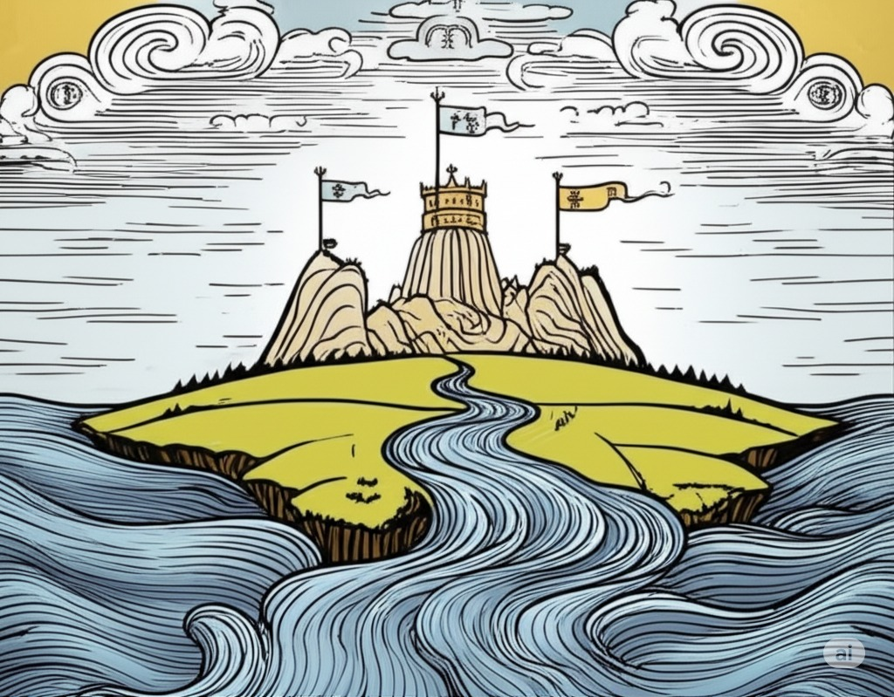
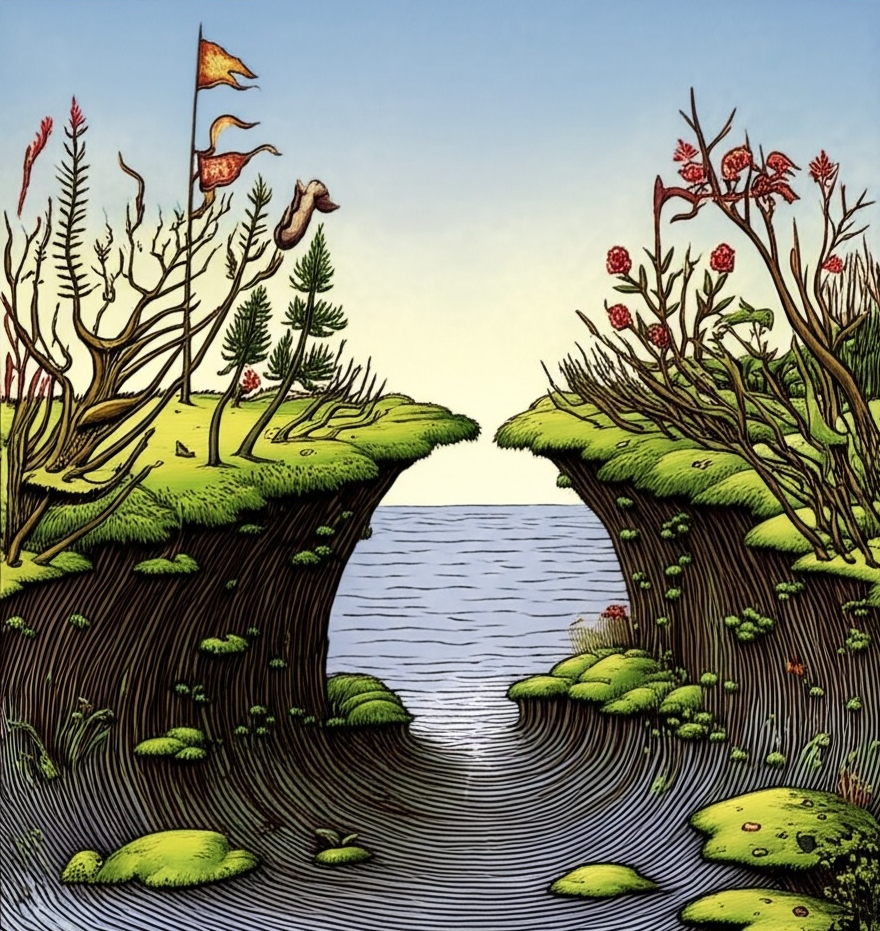
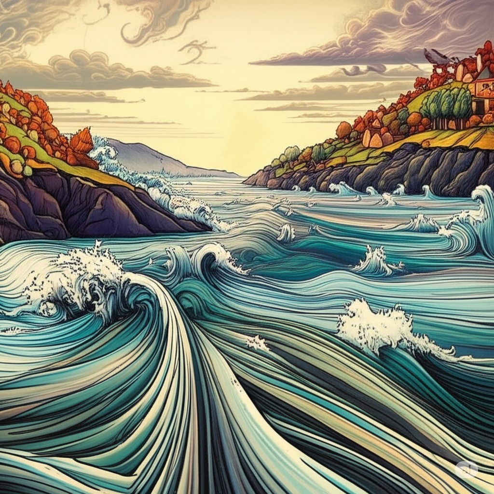
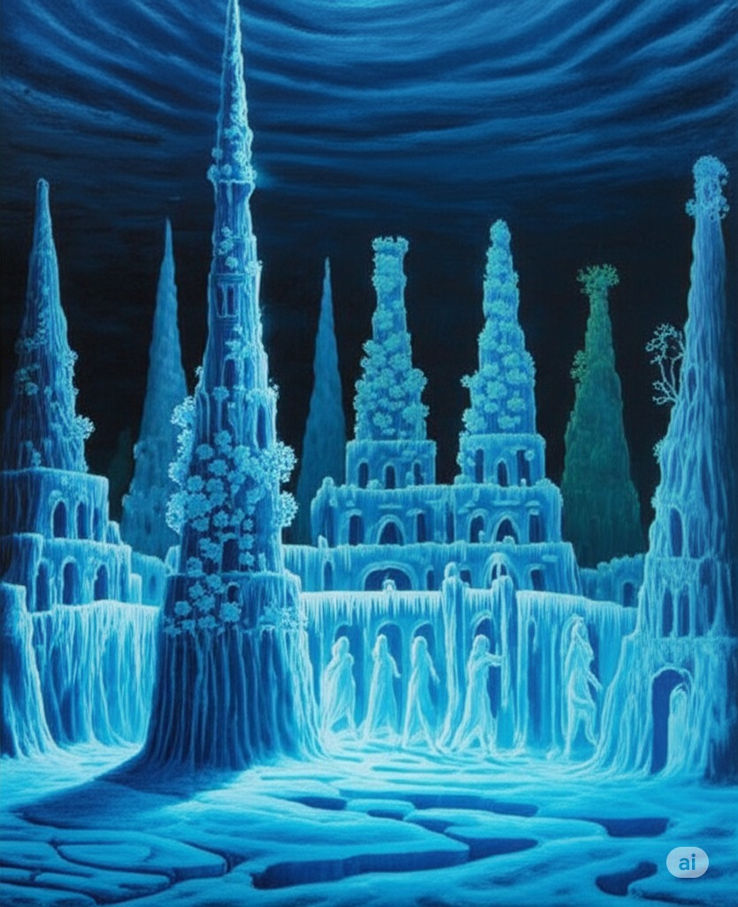

.. _the-ballad-of-the-isle:

-------------------------
I: The Ballad of the Isle
-------------------------

Spring
------

    
    The Accord
    
    :small:`Image by Gemini Flash 2.0`

| The island formed where rivers meet,
|   where silt through vortex fords.
| The place emerged, the brokered seat, 
|   a land of met accords.
| 
| Amassed a mount that, breaching air, 
|   declared to reaching ear
| of kingdoms come to loyal swear
|   an oath all must adhere. 
| 
| The Sky, the Sea, the Mountain crags
|   that vie on fronts opposed,
| beneath the fountain planted flags 
|   agreed to plans proposed.
|
| A barren hump, the sodden deal
|   for flocking birds to plow
| their gullet seed, to letters leal
|   the court of wings their vow. 
| 
| The shoots are sunk and water sewn
|   through roots of flooded banks
| where mudded flanks of fish cyclone
|   the scaly studded ranks. 
| 
| The trees then stake foundations firm,
|   cement what's broken free, 
| confirm the seed to bring to term
|   the squawking newborn plea.
|
| A birth announced to kneeling crowds
|   on consecrated Earth,
| a seal pronounced beneath the clouds
|   to celebrate with mirth.

Summer
------

    The Jubilee

    :small:`Image by Gemini Flash 2.0`

| At last the Summer yields to life
|   and summons forth its herds
| to open market pastures rife
|   with bounty born by birds.
|
| In shallows deer appear to graze
|   beside the lazing drapes
| of rays of incandescent haze
|   that veils their swaying shapes.
|
| Then maiden buds unfold to bees 
|   the sweetly nectared heat;
| unladened, drowsy through the breeze,
|   the teasing fumes secrete. 
|
| Along the flowing inlet streams 
|   the festival begins.
| Caressing music tinges dreams
|   with cricket violins.
|
| The gondolas of lillies' bud
|   that carry courting toads
| through bogs to ports of mud
|   release their tadpole loads.
|
| Oh! Jubilee of June, July
|   through fallow leas by moon,
| when rodents swoon in cups of rye 
|   and fall to bed too soon.
|
| Amid the revelry a kiss
|   to memory's delight,
| two larks alight in fading bliss
|   fulfill this final night. 

Autumn
------

    The Flood

    :small:`Image by Gemini Flash 2.0`

| For Autumn comes with heavy rain 
|   to test the borders drawn.
| The water drained from level plain
|   in flooding rose the dawn.
|
| The thunder heralds sundered age 
|   besieged by droplets fat 
| with blood of yearly plundered wage, 
|   enraged what Spring begat.  
|
| What muddy lanes then sluice the drowned
|   debris and sweep from field
| the tumbling tumult, turned aground
|   and heaped by waves to wield.
|
| So inch by inch the tides reclaim
|   the island kingdom keep
| and cast it down without a name
|   to swirling depths of sleep.
| 
| Yet down below, the stones make schemes
|   through skipping, streaming chunks
| inlaid by sunken trees these seams
|   as ballast for their trunks.
| 
| Arise the turret towers stark
|   against the ruddered land 
| to touch the ceiling shuttered dark
|   and brace what sprawling spanned. 
|
| Beneath the surface flowers form
|   as shades of algae grow
| atop the castle walls in swarm,
|   the borough glade aglow.

Winter
------

    The Afterlife
    
    :small:`Image by Gemini Flash 2.0`

| A timeless age begins to blow
|   above where worlds still thrive.
| Descending sickles diving slow
|   as primal ends arrive.
|
| Let Winter lens of crystal glass
|   behold submerged the fast,
| alive with dancing ghosts en masse
|   retreading paths now past. 
|
| The stasis holds in cold command 
|   the surface wraiths at play. 
| They turn to ice, encased expand
|   beyond the skinned decay. 
|
| What moments held in spells now spent
|   impels the course of freeze.
| The towers brought to knees repent,
|   now felled by Time's disease.
|
| The afterlife morassed in cracks
|   of marrow twisted blue
| and white imbues the zodiacs
|   of death with ghastly hue.
|
| When Spring returns the tides recede,
|   but hollow urns are filled. 
| The ashes spurned through snaking weed
|   take root when fields are tilled. 

.. | 
.. | What form remains recast in shells 

- May 2025

