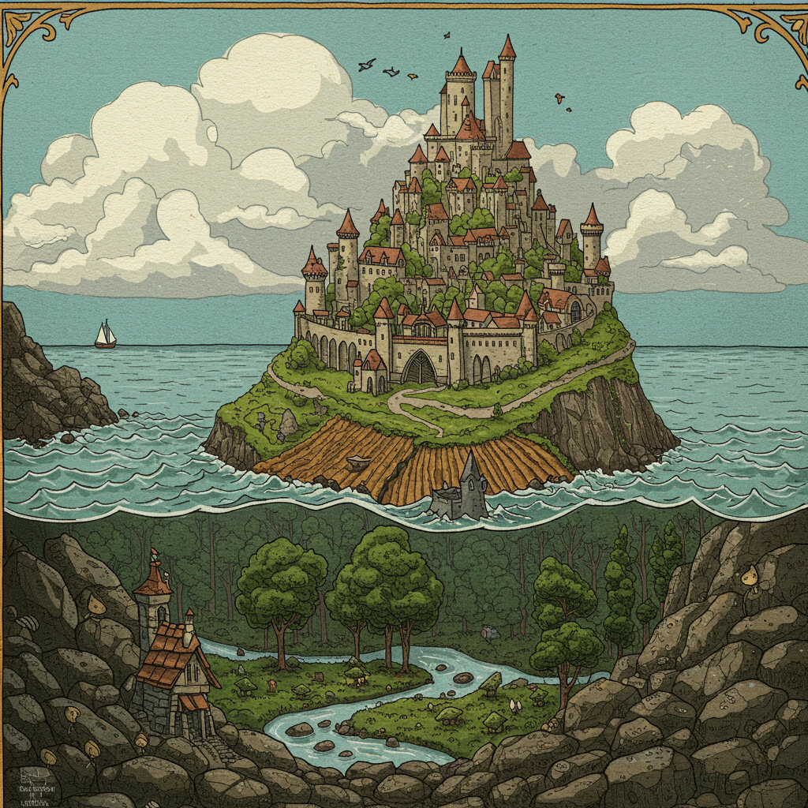

.. _the-ballad-of-the-isle:

The Ballad of the Isle
----------------------

    Image by Imagen 3.0 v002

| The island formed where rivers meet,
|   where silt in vortex fords.
| The place emerged, the brokered seat, 
|   this land of met accords.
| 
| Amassed a mount that breached the air 
|   with fare to reach the ear
| of kingdoms come to loyal swear
|   an oath all must adhere. 
| 
| The Sky, the Sea, the Mountain crags
|   that vie on fronts opposed,
| beneath the fountain planted flags 
|   agreed to plans proposed.

.. carousel::
    :show_controls:
    :show_indicators:
    :show_fade:

    .. figure:: ../../_static/img/context/poetical/companions/the-ballad-of-the-isle/accord-01.jpeg
        :align: left
        :alt: The Ballad of the Isle, The Accord I
        :target: ../../_static/img/context/poetical/companions/the-ballad-of-the-isle/accord-01.jpeg

        I 
        
        Image by Gemini Flash 2.0

    .. figure:: ../../_static/img/context/poetical/companions/the-ballad-of-the-isle/accord-02.jpeg
        :align: left
        :alt: The Ballad of the Isle, The Accord II
        :target: ../../_static/img/context/poetical/companions/the-ballad-of-the-isle/accord-02.jpeg

        II 

        Image by Gemini Flash 2.0

    .. figure:: ../../_static/img/context/poetical/companions/the-ballad-of-the-isle/accord-03.jpeg
        :align: left
        :alt: The Ballad of the Isle, The Accord III
        :target: ../../_static/img/context/poetical/companions/the-ballad-of-the-isle/accord-03.jpeg

        III

        Image by Gemini Flash 2.0

    .. figure:: ../../_static/img/context/poetical/companions/the-ballad-of-the-isle/accord-04.jpeg
        :align: left
        :alt: The Ballad of the Isle, The Accord IV
        :target: ../../_static/img/context/poetical/companions/the-ballad-of-the-isle/accord-04.jpeg
        
        IV

        Image by Gemini Flash 2.0

| A barren hump, the sodden deal
|   where flocking birds will plow
| their gullet seed, to letters leal
|   the court of wings their vow. 
| 
| The shoots are sunk and water sewn
|   through roots of flooded banks
| where mudded flanks of fish cyclone
|   the scaly studded ranks. 
| 
| The trees then stake foundations firm,
|   cement what's broken free, 
| confirm the seed to bring to term
|   the squawking newborn plea.
|
| At last the Summer yields to life
|   and summons forth its words
| to open market pastures rife
|   with bounty born by birds.
|
| The maiden buds unfold to bees
|   the sweetly nectared heat,
| unladened, drowsy, through the breeze
|   the pleasing fumes secrete. 

.. carousel::
    :show_controls:
    :show_indicators:
    :show_fade:

    .. figure:: ../../_static/img/context/poetical/companions/the-ballad-of-the-isle/jubilee-01.jpeg
        :align: left
        :alt: The Ballad of the Isle, The Jubilee I
        :target: ../../_static/img/context/poetical/companions/the-ballad-of-the-isle/jubilee-01.jpeg

        I 
        
        Image by Gemini Flash 2.0

    .. figure:: ../../_static/img/context/poetical/companions/the-ballad-of-the-isle/jubilee-02.jpeg
        :align: left
        :alt: The Ballad of the Isle, The Jubilee II
        :target: ../../_static/img/context/poetical/companions/the-ballad-of-the-isle/jubilee-02.jpeg

        II 

        Image by Gemini Flash 2.0

    .. figure:: ../../_static/img/context/poetical/companions/the-ballad-of-the-isle/jubilee-03.jpeg
        :align: left
        :alt: The Ballad of the Isle, The Jubilee III
        :target: ../../_static/img/context/poetical/companions/the-ballad-of-the-isle/jubilee-03.jpeg

        III

        Image by Gemini Flash 2.0

    .. figure:: ../../_static/img/context/poetical/companions/the-ballad-of-the-isle/jubilee-04.jpeg
        :align: left
        :alt: The Ballad of the Isle, The Jubilee IV
        :target: ../../_static/img/context/poetical/companions/the-ballad-of-the-isle/jubilee-04.jpeg

        IV

        Image by Gemini Flash 2.0

| Oh! Jubilee of June, July
|   through fallow leas by moon,
| when rodents swoon in cups of rye 
|   and fall to bed too soon.
|
| For Autumn comes with heavy rain 
|   to test the borders drawn.
| The water drained from level plain
|   in flooding rose the dawn.
|
| The thunder heralds sundered age 
|   besieged by droplets fat 
| with blood of prior plundered wage, 
|   enraged what Spring begat.  

.. carousel::
    :show_controls:
    :show_indicators:
    :show_fade:

    .. figure:: ../../_static/img/context/poetical/companions/the-ballad-of-the-isle/flood-01.jpeg
        :align: left
        :alt: The Ballad of the Isle, Autumnal Flooding I
        :target: ../../_static/img/context/poetical/companions/the-ballad-of-the-isle/flood-01.jpeg

        I 
        
        Image by Gemini Flash 2.0

    .. figure:: ../../_static/img/context/poetical/companions/the-ballad-of-the-isle/flood-02.jpeg
        :align: left
        :alt: The Ballad of the Isle, Autumnal Flooding II
        :target: ../../_static/img/context/poetical/companions/the-ballad-of-the-isle/flood-02.jpeg

        II 

        Image by Gemini Flash 2.0

    .. figure:: ../../_static/img/context/poetical/companions/the-ballad-of-the-isle/flood-03.jpeg
        :align: left
        :alt: The Ballad of the Isle, Autumnal Flooding III
        :target: ../../_static/img/context/poetical/companions/the-ballad-of-the-isle/flood-03.jpeg

        III

        Image by Gemini Flash 2.0

    .. figure:: ../../_static/img/context/poetical/companions/the-ballad-of-the-isle/flood-04.jpeg
        :align: left
        :alt: The Ballad of the Isle, Autumnal Flooding IV
        :target: ../../_static/img/context/poetical/companions/the-ballad-of-the-isle/flood-04.jpeg

        IV

        Image by Gemini Flash 2.0

| What muddy lanes then sluice the drowned
|   debris and sweep from field
| the tumbling tumult, turned aground
|   and heaped by waves to wield.
|
| So inch by inch the tides reclaim
|   the island kingdom keep
| and cast it down without a name
|   to swirling depths of sleep.
| 
| Yet down below, the stones make schemes
|   through skipping, streaming chunks
| inlaid by sunken trees these seams
|   as ballast for their trunks.
| 
| Arise the turret towers stark
|   against the ruddered land 
| to touch the ceiling shuttered dark
|   and brace what sprawling spanned. 
|
| Beneath the surface flowers form
|   as shades of algae grow
| atop the castle walls in swarm,
|   the borough glade aglow.

.. carousel::
    :show_controls:
    :show_indicators:
    :show_fade:

    .. figure:: ../../_static/img/context/poetical/companions/the-ballad-of-the-isle/afterlife-01.jpeg
        :align: left
        :alt: The Ballad of the Isle, Afterlife I
        :target: ../../_static/img/context/poetical/companions/the-ballad-of-the-isle/afterlife-01.jpeg

        I 
        
        Image by Gemini Flash 2.0

    .. figure:: ../../_static/img/context/poetical/companions/the-ballad-of-the-isle/afterlife-02.jpeg
        :align: left
        :alt: The Ballad of the Isle, Afterlife II
        :target: ../../_static/img/context/poetical/companions/the-ballad-of-the-isle/afterlife-02.jpeg

        II 

        Image by Gemini Flash 2.0

    .. figure:: ../../_static/img/context/poetical/companions/the-ballad-of-the-isle/afterlife-03.jpeg
        :align: left
        :alt: The Ballad of the Isle, Afterlife III
        :target: ../../_static/img/context/poetical/companions/the-ballad-of-the-isle/afterlife-03.jpeg

        III

        Image by Gemini Flash 2.0

    .. figure:: ../../_static/img/context/poetical/companions/the-ballad-of-the-isle/afterlife-04.jpeg
        :align: left
        :alt: The Ballad of the Isle, Afterlife IV
        :target: ../../_static/img/context/poetical/companions/the-ballad-of-the-isle/afterlife-04.jpeg
        
        IV

        Image by Gemini Flash 2.0

| Let Winter freeze, with crystal glass,
|   behold submerged the fast,
| alive with dancing ghosts en masse
|   retreading paths now past. 
|
| The stasis holds in cold command 
|   the surface wraiths at play. 
| They turn to ice, encased expand
|   beyond the skinned decay. 
|
| When Spring returns the tides recede,
|   but hollow urns are filled. 
| The ashes spurned through snaking weed
|   take root when fields are tilled. 

.. figure:: ../../_static/img/context/poetical/companions/the-ballad-of-the-isle/bookend-02.png
    :align: left
    :alt: The Ballad of the Isle
    :width: 50%

    Image by Imagen 3.0 v002

- May 2025