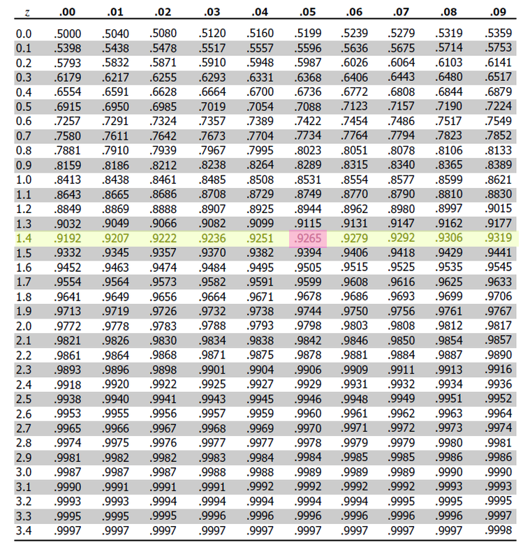
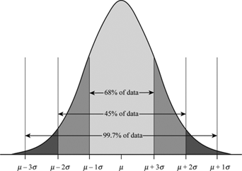

.. _normal_distribution:

===================
Normal Distribution
===================

The **Normal Distribution** is the foundation of :ref:`inferential statistics <inferential-statistic>`. The **Normal Distribution** represents the *ideal population* distribution for a sample that is approximately normal. 

.. _normality:

Normality 
=========

.. _normality_introduction:

Introduction
------------

Normality arises when observations being randomly drawn from a :ref:`population` are *independent* and *identically distributed*. In other words, if a series of experiments are performed where each experiment is the same as the last in every respect, then the outcomes of all the experiments taken together should be approximately normal. 

.. important::

    *Independence* and *Identically Distributed* are mathematical concepts with precise defintions. We will talk more about them in the section on :ref:`probability <probability-introduction>` 

In order to explain the origin of normality, it is instructive to consider a simple example.  Consider the experiment of rolling a single die. Think about what the *ideal* relative frequency distribution for this experiment should look like. A die has six sides and each one is equally likely. If we let :math:`\mathcal{X}` represent the outcome a rolling a single die, we can express the relation of all outcomes being equally likely with the following equation, 

.. math::

    P(\mathcal{X}=1) = P(\mathcal{X}=2) = P(\mathcal{X}=3) = P(\mathcal{X}=4) = P(\mathcal{X}=5) = P(\mathcal{X}=6)

To say the same thing in a different way, the :ref:`probability <probability-introduction>` of all outcomes should be the same,

.. math::

    P(\mathcal{X}=i) = p \text{ for }   i = 1, 2, 3, 4, 5, 6 

Where *p* is a constant. The *ideal* histogram (in other words, the distribution of the *population*) would look perfectly uniform,

.. plot:: _plots/examples/04_ex01_die_roll.py

Consider now the experiment of rolling 30 die. The *relative* frequency of each outcome in the *ideal distribution* will not change, since the new die being rolled consist of the same outcomes as the original die; Outcomes are added to the experiment in the same proportion. 

Take this experiment of rolling 30 die and repeat 

TODO

A departure from normality can suggest several things: 

1. The selection process was not random.
2. The observations are not *independent*.
3. The observations are not being drawn from the exact same population.

.. _normal_calculations:

Normal Calculations
-------------------

When we calculate Normal probabilities, we usually work with *Z distributions*, where each observation :math:`x_i` has been converted into a :ref:`z-score` :math:`z_i`,

.. math::

	z_i = \frac{x_i - \mu}{\sigma}
	
The reason for this transformation is easily understood by recalling the :ref:`data transformation theorems <data-transformations>` that states the mean of a *Z distribution* will always be 0 and the standard deviation of a *Z distribution* will always be 1. 

If an observation :math:`\mathcal{X}` drawn from a population follows a Normal distribution with mean :math:`\mu` and standard deviation :math:`\sigma`, we write,

.. math::

	\mathcal{X} \sim \mathcal{N}(\mu, \sigma)
	
Then, the corresponding *Z distribution* can be written,

.. math::

	\mathcal{Z} \sim \mathcal{N}(0, 1)
	
TODO

.. _normal_cdf:

Cumulative Distribution Function
********************************

The cumulative distribution function (CDF) for the Normal distribution is an extremely important function in mathematics. Symbolically, it is written,

.. math::

	\Phi(z) = P(\mathcal{Z} \leq z) = p
	
This function represents the area under the density curve to the left of the point :math:`z`. In other words, This function tells us the *percentage* :math:`p` of the Standard Normal distribution that is less than or equal to the point :math:`z`. To put it yet another way, it tells us what percentage :math:`p` of the original Normal distribution is less than or equal to :math:`z` standard deviations away from the mean.

Graphically, we can think of the Normal CDF at a point, :math:`\Phi(z)` as representing the shaded area to the left of :math:`z`. For example, the quantity :math:`\Phi(0.5)` can be visualized as the shaded region under the density curve,

.. plot:: _plots/distributions/normal/normal_distribution_cdf.py

.. _normal_inverse_cdf:

Inverse Cumulative Distribution Function
****************************************

Every well-behaved function has an inverse. The CDF of the Normal Distribution is no different. The inverse CDF is denoted,

.. math::

	\Phi^{-1}(p) = z
	
The CDF tells us, given a value of :math:`z`, what percent of the distribution is below :math:`z`. The inverse CDF, on the other hand, tells us, given a value of :math:`p`, what observation :math:`z` corresponds to that percentile. It is the point :math:`z` on the Normal density curve such that the shaded area below :math:`z` is equal to :math:`p`.

As an example, if we were interested in the 35 :sup:`th` percentile of the Standard Normal distribution, the inverse CDF would tell us the point :math:`z` such that 35% of the distribution is less than or equal to that point, i.e. the point where the area to the left of the :math:`z` is 35%.

.. plot:: _plots/distributions/normal/normal_distribution_inverse.py

.. _normal_symmetry:

Symmetry
--------

TODO 

.. _z_table_reference:

Z-Tables
========

These days we have calculators that can perform almost any calculation you can imagine, but back in the old days, aspiring mathematicians needed to be familiar with *tables*. Many functions in trigonometry and algebra do not have closed form algorithms for their exact calculation, so their values must be looked up in a *table*.

For example, :math:`sin(x)` is a trigonometric quantity defined as the ratio of sides in a right triangle. It is, in general, impossible to calculate the exact value of :math:`sin(x)` for an arbitrary :math:`x` without more advanced techniques introduced in Calculus. For this reason, before the advent of modern computing, values of *sin* were tabulated in tables like the following,

(TODO: insert picture)

Similarly, the Standard Normal distribution is defined by a density curve whose area is not easily calculated without a substantial amount of math-power (like horse-power, but with math). In order to aid in calculations, statisticians of the past tabulated the values of the Standard Normal and devised a way of representing the CDF of the Standard Values through a two-way table,

.. image:: ../../_static/img/mathematics/tables/table_positive_z.png
	:align: center

This table can answers questions like,

.. math::

	P(\mathcal{Z} \leq 1.45)
	

First, we find the row that corresponds to the two leading digits, `1.4`. 

.. image:: ../../_static/img/mathematics/tables/table_positive_z_example_step1.png
	:align: center

Then, we find the column that corresonds to the last decimal spot, `0.05`. 

This tells us that `92.65%` of the Standard Normal distribution has a distance less than or equal to 1.45 standard deviations from the mean.
 
.. _empirical_rule:

Empirical Rule
==============

TODO 

.. topic:: Empirical Rule

	68% of a distribution is within one standard deviation of the mean.
	
	95% of a distribution is within two standard deviations of the mean.
	
	99% of a distribution is within three standard deviations of the mean.
	
.. topic:: Empirical Rule (Mathematical Version, x Distributions)

	.. math::
		
		P(\bar{x} - \sigma \leq \mathcal{X} \leq \bar{x} + \sigma) = 0.68
	
	.. math::
		
		P(\bar{x} - 2 \cdot \sigma \leq \mathcal{X} \leq \bar{x} + 2 \cdot \sigma) = 0.95

.. topic:: Empirical Rule (Mathematical Version, z Distributions)

	.. math::
		
		P(-1 \leq \mathcal{Z} \leq 1) = 0.68
	
	.. math::
		
		P(-2 \leq \mathcal{Z} \leq 2) = 0.95
		
	.. math::
		
		P(-3 \leq \mathcal{Z} \leq 3) = 0.99

The *Empirical Rule* can be visualized through the area underneath the Normal curve,

TODO

.. _normal_parameters:

Parameters
==========

Mean
----

TODO 

Varying the Mean Parameter
**************************

TODO

Standard Deviation
------------------

Varying the Standard Deviation Parameter
****************************************

By changing the :ref:`standard-deviation`, the shape of the distribution changes. As the :ref:`standard-deviation` increase, the graph spreads out. This is because :ref:`standard-deviation` is a :ref:`measure of variation <measures-of-variation>`. In other words, :ref:`standard-deviation` quantifies how the distribution is spread out along the *x*-axis.

.. plot:: _plots/distributions/normal/normal_distribution_parameters.py

Summary
-------

To summarize,

.. topic:: Effects of Varying The Normal Parameters

	1. By changing the mean of the *Normal distribution*, the *location* of the distribution changes. 
		
		a. Increasing the mean shifts the distribution to the right. 
		
		b. Decreasing the mean shifts the distribution to the left.
		 
	2. By changing the standard deviation of the *Normal distribution*, the *spread* of the distribution changes. 

		a. As the standard deviation becomes larger, the distribution become flatter and more spread out around the mean. 
		
		b. As the standard deviation becomes smaller, the distribution clusters around the mean in a sharper and sharper peak. 

.. _assessing-normality:

Assessing Normality
===================

TODO

.. _qq-plots: 

QQ Plots
--------

A common technique for assessing the *normality* of a sample distribution is to generate a *Quantile-Quantile Plot*, or *QQ Plot* for short. QQ plots provide a visual representation of a sample's *normality* by plotting the percentiles of a sample distribution against the percentiles of the theoretical Normal Distribution. 

The exact steps for generating a QQ plot are given below,

1. Find the :ref`order statistics <order_statistics>` of the distribution. In other words, sort the sample in *ascending* order.

.. note::

	Step 1 is equivalent to finding the :ref:`percentiles <percentile>` of the sample distribution.

2. Standarize the sorted sample, i.e. find each observation's :ref:`z-score`.

3. Find the theoretical percentiles from the Standard Normal Distribution for each ordered observation.

4. Plot the actual percentiles versus the theoretical percentiles in the x-y plane.

Consider the following simplified example. Let the sample :math:`S` be given by,

.. math::

	S = \{ 10, 15, 20, 30 \}	
	
The sample statistics for this distribution are given by,

.. math::

	\bar{x} = 18.75
	
.. math::

	s \approx 8.54
	
Standardizing each observation and rounding to the second decimal spot,

.. math::
	
	Z = \{ -1.02, -0.44, 0.15, 1.32 \}
	
Then, we construct the theoretical percentiles of the Standard Normal distribution for a sample of size :math:`n = 4`. To do so, we take the inverse CDF of the sample percentile,

.. math::

	\Phi^{-1}(\frac{i}{n+1})
	
For :math:`i = 1, 2, ... , n `. Note the denominator of :math:`n+1`. If it is surprising the denominator is :math:`n+1` instead of `n`, read through the :ref:`order statistics section <order-statistics>`. There are *n* observations, but these values divide the number line into *n + 1* intervals.

In this example, we would find,

.. math:: 
	
	Z_{ \text{theoretical} } = \{ \Phi^{-1}(\frac{1}{5}), \Phi^{-1}(\frac{2}{5}), \Phi^{-1}(\frac{3}{5}), \Phi^{-1}(\frac{4}{5}) \}
	
.. math::

	Z_{\text{theoretical}} = \{ -0.842, -0.253, 0.253, 0.842 \}
	
After constructing the theoretical percentiles, we create a scatter plot using the order paired,

	( actual percentile, theoretical percentiles )
	
If the sample distribution is Normal, we should observe a linear relationship between the x-value and the y-value of this scatter plot. The following plot is the QQ plot summarizes the normality of this example,

.. plot:: _plots/other/qq_plot_simple.py

We notice an approximately linear relationship between the observed percentiles and the theoretical percentile, and thus we conclude there is no evidence to suggest the distribution is not normal.

.. important::

	The phrasing here is important! We have **not** shown the distribution is Normal. We have only provided evidence to contradict the claim the distribution is **not** Normal. In other words, we have demonstrated the falsity of a negative claim; we have not demonstrated the truth of a postive claim.

Relation To Other Distributions
===============================

The :ref:`normal_distribution` is deeply connected with many different areas of mathematics. It pops up everywhere, from `quantum mechanics <https://en.wikipedia.org/wiki/Wave_packet>`_ to `finance <https://www.investopedia.com/articles/investing/102014/lognormal-and-normal-distribution.asp#:~:text=When%20the%20investor%20continuously%20compounds,time%20in%20a%20normal%20distribution.>`_. The reach of the *normal distribution* is far and wide.

.. _normal-binomial-approximation:

Normal As An Approximation of the Binomial
------------------------------------------

TODO 

.. topic:: Conditions for Approximation
   
    :math:`n \cdot p \geq 10`

    :math:`n \cdot (1 - p) \geq 10`

.. _normal-poisson-approximation:

Poisson As An Approximation of the Normal
-----------------------------------------

TODO

.. topic:: Conditions for Approximation
        
    :math:`	\lambda \leq \leq 0`
