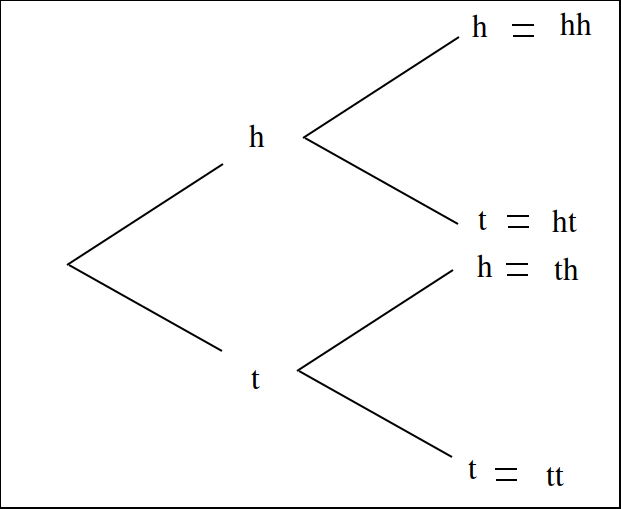

.. _probability-introduction:

============
Introduction
============

Probability is the study of the properties of random events.

Preliminaries
=============

.. _compound-union:

--------------
Compound Union 
--------------

Symbolic Expression
    .. math:: 

        \bigcup\limits_{i=1}^{n} A_{i} = A_1 \cup A_2 \cup ... \cup A_{n-1} \cup A_n 

A symbol that represents the union of a sequence of sets.

.. admonition:: Example
    
    Let **A**, **B**, **C** and **D** be sets given by, 

    .. math::

        A_1 = \{ a, b, c \}

    .. math::

        A_2 = \{ b, c, d \}

    .. math::

        A_3 = \{ c, d, e \}

    .. math::

        A_4 = \{ d, e, f \}

    Then,

    .. math::

        \bigcup\limits_{i=1}^{4} A_{i} = A_1 \cup A_2 \cup A_3 \cup A_4 

    .. math::

        = \{ a, b, c, d, e, f \}

---------
Summation
---------

    Symbolic Expression 
        .. math::
        
            \sum_{i=1}^n x_i = x_1 + x_2 + ... x_{n-1} + x_n
    
        Sometimes written as,

        .. math:: 
            
            \sum_{x_i \in B} x_i 

        Where **B** is a set of elements. 
    
A symbol that represents the sum of elements :math:`x_i`.

.. admonition:: Example

    Let the set **A** be given by,

    .. math::

        A = \{ 1, 2, 3, 4, 5 \}

    Then,

    .. math:: 

        \sum_{x_i \in A} x_i = 1 + 2 + 3 + 4 + 5 = 15

.. note::

    The sum :math:`\sum` is only defined if the set it is summing contains *only* numerical elements. It makes no sense to take about the sum of elements with a set like,

    .. math::

        A = \{ \text{ novels }, \text{ textbooks }, \text{ magazines } \}

Definitions
===========

.. _experiment:

Experiment
    An *uncertain* event.    

.. _mutual-exclusion:

Mutual Exclusivity
    .. math::

        A \cap B = \varnothing \implies \text{ A and B are mutually exclusive.} 

Two sets, **A** and **B**, are *mutually exclusive* if they are disjoint.

.. _outcome:

Outcomes 
    :math:`x, y, z` (*lower case letters*)
        
A possible way an experiment might occur.
    
.. _sample-space: 

Sample Space 
    :math:`S`
        
The set of all possible outcomes for an experiment.

.. note:: 

    The *sample space* is simply the :ref:`universal-set` in probability's :ref:`domain-of-discourse`.

.. _event:

Events 
    :math:`A, B, C` (*upper-case letters*)

    :math:`A_1, A_2, A_3, ..., A_{n-1}, A_n` (*upper-case letters with subscripts*)
        
A subset of the sample space, i.e. a set of outcomes. 

.. math::
    A \subseteq S \implies  \text{ A is an event }

Probability
    :math:`P(A)`
        
A numerical measure of the *likelihood*, or *chance*, that an event **A** occurs.

.. _sample-spaces:

Sample Spaces and Events
========================

The *sample space* for an experiment is the set of everything that could possibly happen.

----------
Motivation
----------

.. note:: 
    By "*fair*", we mean the probability of all outcomes are *equally likely*.

Consider flipping a fair, two-sided coin. The only possible outcomes to this experiment are heads or tails. If we let *h* represent the outcome of a head for a single flip and *t* represent the outcome of a tail for a single flip, then the sample space is given by the set **S**,

.. math:: 
    S = \{ h, t \}

Events can be defined as :ref:`subsets <subset>` of the sample space. If we let **H** represent the event of a head and if we let **T** represent the event of a tail, then clearly,

.. math:: 
    H = \{ h \}
    
.. math:: 
    T = \{ t \}

Be careful not to confuse the outcome *h* with the event **H**, and likewise the outcome *t* with the event **T**. They have different, but related, meanings. The outcomes *h* and *t* are individual observables; they are physically measured by flipping a coin and observing on which side it lands. An event, on the other hand, is a :ref:`set <sets>`, and *sets* are abstract collections of individual elements. In this case, the sets are *singletons*, i.e. the sets **H** and **T** only contain one element each, which can lead to confusing the set for the outcome. Let us extend this example further, to put a finer point on this subtlety.   

Consider now flipping the same fair, two-sided coin twice. A :ref:`tree diagram <tree-diagrams>` can help visualize the sample space for this experiment. We represent each each flip as a branch in the tree diagram, with each outcome forking the tree,

The outcomes of the sample space are found by tracing each possible path of the :ref:`tree diagram <tree-diagrams>` and then collecting them into a set,

.. math::
    S = \{ hh, ht, th, tt \}

In this example, there is no simple correspondence between the events defined on the sample space and the outcomes within those events, as in the previous example. 

Take note, the sequence of outcomes *ht* is different than the sequence of outcomes *th*. In the first case, we get a head and *then* we get a tail. In the second case, we get a head and *then* we get a tail. Therefore, *ht* and *th* represent two different *outcomes* that correspond to the same *event*. Let us call that event the set **HT**. **HT** represents event of getting one head and one tail, regardless of order. Then, **HT** has exactly two outcomes (elements),

.. math:: 
    HT = \{ ht, th \}

When one of the outcomes *ht* or *th* is observed, we say the event **HT** *occurs*.

It is important to keep in mind the distinction between *events* and *outcomes*. The differences are summarized below,

    1. *Outcomes* are elements. *Events* are sets.
    2. *Outcomes* are observed. *Events* occur.

.. _compound-events:

---------------
Compound Events
---------------

A *compound* event is formed by composing simpler events with :ref:`set-operations`.

Example
    Consider the experiment of drawing a single card at random from a well-shuffled, standard playing deck. Let **A** represent the event of drawing a 2. Let **B** represent the event of drawing a heart.

The meaning of a few different *compound events* is considered below,

1. :math:`A \cap B` This *compound event* represents the event of getting a 2 of hearts.
2. :math:`A \cup B` This *compound event* represents the event of getting a 2 *or* a heart.
3. :math:`A^c` This *compound event* represents the event of getting any card except a 2.
4. :math:`A \cap B^c` This *compond event* represents the event of getting a two that is *not* a heart.
   
.. _classical-definition-of-probability:

-----------------------------------
Classical Definition of Probability
-----------------------------------

Returning to the experiment of flipping a fair coin once, we have a sample space and two events, **H** and **T**, defined on that sample space,

.. math:: 
    S = \{ h, t \}

.. math:: 
    H = \{ h \}
    
.. math:: 
    T = \{ t \}

The cardinalities of these sets are given by,

.. math:: 
    n(S) = 2

.. math:: 
    n(H) = n(T) = 1

A natural way to define probability of an event is as the ratio of the cardinality of that event to the cardinality of the sample space. This leads to the following definition of *the probability of event* **A**,

.. math:: 
    P(A) = \frac{n(A)}{n(S)}

In plain English,

    The probability of an event **A** is the ratio of the number ways **A** can occur to the number of ways all the outcomes in the sample space **S** can occur.

Another way of saying the same thing,

    The probability of an event **A** is the ratio of the cardinalities of the set **A** and the sample space **S**.

This is called the *classical definition of probability*.

Applying this definition to the events **H** and **T** in the first example, it can be seen to conform to the intuitive notions of probability, namely that *equally likely* events should have the same probability. Intuitively, if the coin being flipped is fair, the probability of either event **H** or **T** should be equal.

.. math:: 
    P(H) = \frac{n(H)}{n(S)} = \frac{1}{2}

.. math:: 
    P(T) = \frac{n(T)}{n(S)} = \frac{1}{2}

.. _law-of-large-numbers:

Law of Large Numbers
--------------------

TODO 

.. _axioms-of-probability:

Axioms of Probability
=====================

The *classical definition of probability* suffices for a general understanding of probability, but there are cases where it fails to account for every feature we would expect a definition of probability to satisfy. 

To see this, consider the experiment of spinning a dial on a clock with radius *r*,

(INSERT PICTURE)

The dial can land at any point between 0 and the circumference of the clock, :math:`{2}{\cdot}{\pi}{\cdot}{r}`. Between 0 and :math:`{2}{\cdot}{\pi}{\cdot}{r}`, there are an *infinite* number of numbers (*0, 0.01, 0.001, 0.001, ..., 1, 1.01, 1.001, ..., etc., ... ,* :math:`{2}{\cdot}{\pi}{\cdot}{r}`) ; What is :math:`n(S)` when the sample space of outcomes is infinitely large? The *classical definition of probability* is unable to answer this question.

For this reason and other similar cases, the *classical definition of probability* is not sufficient to completely determine the nature of probability. This leads to the *axiomatization of probability*, which acts as additional constraints any model of probability must satisfy in order to be considered a probability. 

.. note::
    We will see in a subsequent section, when we discuss :ref:`the uniform distribution <uniform-distribution>`, while we cannot calculate the probability of the dial exactly landing on a given number, we can calculate the probability the dial lands within a certain interval (that is to say, a certain `arc length <https://en.wikipedia.org/wiki/Arc_length>`_ of the clock's circumference).

------
Axioms
------

.. _probability-axiom-1:

Axiom 1
-------

:math:`P(A)>=0`    
    All probabilities are positive; No probabilities are negative.

.. _probability-axiom-2:

Axiom 2
-------

:math:`P(S)=1`
    The probability of *some* outcome from the sample space **S** occuring is equal to 1.

.. _probability-axiom-3:

Axiom 3
-------

:math:`\forall i \neq j: A_i \cap A_j = \varnothing \implies P(\bigcup\limits_{i=1}^{n} A_i) = \sum_{i=1}^n P(A_i)`
    If each event :sub:`i` **A** in the sample space **S** is *mutually exclusive* with every other event :math:`\forall i \neq j: A_i`, then the probability of the union of all of these events is equal to the sum of the probabilities of each individual event.

:ref:`probability-axiom-1` and :ref:`probability-axiom-2` are fairly intuitive and straight-forward in their meaning, while :ref:`probability-axiom-3` takes a bit of study to fully appreciate. To help in that endeavor, consider the following example.

Example
    Let us return again to the experiment of flipping a fair coin twice. Consider now two different events **A** and **B** defined on this sample space,

    .. math::
        
        A \equiv \text{ getting at least one head }
        
    .. math::
        
        B \equiv \text{ getting exactly one tail }
    
    Find the probability of :math:`P(A \cup B)`. 
    
The sample space **S** of this experiment was given by,

.. math::
    S = \{ hh, ht, th, tt \}

Then, in terms of outcomes, clearly, these events can be defined as,

.. math::
    A = \{ hh, ht, th \}

.. math::
    n(A) = 3

.. math::
    B = \{ ht, th \}

.. math::
    n(B) = 2

And, using the :ref:`classical-definition-of-probability`, the probabilities of these events can be calculated by,

.. math::
    P(A) = \frac{3}{4}

.. math::
    P(B) = \frac{2}{4} = \frac{1}{2}

:ref:`probability-axiom-3` tells us how to compute :math:`A \cup B`; it tells us the probability of the union is equal to the sum of the individual probabilities. However, if we try to apply :ref:`probability-axiom-3` here, we wind up with a contradiction,

.. math:: 
    P(A) + P(B) = \frac{3}{4} + \frac{2}{4} = \frac{5}{4} \geq 1

Here is a probability greater than 1, which cannot be the case. What is going on?

The issue is the *condition* that must be met to apply :ref:`probability-axiom-3`; the events **A** and **B** must be *mutually exclusive*, :math:`A \cap B = \varnothing`, while in this example we have,

.. math::

    A \cap B = \{ ht, th \}

In other words, **A** and **B** are *not* mutually exclusive here. Therefore, we *cannot* say the probability of the union  of these two events is equal to the sum of the probabilities of each individual event. In fact, in this example,

.. math::

    A \cup B = \{ hh, ht, th \}

And therefore, by the :ref:`classical-definition-of-probability`,

.. math::
    P(A \cup B) = \frac{3}{4}

Which is clearly not greater than 1.

If, instead, we consider the event **C**,

.. math::
    C \equiv \text{ getting exactly two heads }

Then, the outcomes of **C** are,

.. math::
    C = \{ hh \}

.. math::
    n(C) = 1

And the probability of the event **C**,

.. math::
    P(C) = \frac{1}{4}

Then, the :ref:`compound event <compound-events>` :math:`B \cup C` is found by aggregating the outcomes in both of the individual events **B** and **C** into a single new set,

.. math::
    B \cup C = \{ hh, th, ht \}

.. math::
    n(B \cup C) = 3

So the probability of the compound event :math:`B \cup C` is calculated as,

.. math::
    P(B \cup C) = \frac{3}{4}

Notice :math:`B \cap C = \varnothing`, i.e. **B** and **C** are mutually exclusive, so by :ref:`probability-axiom-3`, we may also decompose this probability into its individual probabilities,

.. math::
    P(B \cup C) = P(B) + P(C) = \frac{1}{2} + \frac{1}{4} = \frac{3}{4}

In this case, the two methods of finding the probabilities agree *because the condition (or hypothesis) of* :ref:`probability-axiom-3` *was met*, namely, that the events are mutually exclusive. If the condition (or hypothesis) of :ref:`probability-axiom-3` is not met, then its conclusion does not follow.

.. _probability-theorems:

Theorems
========

We can use these *axioms*, along with the `theorems of set theory <set-theorems>` to prove various things about probability.

.. _probability-law-of-complements:

------------------
Law of Complements 
------------------

Symbolic Expression
    .. math::
        
        P(A) + P(A^c) = 1

This corollary should be intuitively obvious, considering the Venn Diagramm of complementary sets,

.. image:: ../../_static/img/math/sets/sets-complement.jpg
    :align: center

If the entire rectangle encompassing set **A** in the above diagram is identified as the sample space **S**, then the theorem follows immediately from Axiom 2, namely, :math:`P(S)=1`. 

.. warning:: 

    The converse of this theorem is *not* true, i.e. if two events **A** and **B** have probabilities that sum to *1*, this does not imply they are complements of one another. 

To see an example of what that pesky warning is talking about, consider flipping a fair, two-sided coin twice. Let **A** be the event of getting a head in the first flip. Let **B** of getting exactly one head in both flips. 

The outcomes of **A** are given by,

.. math::

    A = \{ hh, ht \}

While the outcomes of **B** are given by,

.. math::

    B = \{ ht, th \}

In this case, 

.. math::
    
    P(A) + P(B) = 1

But **A** and **B** are *not* complements. To restart this result in plain English,

    The sum of the probability of complementary events is equal to 1; The converse does not hold, namely if the sum of probability of events is equal to 1, the events in question are not necessarily complements.

Two equivalent formal proofs of this theorem are given below. Choose whichever one makes more sense to you.

Proof #1 
    By the :ref:`classical-definition-of-probability`, the probability of :math:`A \cup A^c` is given by,

    .. math::

        P(A \cup A^c) = \frac{n(A \cup A^c)}{n(S)}
        
    By :ref:`law-of-unions` and :ref:`law-of-noncontradiction`,

    .. math::

        n(A \cup A^c) = n(A) + n(A^c)

    So, the probability of :math:`A \cup A^c` is,

    .. math::

        P(A \cup A^c) = \frac{n(A) + n(A^c)}{n(S)} 
        
    Distributing :math:`\frac{1}{n(S)}`,

    .. math::

        P(A \cup A^c) = \frac{n(A)}{n(S)} + \frac{n(A^c)}{n(S)}

    Applying the :ref:`classical-definition-of-probability` to both terms on the right hand side of the equation, 

    .. math::

        = P(A) + P(A^c)

    On the other hand, by :ref:`law-of-excluded-middle`,

    .. math::

        P(A \cup A^c) = P(S)

    By :ref:`probability-axiom-2`,

    .. math::
        
        P(S) = 1

    Putting it altogether,

    .. math::

        1 = P(A) + P(A^C)

Proof #2
    By :ref:`law-of-noncontradiction`,

    .. math::

        A \cap A^c = \varnothing

    Therefore, :math:`A` and :math:`A^c` are *mutually exclusive*. So by :ref:`probability-axiom-3`, we can say,

    .. math::

        P(A \cup A^c) = P(A) + P(A^c)

    But, by :ref:`law-of-excluded-middle`,

    .. math::
        
        A \cup A^c = S

    And by :ref:`probability-axiom-2`,

    .. math::

        P(S) = 1

    So,

    .. math::
        1 = P(A) + P(A^c)

Example
    Find the probability of atleast getting at least one head if you flip a coin 3 three times. 

TODO

.. _probability-law-of-unions:

Law of Unions
-------------

Symbolic Expression
    .. math:: 
        P(A \cup B) = P(A) + P(B) - P(A \cap B)

Again, from inspection of a :ref:`venn-diagrams` of *overlappying* sets, this theorem should be obvious,

.. image:: ../../_static/img/math/sets/sets-union-overlapping.jpg

The union is the area encompassed by bother circles. When we add the probability of **A** (area of circle **A**) to the probability of **B** (area of circle **B**), we double-count the area :math:`A \cap B`, so to correct the overcount, we must subtract once by the offending area.

The formal proof **Law of Unions** follows directly from :ref:`law-of-unions` and the :ref:`classical-definition-of-probability`. The proof is given below.

Proof 
    By the :ref:`classical-definition-of-probability`,

    .. math:: 
        P(A \cup B) = \frac{n(A \cup B)}{n(S)}

    By :ref:`law-of-unions`,

    .. math:: 
        P(A \cup B) = \frac{n(A) + n(B) - n(A \cap B)}/{n(S)}

    Distributing :math:`\frac{1}{n(S)}`,

    .. math:: 
        P(A \cup B) = \frac{n(A)}{n(S)} + \frac{n(B)}{n(S)} - \frac{n(A \cap B)}{n(S)}

    Applying the :ref:`classical-definition-of-probability` to all three terms on the right side of the equation,

    .. math::
        P(A \cup B) = P(A) + P(B) - P(A \cap B)

Example
    Consider a standard deck of 52 playing cards. Find the probability of selecting a Jack or diamond. 

The sample space for a selecting a single card from a deck of 52 cards is shown below,

.. image:: ../../_static/img/math/probability/playing-cards.jpg
   :width: 60%
   :align: center

Let **J** be the event of selecting a jack. Let **D** be the event of selecting a diamond. This example wants us to find :math:`J \cup D`.

There are 4 Jacks and 13 Diamonds in a standard deck of cards. Therefore, the probability of the individual events is given by,

.. math::

    P(J) = \frac{4}{52} = \frac{1}{13}

.. math::

    P(D) = \frac{13}{52} = \frac{1}{4}

If we stopped at this point and simply added these two probability to find :math:`P(J \cup D)`, we would be counting the Jack of Diamonds twice, once when we found the probability of a Jack and again when we found the probability of a Diamond. To avoid double-counting this card, we first find,

.. math:: 

    P(J \cap D) = \frac{1}{52}

Therefore, the desired probability is,

.. math::

    P(J \cup D) = P(J) + P(D) - P(D \cap J) 

.. math::

    = \frac{4}{52} + \frac{13}{52} - \frac{1}{52} = \frac{16}{52} = \frac{4}{13} \approx 0.31

.. _probability-tables:

Probability Tables
******************

If you have two events, :math:`A` and :math:`B`, then you can form a *two-way* probability table by partitioning the sample space into :math:`A` and :math:`A^c` and then simultaneously partitioning the sample space into :math:`B` and :math:`B^c`, 

                        
+--------------+---------------------+--------------------+----------------+ 
| Events       |     :math:`A`       |  :math:`A^c`       |    Probability |
+--------------+---------------------+--------------------+----------------+
| :math:`B`    | :math:`P(B \cap A)` | :math:`B \cap A^c` | :math:`P(B)`   |
+--------------+---------------------+--------------------+----------------+
| :math:`B^c`  | :math:`P(B \cap A`  | :math:`B \cap A^c` | :math:`P(B^c)` |
+--------------+---------------------+--------------------+----------------+
| Probabilitiy | :math:`P(A)`        | :math:`P(A^c)`     | :math:`P(S)=1` |
+--------------+---------------------+--------------------+----------------+

