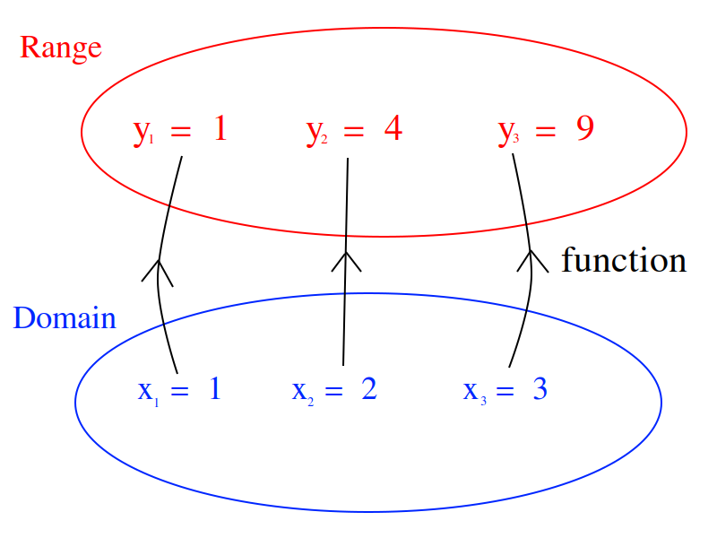
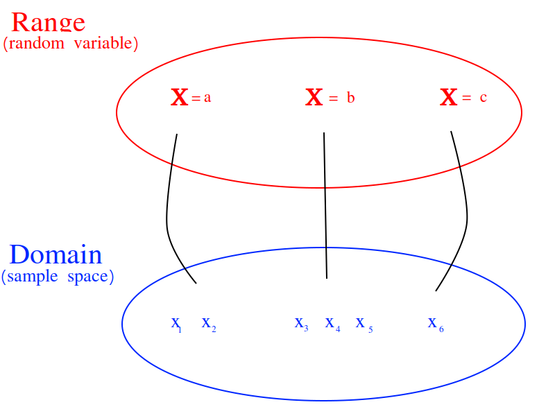
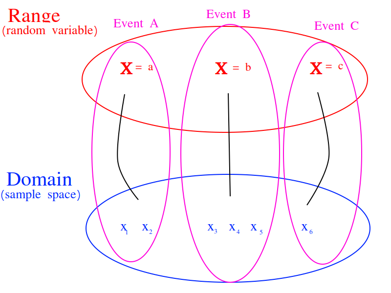

.. _random-variables:

================
Random Variables
================

Many things in life are *uncertain*. Nevertheless, *uncertainy* doesn't equate to *unpredictability*. Even though events may be *uncertain*, we can still make *predictions* about their outcome based on our knowledge of the sample space. Before we can do that, we need to talk about *random variables* and how they can be used to model processes in the real world.

Definition
==========

The following sentences all say the same thing in slightly different ways.

	1. A *random variable* :math:`\mathcal{X}` is an *uncertain* quantity. 

	2. A *random variable* :math:`\mathcal{X}` depends on the outcome of random event.
	
	3. A *random variable*  :math:`\mathcal{X}` is a function whose input is determined by a random process.

.. admonition:: Example #1-A

	A friend flips a fair, two-sided coin. If it lands on heads, he will pay you five dollars. If it lands on tails, you have to pay him five dollars. 

.. admonition:: Solution #1-A

	The sample space for this simple game is given by,
    
	.. math::
    
    		S = \{ h, t \}

	The amount of money you win or lose is a *random variable* that depends on the outcome of the coin flip, i.e. whether the event of :math:`H = \{ h \}` or the event :math:`T = \{ *t* \}` from the sample space occurs. Using this information, we can define the *random variable* for the amount of money won or lost playing this game as follows,

	.. math::
   
		\mathcal{X} = \begin{array}{ c l }
			5       & \quad \textrm{with } p(H) \\
			-5      & \quad \textrm{with } p(T)
    				\end{array}

	We can use a table to visualize the outcomes of this *random variable* and their associated probabilities,

	+------+---------------+
	|   x  |   P(X = x)    |
	+------+---------------+
	|  5   |   P(H) = 0.5  |
	+------+---------------+
	| -5   |   P(T) = 0.5  |
	+------+---------------+

	Notice this is similar in form and function to a :ref:`frequency distribution <frequency-distributions>`.

.. admonition:: Example #1-B

	Suppose you own a car that gets 30 miles per gallon of gasoline. Due to your commute, you drive your car approximately 120 miles every week. Describe the cost of operating your car as a random variable measured in dollars.
   
.. admonition:: Solution #1-B
 
	Your weekly cost of keeping your tank full is given by the expression

		(Weekly Cost of Gas) = (Price per Gallon of Gasoline) :math:`\cdot` (Gallons Used)

	If we assume you drive the exactly same amount every week, the second term on the right hand side of the expression can be written as,

    		(Gallons Used) = :math:`\frac{120 miles}{30 mpg} = 4 gallons`

	The price per gallon of gasoline, however, is an *uncertain* quantity; it depends on many extranenous factors, such as political conditions, shipping costs, taxes and tariffs, weather and climate, etc. Because of this, the price changes from day to day. 

	The uncertainty in the price of gasoline becomes uncertainty in the weekly cost of driving your car. Therefore, we can model the weekly cost of gas as a *random variable*,

	.. math::
    
    		\mathcal{X} \frac{\$}{gal} \cdot \text{4 gal }
    
	where :math:`\mathcal{X}` is the price of gasoline measured in dollars per gallon.

Random Variable or Random Function? 
-----------------------------------

A *random variable* is not very well named. 

.. admonition:: Reminder

    In case you have forgotten, statisticians are very bad at naming things.

A more suitable name would be *random function*. In this section, the reason for this will be explored. We will examine the connection between *random variables* and *functions*.

Review of Functions
*******************

Recall the concept of a *function* from your other mathematics classes. You probably remember a definition along the lines, "A function :math:`f(x)` receives an input *x* and assigns to it a value *y*." This definition has served you in your mathematics career up to this point, but it will no longer suffice. This is not *precisely* what a function is, though it is a close approximation. In order to understand what a *random variable* is, the concept of a *function* must be extended and enlarged to encompass a larger *set* of ideas (pun intended). 

When the concept of *functions* is first taught, students are encouraged to treat a function as an algebraic expression, such as :math:`f(x) = x^2`. It's an algebraic *thing* that you plug numbers into and out of which you get numbers, which may or may not be the same numbers that were inputted (consider the output of  :math:`f(x) = x` versus :math:`f(x) = x^2`; what is the difference between the set of things output by each of these function?). When `f(x)=x^2`, we put `x = 5` and get `f(5) = 25`, which describes an ordered pair in the **Cartesian** plane, :math:`(5, f(5))`. Students are told about the *domain* and *range*; The :ref:`set <sets>` of all values that are input into a function is called the *domain*. Likewise, the set of all values that is output by the function is called the *range*. You probably remember seeing a diagram to help you visualize this idea and it probably looked like this,

And then you studied various types of algebraic functions, such as logs and sines. You learned about the joy of factoring and finding roots. You plotted curves and found inflection points. Life was idyllic; It seemed as though nothing could ever shatter the peace and serenity you were blessed with amidst the glory of algebra. However, this is not the whole story.

Extension of The Concept of a Function
**************************************

The concept of a *function* underwent a radical change in the early 20 :sup:`th` century as set theory was developed by people with names like `Guiseppe Peano <https://en.wikipedia.org/wiki/Giuseppe_Peano>`_ and `Ernst Zermelo <https://en.wikipedia.org/wiki/Ernst_Zermelo>`_ to formalize the foundation of mathematics and make it so rigorous it was beyond reproach. To see why the notion of a function had to be extended, consider the following propositions,

    The set of all unicorns has zero elements.

    The set of all humans has seven billion elements. 

    The set of all natural numbers is infinite.

    The set of all prime numbers is infinite.

These statements could be translated into :ref:`set theoretic <set-theory>` symbols in the following way,

.. math:: 
    
    	n(\{ \forall x: x \in U \}) = 0

.. math::
	
	n(\{ \forall x: x \in H \}) = 7,000,000,000

.. math::

	n(\mathbb{N}) = \infty

.. math::
	
	n(P) = \infty

If the specifics were abstracted away, this would lead to an expression that looks like,

.. math:: 

	n(x) = y

In each case, the cardinality of *something* is being asserted. In other words, a *value* is being assigned to an input, but what exactly is the input? Each proposition is asserting a property of an entire :ref:`set <set-theory>`; this suggests the constraint that functions are *numbers* be relaxed so that we may input *sets* into *funtions*.

Put in the parlance of modern mathematics, a function *maps* a value to a given set. The set of all values that are mapped is likewise a set of *things*. This leds to the idea of a *function* as a map between sets. A *function* takes elements from one set and *maps* them to the elements of another set. This slight change in the way functions are talked about leads to a revision of the diagram given at the beginning of this section,

This suggests we view random variables as *functions* of the outcomes in sample space, 

.. math:: 
	
	\mathcal{X} = f(A)

.. math:: 
	
	\text{where} A \subseteq S

This is getting closer to the truth. However, this picture is not yet complete; it doesn't include probability. The outcomes in the sample space are *uncertain*.

Random Variables and Events
***************************

The outcomes in a event determine the value of the random variable in the same way the values inputted into a function determine the output of the function. However, the input to a random variable is uncertain, therefore the output is likewise uncertain. The probability of an event occuring in the sample space is transferred, through the outcomes that determine the random variable, into the probability of a random variable assuming a particular value. An event (set) of outcomes in the *sample space* becomes an assignment of a particular value to a *random variable*,

A random variable shows how events from the sample space (the domain) are transformed into events of the random variable (the range). 

.. _random-variable-properties:

Properties
==========

.. _random-variable-pdf:

Probability Density Function
----------------------------

The *density function* should be familiar. We have already encountered its statistical analogue, :ref:`frequency`. The probability density of a random variable at a certain value is analogous to the *frequency* of an observation in a sample of data.

TODO
    
.. _random-variable-cdf:

Cumulative Distribution Function
--------------------------------    

TODO 

.. _random-variable-expectation:

Expectation
===========

TODO

.. topic:: Expectation of a Discrete Random Variable

	If :math:`\mathcal{X}` is a discrete random variable that takes on the values :math:`x`, then *expectation* of :math:`\mathcal{X}` is defined as,
	
	.. math::
	
		E(\mathcal{X}) = \sum_{x \in \mathcal{X}(S)}{x \ \cdot P(\mathcal{X} = x) }

TODO

The *expectation* of a Random Variable :math:`\mathcal{X}` is the weighted sum of its outcome. The *weight* of each outcome is exactly the probability of that outcome occuring.

TODO

Here the subject matter is sample spaces and probability, but the current discussion bares a striking similarity of the discussion of the :ref:`sample-mean-formula`. The reader may wonder if there is a connection between the *expectation of a random variable* and the *mean of a sample where each observation is randomly drawn from the same underlying population* (if the reader does not wonder this, this sentence is meant to elicit said wonder, so start wondering). In fact, the formulae for expectations and sample means share a connection through the :ref:`law-of-large-numbers`. 

Recall the formula for the sample mean is written,

.. math::

	\bar{x} = \frac{ \sum_{i=1}^{n} x_i }{n}
	
However, when it is written like this, the connection to *expectations* is not so obvious. The index of this summation, *i*, is taken over the individual observations, rather than the *unique* observations. We may rewrite this formula, with the concept of :ref:`relative-frequency`, :math:`p(x)`, 

.. math::

	\bar{x} = \sum_{x \in S} {x \cdot p(x)} 
	
The connection is now more apparent. In the limit, as the number of observations in the sample *S* approaches the number of individuals in the population, the *relative frequency* of an observation becomes the *probability* of the individual occuring in the population.

TODO

.. _random-variable-variance:

Variance
========

TODO 

.. topic:: Variance of Random Variable

	If :math:`\mathcal{X}` is a Random Variable, the Variance of :math:`\mathcal{X}` is given by,
	
	.. math::
	
		Var(\mathcal{X}) = E( (\mathcal{X} - E(\mathcal{X}))^2 )
		
If the additional constraint is added that :math:`\mathcal{X}` is discrete, the *outer* expectation can be expanded and rewritten,
	
	.. math::
	
		Var(\mathcal{X}) = \sum_{x \in \mathcal{X}(S)}{(x - E(\mathcal{X}))^2  \cdot P(\mathcal{X} = x) }

TODO

.. topic:: Variance Shortcut Formula
	
	If :math:`\mathcal{X}` is a Random Variable, the Variance of :math:`\mathcal{X}` can be calculated with the formula,
	
	.. math::
	
		Var(\mathcal{X}) = E(\mathcal{X}^2) - (E(\mathcal{X})^2)

TODO

Standard Deviation
------------------

TODO

.. _random-variable-theorems:

Theorems
========

TODO

.. _scalar-properties:

Scalar Properties
-----------------

The results in this section will be used as building blocks to construct complex Random Variables from simple foundations. The following properties of Random Variables state how the expectation of a given :math:`\mathcal{X}` is shifted and scaled by a constant factor of *a*

.. topic:: Additive Property of Expectations

	Let :math:`\mathcal{X}` be a random variable. Let *a* be any real number. Then,
	
	.. math::
	
		E(\mathcal{X} + a) = E(\mathcal{X}) + a 

.. topic:: Multiplicative Property of Expectations

	Let :math:`\mathcal{X}` be a random variable. Let *a* be any real number. Then,
	
	.. math::
	
		E(a \cdot \mathcal{X}) = a \cdot E(\mathcal{X})

	
.. _linearity-of-expectations:

Linearity of Expectations
-------------------------

The :ref:`scalar-properties` detail how the expectation of a Random Variable is modified by a constant value. The results of this section extend this idea to the composition of Random Variables. In other words, the following theorem describes how the expectation of a sum of Random Variables can be decomposed into the expectation of each individual Random Variable in the sum,

.. topic:: Expectation of a Sum

	Suppose :math:`\mathcal{Y}` and :math:`\mathcal{Z}` are random variables, not necessarily independent. If :math:`\mathcal{X} = \mathcal{Y} + \mathcal{Z}`, then
	
	.. math::
	
		E(\mathcal{X}) = E(\mathcal{Y}) + E(\mathcal{Z})

TODO

.. admonition:: Example #2-C

	Suppose you play a game where you roll a die and then flip a coin. If you roll a 6, you win $1. If the coin lands on a head, you win an additional $1. What is the expected value of your winnings?
	
.. admonition:: Solution #2-C

	In this example there are two random processes: the amount of money you win from rolling the die and the amount of money you win from flipping the coin. Call the former :math:`\mathcal{X}` and call the latter :math:`\mathcal{Y}`. The quantity of interest in this problem is then given by,
	
	.. math::
		
		E(\mathcal{X} + \mathcal{Y})
		
	By the *linearity of expectations*, this can be broken down into the individual expectations,
	
	.. math::
	
		E(\mathcal{X}) + E(\mathcal{Y})
		
	For :math:`\mathcal{X}`, note the outcome of winning $1 has a probability of :math:`\frac{1}{6}` and the outcome of winning $0 has a probability of :math:`\frac{5}{6}`. Therefore,
	
	.. math::
	
		E(\mathcal{X}) \approx \$ 0.17
		
	Similary, the expectation of :math:`\mathcal{Y}` is found by,
	
	.. math:: 
	
		E(\mathcal{Y}) = \$ 1 \ cdot 0.5 + \$ 0 \cdot
		
	.. math::
	
		E(\mathcal{Y}) = \$ 0.50
		
	Therefore, the expected value of the winnings in this game is,
	
	.. math::
	
		E(\mathcal{X} + \mathcal{Y}) = \$ 0.17 + \$ 0.50 = \$ 0.67 
		
.. note::

	This problem is not so simple without the *linearity of expectations*! You would need to account for all possible outcomes and find the probability distribution for the sample space! 

Variance of a Sum
-----------------

TODO

.. topic:: Variance of a Sum

	Suppose :math:`\mathcal{Y}` and :math:`\mathcal{Z}` are *independent* random variables. If :math:`\mathcal{X} = \mathcal{Y} + \mathcal{Z}`, then
	
	.. math::
	
		Var(\mathcal{X}) = Var(\mathcal{Y}) + Var(\mathcal{Z})
		
	Or, in terms of standard deviations,
	
	.. math::
	
		\sigma_{x}^2= \sigma_y^2 + \sigma_z^2
		
	Solving for :math:`\sigma_{x}` by taking the square root and throwing away the negative root (because standard deviation cannot be negative!),
	
	.. math::
	
		\sigma_x = \sqrt{\sigma_y^2 + \sigma_z^2}
		
