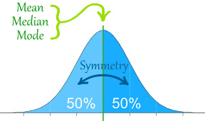

.. _graphical-representations:

=========================
Graphical Representations
=========================

In this section we study various ways of representing data graphically. 

.. _frequency-distributions:

Frequency Distributions
=======================

A *frequency distribution* is the foundation of most statistical graphs. In order to interpret graphs like histograms or pie charts, you must first understand what a *frequency distribution* represents.

A *frequency distribution* is a tabular summary (table) of a sample of data. It tells us how often each observation occurs. 

.. _ungrouped-frequency-distributions:

Ungrouped Distributions
-----------------------

The concept of an *ungrouped distribution* is intuitive and best seen by example.

Example
    Suppose you ask 10 people their favorite color and the following data set represents their answers,

    .. math:: 
        S = \{ r, b, g, g, r, r, y, o, r, b \}

    Where 

        *b* = response of "blue"

        *g* = response of "green"

        *o* = response of "orange"

        *r* = response of "red"

        *y* = response of "yellow "

    Describe the *distribution* of this sample with a an ungrouped frequency distribution.

.. important::

	In this example, the individual would be the person being surveyed, while the variable being observed is their favorite color. The variable in this instance is *categorical*.
	 
An *ungrouped frequency distribtion* is simply a table where each entry represents the :ref:`frequency` of every possible observation,

+-------------+------+
| :math:`x_i` | f(x) |
+=============+======+
| b           | 2    |
+-------------+------+
| g           | 2    |
+-------------+------+
| o           | 1    |
+-------------+------+
| r           | 4    |
+-------------+------+
| y           | 1    |
+-------------+------+

Notice the sum of the right hand column totals to the number of observations in the sample, :math:`n = 10`. We summarize this result below,

.. math:: 

    n = \sum_{x_i \in S} f(x_i)

Take note of the index in this sum. The :math:`x_i \in S` symbol can be read as "*for every* :math:`x_i` *in S*". This notation is used to take into account observations that may have the same value, as in this example where the observations ``b``, ``g`` and ``r`` occur multiple times. In other words, each term :math:`x_i` of the sum is a *unique value*. Its multiplicity derives from the frequency :math:`f(x_i)` by which it is multiplied.

Contrast this against the notation employed in the :ref:`sample mean formula <sample-mean-formula>`

.. math:: 

    \bar{x} = \frac{ \sum^n_{i=1} x_i }{n}

In the :ref:`sample_mean_formula <sample-mean-formula>`, the index is over the observation order, i.e. from :math:`i = 1, 2, 3 ..., n`. In this case, it may happen that :math:`x_i = x_j` for some :math:`i \neq j`. In other words, in the sample mean formula, it is possible for terms in the summation to *repeat*. 

.. _two-way-tables:

Two Way Tables
--------------

.. tip::

	This section includes a lot of terminology that will be covered in upcoming :ref:`probability` and :ref:`set-theory` sections.
	
Often times, you are observing more than one *categorical variable* on a single individual. If each observation in the sample has two *attributes* (*dimensions*, *properties*), we call such data *bivariate*. A *bivariate* data set is represent with a set of *ordered pairs* :math:`(x_i, y_i)`,

.. math::

	S = \{ (x_1, y_1), (x_2, y_2), ... , (x_n, y_n) \}
	

For example, suppose we asked a sample of people the following questions:

	Have you seen the *Empire Strikes Back*?
	
	Have you seen the *The Two Towers*?
	
We may represent their response to the first question as :math:`\text{yes}_{e}` and :math:`\text{no}_{e}`, i.e. "yes, I have seen the *Empire Strikes Back*" and "no, I have not seen the *Empire Strikes Back*". 

In a similar fashion, we may represent their response to the second question as :math:`\text{yes}_{t}` and :math:`\text{no}_{t}`, i.e. "yes, I have seen *The Two Towers*" and "no, I have not seen *The Two Towers*".

Suppose we sampled a group of ten people and asked them these questions. Then we might represent their responses with the following sample ``S``, where the *x* variable is their response to the first question and the *y* variable is their response to the second question,

.. math::

	S = { (\text{yes}_{e}, \text{yes}_{t}), (\text{no}_{e}, \text{yes}_{t}), (\text{no}_{e}, \text{yes}_{t}), (\text{yes}_{e}, \text{no}_{t}), (\text{yes}_{e}, \text{yes}_{t}), (\text{yes}_{e}, \text{no}_{t}),(\text{yes}_{e}, \text{no}_{t}),(\text{yes}_{e}, \text{yes}_{t}), (\text{no}_{e}, \text{no}_{t}), (\text{yes}_{e}, \text{no}_{t})}
	 	
	 	
Even with a small sample of *10*, this is a lot of information to process. A useful way to summarize this data into a more readable format is with a *two-way* table, 

+-------------------------+------------------------+-----------------------+
| outcomes                | :math:`\text{yes}_{e}` | :math:`\text{no}_{e}` |
+-------------------------+------------------------+-----------------------+
|  :math:`\text{yes}_{t}` |                        |                       |
+-------------------------+------------------------+-----------------------+
| :math:`\text{no}_{t}`   |                        |                       |
+-------------------------+------------------------+-----------------------+

The :ref:`intersection` of each row and column represents the simultaneous occurance of two *events*.

.. topic:: Intersection

	The intersection of two events **A** and **B** is denoted :math:`A \cap B`. 
	
	This can be read as "*A* **and** *B*". We will talk much more about :ref:`intersections <intersection>` in later sections.

There are four *events* here, but two of them are related to the others.
	
To see this, let us define **E** to be the event of seeing the *Empire Strikes Back* and **T** to be the event of seeing *The Two Towers*. 

The complement of event is its *negation*. 

.. topic:: Complement

	The complement of an event **A** is denoted :math:`A^c`
	
	This can be read as "**not** *A*". We will take more about :ref:`complements <complement>` in later sections.
	

If **E** is the event of seeing the *Empire Strikes Back*, then :math:`E^c` is the event of **not** seeing the *Empire Strikes Back*. We call :math:`E` and :math:`E^c` *complementary events*.

Similarly, if **T** is the event of seeing the *Two Towers*, then :math:`T^c` is the event of **not** seeing the *Two Towers*. We call :math:`T` and :math:`T^c` *complementary events*.

.. note::

	:math:`E` and :math:`E^c` *partition* the sample.
	
	:math:`T` and :math:`T^c` *partition* the sample.
	
	*Complementary events* are a type of *partition*.

We can compose the events and their complements with the *operation* of *intersection*,

.. topic:: Belonging

	The symbol :math:`\in` is the Greek letter *epsilon*. It represents the *relation of belonging*. We say *outcomes belong to events*.
	
.. admonition:: :math:`(\text{yes}_{e}, \text{yes}_{t}) \in E \cap T`

	The event of seeing both movies.
	
	In other words, seeing *Empire Strikes Back* **and** seeing *The Two Towers*.
	
.. admonition:: :math:`(\text{yes}_{e}, \text{no}_{t}) \in E \cap T^c`

	The event of seeing the *Empire Strikes Back* but not *The Two Towers*.
	
	In other words, seeing the *Empire Strikes Back* **and** not seeing the *Two Towers*.
	
.. admonition:: :math:`(\text{no}_{e}, \text{yes}_{t}) \in E^c \cap T`
	
	The event of not seeing the *Empire Strikes Back*, but seeing the *Two Towers*.
	
	In other words, not seeing the *Empire Strikes Back* **and** seeing the *Two Towers*.
	
.. admonition:: :math:`(\text{no}_{e}, \text{no}_{t}) \in E^c \cap T^c`

	The event of seeing neither movie.
	
	In other words, not seeing the *Empire Strikes Back* **and** not seeing the *Two Towers*. 
	

Notice, just like the pair of events :math:`E` and :math:`E^c` and the pair of events :math:`T` and :math:`T^c`, the four events

- :math:`E \cap T`
- :math:`E \cap T^c`
- :math:`E^c \cap T`
- :math:`E^c \cap T^c`

form a *partition of the sample*. By this, we mean all of these events aggregated together comprise the *entire* sample :math:`S`.

With these definitions in hand, we can think of the table being filled like so,

+-------------------------+------------------------+-----------------------+
|   events                | :math:`E`              | :math:`E^c`           |
+-------------------------+------------------------+-----------------------+
|  :math:`T`              | :math:`E \cap T`       | :math:`E^c \cap T`    |
+-------------------------+------------------------+-----------------------+
|       :math:`T^c`       | :math:`E \cap T^c`     | :math:`E^c \cap T^c`  |
+-------------------------+------------------------+-----------------------+

.. note:: 

	*Events* are composed of *outcomes*. Or, as we phrased it above, *outcomes* belong to *events*. *Outcomes* represent the *values* the observable variables assumes; *Events* represent ways of "*parsing*" or "*grouping*" the outcomes into abstractions, otherwise known as :ref:`sets <set-theory>`.
	
	In symbols,
	
	.. math::
	
		(\text{yes}_{t}, \text{yes}_{e}) \in E \cap T
		
	We read this as, 
		
		the outcome of :math:`\text{yes}_{t}` and :math:`\text{yes}_{e}` is *in* the event :math:`E \cap T`.
	
The *joint probability* (*percentage*) of two *events* occuring is given by :ref:`classical definition of probability<classical-definition-of-probability>`. For example, the percentage of people who have seen the *Empire Strkes Back* and the *Two Towers*,

.. math::

	P(E \cap T) = \frac{n(E \cap T)}{n(S)}
	
In this case, :math:`n(S)=10`. To find :math:`n(E \cap T)`, we count up all the *outcomes* that satisfy the condition of seeing both movines, or in symbols,

.. math::
	
	(\text{yes}_{t}, \text{yes}_{e}) \in E \cap T
	
And similarly for the rest of the events.
	
+-------------------------+------------------------+-----------------------+
| outcomes                | :math:`\text{yes}_{e}` | :math:`\text{no}_{e}` |
+-------------------------+------------------------+-----------------------+
|  :math:`\text{yes}_{t}` |           3            |          2            |
+-------------------------+------------------------+-----------------------+
| :math:`\text{no}_{t}`   |           4            |          1            |
+-------------------------+------------------------+-----------------------+

Therefore,

.. math::

	P(E \cap T) = \frac{3}{10} = 0.30
	

In plain English, "*30 percent of people in this sample have seen both movies*".
	
There are many things a table like this tells us. In the next few sections we will take a look at a few of the important facts it is telling us. 

As we study this table, keep in mind the following question,

.. admonition:: Think About It

	In what ways does this table add up to 100%?
	
Whenever we encounter something that sums to 100%, it is a fair guess it represents a type of *distribution*.

.. _joint-frequency-distribution:

Joint Frequency Distribution
****************************

The most obvious to make this table equal *100%* is through its *joint frequency distribution*. Each entry in the table must sum to the total number of observations,

.. math::

	n(E \cap T) + n(E \cap T^c) + n(E^c \cap T) + n(E^c \cap T^c) = n
	
Where :math:`n` is the total number. In this case, we have,

.. math::

	3 + 4 + 2 + 1 = 10
	
We may also express this in terms of *relative joint frequency*, by dividing through by the total number of observations, 10,

.. math::
	
	P(E \cap T) + P(E \cap T^c) + P(E^c \cap T) + P(E^c \cap T^c) = 1	
	

.. math::

	\frac{3}{10} + \frac{4}{10} + \frac{2}{10} + \frac{1}{10} = 1

Take note: each event, :math:`E \cap T`, :math:`E \cap T^c`, :math:`E^c \cap T` and :math:`E^c \cap T^c`, taken together divided the entire sample :math:`S` in groups that share no outcomes. In other words, each event is *mutually exclusive* with every other event. More than that, the events compass the *entire* sample space. 

We call events that divide the *entire* sample into mutually exclusive groups a *partition* of the sample. 

.. tip::

	Think of an *event* as a *group* of outcomes. Or, more precisely, a :ref:`set <set-theory>`.

.. important::

	Any time a set of events *partition* an *entire* sample into sets of *mutually exclusive* outcomes, then those events form a *distribution*. 

.. _marginal-frequency-distribution:

Marginal Frequency Distribution
*******************************

In the previous section, we observed both values of the categorical variable simultaneously. We may choose, for whatever reason, to ignore one of the variable. For example, if instead of asking every person in our example if they had seen the *Empire Strikes Back* **and** the *Two Towers*, we had only asked each individual the only first question, then we would have an ordinary frequency distribution. In others, ignoring the *y* variable, we can get the following distribution,

+---------------------------+---------------------------+
| :math:`\text{yes}_{e}`    |  :math:`\text{no}_{e}`    | 
+---------------------------+---------------------------+
|         7                 |            3              | 
+---------------------------+---------------------------+

Notice this row represents the sum of each column in the original *joint frequency* distribution. 

.. note:: 

    You can think of this distribution being attached to the bottom *margin* of the joint frequency distribution as a row of *totals*,

    +-------------------------+------------------------+-----------------------+
    | outcomes                | :math:`\text{yes}_{e}` | :math:`\text{no}_{e}` |
    +-------------------------+------------------------+-----------------------+
    |  :math:`\text{yes}_{t}` |           3            |          2            |
    +-------------------------+------------------------+-----------------------+
    | :math:`\text{no}_{t}`   |           4            |          1            |
    +-------------------------+------------------------+-----------------------+
    |     Totals              |         7              |            3          | 
    +-------------------------+------------------------+-----------------------+

Moreover, it must also total to *n*,

.. math::

	n(E) + n(E^c) = n 

This may also be expressed in terms of percentages as,

.. math::

	P(E) + P(E^c) = 1
	
Similarly, if we had restricted our attention to only the question of whether people in the sample had seen the *Two Towers*, we would have,

+---------------------------+---------+
|         x_i               |  f(x_i) |
+---------------------------+---------+
| :math:`\text{yes}_{t}`    |    5    | 
+---------------------------+---------+
| :math:`\text{no}_{t}`     |    5    | 
+---------------------------+---------+

Notice this column represents the sum of each row in the original *joint frequency* distribution. 

.. note::

    You can think of this table being attached to the right *margin* of the *joint frequency distribution* as a column of *totals*,

    +-------------------------+------------------------+-----------------------+-------+
    | outcomes                | :math:`\text{yes}_{e}` | :math:`\text{no}_{e}` | Total |
    +-------------------------+------------------------+-----------------------+-------+
    |  :math:`\text{yes}_{t}` |           3            |          2            |   5   |
    +-------------------------+------------------------+-----------------------+-------+
    | :math:`\text{no}_{t}`   |           4            |          1            |   5   |
    +-------------------------+------------------------+-----------------------+-------+

Morever, it must also total to *n*,

.. math::

	n(T) + n(T^c) = n
	
Or, expressed in terms of percentages,

.. math::

	P(T) + P(T^c) = 1
	
.. important::

	The equation,
	
	.. math::
	
		P(A) + P(A^c) = 1
		
	is known as the :ref:`law-of-complements`.
	
When one variable is ignored entirely, i.e. if only one variable is observed for each individual, the distribution formed by the *partition* is known as a *marginal frequency distribution*.

.. _conditional-frequency-distribution:

Conditional Frequency Distribution
**********************************

Yet another way to make this table equal *100%* is through its *conditional frequency distribution*. A *conditional frequency distribution* can be understood as the distribution of one variable *given the value of the other variable*. 

A more precise definition of a *conditional frequency* of :math:`x_i` given :math:`y_i` might go,

    The *conditional frequency* is proportion of times the outcomes :math:`x_i` **and** :math:`y_i` are observed simultaneously as compared to the number of times the outcome :math:`y_i` is observed alone. 

We can state this definition mathematically,

.. math::

    P(A | B) = \frac{n(A \cap B)}{n(B)}

Where **A** is defined as the event of the variable :math:`x_i` being observed to be a particular value and **B** is defined as the event of the variable :math:`y_i` being observed to be a particular value.

In other words, in the context of our example, where each variable may assume two values,

.. math::

    x = \text{yes}_e, \text{no}_e

.. math::

    y = \text{yes}_t, \text{no}_t

We have the following outcomes that belong to **E**, the event of seeing the *Empire Strikes Back*,

.. math::

    (\text{yes}_e, \text{yes}_t) \in E

.. math::

    (\text{yes}_e, \text{no}_t) \in E

And, likewise, we have the following outcomes that belong to **T**, the event of seeing the *Two Towers*,

.. math::

    (\text{yes}_e, \text{yes}_t) \in T

.. math::

    (\text{no}_e, \text{yes}_t) \in T

The *conditional distribution* of either variable with respect to the other can be understood as follows:

The *conditional distribution of people who have seen the Empire Strikes Back* answers the following question:

- What percent of the people who have seen *Empire Strikes Back* have seen the *Two Towers*?
- What percent of the people who have seen *Empire Strike Back* have *not* seen the *Two Towers*?

In other words, *given* a person has seen *Empire Strikes Back*, the conditional distribution will tell you what *percent* of the **reduced** sample has seen or not seen the *Two Towers*.

In this case, we are conditioning on the :math:`x` variable, the variable which measures whether or not someone has *Empire Strikes Back*. We may also *condition* on the :math:`y` variable, to get the *conditional distribution of people who have seen the Two Towers*. This distribution will answer the following questions,

- What percent of the people who have seen *Two Towers* have seen the *Empire Strikes Back*?
- What percent of the people who have seen *Two Towers* have *not* seen the *Empire Strikes Back*?

.. important::

    The questions:

    - What percent of the people who have seen *Empire Strikes Back* have seen the *Two Towers*?
    - What percent of the people who have seen *Two Towers* have seen the *Empire Strikes Back*?

    are not asking the same question. The difference is subtle, but huge!

In the first case, we are narrowing our attention down to *only* those people who have seen the *Empire Strikes Back* and asking what percent of them have seen the *Two Towers*. Therefore, to calculate the conditional frequency of *Two Towers* viewership given *Empire Strikes Back* viewership ,

.. math::

    P(T | E) = \frac{n(T \cap E)}{n(E)} = \frac{3}{7}

Whereas in the second case, we are narrowing our attention down to *only* those people who have seen *Two Towers* and asking what percent of them have seen the *Empire Strikes Back*. Therefore, to calculate the conditional frequency of *Empire Strikes Back* viewership given *Two Towers* viewership,

.. math::

    P(E | T) = \frac{n(T \cap E)}{n(T)} = \frac{3}{5}

In other words, a higher percentage of *Two Towers* viewers have also seen *Empire Strikes Back* than the percentage of *Empire Strikes Back* viewers who have also seen the *Two Towers*.

.. _grouped-frequency-distributions: 

Grouped Distributions
---------------------                                               

Up to this point, we have been dealing with *categorical* data. An *ungrouped* distribution is very easily extracted from *categorical* data. When we consider *quantitative* data, the situation becomes more complicated.

*Quantitative* data comes in two forms:

- Discrete
- Continuous

.. topic:: Discrete Data

	Discrete data are *countable*. 
	
	Examples
		- Number of passengers on a train
		- Number of goals scored in a soccer game
		- Number of defective batteries in a sample of 100.
                              
.. topic:: Continuous Data

	Continuous data are *uncountable*.
	
	Examples
		- Temperature on a summer day
		- Mass of a body
		- The charge of an electron

When the data are *discrete*, it *may* be possible to get by with an *ungrouped* distirbution, however *ungrouped* distributions can get cumbersome when the :ref:`range` of the data is very large. Consider a sample of data composed of the first 100 random natural numbers

.. math::

    S = \{ 97, 52, 93, ..., 10 \}

In this case, counting the frequency of each individual observation can quickly become tedious.

When the data are continuous, *ungrouped* distributions are no longer a tenable solution. For example, consider the following dataset which represents the eruption length and period between eruptions for the famous geyser `Old Faithful <https://en.wikipedia.org/wiki/Old_Faithful>`_ at Yellowstone National Park in Wymoing.

.. csv-table:: Old Faithful Eruption and Waiting Times
   :file: ../../_static/csv/datasets/previews/old_faithful_data_preview.csv

Attempting to create an ungrouped distribution of this data would be a futile effort. Therefore, the standard approach with datasets like this is to create an *grouped* frequency distribution.

Steps
*****

If you are given a sample of *n* data points :math:`S = \{ x_1, x_2, ... , x_n \}`, then the steps for finding a *grouped* frequency distribution are as follows,

1. Find the range of the data set. 

.. math::

    R = max(S) - min(S)

2. Choose a number of classes. Typically between 5  and 20, depending on the size and type of data.

3. Find the class width. Round up, if necessary.

.. math::
    
    w = \frac{R}{n}

.. note:: 

    Using the :ref:`ceiling-function` from a future section, we could simply write,

    .. math::

        w = \lceil \frac{R}{n} \rceil

    And the *rounding* would be implied. 

4. Find the lower and upper class limits **LL**:sub:`i` and **UL**:sub:`i`, for each *i* up to *n*, i.e. for each class, by adding multiples of the class width to the sample minimum.

.. math:: 
    
    LL_i = min(S) + (i-1) \cdot w

.. math::

    UL_i = min(S) + i \cdot w

.. math::
    
    i = 1, 2, ... , n

5. Sort the data set into classes and tally up the frequency of each class.

+-------------------------------+-------------------------------+
| Class Limits                  | f(x)                          |
+-------------------------------+-------------------------------+
| :math:`LL_1 \leq x < UL_1`    | :math:`f(LL_1 \leq x < UL_1)` |
+-------------------------------+-------------------------------+
| :math:`LL_2 \leq x < UL_2`    | :math:`f(LL_2 \leq x < UL_2)` |
+-------------------------------+-------------------------------+
| ...                           | ...                           |
+-------------------------------+-------------------------------+
| :math:`LL_n \leq x \leq UL_n` | :math:`f(LL_n \leq x < UL_n)` |
+-------------------------------+-------------------------------+

.. important:: 
    
    Note each class is inclusive, :math:`\leq`, with respect to the *lower limit*, while it is strictly exclusive, :math:`<`, with respect to the *upper limit*. This is so the classes are *mutually exclusive*, or to the say the same thing in a different way, a single observation cannot be assigned to two different classes; Every individual can belong to *only* one class.

    This applies to every class except the last, which must include the *upper limit*. Otherwise, the distribution would be missing a single value: the maximum value of the sample. 

Example 
    Suppose you measure the height of everyone in your class and get the following sample of data, where each observation in the data set is measured in feet,

    .. math::

        S = \{ 5.7, 5.8, 5.5, 5.7, 5.9, 6.3, 5.3, 5.5, 5.4, 5.3, 5.7, 5.9 \}

    Find the grouped frequency distribution for this sample of data using :math:`n = 5` classes.

First we find the sample range,

.. math:: 

    R = max(S) - min(S) = 6.3 - 5.3 = 1.0

We divide this interval into 5 sub-intervals, called *classes*,

.. math:: 

    w = \frac{1.0}{5} = 0.20

Then the lower class limits and upper class limits are found by adding successive multiples of the class width to the minimum value of the sample.

The limits of the first class are given by, 

.. math:: 

    LL_1 = 5.3 + 0 \cdot 0.20 = 5.3

.. math:: 

    UL_1 = 5.3 + 1 \cdot 0.20 = 5.5 

The limits of the second class are given by,

.. math:: 

    LL_2 = 5.3 + 1 \cdot 0.20 = 5.5 

.. math:: 

    UL_2 = 5.3 + 2 \cdot 0.2 = 5.7

The limits of the third class are given by,

.. math:: 

    LL_3 = 5.3 + 2 \cdot 0.20 = 5.7

.. math:: 

    UL_3 = 5.3 + 3 \cdot 0.2 = 5.9

The limits of fourth class are given by,

.. math:: 

    LL_4 = 5.3 + 3 \cdot 0.20 = 5.9

.. math:: 

    UL_4 = 5.3 + 4 \cdot 0.2 = 6.1

The limits of the fifth class are given by,

.. math:: 

    LL_5 = 5.3 + 4 \cdot 0.20 = 6.1

.. math:: 

    UL_5 = 5.3 + 5 \cdot 0.2 = 6.3

Using this limits, we can construct the table,

+-----------------------------+----------------+
| Class Limits                | :math:`f(x_i)` |
+-----------------------------+----------------+
| :math:`5.3 \leq x_i < 5.5`  | 3              |
+-----------------------------+----------------+
| :math:`5.5 \leq x < 5.7`    | 2              |
+-----------------------------+----------------+
| :math:`5.7 \leq x < 5.9`    | 4              |
+-----------------------------+----------------+
| :math:`5.9 \leq x < 6.1`    | 2              |
+-----------------------------+----------------+
| :math:`6.1 \leq x \leq 6.3` | 1              |
+-----------------------------+----------------+

.. tip:: 

    A quick check to verify the *grouped frequency distribution* has been constructed correctly is to sum the frequencies and ensure they total up to the number of samples.

    In this case, the total number of samples is 12 and,

    .. math::

        12 = 3 + 2 + 4 + 2 + 1

.. _histograms:

Histograms
==========

A *histogram* is a graphical representation of a :ref:`frequency distribution <frequency-distributions>`. The *classes* or *bins* are plotted on the *x-axis* against the frequency of each *class* on the *y-axis*.

.. plot:: _scripts/py/plots/histograms/histogram_random.py

The *width* of the bars is normalized so that the bars of the histogram meet. 

.. _histogram-variatians:

Variations
----------

A basic *histogram* can be modified to accomodate a variety of scenarios, depending on the specifics of the problem. In each case below, the sample's frequency distribution is used as the basis for constructing the graph.

.. _dot-plots:

Dot Plots
*********

Instead bars with differing heights, *dot plots* use *stacked dots* to represent the number of times each observation occurs, i.e. its frequency. 

Suppose a quiz with nine questions was administered to an A.P. Statistics course. The following sample represents the number of questions answered correctly by each student in this class,

.. math:: 
    
    S = \{ 3, 3, 4, 4, 4, 5, 5, 6, 6, 6, 6, 6, 6, 7, 7, 9 \}

Then the dot plot is constructed by drawing a number of dots above a point on the number line that corresponds to the *frequency* of that observation.

.. plot:: _scripts/py/plots/other/dot_plot.py

*Dot plots* are a quick and easy to represent a sample of data graphically. When in doubt, throw together a dot plot to see if it gives you any clues about the distribution.

.. _stem-leaf-plots:

Stem-Leaf Plots
***************

A *stem-leaf* plot is a type of histogram where the classes are determined by the leading digits of the observation values. 

For example, you measured the average annual rainfall in inches for Maryland over the course of 20 years and arrived at the following sample,

.. math:: 

    S = \{ 46 \text{ in}, 52 \text{ in},  33 \text{ in}, 42 \text{ in}, 43 \text{ in}, 51 \text{ in}, 31 \text{ in}, 27 \text{ in}, 49 \text{ in}, 47 \text{ in}, 37 \text{ in}, 50 \text{ in}, 42 \text{ in}, 46 \text{ in}, 61 \text{ in}, 37 \text{ in}, 46 \text{ in}, 47 \text{ in}, 51 \text{ in}, 33 \text{ in} \}

A *stem-and-leaf* plot is a *tabular summary* (table) where the first column, called the *stem* column, is the leading digits that occurs in the sample, in this case ``3``, ``4``, ``5`` and ``6``. The digits after the leading digit after tallied up and written in ascending order in the second column, called the *leaf* column,

+------+----------------------------+
| Stem |         Leaf               |
+------+----------------------------+
|   3  | 3, 3, 7,                   |
+------+----------------------------+
|   4  | 2, 2, 3, 6, 6, 6, 9, 7, 7  |
+------+----------------------------+
|   5  | 0, 1, 1, 2                 |
+------+----------------------------+
|   6  | 1,1                        |
+------+----------------------------+

*Stem-and-leaf* plots are convenient for finding the :ref:`mode` of a distribution; the :ref:`mode` is simply the observation with the most number of leaves, in this case, ``46`` inches.

.. _relative_frequency_plots:

Relative Frequency Plots
************************

*Relative frequency* histograms express the frequency of each class as a *percentage* of the total observations in the sample, 

.. math::
    r(x_i) = \frac{f(x_i)}{n}

Recall that the sum of frequencies is *n*,

.. math:: 

    n = \sum_{x_i \in S} f(x_i)

Therefore, the sum of *relative frequencies* is,

.. math::

    \sum_{x_i \in S} r(x_i) = \sum_{x_i \in S} \frac{f(x_i)}{n}

Since the sum does not depend on *n*, we can factor :math:`\frac{1}{n}` out of the denominator,

.. math::

     = \frac{1}{n} \cdot \sum_{x_i \in S} f(x_i)

Whence, we apply the *Frequency Equation* to get,

.. math::

    = \frac{1}{n} \cdot n = 1

In other words, the sum of *relative frequencies* is equal to 1, 

.. math::

    \sum_{x_i \in S} r(x_i) = 1

This intuitive result simply means the distribution must total to *100%*.

In other words, *relative frequency* histograms do not change the shape of the distribution; they scale (*normalize*) the distribution so that the sum of class frequencies is *100%*.

.. plot:: _scripts/py/plots/histograms/histogram_relative.py

Pie Charts
**********

*Pie charts* are a special type of relative frequency histogram. Since the relative frequencies sum to 1, we can represent the distribution as *one* circle and then express the proportion the distribtion that belongs to class by the proportion of area in a circular sector.

In other words, the size of each slice of the pie represents the relative frequency of that class. 

.. plot:: _scripts/py/plots/other/pie_chart.py

.. _distribution_shapes:

Distribution Shapes
-------------------

The shape of the histogram tells a story about the distribution of the sample. 

.. _uniform_shape:

Uniform
*******

A histogram where each class is approximately level with every other class is known as a *uniform* distribution. 

.. plot:: _scripts/py/plots/histograms/histogram_uniform.py

A *uniform distribution* tells us each class is *equally likely*. In other words, if we were to randomly select an individual from this sample, there is an equal chance the selected individual will come from each class. 

Example
    Find yourself a die and roll it 30 or so times, keeping track of each outcome. Once you have a large enough sample, create and graph a frequency distribution. The resulting display will approximate a *uniform* distribution.

Normal
******

A histogram where the classes are symmetric and decreasing around a common point is known as *normal*.

.. plot:: _scripts/py/plots/histograms/histogram_normal.py

The line of symmetry in a perfectly symmetrical distribution is the :ref:`median`. The reason for this can seen by equating the *area* under the distribution with the proportion of the sample that belongs to that area. Since the *areas* on either side of a symmetric distribution are equal,

It follows these areas both represent fifty percent of the distribution. 

A *normal distribution* tells us classes closer to the :ref:`median` are more likely to be observed.

Example
    :download:`Old Faithful Data Set <../../_static/csv/datasets/scientific/old_faithful_data.csv>`.

*Old Faithful* is a famous hot-water geyser in Yellowstone National Park that erupts every 45 minutes to 2 hours. 

.. image:: ../../_static/img/context/scientific/old-faithful.jpg
    :width: 200
    :align: center

The first column of this dataset represents the *length of an eruption in minutes* while the second column represents the *waiting time in minutes* until the next eruption.

.. note::

    We will construct the histogram for this dataset in class using **Python3** using the *length of an eruption in minutes*.

.. note:: 

    We will also look at this dataset again when we get to :ref:`correlation` and :ref:`scatter-plots`.
    
Bimodal
*******

A histogram where two classes are more frequent than the other classes in the distribution is known as *bimodal*.

.. plot:: _scripts/py/plots/histograms/histogram_bimodal.py

Example
    :download:`Pigeon Racing Speeds <../../_static/csv/datasets/cultural/pigeon_racing_times_data.csv>`.

Skewed
******

Definition
    A *skew* is a feature of sample where more data is *clustered* on one side of the sample than the other. We say such data are "*skewed*", or that it exhibits "*skewness*". 

A *skewed* distribution has *tails*, indicating the distribution is not symmetric (or, *asymmetric*). Individuals drawn from a *skewed* distribution are more likely to have extreme values. By "*extreme*" we mean values outside of the intervals where the majority of the distribution lies. 

**Skewed Right**

.. plot:: _scripts/py/plots/histograms/histogram_skewed_right.py

.. c
**Skewed Left**

.. plot:: _scripts/py/plots/histograms/histogram_skewed_left.py
    
.. _ogives:

Ogives
======

An *ogive* is a histogram of the *cumulative frequency*. The difference between *frequency* and *cumulative frequency* is slight, but potent.

Frequency
    :math:`f(x_i)`

    The number of times an observation :math:`x_i` occurs in a sample.

Cumulative Frequency
    :math:`F(x_i)`

    The number of times an observation *less than or equal to* :math:`x_i` occurs in a sample.

Notice, by definition,

.. math::

    F(x_i) = \sum^{i}_{j = 1} f(x_j)

.. warning::

    Be mindful of the *indices* in the summation. This summation says "*add up all the frequencies up to a certain observation* :math:`x_i`".

In order to construct an *ogive* or a *cumulative frequency histogram*, we first have to find the *cumulative frequency distribution*.

Recall the *frequency distribution* created in the :ref:`ungrouped-frequency-distributions` section. The *cumulative frequency* of this distribution can be found by adding another column :math:`F(x_i)` that sums up the the individual frequencies of all the classes up to that class,

+-----------------------------+----------------+------------------------+
| Class Limits                | :math:`f(x_i)` | :math:`F(x_i)`         |
+-----------------------------+----------------+------------------------+
| :math:`5.3 \leq  x_i < 5.5` | 3              | 3                      |
+-----------------------------+----------------+------------------------+
| :math:`5.5 \leq x < 5.7`    | 2              | 5 = 2 + 3              |
+-----------------------------+----------------+------------------------+
| :math:`5.7 \leq x < 5.9`    | 4              | 9 = 4 + 2 + 3          |
+-----------------------------+----------------+------------------------+
| :math:`5.9 \leq x < 6.1`    | 2              | 11 = 2 + 4 + 2 + 3     |
+-----------------------------+----------------+------------------------+
| :math:`6.1 \leq x \leq 6.3` | 1              | 12 = 1 + 2 + 4 + 2 + 3 |
+-----------------------------+----------------+------------------------+

.. plot:: _scripts/py/plots/histograms/histogram_and_ogive.py

Distribution Shapes
-------------------

All *cumulative frequency histograms* (*ogives*) are *monotonic*. A *monotonic* functions is *non-decreasing*. Another way of saying *non-decreasing* is to say "*always increases or stays the same*". The reason for this should be clear: we are always adding quantities to the cumulative frequency as :math:`x_i` increases. The *cumulative frequency* never *decreases*. 

Thus, it can sometimes be difficult to discern any features of the distribution from the cumulative frequency histogram. Nevertheless, closer inspection reveals a few things we can infer.

Uniform
*******

.. plot:: _scripts/py/plots/ogives/ogive_uniform.py

.. note::

    Notice each step in the ogive increase by roughly the same amount. This is because frequencies in a uniform distribution are roughly equal.

Normal
******

.. plot:: _scripts/py/plots/ogives/ogive_normal.py

.. note::

    Notice the steps in the graph increase in size up to the center and then decrease in size until the ogive levels off. This is because normal distributions are centered around the mean and drop off in frequency as distance from the mean increases. 

Bimodal
*******

.. plot:: _scripts/py/plots/ogives/ogive_bimodal.py

.. note::
    
    Notice there are two steps in the graph larger than the rest, due to the large frequencies of the modes in a bimodal distribution.

Skewed
******

Skewed Right
    .. plot:: _scripts/py/plots/ogives/ogive_skewed_right.py

Skewed Left
    .. plot:: _scripts/py/plots/ogives/ogive_skewed_left.py

Variations
----------

Stacked Bar Chart
*****************

A *stacked bar chart* is a type of *ogive* that is used specifically for *categorical data*. In particular, it is meant to visualize the :ref:`conditional-frequency-distribution` of one categorical variable with respect to all the other values of the other categorical variable.

With a *stacked bar chart*, the sample is broken up into non-overlapping (:ref:`mutual exclusive <mutual-exclusion>`) groups. The *conditional distribution* of each group is plotted as a vertical bar that totals to 100%,

.. plot:: _scripts/py/plots/other/stacked_bar_chart.py

Each bar of the graph is *conditioned* on one variable. In this example, the *condition* is the event of a red object or a blue object. *Given* a blue object has been selected from the groups on the horizontal axis, the *conditional distribution* of shape (i.e., duck or ball) is plotted on the vertical axis.

In this example, the *red* group is broken down into a distribution of *ducks* and *balls* according to the formulae,

.. math::

	P( \text{Duck} \mid \text{Red}) = \frac{n( \text{Duck and Red} ) }{n( \text{Red})}

.. math::

	P( \text{Ball} \mid \text{Red}) = \frac{n( \text{Ball and Red} ) }{n( \text{Red})}
	
Where as the *blue* group is broken down into a distribution of *ducks* and *balls* according to the formulae,

.. math::

	P( \text{Duck} \mid \text{Blue}) = \frac{n( \text{Duck and Blue} ) }{n( \text{Blue})}

.. math::

	P( \text{Ball} \mid \text{Blue}) = \frac{n( \text{Ball and Blue} ) }{n( \text{Blue})}
	
.. _boxplots: 

Boxplots
========

While :ref:`histograms` and :ref:`ogives` provide a wealth of information about the sample distribution, they do not give us the whole picture. A *boxplot* can help fill in the blind spots, providing deeper insight in the nature of the distribution you are analyzing.

.. _boxplot-construction:

Construction
------------

Every *boxplot* requires five numbers. It may surprise you to find out (but probably not) these numbers are referred to as a *Five Number Summary*.

.. _five-number-summary:

Five Number Summary
*******************

To construct a boxplot, you must find the following:

1. Find the maximum observation.
2. Find the 75 :sup:`th` percentile (*third quartile*)
3. Find the 50 :sup:`th` percentile (*median*)
4. Find the 25 :sup:`th` percentile (*first quartile*)
5. Find the minimum observation.

.. note::

    These terms (minimum, percentile and maximum) are defined in the :ref:`point-estimation` section.
    
The middle three numbers, i.e. the third quartile, the median and the first quartile, form the *box* of the *boxplot*. The numbers on the ends, i.e. the maximum and minimum, are sometimes known as the *whiskers*. 

By definition, the *box* of the *boxplot* will show you where 50% of the distribution is centered. In other words, between the third quartile and the first quartile, you will find 50% of all observations in a sample.
 
.. _distribution-shapes:

Distribution Shapes
-------------------

A boxplot provides another window into a distribution by revealing the characteristic features of important distribution *shapes*.

The comparative lengths of the boxplot *whiskers* show us in what direction the distribution is being pulled by :ref:`outliers`.

For this last reason, *boxplots* are often useful graphical tools for quickly identifying *outliers*. We will talk more about how to use *boxplots* to identify outlying observations when we get to the :ref:`interquartile-range` descriptive statistic in the next section.

For now, we present various boxplots in order to exhibit how the distribution shape is manifested in the relative lengths of the whisker.

Normal
******

.. plot:: _scripts/py/plots/boxplots/boxplot_normal.py

A *normal* boxplot has a *box* that sits evenly between its *whiskers*. The length of the left *whisker* is roughly equal to the length of the right *whisker*. There are no *outlying observations* to skew the whiskers. 

Notice the red line that represents the *median* is roughly centered within the *box*.

Skewed
******

**Skewed Right**

.. plot:: _scripts/py/plots/boxplots/boxplot_skewed_right.py

A *skewed right* boxplot has a *box* with lopsided *whiskers*. Its right *whisker* is pulled in the direction of the skew, i.e. towards the right. The presence of outlying observations on the right causes the distribution to *stretch* towards them. 

Notice the red line that represents the median sits close to the left side of the *box*, where the majority of the distribution lies. 

**Skewed Left**

.. plot:: _scripts/py/plots/boxplots/boxplot_skewed_left.py

A skewed left boxplot has a *box* with lopsided *whiskers*. Its left *whisker* is pulled in the direction of the skew, i.e towards the left. The presence of outlying observations on the left causes the distribution to *stretch* towards them.

Notice the red line that represents the median sits close to the right side of the *box*, where the majority of the distribution lies.
