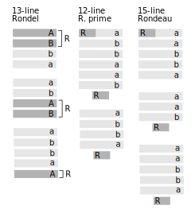

.. NOTE: 
    The following document was generated with Sphinx using the following LaTeX preamble in the ```conf.py```
    
        latex_preamble = r"""
        \usepackage{babel}
        \babelprovide[import, main]{coptic} 
        \usepackage{amssymb}
        \usepackage{amsmath}
        \usepackage[utf8]{inputenc} 
        \usepackage{lmodern}
        \usepackage{textcomp}
        """

.. _syntagmics:

==========
Syntagmics
==========
.. _syntagmics-introduction:

Section I: Introduction
=======================

.. epigraph::

    | When Ajax strives, some Rock's vast Weight to throw,
    | The Line too labours, and the Words move slow:

    -- `Essay on Man`_, Alexander Pope

.. _syntagmics-prior-definitions:

-----------------
Prior Definitions
-----------------

Given below are existing definitions of poetical devices. 

.. topic:: Definition: Feet
    
    - Iamb: One unstressed syllable followed by a stressed syllable.
    - Spondee: A stressed syllable followed by a stressed syllable. Employed to slow down the pace of a line.
    - Dactyl: A stressed syllable followed by two unstressed syllables. Employed to create a sense of falling or release.
    - Trochee: A stressed syllable folowed by an unstressed syllable. Employed to emphasize urgency or directness.
    - Anapest: Two unstressed syllables followed by a stressed syllable. Employed to create a sense of building momentum.
    - Pyrrchic: Two unstressed syllables. 
    - Amphibrach: An unstressed syllable followed by a stressed syllable and then another unstressed syllable.
    - Bacchius: An unstressed syllable followed by two stressed syllables. 
    - Antibacchius: Two stressed syllables followed by an unstressed syllable.

.. topic:: Definition: Lines

    - Dimeter: A line with two feet.
    - Trimeter: A line with three feet.
    - Tetrameter: A line with four feet.
    - Pentameter: A line with five feet.
    - Hexmeter: A line with six feet.
    - Heptameter: A line with seven feet.
    - Octameter: A line with eight feet. 
    - Hendecasyllable: A line consisting of eleven syllables. 

.. topic:: Definitions: Stanzas

    - Couplet: A stanza with two lines.
    - Tercet: A stanza with three lines
    - Quatrain: A stanza with four lines
    - Cinquain: A stanza with five lines
    - Sestet: A stanza with six lines.
    - Septet: A stanza with seven lines.
    - Octet: A stanza with eight lines.
    - Nonet: A stanza with nine lines.
    - Decastich: A stanza with ten lines.
    - Envoi: A short, concluding stanza.

.. _syntagmics-formalization:

-------------
Formalization
-------------

The syntagmic hierarchy, in descending order, is given by, 

1. Poems
2. Stanzas
3. Lines 
4. Words
5. Syllables

Each layer is composed of elements from the layer beneath it joined together through operations (to be defined shortly). 

In this formalization, English letters will be used to represent lines, Greek letters will be used to represent words and Coptic letters will be used to represent syllables. 

.. note::

    All symbolic terms will be typeset differently to distinguish them from the level of analysis and definition, and to indicate their nature as "*sentences*" in the language of syntagmics. 

.. _syntagmics-constants:

Constants
---------

1. Uppercase English letters (:math:`A, B, C, ...` ): Fixed lines.
    a. The uppercase English letter :math:`S` is reserved for sets.
2. Uppercase Greek letters (:math:`\mathrm{A}, \mathrm{B}, \Gamma, ...`): Fixed words.
3. Uppercase Coptic letters (:math:`Ⲁ, Ⲃ, Ⲅ, ...`): Fixed syllables.
4. The lowercase English letter n is reserved for natural numbers.
5. The lowercase Fraktur letter :math:`\mathfrak{i}` is reserved for iambs.
6. The lowercase Fraktur letter :math:`\mathfrak{t}` is reserved for trochees.
7. The lowercase Fraktur letter :math:`\mathfrak{s}` is reserved for spondees. 
8. The lowercase Fraktur letter :math:`\mathfrak{a}` is reserved for anapests.
9.  The lowercase Fraktur letter :math:`\mathfrak{d}` is reserved for dactyls.
10. The empty set :math:`\varnothing` is reserved for the pause (caesura). 
11. The ampersand :math:`\text{&}` represents blank newlines. 

.. _syntagmics-variables:

Variables
---------

1. Lowercase English letters (:math:`a, b, c, ...` ): Indeterminate rhymed lines.
    a. The lowercase English letters :math:`u, v, w` are reserved for indeterminate lines, not necessarily rhymed. 
    b. The lowercase English letters :math:`x, y, z` are reserved for general syntagmic variables (syllables, words, lines, stanzas and poems)
2. The lowercase Greek letters (:math:`\alpha, \beta, \gamma`): Indeterminate rhymed words.
    a. The lowercase Greek letter :math:`\kappa, \lambda, \mu` are reserved for indetermine words, not necessarily rhymed.
3. The Coptic letters :math:`ⲣ, ⲡ, Ⲡ` are reserved for indeterminate syllables. Subscripts are often used with syllabic variables to denote different syllables. 
4. The lowercase Fraktur letter :math:`\mathfrak{x}` is reserved for indeterminate meters.
5. The lowercase Greek letter :math:`\varsigma` is reserved for indeterminate stanzas.
6. The lowercase English letters :math:`p` and :math:`q` are reserved for indeterminate poems. 

.. important::

    Upper English letters are meant to denote particular lines, whereas lowercase English letters are meant to denote indeterminate lines that are related through their rhyme scheme. 

.. note::

    The choice of :math:`ⲡ` and :math:`Ⲡ` to represent syllables mirrors the unstressed and stressed syllables of verses. In other words, :math:`ⲡ` is meant to represent indeterminate unstressed syllables, whereas :math:`Ⲡ` is meant to represent indeterminate stressed syllables. :math:`ⲣ` is used in a more general capacity, to represent stressed or unstressed syllables.

The variables will sometimes be referred to as *syntagmic variables*, or *signs*. 

Uppercase-lowercase pairs of English letters are understood to be rhymes. The difference in the symbolism is the *fixed* nature of the denotation. For example, the sign :math:`A.a.a.A` denotes one fixed line, a rhyming couplet and then the fixed line again,

    | The cat on the mat
    | Got large and fat
    | So-and-so such that 
    | The cat on the mat

Note that both :math:`A` and both instances of :math:`a` rhyme in this example. The rhyme structure of a composite sign is encoded through the case of constants and variables. In other words, preemptively using the notation from the next :ref:`section <syntagmics-relations>`, :math:`A \parallel a`, :math:`B \parallel b`, etc.

The intent behind defining :math:`p` and :math:`q` as "*poetic*" variables is to formalize the schema of a certain fixed poetic forms through operations performed on line, word and syllabic variables and constants. "*Poetic*" variables can be seen as the well-formed formulae that emerge through the calculus that governs the lower levels of the syntagmic hierarchy.

.. _syntagmics-relations:

Relations
---------

All syntagmic relations are to be understood as truth values, meaning each expression results in a judgement of truth or falsity. 

1. :math:`y \subset_p x` (**Containment**): The sign y is contained in the sign x. 

.. important::

    The subscript *p* is used to differentiate containment from the set relation of "*subset*".

The relation of "contains" extends up the levels of the syntagmic hierarchy, capturing each successive level under its umbrella as it moves up each rung of the ladder,
 
- Words contain syllables
- Lines contain words and syllables
- Stanzas contain lines, words and syllables
 
Consider the line from `Spring and Fall`_ by Gerard Manley Hopkins, 

.. math::

    x = \text{Though worlds of wanwood leafmeal lie}

Then for each word :math:`\lambda` in :math:`\{ \text{Though}, \text{worlds}, ..., \text{lie} \}`,

.. math::

    \lambda \subset_p x

Similarly, for each syllable :math:`\rho` in :math:`\{ \text{Though}, ... \text{wan}, \text{wood}, ... \text{lie} \}`,

.. math::

    \rho \subset_p x

2. :math:`x \parallel y` (**Rhymation**): The sign x rhymes with the sign y. 

The relation of "*rhymes with*", or *rhymation*, is defined more precisely in :ref:`syntagmics-rhymation` section.

.. _syntagmics-operations:

Operations
----------

This section introduces the primitive operations of *syntagimcs*. 

.. important::

    These are the verbs of the system. They are used to express syntagmic proposition *within the system*.

In other words, all operations defined in this section are to be understood as *object* level constructs, in contradistinction to :ref:`relations <syntagmics-relations>` like containment or rhymation which are predicated of objects and yield judgements as a result. All syntagmic operations are to be understood as being closed under the domain of signs, meaning each operation will always yield a sign as a result.

1. :math:`x.y` (**Succession**): Successive signs.
2. :math:`xy` (**Concatenation**): Concatenated signs.
3. :math:`x:y` (**Disjunction**): A sign that is either x or y.
4. :math:`x + y` (**Separation**): Separated signs.
5. :math:`x \circ y` (**Projection**) : Sign containing another sign. 
6. :math:`x(y)` (**Appendment**): A sign ending in another sign.  
7. :math:`(y)x` (**Prependment**): A sign beginning with another sign 
8. :math:`x \circ y \,|\, y = z` (**Substitution**): Substitute :math:`z` for :math:`y` in the sign :math:`x`, where :math:`x` contains :math:`y`, :math:`y \subset_p x`.

Brackets, :math:`[]`, are used to group operations within signs by precedence.

.. TODO 
    Substitution needs to be clarified with respect to how it operates with brackets. Currently, the meaning of a.[b+c] would be equivalent to a.b + c, meaning succession doesn't distribute. This isn't necessarily a problem, but it should be commented on and discussed. There is ambiguity here.

Separation vs. Succession 
^^^^^^^^^^^^^^^^^^^^^^^^^

To see what is meant by the distinction between *separation* and *succession*, let :math:`x = \text{the fish in the dish}` and :math:`y = \text{the dog on a jog}`. Then :math:`x.y` means,

    | the fish in the dish
    | the dog on a jog

Where as :math:`x + y` means,

    | the fish in the dish
    | 
    | the dog on a jog

From this, it can be see the operation of *successions* inserts a new line at the end of first line, whereas the operation of *separation* inserts a new line after the first line *and* before the second line, to create a blank line between them. In effect, the operation of *separation* creates stanzas, whereas the operation of *succession* creates lines within stanzas. 

Projection
^^^^^^^^^^

It is important to clarify that projection is a *sign*. It is an object *within* the syntagmic system (or more specifically, an operation which yields an object). It serves a semantic function within the system. This differents from the metalogical nature of *containment*, which is an expression *about* the system, i.e. a truth value.

.. important::

    The operation of *projection* is a sign. The relation of *containment* is a truth value.

To state "*y projects x*", or symbolically,

.. math::

    x = x \circ y

Can be seen as a form of "*poetic factorization*", akin to an arithmetic relation :math:`9 = 3 \cdot 3`, where one sign is identified as a constituent (or *factor*) of another. The :math:`y` in :math:`x \circ y` will sometimes be referred to as a *factor* of :math:`x`. 

The operation of projection is not commutative,

.. math::

    x \circ y \neq y \circ x 

The sign on the lefthand side :math:`x` of a projection :math:`x \circ y` is the "*larger*" sign that contains the "*smaller*" sign :math:`y` on the righthand side. In other words, logically, if :math:`x` contains :math:`y`,

.. math::
    
    [y \subset_p x] \implies [x \circ y = x]

However, if :math:`x` does not contain :math:`y`, then :math:`x \circ y` is defined to be a caesura, :math:`\varnothing`, i.e. the absence of a syntagmic variable. 

.. math::

    [\neg y \subset_p x] \implies [x \circ y = \varnothing]

For this reason, :math:`x \circ y` can be thought of an indicator variable that returns the first operand if it contains the second operand, and nothing if the first operand does not contain the second operand. 

.. math::

    [[y \subset_p x] \implies [x = x \circ y]] \lor [x \circ y = \varnothing]

In fact, the prior expression can be seen as the *logical definition* of a *factor*. To be more precise, a factor :math:`y` of a fixed :math:`x` is defined as any syntagmic sign that satsifies the open formula given above. 

Projection is logically related to appendment and prependment. Note :math:`y = \text{cat}` prepends :math:`x = \text{cat on a mat}`, where as :math:`z = \text{mat}` appends :math:`x`. Both :math:`z` and :math:`y` project :math:`x`, as well,

.. math::

    x = x \circ y

.. math::

    x = x \circ z

In other words, if a sign prepends or appends another sign, it also projects that sign. Taking the previous two equations and substituting the first into the second, 

.. math::

    x = [x \circ y] \circ z

The brackets are dropped for notationally convenience and it is understood a projection is to be applied starting with the leftmost sign (:math:`y`) and moving right to the next projection operand (:math:`z`).

.. math::

    x = x \circ y \circ z

Importantly, projection does not imply prependment or appendment. For example :math:`t = \text{on}` projects :math:`x`, but it does not prepend or append it. In other words, appendment, prependment and projection are logically related as follows,

.. math::

    x(y) \implies [x \circ y]

And,

.. math::

    (y)x \implies [x \circ y]

Or more succinctly,

.. math::

    [x(y) \lor (y)x] \implies (x \circ y)


.. important::
    
    The converse of this does not hold. 

The "zero" property of projection is given by noting that caesuras cannot contain anything but themselves,

.. math::

    [\varnothing \cdot y] = \varnothing

Which aligns with the definition. In addition, the operation of projection is *idempotent*,

.. math::

    [x \circ y] \circ y = x \circ y

The inner term, :math:`x \circ y` is guaranteed to be a sign that is either empty or contains :math:`y`. If it is empty (caesura), then, as noted, projecting it any number times will always result in a caesura. If it contains :math:`y`, then it will return the very sign that contains :math:`y`, ensuring :math:`[x \cdot y]` is well defined.

**Provisional Notation**

1. #x: A lengthened sign. 
2. ♭x: A shortened sign.  

Virelais require alternating rhymes to shorten and length across stanzas. The signs "#x" and "♭x" are here provisionally offered as a symbolic way of capturing this form. However, further research needs to be done on the exact syntactical rules of these signs. 

.. _syntagmics-shorthand:

Shorthand
---------

Shorthand notation is introduced in this section to extend the primitive operations defined in the previous seciton.

1. **Summation**: The connotation of the :math:`+` symbol is leveraged to extend the symbolism to the :math:`\sum` symbol. Consider,

.. math::

    \sum_1^{n} {a_i}{b_i}{a_i} = a_1.b_1.a_1 + a_2.b_2.a_2 + ... a_n.b_n.a_n 

This example shows how to represent a poem of arbitrary length composed of tercet stanzas where the first and third lines rhyme. 

2. **Serialization**: A *serialization* (serialized concatenation) is used in reference to syllables. It simply means the concatenation of a patterned sequence of syllables. Consider,

.. math::

    \prod_{i=1}^{n} {ⲡ_i}{Ⲡ_i} = {ⲡ_i}{Ⲡ_i}{ⲡ_i}{Ⲡ_i} ... {ⲡ_n}{Ⲡ_n}

This example shows how to represent a line of iambic meter, i.e. sequences of unstressed and then stressed syllables. 

3. **Exponentiation**: An exponent is used as shorthand for excessive succession of rhymes. For example, consider the lines, 

    | the ball in the bag
    | the rip in the rag
    | the gig in the gag 
    | 
    | some dittery dots
    | some jittery jots
    | these simmering sots. 

This can be represented using the operation of *succession* and the operation of *separation* with the expression, 

.. math::

    p = a.a.a + b.b.b

*Exponentation* is used to denote iterated *succession*. The exponent of a line denotes the numbers of times the rhyme appears. The current example can be expressed,

.. math::

    p = a^3 + b^3

.. _syntagmics-scope:

Scope
-----

The *scope* of a rhyme is denoted with a bar. Any line variable of the same character that feels under the scope of a bar rhymes, whereas the same variable used outside of the scope of the bar is not required to rhyme with the variable under the bar. An example will help clear this up. Consider the differences that separate the two poetical propositions, :math:`p` and :math:`q`,

.. math::

   p = \overline{a.b.a} + \overline{a.b.a}

.. math::

   q = \overline{a.b.a + a.b.a}

In the case of *p*, the line variable *a* in the first stanza is not required to rhyme with the line variable *a* in the second stanza. In the case of *q*, the line variable *a* in both the first and second stanza must rhyme. For example, the following values of *p* and *q* satisfy these definitions. For *p*,

    | the dog is brown 
    | the cat is green.
    | the fish does drown. 
    |
    | the dog is blue. 
    | the cat is red. 
    | the fish eats you. 

Whereas for *q*,

    | the dog is brown 
    | the cat is green 
    | the fish does drown
    |
    | the dog does frown.
    | the cat is mean. 
    | the fish gets down. 

If the bar is omitted from a sign, it is implied to extend over the entire proposition.

Examples
--------

**Primitive Operations**

:math:`a.b.a`
    A tercet where the first and third lines rhyme. 

:math:`A.b.A` 
    A tercet where the first and third lines are the same. 

:math:`a.b.a + a.b.a` 
    Two rhyming tercets.

:math:`a.b.[b:a]`
    A tercet where the last line rhymes with either the first line or the second line.

**Examples**

To make clear how shorthand can be leveraged to concisely represent a poetic scheme, some examples are given below.


1. Consider the following poem,

    | pippity pop
    | slippity slop
    |
    | yippity yap
    | kippity cap 

This expression can be represented using primitive operations as,

.. math::
    
    p = a.a + b.b

Using :ref:`exponentiation <syntagmics-shorthand>`,

.. math::

    p = a^2 + b^2

Keeping in mind the definition of :ref:`syntagmics-scope` and applying a :ref:`summation <syntagmics-shorthand>`, this can be further reduced,

.. math::

    p = \sum_1^2 \overline{a^2}

In general, an arbitrary number of rhyming couplets can be represented,

.. math::

    p = \sum_1^n \overline{a^2}

.. _syntagmics-meter:

Meter
-----

:math:`\mathfrak{i} = ⲡⲠ`
    The definition of an **iamb**

:math:`\mathfrak{t} = Ⲡⲡ`
    The definition of a **trochee**

:math:`\mathfrak{s} = ⲠⲠ`
    The definition of a **spondee**

:math:`\mathfrak{d} = Ⲡⲡⲡ`
    The definition of **dactyl**

:math:`\mathfrak{a} = ⲡⲡⲠ`
    The definition of a **anapest**

.. topic:: Definition: Meters

    :math:`a/\mathfrak{x}_n` denotes a line in :math:`\mathfrak{x}` n-meter. 

For example, 

.. math::

    (a/\mathfrak{i}_4).(b/\mathfrak{i}_3).(a/\mathfrak{i}_4)

Refers to a tercet where the first and third line are written in iambic tetrameter, whereas the second line is written in iambic trimeter. In other words,

.. math::

    (a/\mathfrak{i}_4) = {\pi_1}{\Pi_1}{\pi_2}{\Pi_2}{\pi_3}{\Pi_3}{\pi_4}{\Pi_4}

Note in this example the first and third line rhyme. 

The scope of a meter extends to everything contained in the parenthesis it marks. For example,

.. math::

    (a.a/\mathfrak{i}_4)

Denotes a rhyming couplet where each line is written in iambic tetrameter. 

.. _syntagmics-rhymation:

Rhymation
---------

Ending Stress
^^^^^^^^^^^^^

In order to express the different categories of rhymes that may be used to aggregates lines into a scheme, notation is introduced to *accent* a sign to indicate its ending stress. 

If a sign has no accent mark, then any type of stress satisfies the sign.

.. note::

    Stress accents can affix both lines :math:`u` and words :math:`\lambda`. They do *not* operate on syllables. 

The accented sign will be referred to as a *rhyme particle*. For instance, :math:`\hat{x}` (to be defined immediately) is a *rhyme particle*. In and of itself, it does not denote a rhyme. It is only in the context of a poetical proposition that it can be said to bear the meaning of a "*rhyme*". By writing :math:`\hat{x}`, all that has been stated is the syllabic form of the sign. In effect, the hat encodes the syllabic form and the vartiable encodes the rhyme scheme. 

1. Masculine Stress

A masculine rhyme occurs when the final syllable in two words is stressed and identical phonetically. For example, the following pairs of words are masculine rhymes, 

- cat, hat
- bright, light
- despair, compare

A hat is used to denote a masculine ending stress,

.. math::

    \hat{x} = x(Ⲡ)

2. Feminine Stress
   
A feminine rhyme occurs when the final syllable in two words is unstressed, and the last two syllables are identical phonetically. For example, the following pairs of words are feminine rhymes,
   
- mother, another
- flowing, going

A check is used to denote a feminine ending stress,

.. math::

    \check{x} = x(Ⲡⲡ)

3. Dactylic Stress

A dactylic rhyme occurs when two words ends in identical dactyls. For example, the following pairs of words are dactylic rhymes, 

- happily, snappily
- tenderness, slenderness

A dot is used to denote a dactylic ending stress, 

.. math::

    \dot{x} = x(Ⲡ{ⲡ_1}{ⲡ_2})

4. Off Stress

An off rhyme involves imperfect sound correspondence (assonance, consonance, etc.). For example, the following pairs are off rhymes, 

- bottle, fiddle (syllabic rhyme)
- hammer, carpenter (weak rhyme)

A tilde is used to denote an off stress, 

.. math::

    \tilde{x} = [ ... ]

Where "..." represents as yet undetermined operation.

.. note:: 

    Because off-rhymes do not (yet) have a syllabic representation, they are only used *within* poetical proposition to denote a rhyme. Writing :math:`\tilde{x}` has no meaning outside of the poetical proposition, unlike the other forms of rhymes which represent definite syllabic configurations of ending stress. 

**Shorthand**

To avoid unnecessary complexity, the following notations are defined. In the case of masculine rhyme particles,

.. math::

    \hat{x.y} = \hat{x}.\hat{y} 

.. math::

    \hat{x + y} = \hat{x} + \hat{y}

.. math::

    \hat{x:y} = \hat{x}:\hat{y}

Similarly for the other types of rhyme particles. 

Logical Structure
^^^^^^^^^^^^^^^^^

Now that notation has been introduced to formalize rhyme structure in a poem, the relation of *rhymation* can be clarified. Rhymation is meant to explicate the relation of "*perfect rhymes*" within the formal system being developing.

It should first be noted, by :ref:`definition <syntagmics-variables>`, that all signs rhyme with themselves,

.. math::

    x \parallel x

Furthermore, if an arbitary sign :math:`x` rhymes with the sign :math:`y`, then :math:`y` rhymes with :math:`x`, and visa versa,

.. math::

    x \parallel y \equiv y \parallel x

If two arbitrary signs :math:`x` and :math:`y` end in the same masculine particle, :math:`z`, then they rhyme,

.. math::

    [x(\hat{z}) \land y(\hat{z})] \implies x \parallel y

If two arbitrary signs :math:`x` and :math:`y` end in the same feminine particle, :math:`z`, then they rhyme,

.. math::

    [x(\check{z}) \land y(\check{z})] \implies x \parallel y

If two arbitary signs end in the same dactylic particle, then they rhyme, 

.. math::

    [x(\dot{z}) \land y(\dot{z})] \implies x \parallel y

However, off-rhymes do *not* imply the relation of *rhymation*.

If the secondary relations are defined, 

- :math:`\vdash`, Masculine Rhyme: :math:`x \prec y \equiv [x(\hat{\lambda}) \land y(\hat{\lambda})]`
- :math:`\Vdash`, Feminie Rhyme: :math:`x \Vdash y \equiv [\exists z: [x(\check{z) \land y(\check{z})]]`
- :math:`\Vvdash`, Dactylic Rhyme: :math:`x \Vvdash y \equiv  [x(\dot{\lambda}) \land y(\dot{\lambda})]`

Then, the relation of *rhymation* can be defined precisely as, 

.. math::

    x \parallel y \equiv [x [ \vdash \lor \Vdash  \lor \vVdash ] y]

Where the righthand logical sum, :math:`[ \vdash \lor \Vdash  \lor \Vvdash ]`, is shorthand for one of the three relations obtaining between :math:`x` and :math:`y`.

.. _syntagmics-definitions:

-----------
Definitions 
-----------

With the primitive foundations of *syntagmics* laid, definitions are now given for quantities of 

Lengths
-------

A poetic sign has many different notions of "*length*" beyond the purely linguistic lengths of a sentence. A sentence, as it is conceived in the fields of formal linguistic, can be broken into sequences of characters, words or phonemes (among other categorizations). A poetic sign possesses these notions of length as a result of its embodiment in the medium of language, but it also possesses dimensions of length over and above the lengths prescribed by syntax, semantics and pragmatics. These concepts of length are derived from the structure of poetic signs and represent a space orthogonal to conventional formal linguistics where the semantics of poems are encoded. 

.. topic:: Stanza Length of a Poem

    Let :math:`p` be an arbitrary poem with stanzas :math:`\varsigma_i`. The stanza length of poem :math:`p`, denoted :math:`l(p \mid \varsigma)`, is the natural number :math:`n` that satisfies, 

    .. math::

        l_{\varsigma}(p) = n \equiv p = \sum_1^n \varsigma_i

.. topic:: Line Length of a Stanza

    Let :math:`\varsigma` be an arbitrary stanza with lines :math:`u_i`. The line length of :math:`\varsigma`, denoted :math:`l(\varsigma \mid u)`, is the natural number :math:`n` that satisfies, 

    .. math::

        l(\varsigma \mid u) = n + 1 \equiv \varsigma = u^n

.. topic:: Syllable Length of a Line

    Let :math:`u` be an arbitrary line with syllables :math:`\rho_i`. The syllable length of :math:`u`, denoted :math:`l(u \mid \rho)`, is the natural number :math:`n` that satisfies, 

    .. math::

        l(u \mid \rho) = n \equiv u = \prod_1^n \rho_i

In effect, the stanza length of a poem is defined as the number times the operation of separation has been applied to stanzas to create a poem, the line length of a stanza is defined as the number of times succession has been applied to lines to construct a stanza, the syllable length is the number of times concatenation has been applied to the syllables to construct a line.

.. note::

    The definition of a length in a level of the syntagmic hierarchy is given in terms of the level directly below it. 

The notation, :math:`l(p \mid \varsigma)`, :math:`l(\varsigma \mid u)` and :math:`l(u \mid \rho)` is meant to invoke the concept of "*conditioning*" from Bayesian analysis. Each type of length is relative to the particular formal term within a syntagmic sign that falls to the right the :math:`\mid` marker. 

There are several other concepts of length that are derived directly from these definitions, illustrating how these "*basic*" units of syntagmic length interconnect to form more abstract notions of length. 

.. topic:: Line Length of a Poem 

    Let :math:`p` be an arbitrary poem with stanzas :math:`\varsigma_i`. Let each :math:`\varsigma_i` have lines :math:`u_j`. The line length of :math:`p`, denoted :math:`l(p \mid u)` is defined as,

    .. math::

        l(p \mid u) = \sum_1^{l(p \mid \varsigma)} l(\varsigma \mid u)

    .. TODO
        Wait. You've confused your own notation. This is meant to be taken as a literal sum, but a sum has been defined to mean iterated separation. This is essentially saying to create stanzas of natural numbers that correspond to the line length of each stanza. Arithmetic isn't defined in the system itself...So, is this meta-poetic theorem?

.. topic:: Syllable Length of a Stanza 

    .. math::

        l(\varsigma \mid \rho) = ...

    .. TODO
        Work out line length of a poem first.

.. topic:: Syllable Length of a Poem

    .. math::

        l(p \mid \rho) = ... 

    .. TODO
        Work out the syllable length of a stanza first.


.. _syntagmics-schemes:

Section II: Schemes
===================

.. _ballad:

Ballad
------

.. topic:: Schema

    .. math::

        \sum_1^{n} \overline{(a/\mathfrak{i}_4).(b/\mathfrak{i}_3).(a:c/\mathfrak{i}_4).(b/\mathfrak{i}_3)}

**References**

- `A tragical ballad of the unfortunate loves of Lord Thomas and fair Eleanor`_, Frances James Child
- `The Ballad of the Goodly Fere`_, Ezra Pound
- `The Ballad of Sir Patrick Stern`_, W. Scott
- `La Belle Dame sans Merci`_, John Keats
- `Lord Thomas and Annet`_, Old English Ballad
- `Tam Lin`_, Old Scottish Ballad

.. _ballade: 

Ballade
-------

.. topic:: Schema
    
    .. math::

        a.b.a.b.b.c.b.C + a.b.a.b.b.c.b.C + a.b.a.b.b.c.b.C + b.c.b.C

    :ref:`Reducing <syntagmics-shorthand>`,

    .. math::

        \overline{[\sum_1^3 {[a.b]^2}.b.c.b.C] + b.c.b.C}

.. topic:: Schema (Ballade Royal)

    .. math::

        [a.b.a + b.b + c.c]:[a.b.a.b + b.c.c]

    :ref:`Reducing <syntagmics-shorthand>`,
    
    .. math::

        [a.b.a + b^2 + c^2]:[[a.b]^2 +b.{c^2}]

.. topic:: Schema (Chant Royal)

    .. math::

        \sum_1^{5} \overline{a.b.a.b.c.c.d.d.e.d.E + [d.d.e.d.E:c.c.d.d.e.d.E]}

    :ref:`Reducing <syntagmics-shorthand>`,

    .. math::

        \sum_1^5 \overline{{[a.b]^2}.{c^2}.{d^2}.e.d.E + [{d^2}.e.d.E:{c^2}{d^2}.e.d.E]

**References**

None yet found. 

.. _kyrielle:

Kyrielle
--------

.. topic:: Schema 

    .. math::

        \overline{\sum_1^{n} [a.a.b.B:a.A.b.b]}

    :ref:`Reducing <syntagmics-shorthand>`,

    .. math::

        \overline{\sum_1^n [{a^2}.b.B:a.A.{b^2}]}

**References**

- `A Lark in the Mesh`_, John Payne
- `A Lenten Hymn`_, Thomas Campion

.. _ode:

Ode
---

No fixed schema.

.. list-table:: 
    
  * - Greek
    - ᾠδή
  * - Latin
    - oda
  * - French
    - ode
  * - English
    - ode

**References**

- `Ode on a Grecian Urn`_, John Keats
- `Ode to a Nightingale`_, John Keats
- `Ode to the West Wind`_, Percy Blysse Shelely

.. _ottava:

Ottava
------

.. topic:: Schema (ottava siciliana)

    .. math::

        a.b.a.b.a.b.a.b

    :ref:`Reducing <syntagmics-shorthand>`,

    .. math::

        [a.b]^4

.. topic:: Schema (strambotto)

    .. math::

        a.b.a.b.c.c.d.d

    :ref:`Reducing <syntagmics-shorthand>`,
    
    .. math::
        
        {[a.b]^2}.{c^2}.{d^2}

Each line in a *ottava siciliana* or *strambotto* is a hendecasyllable.

.. topic:: Schema (ottava rima)

    .. math::

        (a.b.a.b.a.b.c.c/\mathfrak{i}_5)

    :ref:`Reducing <syntagmics-shorthand>`,

    .. math::

        ({[a.b]^3}.{c^2}/\mathfrak{i}_5)
        
**References**

None yet found.

.. _pantoum:

Pantoum
-------

.. topic:: Schema

    A.B.C.D + B.E.D.F + E.G.F.H + ... + x.y.C.A

**References**

- `Pantoum of the Great Depression`_, Donald Justice

.. _rondeau:

Rondeau
-------

**Medieval Rondeaus**

The following diagram shows the different schemata for the rondeau form in 14th-century France,

.. figure:: ../../_static/img/context/poetical/14th-century-rondeaus.svg
  :width: 80%
  :alt: Diagram of 14th century rondeaus
  :align: center

.. topic:: Rondeau Schema (Medieval)

    1. Couplet: A.B.a.A.a.b.A.B
    2. Tercet: A.B.B.a.b.A.B.a.b.b.A.B.B
    3. Quatrain: A.B.B.A.a.b.A.B.a.b.b.a.A.B.B.A
    4. Cinquain: A.A.B.B.A.a.a.b.A.A.B.a.a.b.b.a.A.A.B.B.A

    This schema can be rewritten to emphasize the *refrain R* within in the form using substitution notation,

    5. Couplet: R.a.A.a.b.R | R = A.B 
    6. Tercet: R.a.b.A.B.a.b.b.R | R = A.B.B
    7. Quatrain: R.a.b.A.B.a.b.b.a.R | R = A.B.B.A 
    8. Cinquain: R.a.a.b.A.A.B.a.a.b.b.a.R | R = A.A.B.B.A

Note that a *Rondeau Couplet* is simply a :ref:`triolet`. 

**Renaissance Rondeaus**

The following diagrams shows the different schemata for the rondeau form duing the Renaissance, 



.. topic:: Rondeau Schema (Renaissance)

    1. Rondel: A.B.a.b + a.b.A.B + a.b.b.a.A
    2. Rondeau Prime: (R)a.b.b.a.a.b.R + a.b.b.a.R
    3. Rondeau: (R)a.a.b.b.a + a.a.b + a.a.b.b.a.R

**Roundel**

.. topic:: Roundel Schema 

    .. math::
    
        a.b.a.R + b.a.b + a.b.a.R 

**References**

- `In Flanders Field`_, John McCrae
- `We Wear the Mask`_, Paul Laurence Dunbar

.. _sestina:

Sestina
-------

Six sestets followed by a tercet envoi.

.. topic:: Schema

    .. math::

        u(\mathrm{A}).v(\mathrm{B}).w(\Gamma).x(\Delta).y(\Epsilon).z(\Zeta) + 
        u(\Zeta).v(\mathrm{A}).w(\Epsilon).x(\mathrm{B}).y(\Delta).z(\Gamma) + 
        u(\Gamma).v(\Zeta).w(\Delta).x(\mathrm{A}).y(\mathrm{B}).z(\Epsilon) +
        u(\Epsilon).v(\Gamma).w(\mathrm{B}).x(\Zeta).y(\mathrm{A}).z(\Delta) +
        u(\Delta).v(\Epsilon).w(\mathrm{A}).x(\Gamma).y(\Zeta).z(\mathrm{B}) +
        u(\mathrm{B}).v(\Delta).w(\Zeta).x(\Epsilon).y(\Gamma).z(\mathrm{A}) + 
        [t_1:t_2] | 
        t1 = ((u \circ \mathrm{A}) \circ \mathrm{B}).((v \circ \Gamma) \circ \Delta).((w \circ \Epsilon) \circ \Zeta),
        t2 = ((u \circ \mathrm{A}) \circ \Delta).((v \circ \mathrm{B}) \circ \Epsilon).((w \circ \Gamma) \circ \Zeta),

.. TODO: Projection Bug
    I don't think the current definition of projection will ensure `t_1` and `t_2` aren't empty, i.e. I think caesures will satisfy this schema!

**References**

- `Sestina (Bishop)`_, Elizabeth Bishop
- `Sestina of the Tramp-Royal`_, Rudyard Kipling
- `Sestina, Travel Notes`_, 

.. _sonnet:

Sonnet
------

.. topic:: Schema (Petrachan)

    .. math::
    
        a.b.b.a.a.b.b.a + c.d.e.c.d.e:c.d.c.d.c.d

    :ref:`Reducing <syntagmics-shorthand>`,

    .. math::

        a.b.b.{a^2}.{b^2}.a + c.d.e.c.d.e:{[c.d]^3}

.. topic:: Schema (Shakespearan)

    .. math::

        ([\sum_i^{3} \overline{a.b.a.b}] + a.a/\mathfrak{i}_5)

    :ref:`Reducing <syntagmics-shorthand>`,

    .. math::

        ([\sum_i^{3} \overline{{a.b}^2}] + a^2/\mathfrak{i}_5)


.. topic:: Schema (Spenserian)

    .. math::

        (a.b.a.b + b.c.b.c + c.d.c.d + e.e/\mathfrak{i}_5)

.. TODO: Interlocking Specification
    Need some way of representing the interlocking rhyme scheme. Some way of recursive defining the index of the sum. This would be useful for pantoums and terzas as well!

**References**

- `Batter My Heart, Three Person'd God`_, John Donne
- `Death Be Not Proud`_, John Donne
- `On the Grasshopper and Cricket`_, John Keats
- `When I Have Seen By Times Fell Hand Defac'd`_, William Shakespeare

.. _terza:

Terza
-----

.. topic:: Schema

    .. math::

        \overline{a.b.a + b.c.b + c.d.c + d.e.d +  ... }

**References**

None yet found.

.. _triolet:

Triolet
-------

.. topic:: Schema

    .. math::

        \overline{(A.B.a.A.a.b.A.B/\mathfrak{i}_4)}

**References**

- `Birds at Winter Nightfall`_, Thomas Hardy
- `How Great My Grief`_, Thomas Hardy

.. _virelai:

Virelai
-------

.. topic:: Schema (Ancien)
    
    .. math::
        
        \overline{a.a.♭b.a.a.♭b.a.a.♭b + b.b.♭c.b.b.♭c.b.b.♭c + ... }

.. topic:: Schema (Nouveau)

    .. math::

        \overline{A_1.b.b.a.A_2 + B_1.c.c.b.B_2 +  ... }
    
**References**

- `July`_, Henry Austin Dobson
- `Spring Sadness`_, John Payne

.. _villanelle:

Villanelle
----------

.. topic:: Schema 

    .. math::

        A_1.b.A_2 + a.b.A_1 + a.b.A_2 + a.b.A_1 + a.b.A_2 + a.b.A_1.A_2

**References**

- `Do Not Go Gentle into That Good Night`_, Dylan Thomas
- `Mad Girl's Love Song`_, Sylvia Plath
- `One Art`_, Elizabeth Bishop
- `Song`_, John Fuller
- `The Waking`_, Theodore Roethke
  
.. _syntagmics-decompositions:

Section III: Decompositions
===========================

----------
John Keats
----------

Ode to a Nightingale
--------------------

| My heart aches, and a drowsy numbness pains
|    My sense, as though of hemlock I had drunk,
| Or emptied some dull opiate to the drains
|    One minute past, and Lethe-wards had sunk:
| 'Tis not through envy of thy happy lot,
|   But being too happy in thine happiness,—
|       That thou, light-winged Dryad of the trees
|                   In some melodious plot
|   Of beechen green, and shadows numberless,
|       Singest of summer in full-throated ease.
| 
| O, for a draught of vintage! that hath been
|   Cool'd a long age in the deep-delved earth,
| Tasting of Flora and the country green,
|   Dance, and Provençal song, and sunburnt mirth!
| O for a beaker full of the warm South,
|   Full of the true, the blushful Hippocrene,
|       With beaded bubbles winking at the brim,
|           And purple-stained mouth;
|   That I might drink, and leave the world unseen,
|       And with thee fade away into the forest dim:
|
| Fade far away, dissolve, and quite forget
|   What thou among the leaves hast never known,
| The weariness, the fever, and the fret
|   Here, where men sit and hear each other groan;
| Where palsy shakes a few, sad, last gray hairs,
|   Where youth grows pale, and spectre-thin, and dies;
|       Where but to think is to be full of sorrow
|           And leaden-eyed despairs,
|   Where Beauty cannot keep her lustrous eyes,
|       Or new Love pine at them beyond to-morrow.
|
| Away! away! for I will fly to thee,
|   Not charioted by Bacchus and his pards,
| But on the viewless wings of Poesy,
|   Though the dull brain perplexes and retards:
| Already with thee! tender is the night,
|   And haply the Queen-Moon is on her throne,
|       Cluster'd around by all her starry Fays;
|           But here there is no light,
|   Save what from heaven is with the breezes blown
|       Through verdurous glooms and winding mossy ways.
|
| I cannot see what flowers are at my feet,
|   Nor what soft incense hangs upon the boughs,
| But, in embalmed darkness, guess each sweet
|   Wherewith the seasonable month endows
| The grass, the thicket, and the fruit-tree wild;
|   White hawthorn, and the pastoral eglantine;
|       Fast fading violets cover'd up in leaves;
|           And mid-May's eldest child,
|   The coming musk-rose, full of dewy wine,
|       The murmurous haunt of flies on summer eves.
|
| Darkling I listen; and, for many a time
|   I have been half in love with easeful Death,
| Call'd him soft names in many a mused rhyme,
|   To take into the air my quiet breath;
|       Now more than ever seems it rich to die,
|   To cease upon the midnight with no pain,
|       While thou art pouring forth thy soul abroad
|           In such an ecstasy!
|   Still wouldst thou sing, and I have ears in vain—
|           To thy high requiem become a sod.
|
| Thou wast not born for death, immortal Bird!
|   No hungry generations tread thee down;
| The voice I hear this passing night was heard
|   In ancient days by emperor and clown:
| Perhaps the self-same song that found a path
|   Through the sad heart of Ruth, when, sick for home,
|       She stood in tears amid the alien corn;
|           The same that oft-times hath
|   Charm'd magic casements, opening on the foam
|       Of perilous seas, in faery lands forlorn.
|
| Forlorn! the very word is like a bell
|   To toll me back from thee to my sole self!
| Adieu! the fancy cannot cheat so well
|   As she is fam'd to do, deceiving elf.
| Adieu! adieu! thy plaintive anthem fades
|   Past the near meadows, over the still stream,
|       Up the hill-side; and now 'tis buried deep
|           In the next valley-glades:
|   Was it a vision, or a waking dream?
|       Fled is that music:—Do I wake or sleep?

- `Ode to a Nightingale`_, John Keats

.. topic:: Formalization 

    .. math::

        p = \sum_1^8 ({[a.b]^2}.c.d.e/\mathfrak{i}_5).(c/\mathfrak{i}_3).(d.e/\mathfrak{i}_5)
    
------------
Slyvia Plath
------------

Mad Girl's Love Song
--------------------

| I shut my eyes and all the world drops dead;
| I lift my lids and all is born again.
| (I think I made you up inside my head.)
|
| The stars go waltzing out in blue and red,
| And arbitrary blackness gallops in:
| I shut my eyes and all the world drops dead.
| 
| I dreamed that you bewitched me into bed
| And sung me moon-struck, kissed me quite insane.
| (I think I made you up inside my head.)
| 
| God topples from the sky, hell's fires fade:
| Exit seraphim and Satan's men:
| I shut my eyes and all the world drops dead.
| 
| I fancied you'd return the way you said,
| But I grow old and I forget your name.
| (I think I made you up inside my head.)
| 
| I should have loved a thunderbird instead;
| At least when spring comes they roar back again.
| I shut my eyes and all the world drops dead.
| (I think I made you up inside my head.)

- `Mad Girl's Love Song`_, Sylvia Plath

.. topic:: Formalization 

    .. math::

        p = (\hat{A_1.b.A_2 + a.b.A_1 + a.b.A_2 + a.b.A_1 + a.b.A_2 + a.b.A_1.A_2}/\mathfrak{i}_5)

.. _syntagmics-calculus:

Section IV: Calculus
====================

.. _syntagmics-axioms:

Axioms
------

1. All words are made of syllables, all lines are made of words, all stanzas are made of lines. 

.. math::
    
    \forall \varsigma, u, \lambda: \exists ⲣ: [ⲣ \subset \lambda] \land [\lambda \subset u] \land [u \subset \varsigma]

2. All poems are made of stanzas. 

.. math::

    \forall p: \exists n: p  = \sum_1^{n} \varsigma_i  

3. The scope of a poem is not equal to the scope of its stanzas. 

.. math::

    \forall p: \forall n: \sum_1^{n} \overline{\varsigma_i} \neq \overline{ \sum_1^{n} \varsigma_i }

.. TODO: Axiom 3
    This is also not quite right. Need some way of expressing "*necessarily*". The scope of rhymes over the entire poem isn't *necessarily* equivalent to the scope of the rhymes within the stanzas. 

.. TODO: Possible Theorems
    1. If meter is n-iambic, then syllable length has to be congruent modulo 2n. Similar theorems for other meters.
    2. Define the idea of permissible structures. Then based on constraints like number of lines, number of syllables, only certain poetic forms are permissable. For example, if l(p | u) = 2, then the only structures possible are x.y and x+y. If l(p | u) = 3, then x.y.z, x.y + z, x+y.z, x+y+z, etc. There is some sort of combinatorial relationship between the line length of a poem the possible structures that can manifested.