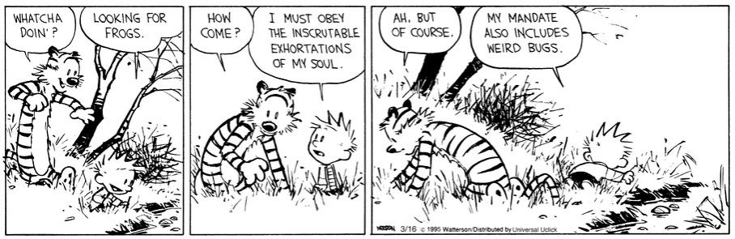

Ἐλάρα
-----

.. toctree::
   :maxdepth: 1
   :caption: Contents:
   :hidden:

   resume
   00_epistemia/index
   01_pedagogy/index
   02_theurgy/index
   03_analecta/index
   04_oeuvre/index

---------------

| Part on seined flow
|                 murdrum 
|                   nun
|                    Wolf denies no trap

--------------

.. image:: _static/img/context/philosophical/wittgenstein-rabbit-duck.svg
   :width: 600px
   :alt: the eye of the beholder
   :align: center
   
--------------

.. epigraph::
   
   *ό ποιητα, ἢ πῖθι ἢ ἄπιθι*

   -- Inscription on an Ancient Grecian drinking vessel.

--------------

