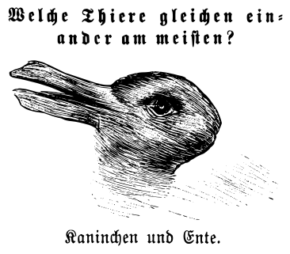

Ἐλάρα
-----

.. toctree::
   :maxdepth: 1
   :caption: Contents:
   :hidden:

   00_epistemia/index
   01_pedagogy/index
   02_praxis/index
   03_dialectics/index
   04_theurgy/index
   05_analecta/index
   06_oeuvre/index

---------------

| Part on seined flow
|                 murdrum 
|                   nun
|                    Wolf denies no trap

--------------

   
--------------

   *ό ποιητα, ἢ πῖθι ἢ ἄπιθι*

   -- Inscription on an Ancient Grecian drinking vessel.