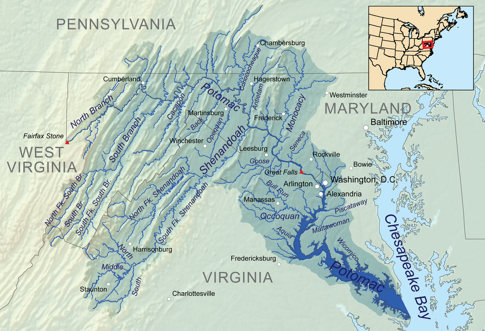

.. _potomac-river:

=============
Potomac River
=============

  The Potomac River Drainage Watershed Basin

  - Kmusser, CC BY-SA 3.0 `<https://creativecommons.org/licenses/by-sa/3.0>`_, via Wikimedia Commons

2026
====

Details
-------

- Departure Date: 2026/05/23, 6:00 AM
- Departure Location: North Branch, Cumberland, MD 

.. topic:: Vessel 

    `Pelican 100 X Angler Kayak <https://www.confluenceoutdoor.com/products/pelican-sentinel-100x-angler-fishing-kayak-mbf10p100-00>`_
    
    :download:`Manual <../../.static/pdf/manuals/pelican-100x.pdf>`

    **Specifications**

    - Height: 13.25 inches
    - Length: 114 inches
    - Width: 30 inches
    - Capacity: 275 pounds
    - Weight: 44 pounds
    - Material: Polyethylene

.. topic:: Equipment

    - `The C&O Companion <http://www.lesserscribe.net/CNOCANweb/index.html>`_
    - `Potomac River Maps <https://www.potomacriver.org/resources/maps/mapdownload/>`_
    - `BigBlue 28W Solar Charger <https://bigblue-tech.com/products/28w-sunpower-solar-charger>`_
    - `Suunto M3 Compass <https://us.suunto.com/products/suunto-m-3-g-compass>`_
    - `Citizen Watch Promaster Dive <https://www.citizenwatch.com/us/en/product/BN0151-09L.html>`_
    - `Ruby Lens Binoculars <https://www.rexdist.com/products/10x25-br-compact-traveling-ruby-lens-binoculars>`_
    - `QuickSnap Waterproof Disposable Camera <https://www.fujifilm.com/us/en/consumer/films/quicksnap-waterproof>`_
    - `Sony ICF B200 AM/FM Radio <https://www.radiomuseum.org/r/sony_icf_b200.html>`_
    
.. list-table:: Provisions
  :header-rows: 1

  * - Item
    - Amount
    - Caloric Value
  * - Peanut Butter
    - 2 pounds
    - TBD