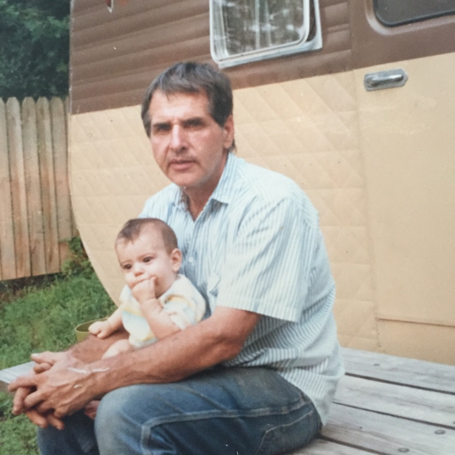
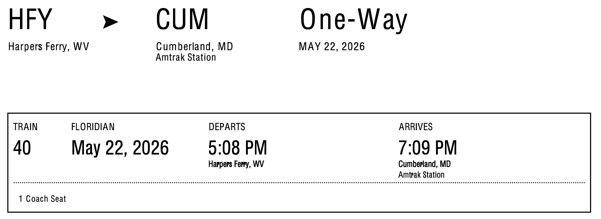
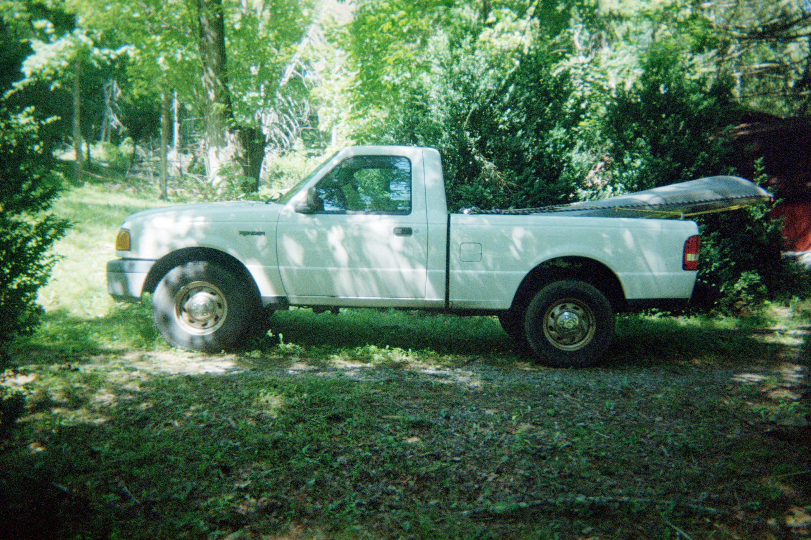
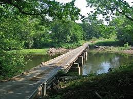
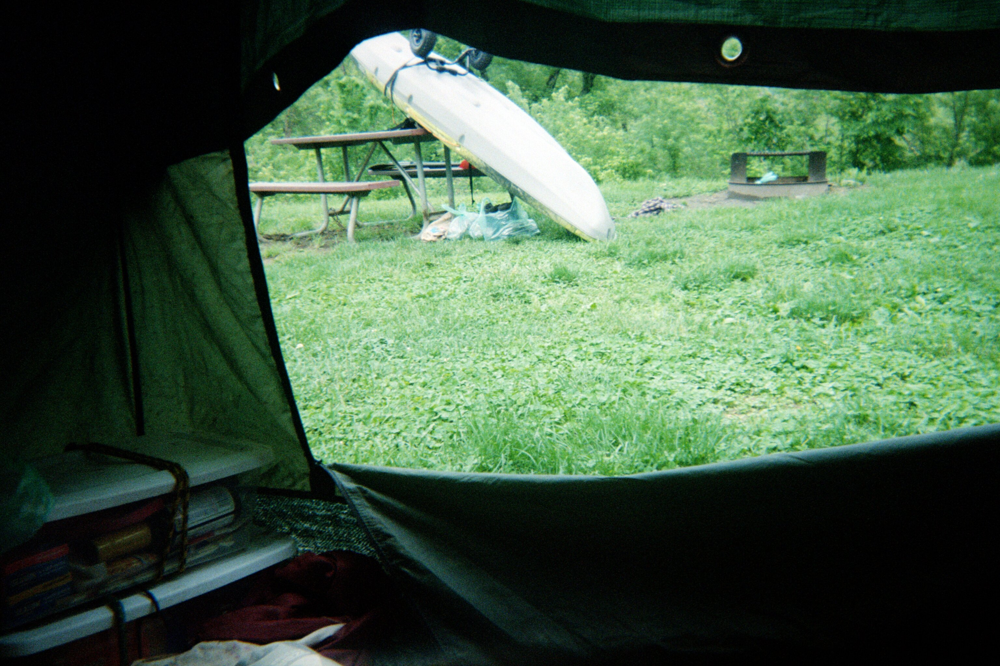
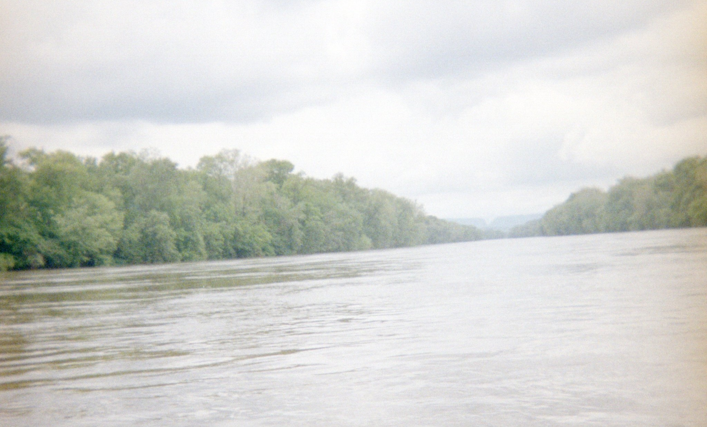
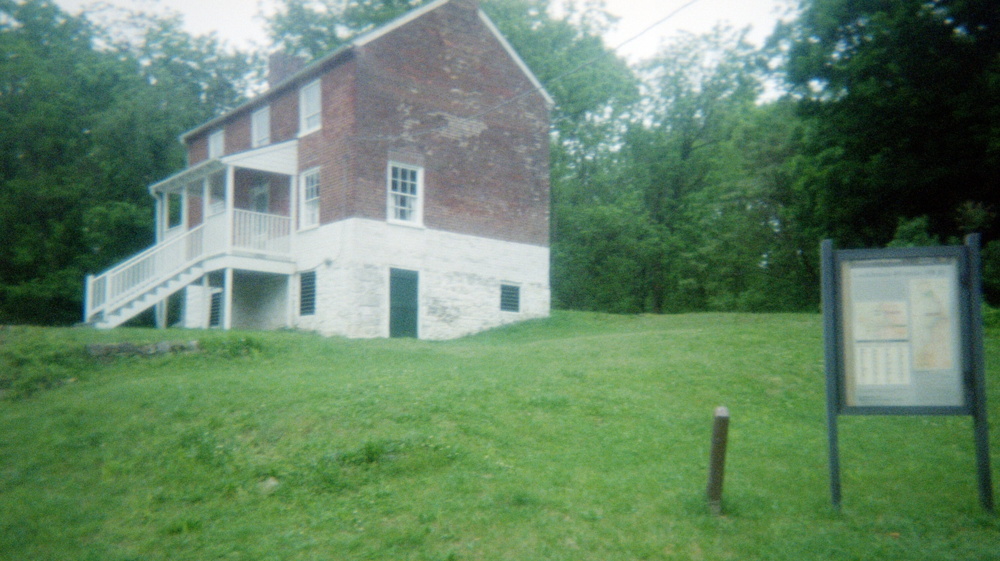
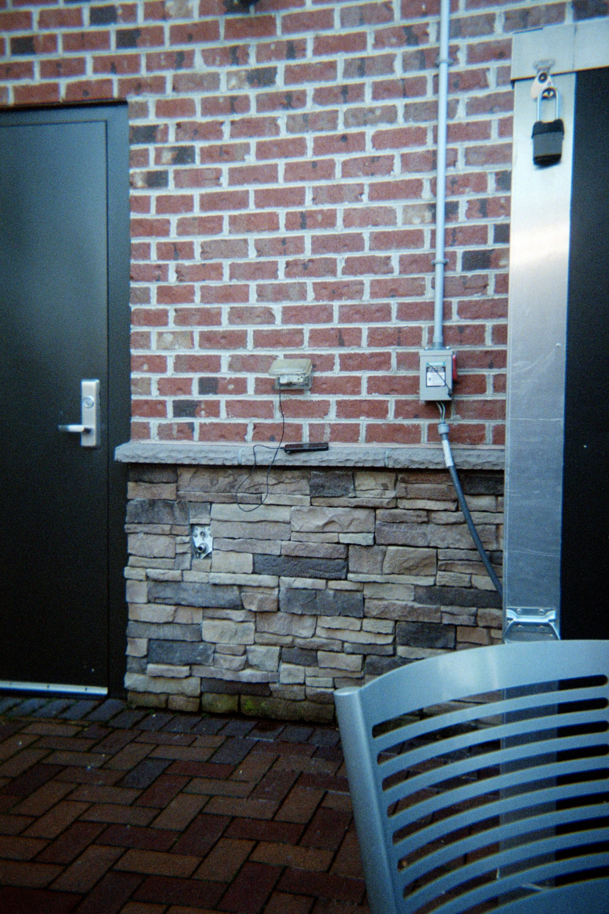

.. _Train Delay Data: https://juckins.net/amtrak_status/archive/html/history.php?train_num=40
.. _Will's Creek CFS: https://waterdata.usgs.gov/monitoring-location/USGS-01601500/
.. _Shepherdstown CFS: https://waterdata.usgs.gov/monitoring-location/USGS-01618000/
.. _Oldtown Toll Bridge: https://www.visitmaryland.org/listing/attraction/old-town-historical-toll-bridge
.. _Floridian: https://www.amtrak.com/floridian-train
.. _MARC Station Parking Lot: https://www.mta.maryland.gov/marc-parking-details
.. _C&O Companion: https://press.jhu.edu/books/title/10639/co-canal-companion
.. _USGS Water Data: https://waterdata.usgs.gov
.. _Interstate Commission on the Potomac River Basin: https://www.potomacriver.org/resources/

.. _potomac-river:

=============
Potomac River
=============

.. figure:: ../../.static/img/maps/potomac-river-watershed.png
  :width: 100%
  :alt: Potomac River Basin
  :align: center

  The Potomac River Drainage Watershed Basin

  `Kmusser, CC BY-SA 3.0 via Wikimedia Commons <https://creativecommons.org/licenses/by-sa/3.0>`_

**Resources**

- `USGS Water Data`_
- `Interstate Commission on the Potomac River Basin`_

Prologmena
==========

  My father

.. topic:: Slack

  **Tuesday, May 12th**

  *Ruth [11:46 AM]*
  
  Hey, just FYI - you’ve not taken much vacation time and after the next three payrolls you’ll hit the “ceiling” of what you can earn.  You may want to schedule some time off so you don’t start losing vacation time.  So by the end of June, you’ll want to have taken some time off or you’ll start losing your vacation accrual

  *Grant [11:47 AM]*

  How many do I have to take to not lose any?

  *Ruth [11:48 AM]*

  So the max is 184 hours.  You earn 5.54 hrs each payroll.  After I process the 6/26 payroll, you’ll have 182.78 hrs.

  *Grant [11:49 AM]*

  Oh, I see.
  
  *Ruth [11:50 AM]*

  Each payroll is a two-week period.  So starting at the end of June, you’d need to take approx.  6 hrs per payroll just to not lose any. even if you plan a couple of long weekends, that will bring you down so you’re not close to the max.

  Just wanted you to be aware.

Thesis
======

I want to speak of endless despair.

It is a river flowing through never-ending mountains. It is felt in the incomprehensible weather that cares not a bit what plans humans draw. It materializes in the afflictions of the body that wrack sensuous reality, the exposure of the elements that ravage and ruin and lay waste to life. It courses through the beating rain of sleepless nights as hypothermia tickles extremities. Its completion is found in the alienation of the self in a wilderness more vast than abstractions can grasp. 

The current, grown bold from rain, strains the muscles which fight against it.

Despair is the annihilation of the soul, the loss of all earthly attachments. It is the destruction of a family, the loss of all love and worth, the abject and base alienation of the self from the world. Despair is the malaise of not being known to anyone but one's self. It is the realization that one is alone without the possibility of it being otherwise.

The self has been called by some a *strange loop*, an epiphenomenon of recursion on nigh infinite scales, a specialized geometry, a mathematical curiosity inevitably spun from the permutations of the finite. But this is incorrect. The self is not a loop; it is where the vacuity of endless recursion meets the uncountably dense foundation of Being. It is the rocks upon which all currents of life converge, in search of anything capable of providing an anchor against which to halt its relentless, unstoppable advance. It is the ground towards which all water flows.

Contrary to modern thought, though perhaps elucidated by Whitehead and Cioran, the self is not an abstraction. It is the fundamental constituent of the universe. That is the lesson of Tarskian satisfaction, Kripkean possibility, Sartre's for-itself, Heidegger's Dasein and the irreconcilable uncertainty discovered in quantum theory. Abstractions cannot in and of themselves contain truth; they are purely vacuous and tautologous. To be is, therefore, fundamentally, the descent of the subjective self to the objective world. It is the act of interpretation and observation. To be is how the subjective becomes the objective.

The history of thought is replete with examples of the limits of language. All stony men are gray. This sentence is false. The set of sets which don't contain themselves. To predicate the impredicable. 

One cannot know the heights of despair through language. It is internal. One tries to define the river. The best available human models currently struggle to understand rotating fluids through anything but brute force approximation. The infinite energies of Navier-Stokes stand like an impassable barrier between the abstraction and the violence which desires nothing, is nothing but raw elemental force.

Wittgenstein spoke of how language evolves, of the network of associations that wax and wane like rain. The pragmatics and contextualization of words. How meaning is not a unitary point, but a smear across the horizon of understanding. So we say "*it is impossible this river is alive*" and also "*it is impossible this river is not a river*" and use the word "*impossible*" in two different ways, employing two different meanings with the same symbol. He taught us to think of language as endless nodes connected by endless edges. The inherent contradiction of language that propels it forward is to take this finite structure and somehow use it to enumerate the continuum of all that is. So it spreads like life, like a dark forest dripping with venomous rain, in search of the point in which it becomes itself.

Despair is the realization the very tools we use to think pale in comparison to the task to which we have set them to work. 

St. John of the Cross said this is equivalent to God's love secretly flooding your spirit and cleaving the way to true discovery and union with the divine. God's love is the suffering of Job. The nature of love is found in despair. In bankruptcy, stricken with ailments, blinded, your family dead, your name forgotten, with nothing at all on which to steady your self. Despar is the inescapable fall of the self into the objective world, to be racked, crucified and fed to lions. To drown in the inhuman depths of a raging river. God, says St. John of the Cross, can only be known by the total annihilation of the self and soul. God is despair.

Preparations
============

----
Gear
----

.. topic:: Vessel 

    `Pelican 100 X Angler Kayak <https://www.confluenceoutdoor.com/products/pelican-sentinel-100x-angler-fishing-kayak-mbf10p100-00>`_
    
    :download:`Manual <../../.static/pdf/manuals/pelican-100x.pdf>`

    **Specifications**

    - Height: 13.25 inches
    - Length: 114 inches
    - Width: 30 inches
    - Capacity: 275 pounds
    - Weight: 44 pounds
    - Material: Polyethylene

.. topic:: Equipment

    - `C&O Companion`_
    - `Potomac Watershed Maps <https://www.potomacriver.org/resources/maps/mapdownload/>`_
    - `BigBlue 28W Solar Charger <https://bigblue-tech.com/products/28w-sunpower-solar-charger>`_
    - `Suunto M3 Compass <https://us.suunto.com/products/suunto-m-3-g-compass>`_
    - `Citizen Watch Promaster Dive <https://www.citizenwatch.com/us/en/product/BN0151-09L.html>`_
    - `Ruby Lens Binoculars <https://www.rexdist.com/products/10x25-br-compact-traveling-ruby-lens-binoculars>`_
    - `QuickSnap Waterproof Disposable Camera <https://www.fujifilm.com/us/en/consumer/films/quicksnap-waterproof>`_
    - `Sony ICF B200 AM/FM Crank Radio <https://www.radiomuseum.org/r/sony_icf_b200.html>`_
    - `Swiss Army Tinker Knife <https://www.swissknifeshop.com/products/swiss-army-tinker>`_
    - `Swiss Gear Wenger Synergy Backpack <https://www.swissgear.com/products/wenger-synergy-laptop-backpack>`_
    - `Type II PFD Life Vest <https://www.survivalatsea.com/life-jackets/foam/seachoice-type-ii-life-vest-orange.aspx>`_
    - `Android Galaxy S8 <https://en.wikipedia.org/wiki/Samsung_Galaxy_S8>`_
    - `Type C USB Cable <https://www.lenovo.com/us/en/p/accessories-and-software/cables-and-adapters/cables/78807615>`_
    - `Universal Kayak Trolley <https://www.walmart.com/ip/Ozark-Trail-Universal-Kayak-Cart-Model-KA204/10690364183>`_

.. topic:: Supplies

    - 30 ft. 1" rope
    - 20 ft. 1/2" rope
    - 20 ft 1/4" rope
    - 1 roll of duct tape
    - 5 carribeaners
    - 2 waterproof roll bags
    - 1 tarp
    - 1 mess kit (pan & plate)
    - 1 sleeping bag
    - 1 1-person dome tent
    - 4 tent stakes
    - 3 elastic bands with hooks
    - 1 hatchet
    - 1 pairs of shorts
    - 2 pairs of pants
    - 3 pairs of socks
    - 1 tee-shirt
    - 2 thermal shirts
    - 1 toboggan
    - 1 sweatshirt
    - 1 fleece sherpa jacket
    - 1 rain jacket
    - 1 poncho
    - 4 50 gallon contractor bags
    - 2 tupperware bins (provisions)
    - 1 composition notebook & 6 pens
    - 1 pair of sunglasses
    - 1 wallet with $200 and expired driver's license
    - 1 toothbrush & toothpaste
    - 1 Bic Multipurpose Lighter
    - 1 first aid kit (hydrocortisone, alcohol swabs, iodine, bandaids, gauze)
    - 1 24-count bottle of ibuprofen
    - 1 bottle of nicorette lozenges
    - 1 pair of river shoes
    - 1 pair of hiking boots

.. list-table:: Provisions
  :header-rows: 1

  * - Item
    - Amount
    - Caloric Value
  * - Peanut Butter
    - 2 pounds
    - 6460 calories
  * - Trail Mix
    - 22 ounces
    - 3600 calories
  * - Macadamia Nuts
    - 12 ounces
    - 2400 calories
  * - Summer Sausage
    - 16 ounces
    - 1520 calories
  * - Fruit & Nut Granula
    - 11 ounces
    - 1320 calories 
  * - Spiced Apple Cider Mix
    - 5 ounces
    - 50 calories
  * - Purified Water
    - 2 gallons
    - 0 calories

-------
Parking
-------

- `Ford Ranger <https://www.kbb.com/ford/ranger/2004/>`_
- `2 Ratchet Straps <https://www.uscargocontrol.com/products/1-x-15-rubber-coated-ratchet-strap-w-vinyl-coated-wire-hooks-4-pack_2>`_

.. topic:: MARC Station Parking Lot

  | 100 S. Maple Ave.	
  | Brunswick, MD 21716
  | Spaces: 675	
  | Price: Free

  - `MARC Station Parking Details <MARC Station Parking Lot>`_

-----
Train
-----

  `Amtrack Floridian Line <Floridian>`_

  | Train: #40
  | Date: May 22, 2026
  | Departs: 5:08 PM, Harpers Ferry, WV
  | Arrives: 7:09 PM, Cumberland, MD

-------------
Planned Route
-------------

.. map::
  :width: 80% 
  :align: center

  * - 39.650153
    - -78.763389
    - Cumberland, MD
  * - 39.524601
    - -78.538814
    - Oldtown, MD
  * - 39.626356
    - -78.387194
    - Little Orleans, MD
  * - 39.651000
    - -78.048000
    - Hancock, MD
  * - 39.599207
    - -77.826033
    - Williamsport, MD
  * - 39.462306
    - -77.774620
    - Sharpsburg, MD
  * - 39.311556
    - -77.630486
    - Brunswick, MD

- Departure Date: 2026/05/23, 6:00 AM
- Departure Location: North Branch, Cumberland, MD 

Expedition
==========

------------
Actual Route
------------

.. map::
  :width: 80% 
  :align: center

  * - 39.650153
    - -78.763389
    - Cumberland, MD
  * - 39.524601
    - -78.538814
    - Oldtown, MD
  * - 39.626356
    - -78.387194
    - Little Orleans, MD
  * - 39.61545202059118
    - -77.94841434871852
    - Clear Spring, MD
  * - 39.311556
    - -77.630486
    - Brunswick, MD

- Departure Date: 2026/05/24, 6:00 AM
- Departure Location: North Branch, Cumberland, MD 

------------
Current Flow
------------

.. graph:: .static/csv/scientific/potomac/wills-creek-2026-05.csv
  :width: 100%
  :align: center
  :interpolate:
  :title: Will's Creek Discharge, 2026/05/22 - 2026/05/27

.. graph:: .static/csv/scientific/potomac/shepherdstown-2026-05.csv
  :width: 100%
  :align: center
  :interpolate:
  :title: Shepherdstown Discharge, 2026/05/22 - 2026/05/27

-------
Journal
-------

.. verse::
  :increment: 5

  My father died alone in blinding pain.
  Dementia drove my mother quite insane.
  
May 22, 2026
------------

  My father's truck

**Oldtown**

- 2:40 PM
- Raining
- Mile Marker: 166

Two weeks ago, I paid a tow truck to haul my father's 2004 Ford Ranger from the ditch in which it had been stuck for the past two and half years.

It wound up there after one of the properties in his estate caught fire in a freak accident. The tenant left a candle burning in the kitchen and went out to get groceries. When she came back, the property was engulfed in flames, encircled by arcs of water glowing red and blue in the commotion. I watched with my mother from the street side as the wooden frame burnt to the ground. 

I had been hauling scrap metal, on a particularly rainy day, from the wreckage of the property. The truck struggled up an embankment, flinging mud behind it in an attempt to stay on solid ground. Eventually, realizing the futility of its course, it gave up, sliding down into the ditch that would become its temporary home.

Over the two and half years since his death, mice had taken up residence in the glove box, infiltrating the cab through a hole rusted through the floor. Unconstrained by human law, their mammalian instincts unreleased, they built a bustling little colony in my father's decaying truck. The cab reeked of rodent, the nauseating, cloying smell of piss, like an ether-soaked rag pressed to your face each time the door opened. The battery was dead and the tires were flat. The passenger side door was crushed into inoperability when the tow truck line pulled it taut against a protuding stump, leaving a long cut across its white surface, a cleft that revealed the barren metal underneath.

After jumping the battery and filling the tires, I scrubbed for hours, but could not exorcise the smell of rodent piss. When the mechanic who did the oil change came out of the garage, he was wearing a face mask and regarded me as though I were a disgusting degenerate, living in my own filth.

Driving the truck through the winding passages of Route 51, where the roads sweep in convoluted trails through the foot hills of the Appalachian Mountains, the engine makes sickening groans, banging over every bump and crevice in the road, as though a creature wants released from the confines of the hood. 

The rain has coated the roads with quicksilver, mirrors that peer into the inverted worlds. Every turn feels as through the tires might hydroplane and send me over the edge into the dense Green Ridge Forest. Three times, while making sharp right-angle turns, as the state routes crisscrossed into one another, the back tires lost traction and skidded over the rain-slick roads, seesawing along the pivot of the double-yellow line. 

I feel the pressure of my journey in the tension of the brakes. The pedals buck with the force of every pot hole. The truck wants to fall apart. I am not sure what is keeping it together. 

I stopped in Old Town for coffee and gas. A few more hours and I'll be in Brunswick.

**Harper's Ferry**

- 8:30 PM
- Cold and Raining
- Mile Marker: 60.7

The rain continues to pour. The train has been ten minutes away for three hours. My phone keeps beeping with updates, telling me the departure has been DELAYED. DELAYED. DELAYED. So I sit here, while it pours on the entire state of Maryland and my flat roof in Cumberland accumulates rainfall. I wonder if it has started leaking yet.

I keep thinking, there's nothing to go back to. Nothing left. My home is gone. My father is dead. My mother's mind is broken. 

I am sitting on a train platform with a wind breaker as the sun sets over Harper's Ferry. The tourist district ascends up an incline opposite the train station; all of the quaint attractions, like a boxcar converted into a diner or a boutique gift shop conjuring the lost allure of America, are closed. I keep almost shivering, not quite cold enough but teetering on the edge of almost, on the thinnest sliver of edge, as though the weather were drawing out its torture. 

Geese honk. The man sitting on the platform next to me lights up another cylinder of handrolled tobacco. An hour ago, we lost a college kid, his backpack decorated with patches and keychains proudly proclaiming his allegiances. He paced back and forth, back and forth, anxious for the train. His phone beeped DELAYED, so he cursed and stormed off, leaving the platform, never to be seen again.

The night descends. I charge my phone with the remainder of my laptop battery while looking up the `average delays of Amtrack Train 40 <Train Delay Data>`_, the Floridian. The line was formed when Amtrak merged with Capitol Limited, expanding its length across the entire eastern seaboard. Unfortunately, the longer a track is, the more delays accumulate. Spreadsheets calculate the average delay time. One hour and forty minutes. Train 40 was scheduled to leave Harper's Ferry at 5:00 PM and the current time is 8:37 PM.

.. topic:: Text 

  *AMTRAK [8:42 PM]*
  
  AMTRAK Travel Update: As of 8:42 PM ET, Train 40 remains stopped north of Rockville (RKV) due to crews performing mechanical assessments. A recovery locomotive is en route from Brunswick and will be added to the trainset. Once completed, service will continue. An additional delay of up to approx. 90 minutes or more is anticipated. We appreciate your patience and will provide an update as more information becomes available. We sincerely apologize for this delay and appreciate your continued pateince.

  *AMTRAK [10:04 PM]*

  AMTRAK Travel Update: As of 10:04 PM ET, Train 40 has resumed service and is operating approx. 4 hours and 55 minutes late. We sincerely appreciate your continued patience and apologize for the lengthy delay. 

May 23, 2026
------------

**Cumberland**

- 11:35 AM
- Raining
- Mile Marker: 184

Train didn't get back into Cumberland until around 1 AM. The only thing the lady sitting to me said was, "*This is the worst train ride I have ever been on in my entire life*," as we got up to leave. I had to walk three blocks to my office in the rain.

Today was the day I was supposed to depart. My father's truck sits in a parking lot in Brunswick, waiting for me. The rain is coming down in voluminous sheets, as though it will never stop. The roof, being flat and prone to accumulate water, leaks incessantly.

I inherited the building from my father when he died. It contains all of his old upholstery supplies. His accumulated remains, now in my care. The rose blossom tree that grows on the sidewalk outside of the building constantly sheds its thoughtless petals, which invariably clog the drainage grate on the roof. 

This could all be fixed if I just got up there and cleaned the fucking spout. Instead, I've set up an electric water pump and run a hose down the side of the building. Anytime it rains more than a quarter of a inch, I have to run the pump and start a siphon to stop the water from leaking down into the garage. All because the only way onto the roof is climbing up a 30 foot ladder and navigating the slippery rubber-sealed roof. I don't understand why I can't just clean the roof, like I'm supposed to, instead of inventing some convoluted patchwork solution.

May 24, 2026
------------

**Spring Gap**

- 8:17 AM
- Cold And Wet
- Mile Marker: 173

I miss my dad.

I am down to my last cigarette, smoking it in Spring Gap.

Lost a day to rain. Stayed in Cumberland Saturday because the roof was leaking. Pouring water into my garage. All of dad's old stuff got wet. I pumped the water off of the roof and spent the day moving stuff around. I hauled as much as I could into the confines of the office, and organized the rest in the garage underneath fields of tarps.

I left at 4 AM. Hauled the kayak for a mile by hand down to the river, through the silent streets of Cumberland. As I passed the last restaurant, the last vestige of civilization before the Canal, the smell of bacon wafting through vents, a cook smoking a cigarette called out me, "*Hey, brother*". I wiped the sweat from my eyes and waved back. 

I hauled the kayak up the ramp up to start of the canal, past Mile Marker 184, where the concrete planes of the flood controls constructed by the Army Corps of Engineers decline in sharp angles towards the rushing water of the Potomac. I rigged the rope around a pole and lowered the kayak's length down the hill. Thought I might die trying to get the kayak into the river. Thought about giving up, calling this stupid trip a wash, but here I am cold and wet. 

Thought I might get hypothermia when I pulled off here. I slipped on the embankment as I was pulling the kayak ashore and fell hands and knees into the river, soaking my clothes. I had to rush to get my bags unpacked from the tangle of ropes and knots, and then change into something dry before I stopped shivering. 

I am only a few miles from my office. I could walk back in less than a few hours. I could still call it quits. 

I cried on the river. I miss my dad so much. I wish I could talk to him one more time. 

He told me that he was glad I was there before he died. I wish I could have been a better son.

  The Oldtown Toll Bridge

  `Source <Oldtown Toll Bridge>`_

**Sorrel Ridge**

- 2:20 PM
- Cold and Wet
- Mile Marker: 154

The current pulled me like a gravity towards the Oldtown Bridge, an old one lane toll bridge that, when the river levels are normal, barely leaves any clearance under which to kayak. I had to lay flat against the plastic and turn my face sideways as the current drove me underneath, the underside of the bridge inches from my eyes, furious waves of water ricocheting off the rusted metal, spraying me. 

The entire trip so far has been an erratic zigzag across the river, as I dodge spinning trees and limbs caught in the whirlpools and vortices revealed by the turbulence of the quickening current. Every bridge has grown a makeshift dam of detritus, a web of debris that accumulates as it sieves the runoff of the storm. I have to angle the kayak precisely through narrow lanes. The slightest prod or poke sends the kayak reeling.

I don't think I can go on much longer. I don't know why I am doing any of this. Not just the trip. The whole thing. When I was young and depressed, I always said I would kill myself after my parents died. I hated living, as I suppose as all teenagers do, but I did not want them to feel bad. They loved me for some reason and killing myself while they still lived seemed cruel. So I pretended to be a son. I am not sure if I ever grew out of that feeling, as so much as buried it deep, deep down.

Dad is dead. So is mom, her body just hasn't caught up.

The kayak nearly capsized when I tried to stand up in it to urinate. Sent me hurling into the water. My jacket and clothes are soaked again. I have them up on a line, but it's too cold for them to dry. 

I don't think I am as prepared as I should be. The kayak, cheap as it is, takes on water; the scupper holes do their job for the most part, but the bucket seat has a permanet puddle of dank water festering within it. The vessel sits too close to the water. Everything gets soaked. My backpack, attached to the front with a strap, got wet all the way through, soaking the sweatshirt that wouldn't fit into the waterproof rollbags. 

I am wrapped in my sleeping bag, the one thing that remains totally dry. If the sleeping bag gets wet, I will probably die of hypothermia. Everything else doesn't matter. As long as it stays dry, everything will be fine. 

For whatever reason, unknown even to me, I have no intention of turning back. My father's truck sits in Brunswick. I *will* get back to it.

**Sorrel Ridge**

- 6:14 pm
- Cold And Wet
- Mile Marker: 154

There is a loneliness in me I can't get rid of. I desparately want a friend. There is no one in my life but me. It's my own fault. 

Chris no longer talks to this side of the family. I never took the time to fully understand why. He and mom never got along. My father wasn't his father, and one day he decided to contact his real father. My mother never forgave him. He stopped coming to family gatherings and dropped out of contact. I have seen him since, but we're not family anymore. That is a strange feeling to describe. Meeting someone who used to be your family. It is perhaps the closest approximation to the abstract concept of alienation that exists in this life.

Billy wanted me to read his screenplay, which I never did. I don't think he ever forgave me. He's always had mental problems, quick to anger and selfish. In his fifties, it's like he's not even there anymore. I wonder if I could have changed things, just by not being so anti-social and distant. I remember when I was trying to get guardianship of my mother, my half-sister revealed to me that years ago, after my father had been diagnosed with Parkinson's, Billy had a falling out with my mother. He allegedly said, "*The old man needs to die*". I don't know how true that is.

Well after it was apparent dementia had started to claim my mother's mind, well after she started to tell lies she probably believes are true, she told me Billy came to her before Dad's funeral and demanded in anger an answer to the question why I had gotten all of dad's old upholstery supplies. I never asked for any of it. I didn't realize I had gotten anything. It was just stuff. Things to take care of. I suppose he wanted to sell all of it. Mom said she gave him $20,000. Again, I don't know how much of this is true. My mother hasn't lived in reality for some time. 

When I sent the letters out to everyone telling them I was going to try and get guardianship of her, I never heard back from Chris. The only thing Billy said, when he came to claim my father's workshop property from his estate, "*She's always been crazy.*". I tried to explain to him it wasn't the normal kind of crazy, that she was losing her memory and I needed to get her to a doctor to find out what was wrong. This was after she had filed police reports about me breaking into her house and stealing common household items, like couch cushions, weed whackers and medication. After she sent me a No Trespassing Order drafted by her lawyer. After I had tried everything to get her to see a doctor. 

Victor. I am sorry I was never there for you. Your father, Billy, abandoned you, I think. And I never made an effort. Never tried to know you. You're the last Moore. I won't ever have kids. And I failed you.

Carmen is the only one who came to help me when I tried to get guardianship of Mom. No one else tried to help. 

I sent everyone a letter. Billy, Carmen, Chris, Terry. No one came to help, except Carmen. Paul is the only one who tried to talk to me. To ask me how I was doing. I didn't respond. Carmen asked me why. I told her I wasn't good at talking to people. She said I had autism. 

Why am I so distant? Why do I push everyone away? I know it doesn't have to be this way, but I don't know how to change it. 

I am an addict. Down to weed and cigarettes. I guess that was the real purpose of this trip. To put some distance between me and the substances that have come to control my life. 

Mom called me a drug addict during one of her fits of dementia, when I was begging her to go to the doctor. I don't know if she meant it, if what she was saying was some sort of truth uncorked by the loss of inhibitions, or a delusion fueled by the madness ravaging her mind. She made fun of me for not having friends. She was right on both accounts, of course.

May 25, 2026
------------

**Sorrel Ridge**

- 7:50 AM
- Raining
- Mile Marker: 154

I didn't sleep at all. I kept dozing right to the edge of sleep and then waking back up. It started raining last night and hasn't ceased. The tent bleeds condensation. Everything is wet. My sleeping bag is still mostly dry, but I feel moisture starting to build and pool in the corners, where the zipper meets the material. I won't be able to leave until it stops raining so much, unless I want to risk getting more clothes soaked. I have two more shirts and one more pairs of pants besides the ones I have on, and I can't take the risk. I will have to stay here until it stops.

I have some sort of rash on both of my lower legs. Feels like some sort of allergic reaction. When I lay curled in my sleeping bag, my inner legs press together and burn as though they were aflame.

My phone has 20% and is roaming. I wouldn't have anyone to call even if I had service.

Every important person in my life is gone. Leah, my friends, my family.

I think about what I would be doing if I hadn't gotten it into my head this kayak trip was a good idea. Probably nothing. Same thing I have been for years, even before dad died and mom went insane. This is probably the first day in over a decade I haven't been high. Everything I have ruined in my life comes down to drugs and alcohol.

I fucked up everything with Leah because I was an alcoholic. I let my dad waste away in his final years so I could get high. I could have had a real relationship with him in those last few years. He tried to connect with me so many times. I never knew what to say, instead preferring to be alone. I could have told him I loved him. Instead my life is a ruin.

I was given every opportunity in this life. Every chance to not be who I am. I was selfish. All I cared about was the feeling of being high. No one else mattered.

And now I am alone, stranded on the river as it pours rain and tiny droplets bead down the inside of the tent. 

Nothing has dried. My two jackets are still soaked. I need sun. Everything will be miserable until the sun returns.

I keep thinking back to the garage and dad's stuff covered in tarps. I'm 36 miles away from Cumberland, but the hand crank radio tells me it's raining there too. The roof is probably leaking.

All because I was too lazy to clean the fucking spout. Why do I fuck everything up? I am going to come back to ruined inheritance. 

I should have brought a gun. I could walk into the woods and kill myself. No one would ever find me if I went deep enough. 

Why do I continue to cling to life? I suppose I still have a shred of hope of meeting someone and starting a family of my own.

The shower has let up, but it still trickles down and thuds intermittently against the tarp I rigged above the tent last night in the pouring rain, flashlight clamped between my teeth, its beam washed out and diluted by the endless fucking rain.

I prayed last night to a God I don't believe in to stop the rain.

**Sorrel Ridge**

- 9:30 AM
- Raining
- Mile Marker: 154

The rain has started again in force. The cold, unfeeling weather. How many lives have been claimed in silence by the rain? What hunters in ages past fell to the chill?

My mind is made of drugs. Without them, I have no thoughts. No poetry. Just words and consciousness. A dull pain.

I never write for myself. Always for an imaginary audience. I know not who I am, truly. Or to whom I am now writing.

I think I used to be charming and funny, but that was a long time ago and perhaps a figment of my imagination.

Slowly and slowly, my meager fortress succumbs to the wet. What happens when I am soaked and have no shelter?

It doesn't stop. It just keeps raining and raining. Every ebb reveals another rush of rain, more forceful and insistent than the last. It beats constantly above my head. My notebook curls with moisture. The ink bleeds in blots. My glasses fog and everything turns into a blur.

Father, what have I done? I cry and the sky mocks me.

Mom said the body at the wake didn't look like you. I wonder if her mind was already cracking. When did it start? I think she was losing her memory while you were still alive. I think you were an essential piece of her and once you died, her mind couldn't hold itself together anymore.

I was never as smart as you. I can do all the fancy math in the world, but I don't understand reality like you did. You never seemed to fail like me. You mastered a craft, understood the precision of creation.

God, I miss you so much.

Why is this world so full of pain and no relief?

I can't say I don't deserve it. I have been a terrible person and treated everyone around me as though they weren't human.

"*Enjoy going through life thinking you are better than everyone else*," My best friend said to me the last time I saw him. He's not wrong, of course.

"*I thought about it. I just don't have fun with you*," Leah said the last I heard from her, when we had planned to meet after years of absence and she decided at the last moment to cancel.

"*Would you believe I have changed?*" I texted her.

"*Not really*," She responded. 

Almost 10 AM. Still raining. The tent floor seeps moisture. I am totally alone here, in a way I have never been. 

All I have are demons and ghosts to keep me company. Father, are you there? Please watch out for me.

Why did I waste my life? Why, now that you are dead, do I talk to you?

"*You can tell me anything*," You said, because you thought I was gay. You were the best person I ever knew. No one compared to you. There was no pretension, no ego, just love and kindness. Your workers, Jimmy, Taz, Dicky, Bob, you took care of them, taught them your trade, paid for their expenses, gave them room and board when they fell on hard times. You did that for strangers and for me, so much more. My education. My life. You gave me everything and I returned nothing. I failed as your son.

It hurts so badly. It hasn't gone away a single bit. It still hurts like the day you died. I don't think I will ever recover. 

What did I think this would be? I knew it would be a cleansing and a detox. I didn't think it would be this painful.

I just want to go home. But there is no home left for me anymore.

  Flooded boat ramp at Little Orleans

**Little Orleans**

- 4:29 PM
- Cloudy But Dry
- Mile Marker: 141

I managed to break camp around 11 AM and made a few miles. I'm ten or so miles from Hancock, I think. My legs are definitely sunburnt. It must be sunburn, though my face isn't sunburnt. I assume sitting in the kayak all day, even if it is cloudy, is not good. I didn't even think about the sun when I was preparing. The burns sting and I can think of little else besides the pain. Like my legs are no longer part of my body. Blisters have started to spread up and down my red skin. Pretty sure that means second-degree burns. Broke into the first aid kit. Best I have is hydrocortisone cream. Did not seem to help in the slightest. I'll have to pick up sunscreen and calamine lotion in Hancock tomorrow. Why didn't I think of sunscreen before? So stupid.

When I was unpacking the kayak at the boat ramp, a couple pulled up in their truck to check the water level. The boat ramp was marked with lines indicating CAUTION and DANGER. The water line had breached the red DANGER marker and now extended well past where the marks could measure. Rain-swept trees could be seen rolling down the muddy and unknowable river. They asked what I was doing. I told them I was kayaking the North Branch of the Potomac. They looked at the cheap, tiny kayak and said in astonishment, "*In that tiny thing? Isn't that dangerous?*". I shrugged and agreed it was, but said it was too late. I had a truck parked in Brunswick and no other way to get to it besides the kayak they now questioned. The husband was smoking a cigarette. All I could think was how much I wanted one. 

As soon as I got my gear unpacked, I cracked open the nicorette lozenges and fed my addiction. 

The sun is actually visible throught the clouds and the solar panel, to my chagrin, works. Was able to charge my phone to 26%. There was a voicemail from Mom. I expected it to be a dementia-fuled rant accusing of me of breaking into the house and stealing whatever item she happened to have misplaced today, but it wasn't. She went to the graveyard to find Dad's grave, but couldn't remember where it was. 

I called her back, assured her it was still there because I gone to see it just a few weeks ago. I said I would take her there, but I'm kayaking the Potomac. She asked me if I was doing it alone. I told her yes, and that I had parked Dad's truck in Brunswick, so I could pull out of the river and load it up right then and there and drive back without much hassle. She didn't remember signing the truck over to me, much less what it looked like. I explained it was an old white Ford Ranger. She said I could call her if I needed someone to pick me up. I would like to take her up on her offer, but I am not sure I would trust her to go this far from home without getting lost.

As my mother's memory goes, so does the radius of her movement.

  Little Orleans campground

.. topic:: Text

  *Grant [3:16 PM]*

  Hello, sorry. I have been going through a lot and haven't been very thoughtful to others. I am sorry. 

**Little Orleans**

- 5:04 PM
- Cloudy But Dry
- Mile Marker: 141

Five rabbits just ran by my tent. Which reminds me I saw a bald eagle swoop across the width of the river and disappear into the forest today. 

Turtles are everywhere along the river. I must have seen over a hundred. They appear to be seeking refuge from the flooding Potomac by crawling up the sides of trees en masse. Legions of them, ascending from the depths, with nothing else but the blind impulse to weather the storm and survive.

May 26, 2026
------------

**Little Orleans**

- 6:55 AM
- Cloudy 
- Mile Marker: 141

10 miles of so from Hancock, the approximate halfway point. I should be to restock there, though I haven't eaten much this entire trip so far. I think like I should be hungrier than I am, but mostly I just feel tired. Atleast I'll be able to get supplies for my sunburn.

It's been three mornings without coffee. Of all the drugs, I didn't expect caffeine to be the one I missed the most. I suppose that's what getting older means. 

  Sideling Hill

**Hancock**

- 11:03 AM
- Cloudy
- Mile Marker: 125

As soon as I stepped off the kayak here, a cramp in my lower left leg started screaming. It has gotten worse with each passing minute, each step I take. I looked a sorry sight limping up into the main town.

Paid $5 for a shower at trailhead shop. Shower was a hot spigot hanging from the ceiling of a converted porta potty behind the shop, next to a dumpster and pit of mud. Hot water was nice, but it burned like a thousand hells across my sunburns whenever they got wet. I am in a state. 

My hands are calloused and sore from the constant paddling for three days. Found an abandoned pair of biker gloves at the Fifteen Mile camp and have been using them ever since. They have been a godsend. 

After picking up sunscreen and calamine lotion at the pharmacy, I bought a pack of cigarettes and coffee at gas station here. Couldn't take it anymore. Another addiction, I suppose, I will never tame. I am currently sitting next to the boat ramp, gathering my strength for the next leg.

More than once this has happened today on the river: A mother duck and her chicks sense my approach. The mother starts squawking and beating her wings against the water, driving directly into my line of motion. Her chicks then disperse into the tall grass that sticks above the river, disappearing from sight. The mother leads me forward, calling after me to follow her, making herself a noisy target. As I paddle, she eventually takes flight and circles overhead until I am well past her nest, to land behind me and retrieve her chicks.

I have no ill intentions, but it's good dress rehearsal for the actual show.

**Clear Spring**

- 7:58 PM
- Cloudy With Light Rain
- Mile Marker: 109

I have been limbing the whole evening. Dragging the kayak ashore was an ordeal in and of itself. It feels like the tendons in my leg are severed. I had to haul the kayak across the wooden bridge of Lock 49 and stopped every few yards to rest. The kayak trolley refused to work, wobbling and losing balance every time the wheels bounced over the rocky path. It appears the straps are not set correctly. I'll have to adjust them before tomorrow morning.

Once the kayak was ashore, I sat on the embankment, trying to charge my phone. Solar panel works, except it's been cloudy non-stop. I've seen the sun maybe three hours the entire trip. My phone was down to 3%. A few errant rays that peaked through the clouds managed to bring it back up to 9% while I was sitting here. 

Tomorrow is going to be a rough one. By river, I am less than day from my goal. However, there are three dams between me and Brunswick: Dam #5, the Power Plant Dam and Dam #4. I'll have to put ashore above Dam #5 and haul the kayak until I can put in past the Power Plant Dam at Williamsport. Then I'll be able to make ten or so miles by river to Dam #4, before I have to take out one more time and go around. The `C&O Companion Book by Mike High <C&O Companion>`_ has been indispensable in its granular detail of the trail and the river. 

(There's currently a groundhug snuffling around the ruins of Lock #49 as I write this.)

The kayak trolley has been hit or miss. Tomorrow it gets put to the test, a trial by fire. Atleast the terrain should be level. Mostly. 

The one saving grace is Lock House #49. The C&O Authority rents it out to hikers, so I used the remaining charge on my phone to reserve it for tonight, though the door was unlocked. I could have easily squatted in the place, but decided the Authority deserved some compensation for the good fortune they have bestowed upon me. $135 a night, but worth every penny. A bed to sleep in will be a miracle compared the sleepless nights I have been spending, sunburnt, on the rocky ground. Best of all is the oven. I am currently baking my soaked clothing. The entire place reeks of roasted mildew.

  Lockhouse #49

Started a campfire in the ring outside and fired up some sausage. The meal tasted liked nothing, but it filled my stomach.

Hopefully tomorrow will be the end of this forsaken trip. If not, then Thursday at the latest. It all depends on how quickly I can get around the dams. 

.. topic:: Text

  *Paul [10:47 PM]*

  Is this grant? I thought it was spam at first. it's cool man, I've been through a lot too, so I get it. My mom told me a bunch of stuff about Granny that bummed me out. It's obvious she has some form of cognitive impairment, but it's still hard to get guardianship when a person in question still has some cognition left. I'm sorry you're going through that and whatever else on top of that. I miss Bill, he was always so chill about everything.

May 27, 2026
------------

This was the day I gave up. What you now read are recollections after the fact.

**Clear Spring**

- 5:00 AM
- Cloudy With Light Rain
- Mile Marker: 109

I woke up dry around 5 AM, the sunburns bearable after applying the calamine lotion. My remaining wet clothes baked in the oven for an hour in the morning before I left. The stench wafted through the house, but everything was finally dry. I opened all of the doors to let the smell air out and started packing, leaving the remainder of my rations, besides the peanut butter, trail mix and water, sitting in the kitchen for the next hiker. I realized, as I sat for the final time at the Lock House kitchen table, I had not seen a soul on the river the entire journey.

The night previous I had gone around the Lock House several times, making sure all of the doors were locked, simply because the house was built in the 1800s; it had seen the generational wasteland of the Civil War; ghost stories had grown from the destruction to be traded like precious gold between the locals. Even as far as Cumberland, when I was in the Boy Scouts, we talked of the dark alleys of Antietam, where the blood of soldiers still seeped through the ground, or of the roaming ghosts of Gettysburg. The guest room had a ledger where all of the previous guests had signed, so I added an entry,

  | Don't mind the ghosts; they're harmless once they consume the soul of your first born. 

As I attached the kayak trolley and made sure the straps were set correctly, rain began to fall in light showers again, nowhere near enough to discourage further progress. Limping down the dirt road leading to Lock House #49, I followed the detour along the main road, the main Canal gated off for construction. The entire park was a labyrinth of shuttered passages, makeshift bridges and signs pointing in contradictory directions to follow the detour. 

I made it back onto the Canal around Mile Marker 108, lugging the kayak behind me, carefully balancing it on the dirt path. The storms began in earnest, as though aware I were now in my final stretch. Thunder echoed through the sky like bomb blasts. The rain began to fall harder than it had the entire journey. Every few hundred yards, I had to stop and tip the water out of the kayak, until I took the tarp and strapped it over the whole vessel to stop the rainwater from collecting.

The kayak compliantly followed behind me, exhausting to pull but manageable with the trolley. I carefully steered it around the puddles and mud that were expanding their territory across the towpath. The rain showed no signs of stopping.

I arrived at Dam #5 to find the entire area under heavy construction, surrounded by overlapping lines of fences that blocked the Canal towpath, directing all travellers through a narrow lane that passed under the front porch of Lock House #47. The site was empty for the rain, but impassable, heavy machinery shedding solid lines of water, glittering in the stormy dark, forming constellations of streams that flushed the dirt and gravel through flooding crevices. To my right, through the thick, dripping forest, the river flung itself headlong over a thirty feet drop, the current furiously coursing over the dam. 

The only way forward was a impromptu flight of stairs, crisscrossing up a hill, made of boards and sheets laid into the mud in the approximate shape of steps, held together by unseen joints. I pulled the kayak up the first flight, but as I switched directions to start the next leg of the ascent, I slipped on the slick wood and lost my grip. The kayak went careening down the stairs, thudding like thunder in the rain, to capsize in a sink of mud at the base. In the fall, the kayak trolley snapped in two and went spinning into the forest, wheels flying in different directions. Without the trolley, there was little hope of completing the trip. I stared down at my fallen kayak for several minutes before picking myself up from the ground.

I was less than ten miles from Williamsport, on the other side of the Power Plant Dam, where I could put the kayak back into the river. If I turned back, I was only two miles from Lock House #47, where I could atleast get out of the rain, although that would do little to solve the problem of transporting the kayak around the dams and simply delay the problem another day. Despite the prescriptions of good sense, I decided to keep going. I picked up the broken trolley and pitched it into the woods, consigned it to oblivion.

I unrolled the 1" root, rigged a harness around my chest and attached the other end to the kayak, after putting it upright. Through sharp gasps of cold air like knives into my lungs, I grunted and fought the kayak up the steps without the trolley, eventually winning the top, where I sat in the kayak a final time, resting in the rain for an amount of time I never measured. After standing back up, I struggled through the circuitous detour, slipped through the mud, as rain poured. Twice the kayak tipped over and three times I fell. I was covered head to toe in mud and shivering. 

Finally, the detour lead me onto another backroad, Dam #5 Road, a flat expanse of blacktop that I thought would be a blessing. If I only had the kayak trolley. For a mile I pulled the kayak through the rain with the harness until I finally collapsed in exhaustion and realized there was no way I was going to make it. I simply did not have the energy to haul a hundred pounds of gear against the force of grating friction another eight miles, all while the rain poured and poured and poured.

I sat on the edge of the road, wondering what to do, as the rain washed over me. There was no other choice but to abandon the kayak and make my way to Williamsport on foot. I pushed the kayak over the side of the road, down an embankment, into the depths of the forest, covering it with fallen branches and debris until I could no longer see it from the road. I planted a stick in the mud off to the side to mark where I had hidden the kayak.

Factoring in what I deemed essential should I need to spend another night in the wilderness, I left the sleeping bag, tent and rest of my rations, save the trail mix which I stuffed into my pack. I hooked my waterproof rollbags, which contained my mercifully still dry clothes, to the front straps of my backpack and hoisted fifty pounds of gear onto my shoulders, taking my last gallon of water in hand. 

For miles, I trudged through the never-ending rain. Every inch of the world was wet to the bone, to the core. The towpath was alive with nightcrawlers and milipedes slithering through the mud and murk. I felt nothing but the strain of my muscles, heedless of the passing seconds beyond the slow backwardation of the Mile Markers down to 100, where Williamsport lay hidden from me. Several times I came upon boat ramps, where I could have put in and let the current take me the rest of way, had I had the strength to pull the kayak that far. 

I sat on a bench near one of the ruined locks to rest. I forget which, or never bothered to look. My glasses were streaking with fog and droplets of rain, so that the world was little more than vague gray and black blurs. I measured my progress by the transition of the towpath from mud to rocks to decaying pavement. The concrete path curled around slate bluffs, the forest falling away, revealing the rushing river mere feet away, without any railing or barrier to prevent falling into its churning wastes. It was a torrent of commotion, of a million explosions of the relentless rain upon its contorting surface.

It was there I realized I had left my father's truck key in the pocket of my jacket, packaged in one of the 50 gallon contractor bags. I cursed myself for my stupidity and hurled my gallon of water as hard I could in whatever direction I happened to be standing. I heard it explode somewhere in the distance, another falling drop of rain.

It was then I gave up. I unzipped my backpack and left everything but my clothes, wallet and phone sitting on the side of the towpath for the next traveller or scavenger: poncho, gloves, sweatshirt, messkit, first aid kit, duct tape, rope, all of it but what I absolutely needed in the civilized world to barter my way back to the truck. I walked the rest of the way to Williamsport in total silence, the absence of thought. The rain continued to fall. I counted down through 104, 103, 102, 101, 100.

Eventually, I started to pass normal people, walking the trail with umbrellas. They called "*good morning*" to me. I mindlessly called the same to them. The towpath rounded the corner and I saw the Conococheague Aqueduct peak out from between the trees ahead. I emerged from the forest into civilization.

The surreality of my ascent from the aqueduct to the main street of Williamsport is an experience I will never forget. Under my feet, the stone arches carried a stream perpendicular to the water rushing underneath it. I crossed a bridge over the stream into the parking lot and climbed up the incline. As I marched up from the aqueduct into Williamsport proper, the rain started to go slack and the noonday bells began to ring, playing a facsimile of *My Country, 'Tis of Thee*. I remembered the line from the bell's song, "*Land where my fathers died*", as the skies cleared. My boots squished with every step while the sun appeared behind the dispersing clouds. 

At the gas station, I bought a phone charger and sat on the patio beneath an outlet as the bars onscreen slowly filled. The sun dried out my clothing while I waited on my Uber. Google Maps told me I was only 22 miles from my father's truck. I had almost made it.

  Charging my phone 

My driver had a statue of Siddhartha Gautama on his dashboard. He asked questions in broken English about what brought me to Williamsport. As he drove me back to my kayak so I could get my father's truck key, I explained the entire journey to him. The week I took off of work, the plan to go from Cumberland to Brunswick along the North Branch, the endless rain, the current, the difficulty, the annihilation. After hearing all of it, he smirked and said to me, "*I am glad to have met you. You are crazy, man.*" I agreed.

He waited for me while I ran into the woods and exhumed the remains of my expedition from the now humid forest, steaming with the vestiges of the rain. The driver laughed as I waddled back up to the car. I don't think he believed any of my story until that moment. 

Thirty minutes later, he dropped me off at the foot of my father's truck in the Brunswick MARC Train Station parking lot. I opened the door to the familiar smell of rodent piss and ignited the engine.

.. topic:: Text

  *Grant [1:08 PM]*

  She would have listened to him. 

  *Paul [1:29 PM]*

  Yeah. She went down fast when he passed. I think she lost most of her mind being in that house alone all the time. My mom said Terry is getting tired having to go find her car keys and pocketbook on a daily basis. It makes make sad but I eventually something is bound to happen, whether she falls, causes a fire or pisses off the cops one too many after accusing another innocent person of theft. How many times has she called the cops on you? 

  *Grant [3:07 PM]*

  Not sure at this point. At least three times. I wasn't trying to get guardianship, really. I was trying to get the court to force her to go to a doctor. 

  *Paul [3:13 PM]*

  Oh, that should be a little easier. I think I heard the DMV might make her get checked, or at least a doctor will have to sign off on it. They might do a scan before they sign off. if she got in an accident because of cognitive deficit, they could be liable. She definitely need a guardianship though. Unless she gets better. 

  *Grant [3:23 PM]*

  There's no way to get her to dgo to the doctor without a court ordering it, because she won't go. I used to have POA and healthcare directives. I scheduled MRIs for her, but she cancelled, freaked out. MVA can't make her get an MRI. They can only revoke her license. And she needs a brain scan to determine what is wrong, although it's pretty clear at this point it's some type of fronto-temporal dementia. She has all the symptoms. 

  *Paul [4:42 PM]*

  Yeah, she used to eat Benadryl like candy and now it's suspected to be linked to many dementia cases. Anticholinergics are really bad when used long term. She must be scared they will find something in a scan. She has to know on some level there is something wrong with her.

  *Grant [4:44 PM]*

  She knows they will. I had cameras in the house up until last October. She talked to Bill Wolfe about losing her memory all of the time.