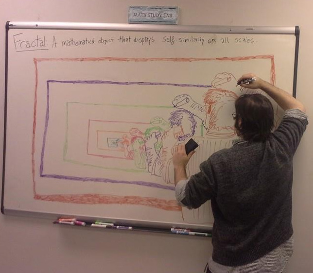
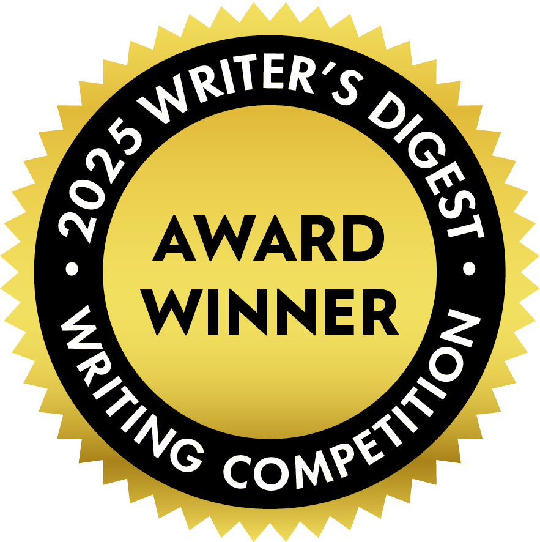
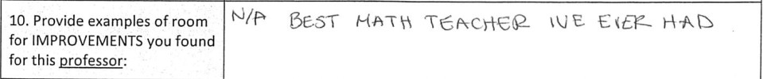

.. NOTE: This document is formatted in RestructuredText (RST).

.. _resume:

======
Resume
======

.. topic:: Contact Information

  Email: chinchalinchin@gmail.com

.. _education:

Education
=========

.. list-table:: Education
  :widths: 15 15 15 15
  :header-rows: 1

  * - School
    - Degree
    - Field of Study
    - Graduation
  * - Towson University
    - Master of Science
    - Mathematics
    - 2013
  * - Frostburg State University
    - Bachelor of Science
    - Physics
    - 2010

.. _publications:

Publications
============

- *Photographs of Autumn*, Macrame Literary Journal, `Summer 2025 Issue <https://macramelit.com/articles/photographs-of-autumn/>`_
- *Absurdity*, The Genre Society, `Fall 2025 Issue <https://www.thegenresociety.com/readhere>`_
- *Father's Lullaby*, Sublimation, `Volume 2 Issue 5 <https://islandofwakwak.com/sublimation-volume-2-2025.html>`_
- *The Unicode Ode*, Infocalypse Press, `Volume 1 Issue 1 <https://www.infocalypse.press/issue-one/>`_
- *The Invocation of Metric Code*, Infocalypse Press, `Volume 1 Issue I <https://www.infocalypse.press/issue-one/>`_
- *The Lives of Kites*, Macrame Literary Journal (Forthcoming)
- *Holly Tree*, The Celestial Glossary, Volume 1 Issue 1 (Forthcoming)
- *Larksong*, Artists From Maryland, February 2026 (Forthcoming)
- *Eulogy*, Artists From Maryland, February 2026 (Forthcoming)
- *Pantoums of Dementia, Movement I: Undulation*, Scribeworth Magazine, Winter 2025 (Forthcoming)
- *Larksong*, Garfield Lake Review, 2026 Edition (Forthcoming)
- *Eulogy*, Garfield Lake Review, 2026 Edition (Forthcoming)
- *Pantoums of Dementia*, Garfield Lake Review, 2026 Edition (Forthcoming)
- *Ode to Death*, Garfield Lake Review, 2026 Edition (Forthcoming)
- *The Origin of Lies*, Garfield Lake Review, 2026 Edition (Forthcoming)  
- *Little Sprout*, WayWords Literary Journal, Issue 21: Theme of Wonder, (Forthcoming)
- *Millenial Lives*, WayWords Literary Journal, Issue 21: Theme of Wonder, (Forthcoming)
- *Pantoums of Dementia*, Sligo Creek Publishing, Bearing Witness: Poems for Troubled Times, (Forthcoming)
- *Eulogy*, Sligo Creek Publishing, Bearing Witness: Poems for Troubled Times, (Forthcoming)
- *Turkey Vultures*, Backbone Mountain Review, (Forthcoming)

.. _contests:

Contests
--------

  
- *Father's Lullaby*, 94th Writer's Digest Contest, Runner Up, `2025 <https://www.writersdigest.com/announcing-the-winners-of-the-94th-annual-writers-digest-writing-competition>`_
- *Ode to Death*, Forgotten: A Marroween Contest, Honorable Mention, `October 2025 <https://marrowmagazine.com/ode-to-death/>`_

.. _experience:

Experience
==========

.. _employment:

Employment
----------

.. list-table:: Employment
  :widths: 15 15 15
  :header-rows: 1

  * - Employer
    - Roles
    - Dates
  * - ProvisionIAM
    - Senior DevOps Engineer
    - March 2025 - Current
  * - MDThink
    - DevOps Lead
    - June 2024 - December 2024
  * - Bishop Walsh
    - Math Teacher
    - September 2023 - March 2024
  * - IHS Markit
    - Software Engineer
    - October 2022 - March 2023
  * - Booz Allen Hamilton
    - Staff Engineer
    - June 2022 - December 2023
  * - Makpar
    - DevOps Engineer
    - October 2021 - May 2022
  * - IBM
    - Full Stack Developer
    - June 2019 - April 2021
  * - Front Range Community College
    - Mathematics Professor
    - January 2018 - December 2018
  * - University of Cincinnati
    - Adjunct Professor
    - August 2017 - December 2017
  * - YTI Career Institute
    - Math Instructor
    - August 2015 - December 2015
  * - Frostburg State University
    - Adjunct Professor
    - August 2015 - May 2017
  * - Allegany College of Maryland
    - Adjunct Professor
    - January 2015 - December 2015
  * - Hamilton Relay
    - Relay Operator
    - April 2014 - December 2014
  * - IBM
    - Conversion Worker
    - November 2013 - April 2014
  * - Walmart
    - Cashier
    - November 2011 - September 2012
  * - Active Network
    - Reservation Specialist
    - January 2011 - August 2011
  * - Savage River Lodge
    - Maintenance
    - June 2010 - November 2010
  * - Burger King
    - Slave
    - March 2009 - August 2009
  * - Fox's Pizza
    - Delivery Driver
    - February 2009 - January 2010
  * - Ruby Tuesday
    - Cook
    - April 2008 - January 2009
  * - Denny's
    - Cook
    - June 2007 - February 2008
  * - Banana Cafe
    - Dish Washer
    - May 2006 - September 2006
    
.. _volunteering:

Volunteering
------------

.. list-table:: Volunteering
  :widths: 15 15 15
  :header-rows: 1

  * - Organization
    - Roles
    - Dates
  * - AmeriCorps
    - Mathematics Tutor
    - August 2014 - August 2016

.. _certifications:

Certifications
--------------

.. list-table:: Certifications
  :header-rows: 1
  :widths: 20 40 40
  :stub-columns: 1

  * - Organization
    - Certification
    - Badge
  * - AWS
    - Developer Associate
    - .. image:: ../_static/img/personal/resume/aws-certified-developer-associate.png
        :alt: AWS Developer Associate
        :height: 50px
        :align: center
  * - AWS
    - DevOps Professional
    - .. image:: ../_static/img/personal/resume/aws-certified-devops-engineer-professional.png
        :alt: AWS DevOps Professional
        :height: 50px
        :align: center
  * - IBM
    - Docker Essentials
    - .. image:: ../_static/img/personal/resume/ibm-docker-introduction.png
        :alt: IBM Docker Essentials
        :height: 50px
        :align: center
  * - IBM
    - Enterprise Design
    - .. image:: ../_static/img/personal/resume/ibm-enterprise-design.png
        :alt: IBM Enterprise Design
        :height: 50px
        :align: center
  * - MTA
    - Database Administration
    - .. image:: ../_static/img/personal/resume/mta-database-fundamentals-certified-2018.png
        :alt: MTA Database Fundamentals
        :height: 50px
        :align: center
  * - MTA
    - Python Programming
    - .. image:: ../_static/img/personal/resume/mta-introduction-to-programming-using-python-certified-2018.png
        :alt: MTA Python Programming
        :height: 50px
        :align: center
  * - MTA
    - Java Programming
    - .. image:: ../_static/img/personal/resume/mta-introduction-to-programming-using-java-certified-2018.png
        :alt: MTA Java Programming
        :height: 50px
        :align: center
  * - MTA
    - Software Development Fundamentals
    - .. image:: ../_static/img/personal/resume/mta-software-development-fundamentals-certified-2018.png
        :alt: MTA Software Development Fundamentals
        :height: 50px
        :align: center

.. _testimonials:

Testimonials
============

----

.. image:: ../_static/img/personal/resume/testimonial-phys-215.jpg
  :alt: PHYS 215, Physics
  :align: center