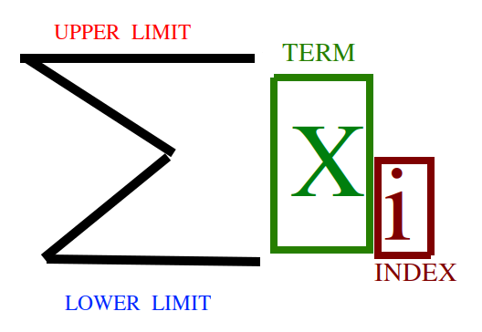

.. _algebra-problems:

-------
Alegbra
-------

Sums
----

.. warning::

    There will be many obligatory *sum* puns on this page.

Something About Sums
^^^^^^^^^^^^^^^^^^^^

*Some* mathematical expressions are *sums*.

.. warning::

    Told you.

A *sum* is a type of operation, like *+*, *-*, *x* and *%* (addition, subtraction, multiplication, division), but there is a key difference. The arithmetic operations mentioned in the previous sentence *operate* on *numbers*. The *sum* symbol operates on *sets*.

Sum Anatomy
^^^^^^^^^^^

.. note::

    :math:`\sum` is the capital Greek letter, *epsilon*.

The different parts of the sum are: the **upper limit**, the **lower limit**, the **term** and the **index**. These components can be identified with the following diagram,

A sum contains two important bits of information:

1. Instructions on how to construct each *term*.
2. Instructions on how to combine each *term*.

Sum Examples
^^^^^^^^^^^^

Example 1
*********

.. math::

    \sum_{i=1}^{5} i 

Let's break it down, term by term. The first set of instructions a *sum* gives us is instructions on how to construct each *term* of the *sum*. The *index* tells us to look at the numbers :math:`i = 1, 2, 3, 4, 5` and then create the term :math:`i` for each one. We start at :math:`1` because the *lower limit* is :math:`i = 1`. We go up to :math:`5` because the *upper limit* is :math:`5`.

.. important::

    The *index* of a *sum* always increases by one, as you move from term to term.

A table will help visualize this,

+-------+-------+-------+-------+-------+-------+
| Index |   1   |   2   |   3   |   4   |   5   |   
+-------+-------+-------+-------+-------+-------+
| Term  |   1   |   2   |   3   |   4   |   5   |
+-------+-------+-------+-------+-------+-------+

In this case, each *term* is equal to the *index* because the expression that defines the *term* is just :math:`i`.

Now that we know what each term of the *sum* is, we move on to the instructions that tell us how to *combine these terms*. To *sum*, we take each *term* of the *set* (the bottom row of the table) and add it up,

.. math::

    \sum_{i=1}^5 i = 1 + 2 + 3 + 4 + 5 = 15

Example 2
*********

Let's make it more complicated. Suppose you were given the expression,

.. math::

    \sum_{i=1}^{4} \frac{i^2}{4}

In the same fashion, we first determine the terms of the sum by looking at the values of the index for :math:`i=1,2,3,4` (from the *lower limit* to the *upper limit*)

+-------+--------------------------------------+-------------------------------------+---------------------------------------+---------------------------------------+---------------------------------------+
| Index |             1                        |            2                        |            3                          |               4                       |               5                       |   
+-------+--------------------------------------+-------------------------------------+---------------------------------------+---------------------------------------+---------------------------------------+
| Term  |  :math:`\frac{1^2}{4} = \frac{1}{4}` | :math:`\frac{2^2}{4} = \frac{4}{4}` |  :math:`\frac{3^2}{4} = \frac{9}{4}`  |  :math:`\frac{4^2}{4} = \frac{16}{4}` |  :math:`\frac{5^2}{4} = \frac{25}{4}` |
+-------+--------------------------------------+-------------------------------------+---------------------------------------+---------------------------------------+---------------------------------------+

Then, once we have each one, we add up each *term*,

.. math::

    \sum_{i=1}^{4} \frac{i^2}{4} = \frac{1}{4} + \frac{4}{4} + \frac{9}{4} + \frac{16}{4} + \frac{25}{4} = \frac{55}{4} = 13.75

Sum Complications 
^^^^^^^^^^^^^^^^^

Sometimes *sums* do not tell us *how* to make the terms of the summation; sometimes they tell us *what* the terms are. In other words, rather than giving us a *formula* involving the index, sometimes a sum will tell you to take *terms* from a particular *sample* (also known mathematically as a *set*). 

Example 3
*********

Suppose you were given the following *sample* (*set*),

.. math::

    S = \{ 15, 12, 13, 17, 18 \}

Each individual in this *sample* (*set*) can be *indexed*,

.. math::

    S = \{ x_1, x_2, x_3, x_4, x_5 \}

Where we have *indexed* each observation according to the scheme,

+-----------+-------------+
| :math:`i` | :math:`x_i` |
+-----------+-------------+
|     1     |     15      |
+-----------+-------------+
|     2     |     12      | 
+-----------+-------------+
|     3     |     13      |
+-----------+-------------+
|     4     |     17      |
+-----------+-------------+
|     5     |     18      |
+-----------+-------------+

If you are given a *sample* (*set*) and you encounter a *sum* that looks like,

.. math::

    \sum_{i=1}^n x_i

This type of *sum* is telling you to take each *term* (*member*) of the *indexed sample* (*set*) and sum them up.

Going back to the example,

.. math::

    S = \{ 15, 12, 13, 17, 18 \}

We can calculate the sum of this *sample* (*set*) :math:`S` by summing up each *term*,

.. math::

    \sum_{i = 1}^5 x_i = x_1 + x_2 + x_3 + x_4 + x_5 = 15 + 12 + 13 + 17 + 18 = 75

Sum Problems
^^^^^^^^^^^^

1. Given 

.. math::

    \sum_{i=1}^5 (2\cdot i + 1)
    
a. Find the terms of the *summation* by filling out the table,

    +-------+-------+-------+-------+-------+-------+
    | Index |   1   |   2   |   3   |   4   |   5   |   
    +-------+-------+-------+-------+-------+-------+
    | Term  |   ?   |   ?   |   ?   |   ?   |   ?   |
    +-------+-------+-------+-------+-------+-------+

b. Calculate the sum :math:`\sum_{i=1}^5 (2\cdot i + 1)`

2. Given 

.. math::

    \sum_{i=1}^5 (i - 3)^2

a. Find the terms of the *summation* by filling out the table, 

    +-------+-------+-------+-------+-------+-------+
    | Index |   1   |   2   |   3   |   4   |   5   |   
    +-------+-------+-------+-------+-------+-------+
    | Term  |   ?   |   ?   |   ?   |   ?   |   ?   |
    +-------+-------+-------+-------+-------+-------+

b. Calculate the sum :math:`\sum_{i=1}^5 (i - 3)^2`

3. Given 

.. math::

    \sum_{i=1}^5 (i-3) \cdot (i + 3)

a. Find the terms of the *summation* by filling out the table, 

    +-------+-------+-------+-------+-------+-------+
    | Index |   1   |   2   |   3   |   4   |   5   |   
    +-------+-------+-------+-------+-------+-------+
    | Term  |   ?   |   ?   |   ?   |   ?   |   ?   |
    +-------+-------+-------+-------+-------+-------+

b. Calculate the sum :math:`\sum_{i=1}^5 (i-3) \cdot (i + 3)`

4. Given 

.. math:: 

    S = \{ 20, 18, 18, 21, 22 \}

.. math::

    \sum_{i=1}^{5} x_i 

a. Find the terms of the *sumation* by filling out the table,

    +-------+-------+-------+-------+-------+-------+
    | Index |   1   |   2   |   3   |   4   |   5   |   
    +-------+-------+-------+-------+-------+-------+
    | Term  |   ?   |   ?   |   ?   |   ?   |   ?   |
    +-------+-------+-------+-------+-------+-------+

b. Calculate the sum :math:`\sum_{i=1}^{5} x_i`

5. Given

.. math:: 

    S = \{ (3,4), (4,7), (5, 4), (6, 6), (7, 8) \}

.. math::

    \sum_{i=1}^{5} (x_i - 5) \cdot (y_i - 5.8)

a. Find the terms of the *sumation* by filling out the table,

    +-------+-------+-------+-------+-------+-------+
    | Index |   1   |   2   |   3   |   4   |   5   |   
    +-------+-------+-------+-------+-------+-------+
    | Term  |   ?   |   ?   |   ?   |   ?   |   ?   |
    +-------+-------+-------+-------+-------+-------+

b. Calculate the sum :math:`\sum_{i=1}^{5} (x_i - 5) \cdot (y_i - 5.8)`
