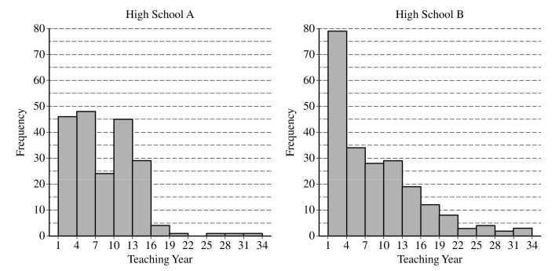
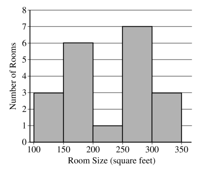
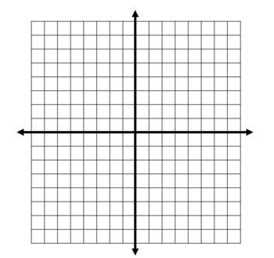
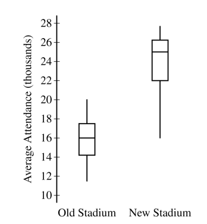
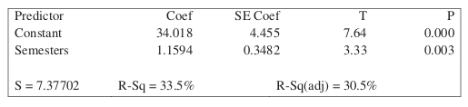
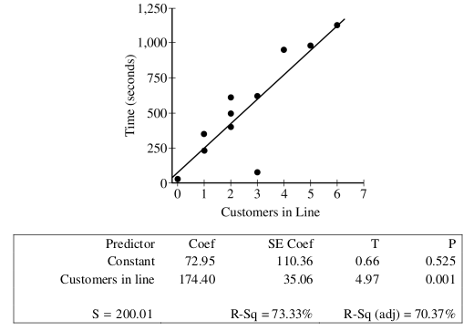

.. _statistics-problems:

----------
Statistics
----------

.. _statistics-graphical-representations-problems:

Graphical Representations
-------------------------

.. topic:: Instructions

    Start a fresh page in your classwork notebook. Write today's date in the margin of the page. Clearly label and solve each of the following. Show your work and circle the anwer. 

Electric Vehicle Distribution
^^^^^^^^^^^^^^^^^^^^^^^^^^^^^

The United States Government General Services Administration maintains a huge database of public available information. One of the datasets they publish is the `Battery Electric Vehicles (BEVs) and Plug-in Hybrid Electric Vehicles (PHEVs) that are currently registered through Washington State Department of Licensing <https://catalog.data.gov/dataset/electric-vehicle-population-data>`_

A random sample of 18 eletric vehicles was selected from this dataset and the *make* of the car was recorded. The resuls are given below,

    BMW, FORD, CHEVROLET, TESLA, FORD, BMW, VOLVO, TESLA, TESLA, NISSAN, CHEVROLET, BMW, TESLA, NISSAN, CHEVROLET, TESLA, TESLA, CHEVROLET

1. What is the population being sampled in this experiment?
   
2. Construct a relative frequency distribution and histogram for this sample of data. Label the axes. What is the most common (frequent) electric vehicle make in this sample of data?

3. Based on this sample, can we conclude your answer to #2 is the most common eletric vehicle make in the United States? Why or why not? 

.. note:: 

    We will come back and examine this dataset in :ref:`project-one`.

Twitter by Tweets and Followers
^^^^^^^^^^^^^^^^^^^^^^^^^^^^^^^

.. important:: 

    The data will be downloaded directly onto the your calculator in class via a cable link. 

    If you want to try out the dataset in **Python** at any point, you can download the full dataset `here <../../_static/csv/cultural/celebrity-twitter-data.csv>`_

The following table lists the top 20 **Twitter** users by follower count (as of 2022).

`Source: Kaggle <https://www.kaggle.com/datasets/ahmedshahriarsakib/top-1000-twitter-celebrity-tweets-embeddings>`_

+-----------------------+---------------------+-----------------------+-----------------+
|   Twitter Username    |      Name           |    Followers Count    |   Tweet Count   |
+-----------------------+---------------------+-----------------------+-----------------+
|      BarackObama      |     Barack Obama    |       13444655        |      16467      |
+-----------------------+---------------------+-----------------------+-----------------+
|      justinbieber     |     Justin Bieber   |       114357427       |       31399     |
+-----------------------+---------------------+-----------------------+-----------------+
|        katyperry      |     KATY PERRY      |       108900656       |       11625     |
+-----------------------+---------------------+-----------------------+-----------------+
|         rihanna       |      Rihanna        |       106201663       |       10630     |
+-----------------------+---------------------+-----------------------+-----------------+
|       Cristiano       |  Cristiano Ronaldo  |       99274403        |        3780     |
+-----------------------+---------------------+-----------------------+-----------------+
|      taylorswift13    |     Taylor Swift    |        90373941       |         716     |
+-----------------------+---------------------+-----------------------+-----------------+
|        ladygaga       |     The Countess    |        84576292       |        9744     |
+-----------------------+---------------------+-----------------------+-----------------+
|        elonmusk       |       Elon Musk     |       82898543        |        17487    |
+-----------------------+---------------------+-----------------------+-----------------+
|      TheEllenShow     |   Ellen DeGeneres   |      77595645         |       23819     |
+-----------------------+---------------------+-----------------------+-----------------+
|     KimKardashian     |   Kim Kardashian    |      72170641         |       35405     |
+-----------------------+---------------------+-----------------------+-----------------+
|      selenagomez      |     Selena Gomez    |        65791273       |        5388     |
+-----------------------+---------------------+-----------------------+-----------------+
|       jtimberlake     |   Justin Timberlake |       63231222        |        4348     |
+-----------------------+---------------------+-----------------------+-----------------+
|       BillGates       |      Bill Gates     |        58128522       |        3848     |
+-----------------------+---------------------+-----------------------+-----------------+
|        neymarjr       |       Neymar Jr     |        56508547       |       42181     |
+-----------------------+---------------------+-----------------------+-----------------+
|      britneyspears    |   Britney Spears    |        55863848       |        5632     |
+-----------------------+---------------------+-----------------------+-----------------+
|        ddlovato       |      Demi Lovato    |        54260759       |        17793    |
+-----------------------+---------------------+-----------------------+-----------------+
|        shakira        |       Shakira       |        52803100       |        7805     |
+-----------------------+---------------------+-----------------------+-----------------+
|        jimmyfallon    |     jimmy fallon    |        51467139       |      14098      |
+-----------------------+---------------------+-----------------------+-----------------+
|        KingJames      |     LeBron James    |        51182528       |       8347      |
+-----------------------+---------------------+-----------------------+-----------------+
|        imVkohli       |       Virat Kohli   |         47768699      |        2593     |
+-----------------------+---------------------+-----------------------+-----------------+

Use this information to answer the following questions.

1. Construct a frequency distribution for the *follower count* of the top twenty Twitter users. Use 8 classes for this sample of data.

    a. Find the class width. 

    b. Find the class limits. 

    c. Find the class frequencies. 

    d. Using the frequency distribution, create a histogram of the sample. Sketch the histogram in your classwork notebook. Make sure to label the axes and classes.

    e. What is the shape of this distribution? What does this tell you about this sample? 

2. Construct a cumulative frequency distribution for the 8 classes.

    a. Using the *cumulative* frequency distribution, create a histogram of the sample. Sketch the cumulative histogram in your classwork notebook. Make sure to label the axes and classes.

    b. Based on this histogram and distribution, what percent of the distribution is below the seventh class? Justify your answer.

    c. Based on this histogram and distribution, estimate the median of this distribution. Justify your answer.

    d. Based on this histogram and distribution, estimate the 25 :sup:`th` percentile of this distribution, i.e. find the class where at least 25 percent of the distribution is *below* it.  

3. Construct a boxplot using the *follower count* for the top twenty Twitter users. 

    a. Sketch the boxplot in your classwork notebook. Be sure to label the axes. In addition, label the points on the graph that correspond to the five-number summary: minimum, 1 :sup:`th` quartile, median, 2 :sup:`nd` quartile, maximum. 

    b. Based on this boxplot, what is the *75* :sup:`th` percentile of this distribution?

    c. Based on this box plot, what is the *25* :sup:`th` percentile of this distribution?

    d. Compare your answers in part *a* and *b* with your answers to *#2b* and *#2d*. Why are these answers different? Which answer is more accurate? Why?

    e. Is the median of this distribution closer to the minimum value of the sample or the maximum value of the sample?

4. Using *follower count* as the *response variable* and *tweet count* as the *indicator variable*, create a scatter plot of *follower count* vs. *tweet count*.

    a. Sketch the scatter plot in your classwork notebook. Label your axes. 

    b. Describe the type of correlation seen in this graph. What does this tell you about the relationship between *follower count* and *tweet count*?

Problems 
^^^^^^^^

1. **2021, Free Response, #5a-b** 

A research center conducted a national survey about teenage behavior. Teens were asked whether they had consumed a soft drink in the past week. The following table shows the counts for three independent random samples from major cities.

+-------+-----------+---------+-----------+-------+
|       | Baltimore | Detroit | San Diego | Total |
+-------+-----------+---------+-----------+-------+
| Yes   | 727       | 1,232   | 1,482     | 3,441 |
+-------+-----------+---------+-----------+-------+
| No    | 177       | 431     | 798       | 1,406 |
+-------+-----------+---------+-----------+-------+
| Total | 904       | 1,663   | 2,280     | 4,847 |
+-------+-----------+---------+-----------+-------+

    a. Suppose one teen is randomly selected from each city's sample. A researcher claims that the likelihood of selecting a teen from Baltimore who consumed a soft drink in the past week is less than the likelihood of selecting a teen from either one of the other cities who consumed a soft drink in the past week because Baltimore has the least number of teens who consumed a soft drink. Is the researcher's claim correct? Explain your answer.

    b. Consider the values in the table. Construct a segmented bar chart of relative frequencies based on the information in the table. 
    
    c. Which city had the smallest proportion of teens who consumed a soft drink in the previous week? Determine the value of the proportion.

2. **2018, Free Response #5** 
   
The following histograms summarize the teaching year for the teachers at two high schools, A and B.

Teaching year is recorded as an integer, with first-year teachers recorded as 1, second-year teachers recorded as 2, and so on. Both sets of data have a mean teaching year of 8.2, with data recorded from 200 teachers at High School A and 221 teachers at High School B. On the histograms, each interval represents possible integer values from the left endpoint up to but not including the right endpoint.

    a. The median teaching year for one high school is 6, and the median teaching year for the other high school is 7. Identify which high school has each median and justify your answer.

    b. An additional 18 teachers were not included with the data recorded from the 200 teachers at High School A. The mean teaching year of the 18 teachers is 2.5. What is the mean teaching year for all 218 teachers at High School A?

3. **2015, Free Response, #1**

Two large corporations, A and B, hire many new college graduates as accountants at entry-level positions. In 2009 the starting salary for an entry-level accountant position was $36,000 a year at both corporations. At each corporation, data were collected from 30 employees who were hired in 2009 as entry-level accountants and were still employed at the corporation five years later. The yearly salaries of the 60 employees in 2014 are summarized in the boxplots below.

.. image:: ../../../_static/img/problems/2015-apstats-frp-1.png
    :align: center

a. Write a few sentences comparing the distributions of the yearly salaries at the two corporations.

b. Suppose both corporations offered you a job for $36,000 a year as an entry-level accountant. Based on the boxplots, give one reason why you might choose to accept the job at corporation A.

c. Suppose both corporations offered you a job for $36,000 a year as an entry-level accountant. Based on the boxplots, give one reason why you might choose to accept the job at corporation B.

4. **2016, Free Response, #2**

Product advertisers studied the effects of television ads on children's choices for two new snacks. The advertisers used two 30-second television ads in an experiment. One ad was for a new sugary snack called Choco-Zuties, and the other ad was for a new healthy snack called Apple-Zuties.

For the experiment, 75 children were randomly assigned to one of three groups, A, B, or C. Each child individually watched a 30-minute television program that was interrupted for 5 minutes of advertising. The advertising was the same for each group with the following exceptions.

- The advertising for group A included the Choco-Zuties ad but not the Apple-Zuties ad.
- The advertising for group B included the Apple-Zuties ad but not the Choco-Zuties ad.
- The advertising for group C included neither the Choco-Zuties ad nor the Apple-Zuties ad.

After the program, the children were offered a choice between the two snacks. The table below summarizes their choices.

.. image:: ../../../_static/img/problems/2016-apstats-frp-02.png
    :align: center

Use this information to answer the following questions.

	a. Do the data provide convincing statistical evidence that there is an association between type of ad and children's choice of snack among all children similar to those who participated in the experiment?

	b. Write a few sentences describing the effect of each ad on children's choice of snack.

5. **2009, Free Response Form B, #1**

    
As gasoline prices have increased in recent years, many drivers have expressed concern about the taxes they pay on gasoline for their cars. In the United States, gasoline taxes are imposed by both the federal government and by individual states. The boxplot above shows the distribution of the state gasoline taxes, in cents per gallon, for all 50 states on January 1, 2006.

a. Based on the boxplot, what are the approximate values of the median and the interquartile range of the distribution of state gasoline taxes, in cents per gallon? Mark and label the boxplot to indicate how you found the approximated values.

b. The federal tax imposed on gasoline was 18.4 cents per gallon at the time the state taxes were in effect. The federal gasoline tax was added to the state gasoline tax for each state to create a new distribution of combined gasoline taxes. What are approximate values, in cents per gallon, of the median and interquartile range of the new distribution of combined gasoline taxes? Justify your answer.

.. _point-estimation-problems:

Point Estimation
================

1. **2019, Free Response, #1**

The sizes, in square feet, of the 20 rooms in a student residence hall at a certain university are summarized in the following histogram.

Use this information to answer the following questions.

	a. Based on the histogram, write a few sentences describing the distribution of room size in the residence hall.

	b. Summary statistics for the sizes are given in the following table.Determine whether there are potential outliers in the data. Then use the following grid to sketch a boxplot of room size.

    
Use the graph you created to answer the following question.

	c. What characteristic of the shape of the distribution of room size is apparent from the histogram but not from the boxplot?
    
2. **2016, Free Response, #1**

Robin works as a server in a small restaurant, where she can earn a tip (extra money) from each customer she serves. The histogram below shows the distribution of her 60 tip amounts for one day of work.

Use this information to answer the following questions.

	a. Write a few sentences to describe the distribution of tip amounts for the day shown.

	b. One of the tip amounts was $8. If the $8 tip had been $18, what effect would the increase have had on the following statistics? Justify your answers.

		The mean:

		The median:

3. **2006, Free Response, #1**

Two parents have each built a toy catapult for use in a game at an elementary school fair. To play the game, students will attempt to launch Ping-Pong balls from the catapults so that the balls land within a 5-centimeter band. A target line will be drawn through the middle of the band, as shown in the figure below. All points on the target line are equidistant from the launching location.

If a ball lands within the shaded band, the student will win a prize. The parents have constructed the two catapults according to slightly different plans. They want to test these
catapults before building additional ones. Under identical conditions, the parents launch 40 Ping-Pong balls from each catapult and measure the distance that the ball travels before landing. Distances to the nearest centimeter are graphed in the dotplots below.

Use this information to answer the following questions.

	a. Comment on any similarities and any differences in the two distributions of distances traveled by balls launched from catapult A and catapult B.

	b. If the parents want to maximize the percentage of having the Ping-Pong balls land within the band, which one of the two catapults, A or B, would be better to use than the other? Justify your choice.

	c. Using the catapult that you chose in part *b*, how many centimeters from the target line should this catapult be placed? Explain why you chose this distance.

4. **2003, Free Response, #1**

Since Hill Valley High School eliminated the use of bells between classes, teachers have noticed that more students seem to be arriving to class a few minutes late. One teacher decided to collect data to determine whether the students' and teachers' watches are displaying the correct time. At exactly 12:00 noon, the teacher asked 9 randomly selected students and 9 randomly selected teachers to record the times on their watches to the nearest half minute. The ordered data showing minutes after 12:00 as positive values and minutes before 12:00 as negative values are shown in the table below.

+----------+------+------+------+------+------+------+-----+-----+-----+
| Students | -4.5 | -3.0 | -0.5 | 0    | 0    | 0.5  | 0.5 | 1.5 | 5.0 |
+----------+------+------+------+------+------+------+-----+-----+-----+
| Teachers | -2.0 | -1.5 | -1.5 | -1.0 | -1.0 | -0.5 | 0   | 0   | 0.5 |
+----------+------+------+------+------+------+------+-----+-----+-----+

Use this information to answer the following questions.

	a. Construct parallel boxplots using these data.

	b. Based on the boxplots in part *#a*, which of the two groups, students or teachers, tends to have watch times that are closer to the true time? Explain your choice.

5. **2006, Free Response Form B, #1**

A large regional real estate company keeps records of home sales for each of its sales agents. Each month, the company publishes the sales volume for each agent. Monthly sales volume is defined as the total sales price of all homes sold by the agent during a month. The figure below displays the cumulative relative frequency plot of the most recent monthly sales volume (in hundreds of thousands of dollars) for these agents.

	
Use this information to answer the following questions.

	a. In the context of this question, explain what information is conveyed by the circled point.

	b. What proportion of sales agents achieved monthly sales volumes between $700,000 and $800,000 ?

	c. For values between 10 and 11 on the horizontal axis, the cumulative relative frequency plot is flat. In the context of this question, explain what this means.

	d. A bonus is to be given to 20 percent of the sales agents. Those who achieved the highest monthly sales volume during the preceding month will receive a bonus. What is the minimum monthly sales volume an agent must have achieved to qualify for the bonus?

6. **2007, Free Response, #1**

The department of agriculture at a university was interested in determining whether a preservative was effective in reducing discoloration in frozen strawberries. A sample of 50 ripe strawberries was prepared for freezing. Then the sample was randomly divided into two groups of 25 strawberries each. Each strawberry was placed into a small plastic bag.

The 25 bags in the control group were sealed. The preservative was added to the 25 bags containing strawberries in the treatment group, and then those bags were sealed. All bags were stored at 0⬚C for a period of 6 months. At the end of this time, after the strawberries were thawed, a technician rated each strawberry's discoloration from 1 to 10, with a low score indicating little discoloration.

The dotplots below show the distributions of discoloration rating for the control and treatment groups.

Use this information to answer the following questions.

	a. Find the mean and median of both the test group and control group.

	b. Comment on the shape of the control distribution versus the shape of the test distribution. Justify your answer with calculations.

	c. Based on the dotplots and your answers to part *#a* and *#b*, comment on the effectiveness of the preservative in lowering the amount of discoloration in strawberries.

7. **AP Question Bank**

To determine the amount of sugar in a typical serving of breakfast cereal, a student randomly selected 60 boxes of different types of cereal from the shelves of a large grocery store.

The student noticed that the side panels of some of the cereal boxes showed sugar content based on one-cup servings, while others showed sugar content based on three-quarter-cup servings. Many of the cereal boxes with side panels that showed three-quarter-cup servings were ones that appealed to young children, and the student wondered whether there might be some difference in the sugar content of the cereals that showed different-size servings on their side panels. To investigate the question, the data were separated into two groups. One group consisted of 29 cereals that showed one-cup serving sizes; the other group consisted of 31 cereals that showed three-quarter-cup serving sizes. The boxplots shown below display sugar content (in grams) per serving of the cereals for each of the two serving sizes.

.. image:: ../../../_static/img/problems/data-transformations-01.png
    :align: center

Two box plots are shown using the same horizontal axis, which shows sugar content per serving in grams and is labeled from 0 to 22 in increments of 2. The bottom plot is for three quarters of a cup. The box extends from 8 to 12 with a vertical line at 10 dividing it into two regions. A horizontal line off the left of the box extends to 4 and a horizontal line off the right extends to 14. The top plot is for one cup. The box extends from 4 to 14 with a vertical line at 12 dividing it into two regions. A horizontal line off the left of the box extends to 0 and a horizontal line off the right extends to 20.

	a. Write a few sentences to compare the distributions of sugar content per serving for the two serving sizes of cereals.

After analyzing the boxplots on the preceding page, the student decided that instead of a comparison of sugar content per recommended serving, it might be more appropriate to compare sugar content for equal-size servings. To compare the amount of sugar in serving sizes of one cup each, the amount of sugar in each of the cereals showing three-quarter-cup servings on their side panels was multiplied by 4/3. The bottom boxplot shown below displays sugar content (in grams) per cup for those cereals that showed a serving size of three-quarter-cup on their side panels.

.. image:: ../../../_static/img/problems/data-transformations-01.png
    :align: center
    
Two box plots are shown using the same horizontal axis, which shows adjusted sugar content per serving in grams and is labeled from 0 to 22 in increments of 2. The bottom plot is for three quarters of a cup. The box extends from 10 to 16 with a vertical line at 13 dividing it into two regions. A horizontal line off the left of the box extends to 5 and a horizontal line off the right extends to 20. The top plot is for one cup. The box extends from 4 to 14 with a vertical line at 12 dividing it into two regions. A horizontal line off the left of the box extends to 0 and a horizontal line off the right extends to 20.

	b. What new information about sugar content do the boxplots above provide?

	c. Based on the boxplots shown above on this page, how would you expect the mean amounts of sugar per cup to compare for the different recommended serving sizes? Explain.

.. _statistics-correlation-problems:

Correlation
-----------

1. **2008, Free Response, #4**

An experiment was conducted to study the effect of temperature on the reliability of an electronic device used in an undersea communications system. The experiment was done in a laboratory where tanks of seawater were maintained at either 10 C, 30 C, 50 C, or 70 C. After the electronic devices were submerged in the tanks for 5,000 hours, each device was inspected to determine if it was still working. The following table provides information on the number of devices tested at each temperature and the number of working devices at the end of the 5,000-hour test.

+----------------------+------+------+------+------+
| Seawater temperature | 10 C | 30 C | 50 C | 70 C |
+----------------------+------+------+------+------+
| # of working devices | 29   |  42  |  21  |  12  |
+----------------------+------+------+------+------+
| # of devices tested  | 30   |  50  |  30  |  20  |
+----------------------+------+------+------+------+

You may assume that the result for any single device is not influenced by the result for any other device.

Use this graph to answer the following questions.

	a. Using the information in the table, construct a scatterplot that would be useful for showing the effect of water temperature on the ability of the devices to work for at least 5,000 hours.

	b. Comment on any trend or pattern that is revealed by the scatterplot you constructed.

	c. An estimate of the proportion of devices that would work after 5,000 hours of submersion in 40 C seawater can be obtained by averaging the estimates at 30 C and 50 C. Compute this estimate and the associated standard error.

2. **2010, Free Response, #1**

Agricultural experts are trying to develop a bird deterrent to reduce costly damage to crops in the United States. An experiment is to be conducted using garlic oil to study its effectiveness as a nontoxic, environmentally safe bird repellant. The experiment will use European starlings, a bird species that causes considerable damage annually to the corn crop in the United States. Food granules made from corn are to be infused with garlic oil in each of five concentrations of garlic: 0 percent, 2 percent, 10 percent, 25 percent, and 50 percent. 

The researchers will determine the adverse reaction of the birds to the repellant by measuring the number of food granules consumed during a two-hour period following overnight food deprivation. There are forty birds available for the experiment, and the researchers will use eight birds for each concentration of garlic. Each bird will be kept in a separate cage and provided with the same number of food granules.

a. For the experiment, identify
	
	i. the treatments

	ii. the experimental units

	iii. the response that will be measured

b. After performing the experiment, the researchers recorded the data shown in the table below.

+---------------------------------------+----+-----+-----+-----+-----+
| Garlic oil concentration              | 0% |  2% | 10% | 25% | 50% |
+---------------------------------------+----+-----+-----+-----+-----+
| Mean number of food granules consumed | 58 |  48 | 29  | 24  |  20 |
+---------------------------------------+----+-----+-----+-----+-----+
| Number of birds                       | 8  |  8  |  8  |  8  |  8  |
+---------------------------------------+----+-----+-----+-----+-----+

Use this table and graph for the following problems,

	i. Construct a graph of the data that could be used to investigate the appropriateness of a linear regression model for analyzing the results of the experiment.
	
	ii. Based on your graph, do you think a linear regression model is appropriate? Explain.
	
3. **2012, Free Response, #1**

The scatterplot below displays the price in dollars and quality rating for 14 different sewing machines.

	
a. Describe the nature of the association between price and quality rating for the sewing machines.

b. One of the 14 sewing machines substantially affects the appropriateness of using a linear regression model to predict quality rating based on price. Report the approximate price and quality rating of that machine and explain your choice.

c. Chris is interested in buying one of the 14 sewing machines. He will consider buying only those machines for which there is no other machine that has both higher quality and lower price. On the scatterplot reproduced below, circle all data points corresponding to machines that Chris will consider buying.

4. **2021, Free Response, #6**

Attendance at games for a certain baseball team is being investigated by the team owner. The following boxplots summarize the attendance, measured as average number of attendees per game, for 47 years of the team's existence. The boxplots include the 30 years of games played in the old stadium and the 17 years played in the new stadium.

a. Compare the distributions of average attendance between the old and new stadiums.

b. The following scatterplot shows average attendance versus year,

Compare the trends in average attendance over time between the old and new stadium.

c. Consider the following scatterplots,

Use these graphs to answer the following question,

	i. Graph I shows the average attendance versus number of games won for each year. Describe the relationship between the variables.

	ii. Graph II shows the same information as Graph I, but also indicates the old and new stadiums. Does Graph II suggest that the rate at which attendance changes as number of games won increases is different in the new stadium compared to the old stadium? Explain your reasoning. 

d. Consider the three variables: number of games won, year, and stadium. Based on the graphs, explain how one of those variables could be a confounding variable in the relationship between average attendance and the other variables.

.. _statistics-regression-problems:

Regression
----------

1. **2016, Free Response, #6**

A newspaper in Germany reported that the more semesters needed to complete an academic program at the university, the greater the starting salary in the first year of a job. The report was based on a study that used a random sample of 24 people who had recently completed an academic program. Information was collected on the number of semesters each person in the sample needed to complete the program and the starting salary, in thousands of euros, for the first year of a job. The data are shown in the scatterplot below.

Use this scatterplot to ansewr the following questions.

	a. Does the scatterplot support the newspaper report about number of semesters and starting salary? Justify your answer.

Use this scatterplot to answer the following questions.

	b. The table above shows computer output from a linear regression analysis on the data. Identify the slope of the least-squares regression line, and interpret the slope in context.

An independent researcher received the data from the newspaper and conducted a new analysis by separating the data into three groups based on the major of each person. A revised scatterplot identifying the major of each person is shown below.

Use this revised scatterplot to answer the following questions.

	c. Based on the people in the sample, describe the association between starting salary and number of semesters for the business majors.

	d. Based on the people in the sample, compare the median starting salaries for the three majors.

	e. Based on the analysis conducted by the independent researcher, how could the newspaper report be modified to give a better description of the relationship between the number of semesters and the starting salary for the people in the sample?

2. **2011, Free Response, #5**

Windmills generate electricity by transferring energy from wind to a turbine. A study was conducted to examine the relationship between wind velocity in miles per hour (mph) and electricity production in amperes for one particular windmill. For the windmill, measurements were taken on twenty-five randomly selected days, and the computer output for the regression analysis for predicting electricity production based on wind velocity is given below. The regression model assumptions were checked and determined to be reasonable over the interval of wind speeds represented in the data, which were from 10 miles per hour to 40 miles per hour.

Use this information to answer the following questions.

	a. Use the computer output above to determine the equation of the least squares regression line. Identify all variables used in the equation.

	b. How much more electricity would the windmill be expected to produce on a day when the wind velocity is 25 mph than on a day when the wind velocity is 15 mph? Show how you arrived at your answer.

	c. What proportion of the variation in electricity production is explained by its linear relationship with wind velocity?

	d. Is there statistically convincing evidence that electricity production by the windmill is related to wind velocity? Explain.

3. **2018, Free Response, #1**

The manager of a grocery store selected a random sample of 11 customers to investigate the relationship between the number of customers in a checkout line and the time to finish checkout. As soon as the selected customer entered the end of a checkout line, data were collected on the number of customers in line who were in front of the selected customer and the time, in seconds, until the selected customer was finished with the checkout. The data are shown in the following scatterplot along with the corresponding least-squares regression line and computer output.

	
Use this information to answer the following questions.

	a. Identify and interpret in context the estimate of the intercept for the least-squares regression line.

	b. Identify and interpret in context the coefficient of determination, :math:`r^2`.

	c. One of the data points was determined to be an outlier. Circle the point on the scatterplot and explain why the point is considered an outlier.

4. **2017, Free Response, #1**

Researchers studying a pack of gray wolves in North America collected data on the length **x**, in meters, from nose to tip of tail, and the weight y, in kilograms, of the wolves. A scatterplot of weight versus length revealed a relationship between the two variables described as positive, linear, and strong.

	a. For the situation described above, explain what is meant by each of the following words.

		i. Positive:

		ii. Linear:

		iii. Strong:
		
	b. The data collected from the wolves were used to create the least-squares equation :math:`hat{y}_i = -16.46 + 35.02 \cdot x_i`. Interpret the meaning of the slope of the least-squares regression line in context.

	c. One wolf in the pack with a length of :math:`1.4` meters had a residual of :math:`-9.67` kilograms. What was the weight of the wolf?

.. _sampling-distribution-problems:

Sampling Distributions
----------------------

.. topic:: Sampling Distribution for Sample Proportion

	If :math:`\mathcal{X}_i \sim \text{Bern}(p)` for :math:`i = 1, 2, ..., n` and the following **conditions for inference** are met,
	
	1. :math:`n \cdot p \geq 10`
	2. :math:`n \cdot (1 - p) \geq 10`
	
	The random variable, :math:`\hat{p} = \frac{\mathcal{X}_1 + \mathcal{X}_2 + ... + \mathcal{X}_n}{n}` has the following distribution,
	
	.. math::
	
		\hat{p} \sim \mathcal{N}(p, \sqrt{\frac{p \cdot (1 - p)}{n}}) 

.. topic:: Sampling Distribution for Difference of Sample Proportions

	If :math:`\mathcal{X}_i \sim \text{Bern}(p_x)` for :math:`i = 1, 2, ..., n_x` and the following **conditions for inference** are met,
	
	1. :math:`n_x \cdot p_x \geq 10`
	2. :math:`n_x \cdot (1 - p_x) \geq 10`
	
	**And** if :math:`\mathcal{Y}_i \sim \text{Bern}(p_y)` for :math:`i = 1, 2, ..., n_y` and the following **conditions for inference** are met,
	
	3. :math:`n_y \cdot p_y \geq 10`
	4. :math:`n_y \cdot (1 - p_y) \geq 10`
	
	Then the random variable :math:`\hat{p}_x - \hat{p}_y` has the following distribution,
	
	.. math::
	
		\hat{p}_{x} - \hat{p}_y \sim \mathcal{N}(p_x - p_y, \sqrt{\frac{p_x \cdot (1 - p_x)}{n_x} + \frac{p_y \cdot (1 - p_y)}{n_y}} ) 

.. topic:: Sampling Distribution for the Sample Mean

	If 
		1. :math:`\mathcal{X}_i \sim \mathcal{N}(\mu, \sigma)` for :math:`i = 1, 2, ..., n` 
	
	**And** the following **conditions for inference** is met,
	
		2. :math:`n \geq 30`
		
	Then the random variable :math:`\bar{\mathcal{X}} = \frac{\mathcal{X}_1 + \mathcal{X}_2 + ... + \mathcal{X}_n}{n}` has the following distribution, 
	
	.. math::
	
		\bar{\mathcal{X}} \sim \mathcal{N}(\mu, \frac{\sigma}{\sqrt{n}})

.. topic:: Sampling Distribution for Difference of Sample Means

	If 
	
		1. :math:`\mathcal{X}_i \sim \mathcal{N}(\mu_x, \sigma_y)` for :math:`i = 1, 2, ..., n_x`
		
		2. :math:`\mathcal{Y}_i \sim \mathcal{N}(\mu_y, \sigma_x)` for :math:`i = 1, 2, ..., n_y` 
		
	And the following **conditions for inference** is met,
	
		3. :math:`min(n_1, n_2) \geq 30`
		
	Then the random variable :math:`\bar{\mathcal{X}} - \bar{\mathcal{Y}}` has the following distribution, 
	
	.. math::
	
		\bar{\mathcal{X}} - \bar{\mathcal{Y}} \sim \mathcal{N}(\mu_x - \mu_y, \sqrt{ \frac{{\sigma_x}^2}{n_x} + \frac{{\sigma_y}^2}{n_y}})

1. **Devore & Berk, 2007, Chapter 6.1 #2**

There are two traffic lights on the way to work. Let :math:`\mathcal{X}_1` be the number of lights that are red, requiring a stop, and suppose the distribution of :math:`\mathcal{X}_1` is as follows,

+----------------+--------+---------+--------+
| :math:`x_1`    |   0    |    1    |    2   |
+----------------+--------+---------+--------+
| :math:`p(x_1)` |  0.2   |   0.5   |   0.3  |
+----------------+--------+---------+--------+

Let :math:`\mathcal{X}_2` be the numebr of lights that are red on the way home; :math:`\mathcal{X}_2` is independent of :math:`\mathcal{X}_1`. Assume that :math:`\mathcal{X}_2` has the same distribution as :math:`\mathcal{X}_1`, so that :math:`\mathcal{X}_1` and :math:`\mathcal{X}_2` is a random sample of size :math:`n=2`.

	a. Let :math:`\mathcal{T} = \mathcal{X}_1 + \mathcal{X}_2`. Find the probability distribution of :math:`\mathcal{T}`. 
	
	b. Calculate :math:`\mu_{T}`. How does it relate to :math:`\mu`, the population mean?
	
	c. Calculate :math:`{\sigma_T}^2`. How does it relate to :math:`\sigma^2`, the population variance?
	
2. **Absence Makes The Heart Grow Fonder**

Let :math:`\mathcal{X}` be the number of students absent from AP Statistics on a given day. Suppose the distribution of :math:`\mathcal{X}` is as follows,

+--------------+--------+---------+--------+---------+
| :math:`x`    |   1    |    2    |    3   |    4    |
+--------------+--------+---------+--------+---------+
| :math:`p(x)` |  0.4   |   0.3   |   0.2  |   0.1   |
+--------------+--------+---------+--------+---------+

	a. Consider a random sample of size :math:`n=2` (two days), and let :math:`\bar{\mathcal{X}}` be the sample mean of the number of absent students. Obtain the probability distribution of :math:`\bar{\mathcal{X}}`.
	
	b. What is the probability the average number of absent students for a sample of 2 is atleast 3 absent students?
	
	c. Is the sample mean an unbiased estimator?
	
	d. Consider again a random sample of size :math:`n=2`, and let :math:`\mathcal{R}` be the sample range of the number of absent students. Obtain the probability distribution of :math:`\mathcal{R}`.

	e. What is the probability the sample range for a sample of 2 is at most 2 absent students? 
	
	e. Is the sample range an unbiased estimator?
	
Sample Proportions
^^^^^^^^^^^^^^^^^^

1. **Handedness**

`Approximately 10% of the world's population is left handed <https://en.wikipedia.org/wiki/Handedness>`_. There are 347 students in the Bishop Walsh student body. Let us assume the Bishop Walsh student body is an exact representative sample of the population, i.e. 10% of the 347 students are left-handed. You decide to draw a simple random sample of students from the study body and measure whether or not they are left-handed.

	a. What are the parameters (expected value and standard deviation) of the population distribution?

	b. How many samples do you need to make to ensure the conditions for inference are met?
	
	c. What are the parameters (expected value and standard deviation) of the sampling distribution?
	
	d. Describe the shape of the samping distribution for :math:`\hat{p}`.
	
	e. Assuming the Wikipedia article referenced above is correct, what is the probability more than half of your sample of Bishop Walsh students are left-handed?
	
	f. Based on the answer to *part b* and *part e*, if you drew a sample of this size and estimated a value of :math:`\hat{p} = 0.5` for this sample, how would this evidence affect your belief in the claim from the Wikipedia article?
	
2. **Illuminati**

`According to a 2019 report by Business Insider, 15% of registered voters in the United States believe the Illuminati secretly controls world events <https://www.businessinsider.com/over-1-in-10-registered-voters-believe-the-illuminati-exists-2019-7>`_. 

	a. How many samples do you need to ensure the conditions for inference are met? 
	
	b. Suppose you randomly sample 50 registered voters living in the US. How likely is it this sample will contain less than 10% of people who believe in the Illuminati?

	c. In a sample of 50 registered voters, how many people who believe in the Illuminati do you need to observe before you can be reasonably convinced the percentage of registered voters who believe in the Illuminati is not equal to the claimed percentage?
	
3. **DVD Players**

`According to a survey conducted in 2022, 38% of 18-29 year olds from the United States live in a household that owns a DVD player <https://www.statista.com/statistics/369955/people-living-in-households-that-own-a-blu-ray-dvd-player-usa/>`_. Suppose you randomly sample 40 Americans between the ages of 18 and 29 years old. What is the probability the proportion of the people from this sample who live in a household with a DVD player will be greater than 45%? 

4. **Coins**

Suppose you flip a coin 100 times. If you allow for a 5% probability of being wrong, how many heads in a sample of 100 would you need to observe before you had convincing evidence the probability of heads for a single coin flip is greater than 50%?

Difference of Sample Proportions
^^^^^^^^^^^^^^^^^^^^^^^^^^^^^^^^

1. **Athletics**

At Bishop Walsh, the administration claims 75% of high school students participate in atleast one extra curricular activity, while 69% of middle students participate in atleast one extracurricular activity. 

During middle school lunch, Mr. Moore asks a random sample of 35 students whether or not they participate in atleast one extracurricular activity. During highschool lunch, Mr. Moore asks the same question to a random sample of 38 high school students.
 
Let :math:`\hat{p}_{\text{hs}}` represent the proportion of high school students in Mr. Moore's sample that participate in atleast one extracurricular activity. Let :math:`\hat{p}_{\text{ms}}` represent the proporition of middle school students in Mr. Moore's sample that participate in atleast one extracurricular activity.

	a. What is the shape of the sampling distribution :math:`\hat{p}_{\text{hs}} - \hat{p}_{\text{ms}}`? Justify your answer.
	
	b. If the administration's claim is true, find and interpret the mean of the sampling distribution for the difference of sample proportions between highschool and middleschool.
	
	c. If the administration's claim is true, find and interpret the standard deviation of the sampling distribution for the difference of sample proportions between highschool and middleschool.
	
	d. Assuming the administration's claim is true, what is the probability that the proportion of highschool students who participate in atleast one extracurricular is atleast 10% higher than the proportion of middle-school students who participate in atleast one extracurricular?
	
	e. Suppose the difference in proportions is exactly 0.10. Based on your result to *part d* does this give you reason to doubt the administration's claim?

2. **Skittles and M&Ms**

The manufacturers of Skittles claim 20% of each bag of Skittles is red. The manufacturers of M&M's claim 25% of each bag of M&Ms is red. Each bag of M&Ms contains 56 pieces. Each bag of Skittles contains 54 pieces. Assuming the manufacturers' claim to be true, what is the probability the proportion of red M&Ms in a bag will exceed the proportion of red Skittles in a bag?

Sample Means
^^^^^^^^^^^^

1. **Devore & Berk, 2007, Chapter 6.2 #17**

The lifetime of a certain brand of battery is normally distributed with a mean of 10 hours and a standard deviation of 1 hour. There are four batteries to a package. If you buy a single package, what is the probability the average lifetime of all of the batteries in the package exceeds 11 hours?

2. **Exams**

There are five students in Mr. Moore's AP Statistics. On the basis of his many years of experience, Mr. Moore knows the time it takes to grade a randomly chosen examination paper is normally distributed with a mean of 10 minutes and a standard deviation of 2.5 minutes. 

     a. What is the probability the average amount of time Mr. Moore spends grading the latest exams is less than 8 minutes?

     b. The latest Dragonball Z is on at 8 pm on the Cartoon Network. If Mr. Moore starts grading at 7:15 PM, what is the probability Mr. Moore misses part of the epic battle between Goku and Frieza?

Difference of Means
^^^^^^^^^^^^^^^^^^^
	
1. **Chemistry**

Mr. Myers notices the chemistry students in his morning class are measuring different pH values for a chemical compound than the students in his afternoon class. There are 10 students in his morning class and 15 students in his afternoon class. Mr. Myers decides to calculate the average pH of each class and compare them.

Suppose the pH measured by a randomly selected chemistry student is normally distributed with a mean pH of 5.00 and a standard deviation of 0.2. What is the probability the difference of the class averages for the pH will be within 0.1 of each other?

2. **2008, Free Response, #2**

Four different statistics have been proposed as estimators of a population parameter. To investigate the behavior of these estimators, 500 random samples are selected from a known population and each statistic is calculated for each sample. The true value of the population parameter is 75. The graphs below show the distribution of values for each statistic.

	
Use the information to solve the following problems.

	a. Which of the statistics appear to be unbiased estimators of the population parameter? How can you tell?

	b. Which of statistics A or B would be a better estimator of the population parameter? Explain your choice.

	c. Which of statistics C or D would be a better estimator of the population parameter? Explain your choice.
	
3. **2006, Free Response, #3**

The depth from the surface of Earth to a refracting layer beneath the surface can be estimated using methods developed by seismologists. One method is based on the time required for vibrations to travel from a distant explosion to a receiving point. The depth measurement **M** is the sum of the true depth **D** and the random measurement error **E**. That is, :math:`M = D + E`. The measurement error **E** is assumed to be normally distributed with mean 0 feet and standard deviation 1.5 feet.

	a. If the true depth at a certain point is 2 feet, what is the probability that the depth measurement will be negative?

	b. Suppose three independent depth measurements are taken at the point where the true depth is 2 feet. What is the probability that at least one of these measurements will be negative?
	
	.. hint::
	
		Draw a Venn Diagram! Use the Multiplication Law for Independent Events to calculate the intersections!

	c. What is the probability that the mean of the three independent depth measurements taken at the point where the true depth is 2 feet will be negative?

4. **2004, Free Response Form B, #3**

Trains carry bauxite ore from a mine in Canada to an aluminum processing plant in northern New York state in hopper cars. Filling equipment is used to load ore into the hopper cars. When functioning properly, the actual weights of ore loaded into each car by the filling equipment at the mine are approximately normally distributed with a mean of 70 tons and a standard deviation of 0.9 ton. If the mean is greater than 70 tons, the loading mechanism is overfilling.

	a. If the filling equipment is functioning properly, what is the probability that the weight of the ore in a randomly selected car will be 70.7 tons or more? Show your work.

	b. Suppose that the weight of ore in a randomly selected car is 70.7 tons. Would that fact make you suspect that the loading mechanism is overfilling the cars? Justify your answer.

	c. If the filling equipment is functioning properly, what is the probability that a random sample of 10 cars will have a mean ore weight of 70.7 tons or more? Show your work.

	d. Based on your answer in part (c), if a random sample of 10 cars had a mean ore weight of 70.7 tons, would you suspect that the loading mechanism was overfilling the cars? Justify your answer.

5. **2007, Free Response, #3**

Big Town Fisheries recently stocked a new lake in a city park with 2,000 fish of various sizes. The distribution of the lengths of these fish is approximately normal.

	a. Big Town Fisheries claims that the mean length of the fish is 8 inches. If the claim is true, which of the following would be more likely?

		A random sample of 15 fish having a mean length that is greater than 10 inches

	or

		A random sample of 50 fish having a mean length that is greater than 10 inches

	Justify your answer.

	b. Suppose the standard deviation of the sampling distribution of the sample mean for random samples of size 50 is 0.3 inch. If the mean length of the fish is 8 inches, use the normal distribution to compute the probability that a random sample of 50 fish will have a mean length less than 7.5 inches.

	c. Suppose the distribution of fish lengths in this lake was nonnormal but had the same mean and standard deviation. Would it still be appropriate to use the normal distribution to compute the probability in *part b* ? Justify your answer.

6. **2009, Free Response, #2**

A tire manufacturer designed a new tread pattern for its all-weather tires. Repeated tests were conducted on cars of approximately the same weight traveling at 60 miles per hour. The tests showed that the new tread pattern enables the cars to stop completely in an average distance of 125 feet with a standard deviation of 6.5 feet and that the stopping distances are approximately normally distributed.

	a. What is the 70th percentile of the distribution of stopping distances?

	b. What is the probability that at least 2 cars out of 5 randomly selected cars in the study will stop in a distance that is greater than the distance calculated in *part a*?

	c. What is the probability that a randomly selected sample of 5 cars in the study will have a mean stopping distance of at least 130 feet?

7. **2010, Free Response, #2**

A local radio station plays 40 rock-and-roll songs during each 4-hour show. The program director at the station needs to know the total amount of airtime for the 40 songs so that time can also be programmed during the show for news and advertisements. The distribution of the lengths of rock-and-roll songs, in minutes, is roughly symmetric with a mean length of 3.9 minutes and a standard deviation of 1.1 minutes.

	a. Describe the sampling distribution of the sample mean song lengths for random samples of 40 rock-and-roll songs.

	b. If the program manager schedules 80 minutes of news and advertisements for the 4-hour (240-minute) show, only 160 minutes are available for music. Approximately what is the probability that the total amount of time needed to play 40 randomly selected rock-and-roll songs exceeds the available airtime?

.. _confidence-interval-problems: 

Confidence Intervals
--------------------

.. topic:: Critical Z Value

	A critical value :math:`z_{\alpha}` from the Standard Normal distribution is defined as,
	
	.. math::
	
		P(\mathcal{Z} \leq z_{\alpha}) = 1 - \alpha
		
.. topic:: Critical T Value

	A critical value :math:`t_{\alpha}` from Student's T Distribution is defined as,
	
	.. math::
	
		P(\frac{\bar{\mathcal{X}}-\mu}{\mathcal{S}} \leq t_{\alpha}) = 1 - \alpha

.. topic:: Sample Mean Standard Error

	.. math::
	
		\text{s}_{\bar{x}} = \frac{s}{\sqrt{n}}
	
.. topic:: Difference of Means Standard Error

	.. math::
	
		\text{s}_{\bar{x_2} - \bar{x_1}} = \sqrt{ \frac{ s_{ \bar{x_1} }^2 }{n_1} + \frac{ s_{ \bar{x_2}}^2 }{n_2} }

.. topic:: Sample Proportion Standard Error

	.. math::
	
		s_{\hat{p}} = \sqrt{ \frac{ \hat{p} \cdot (1-\hat{p}) }{n} }
		
.. topic:: Difference of Sample Proportions Standard Error

	.. math::
	
		s_{\hat{p}_1 - \hat{p}_2} = \sqrt{ \frac{ \hat{p}_1 \cdot (1-\hat{p}_1) }{n_1} + \frac{ \hat{p}_2 \cdot (1-\hat{p}_2) }{n_2} }
	
.. topic:: Margin of Error

	If c is a critical value from a point estimator :math:`\theta`'s sampling distribution and :math:`s_{\theta}` is the standard error of that estimator, then the margin of error for that point estimator is given by,
	
	.. math::
	
		\text{MOE}_{\theta} = \lvert c \rvert \cdot s_{\theta}

.. topic:: Confidence Intervals

	If :math:`\theta` is a population parameter, :math:`\hat{\theta}` is a point estimator of :math:`\theta` and :math:`\text{MOE}_{\theta}` is the margin of error for that estimator, the confidence interval for :math:`\theta` is given by,
	
	.. math::
	
		\hat{\theta} - \text{MOE}_{\theta} \leq \theta \leq \hat{\theta} + \text{MOE}_{\theta}

1. **Critical Values** 

The time it takes a given AP Statistics student to finish one of Mr. Moore's exams is Normally distributed with a mean of 50 minutes and a standard deviation of 10 minutes. You draw a simple random sample of 30 AP Statistics students and force them to take one of Mr. Moore's exams. You record the time it takes each individual in your sample to complete the exam and calculate the average.

	a. Describe the sampling distribution for the average amount of time it takes a sample of this many AP statistics students to complete Mr. Moore's exam. What are the mean and standard deviation of the sampling distribution? 

	b. Find the standardized critical values for the following confidence levels:
	
		i. 90%
		
		ii. 95%
		
		iii. 99%
	
	c. Using the Z-score formula :math:`z = \frac{ \bar{x} - \mu }{ \frac{s}{\sqrt{n}} }`, find the values of the sample mean that correspond to the following confidence levels:
	
		i. 90%
		
		ii. 95%
		
		iii. 99%
		
	d. Draw three Normal curves for the sampling distribution of the sample mean of exam times. For each confidence level in *part b*, label the critical values on the horizontal axis of one of the graphs. Shade in the area that corresponds to the given confidence level on that graph.
	
	e. Using the graphs from *part d*, write a few sentences interpretting the calculated values from *part c*.
	
	f. Using the graphs from *part d*, what conclusion can you draw about the relationship between the width of the estimation interval (i.e., the *precision* of the estimate) and the confidence level.
	
2. **Error**

According to the most recent estimates (by which I mean, whatever the top result on Google said), approximately 8% of males are born colorblind. 

	a. Find the standard error for the proportion of males that are color blind in a sample of 100 males. 
	
	b. Find the standard error for the proportion of males that are color blind in a sample of 150 males.
	
	c. Find the standard error for the proportion of males that are color blind in a sample of 200 males.
	
	d. What is the relationship between the standard error and the number of samples? What does this tell you about the shape of the sampling distribution as n increases? 
	
	e. How large of a sample would you need to get a margin of error that is no more than 0.04?
	
	f. How large of a sample would you need to get a margin of error that is no more than 0.01?
	
	g. How large of a sample would you need to get a margin of error that is no more than 0.001?
	
	h. What is the relationship between the width of the margin of error and the number of samples? How many samples would you need to get a margin of error equal to 0?
	

3. **Estimates**

After careful measurement over the school year, Mr. Moore is 95% confident the average amount of time Sejal spends studying over the week is between 0.10 hours and 0.55 hours. 

	a. What is the margin of error on Mr. Moore's estimate for Sejal's study time?
	
	b. What is Mr. Moore's point estimate for the average amount of time Sejal spends studying a week?
	
	c. What is the standard error associated with Mr. Moore's estimation interval?
	
4. **Modern Mathematical Statistics, Devore & Berk, 2007, Chapter 8.1 #2**

Each of the following is a confidence interval for :math:`\mu`, the true average (i.e., population mean) resonance frequency (Hz) for all tennis rackets of a certain type

	(114.4, 115.6)
	
	(144.1, 115.9)
	
Use this information to answer the following questions.

	a. What is the value of the sample mean resonance frequency?
	
	b. Both intervals were calculated from the same sample data. The confidence level for one of these intervals is 90% and for the other is 99%. Which of the intervals has the 90% confidence level, and why?
	
5. **Modern Mathematical Statistics, Devore & Berk, 2007, Chapter 8.1 #3**

Suppose that a random sample of 50 bottles of a particular brand of cough syrup is selected and the alcohol content of each bottle is determined. Let :math:`\mu` denote the average alcohol content for the population of all bottles of the brand under study. Suppose that the resulting 95% confidence interval is :math`(7.8, 94)`.

	a. Would a 90% confidence interval calculated from this same sample have been narrower or wider than the given interval? Explain your reasoning.
	
	b. Consider the following statement: There is a 95% chance that :math:`\mu` is between 7.8 and 9.4. Is this statement correct? Why or why not?
	
	c. Consider the following statement: We can be highly confident that 95% of all bottles of this type of cough syrup have an alcohol content that is between 7.8 and 9.4. Is this statement correct? Why or why not?
	
	d. Consider the following statement: If the process of selecting a sample of size 50 and then computing the corresponding 95% interval is repeated 100 times, approximately 95 of the resulting intervals will include :math:`\mu`. Is this statement correct? Why or why not?

Population Proportion
^^^^^^^^^^^^^^^^^^^^^

1. **OpenStax, Statistics, Chapter 8: #118**

Suppose that insurance companies did conduct a survey. They randomly surveyed 400 drivers and found that 320 claimed they always buckle up. We are interested in the population proportion of drivers who claim they always buckle up.

	a. Define the random variables :math:`\mathcal{X}` and :math:`\hat{p}` in words.
	
	b. Which distribution should you use for this problem? Explain your choice.
	
	c.  Construct a 95 percent confidence interval for the population proportion who claim they always buckle up.
	
		i. Find the standard error.
		
		ii. Find the margin of error.
		
		iii. State the confidence interval
		
		iv. Sketch the graph. Label the interval limits and confidence level on the graph.

Difference of Proportions
^^^^^^^^^^^^^^^^^^^^^^^^^

1. **Introductory Statistics, Shafer & Zhang, Chapter 7.3: 18**

A survey of 21,250 households concerning telephone service gave the results shown in the following table,

+--------------+----------+-------------+
|              | Landline | No Landline |
+--------------+----------+-------------+
| Cellphone    |  12,474  |     5,844   |
+--------------+----------+-------------+
| No Cellphone |   2,529  |       403   |
+--------------+----------+-------------+

Use this information to answer the following questions.

	a. Give a point estimate for the proportion *of households with landlines* that also own a cellphone.
	
	b. Give a point estimate for the proportion *of households without landlines* that also own a cellphone.
	
	c. Verify the conditions for inference have been met for the sampling distribution of the difference of sample proportions.
	
	d. Find the standard error for the sampling distribution.
	
	e. Construct a 95% confidence interval for the difference in the proportion of households with landlines that use cellphones and the proportion of households without landlines that use cellphones.
	
	f. Write a few sentences interpretting the results in *part e*.
	
	g. Based on the answers to *part e* and *part f*, is there evidence to support the conclusion households without landlines are more likely to own cellphones than households with landlines? Justify your answer.

Population Mean
^^^^^^^^^^^^^^^

1. **Modern Mathematical Statistics, Devore & Berk, 2007, Chapter 8.1 #6**

On the basis of extensive tests, the yield point of a particular type of mild steel reinforcing bar is known to be normally distributed with :math:`\sigma = 100 \text{lbs}`. The composition of the bar has been slightly modified, but the modification is not believed to have affected either the normality of the value of :math:`\sigma`

	a. Assuming this to be the case, if a sample of 25 modified bars resulted in a sample average yield of 8439 lbs, compute a 90% Confidence Interval for the true average yield point of the modified bar. 
	
	b. How would you modify the interval in *part a* to obtain a confidence of 92%?
	 
1. **OpenStax, Statistics, Chapter 8: #2**

Suppose that an accounting firm does a study to determine the time needed to complete one person’s tax forms. It randomly surveys 100 people. The sample mean is 23.6 hours. There is a known population standard deviation of 7.0 hours. Moreover, the population distribution is assumed to be normal.

	a. Define the random variables :math:`\mathcal{X}` and  :math:`\mathcal{\bar{X}}`

	b. Which distribution should you use for this problem? Explain your choice.

	c. Construct a 90 percent confidence interval for the population mean time to complete the tax forms.
	
		i. Find the standard error.
		
		ii. Calculate the margin of error.
		
		iii. State the confidence interval.
		
		iv. Sketch the graph. Label the interval limits and confidence level on the graph.
		
	d. If the firm wished to increase its level of confidence and keep the error bound the same by taking another survey, which changes should it make?
	
	e. If the firm did another survey, kept the error bound the same, and only surveyed 49 people, what would happen to the level of confidence? Why?
	
	f. Suppose that the firm decided that it needed to be at least 96 percent confident of the population mean length of time to within one hour. How would the number of people the firm surveys change? Why?
	
Difference of Means
^^^^^^^^^^^^^^^^^^^

1. **Heights**

The heights of males in the United States have a distribution with a standard deviation of 3 inches. The heights of females in the United States have a distribution with a standard deviation of 2 inches. 

Suppose you randomly sample 30 females and 35 males from the United States. You calculate the sample mean for the females to be 64.3 inches and the sample mean for the males to be 67.5 inches.

	a. Describe the sampling distribution for the sample mean of male heights, i.e. what are its expected value and variance?
	
	b. Describe the sampling distribution for the sample mean of female heights, i.e. what are its expected value and variance?
	
	c. What is the point estimate for the difference between the average male height and the average female height?

	d. What is the standard error associated with the point estimate in *part c*?
	
	e. Assuming there is no difference between the average male height and the average female height, describe the sampling distribution for the difference of average male height and average female height.
	
	f. Construct a 95% confidence interval for the difference between the true mean of male heights and the true mean of female heights.
	
	g. Based on the answer to *part g*, do you have evidence to conclude the average height of males is greater than the average height of females? Justify your answer.
	
Problems
^^^^^^^^

1. **2004, Free Response Form B, #4**

The principal at Crest Middle School, which enrolls only sixth-grade students and seventh-grade students, is interested in determining how much time students at that school spend on homework each night. The table below shows the mean and standard deviation of the amount of time spent on homework each night (in minutes) for a random sample of 20 sixth-grade students and a separate random sample of 20 seventh-grade students at this school.

+------------------------+--------------+--------------------+
|                        |     Mean     | Standard Deviation |
+------------------------+--------------+--------------------+
| Sixth-grade students   |      27.3    |       10.8         |
+------------------------+--------------+--------------------+
| Seventh-grade students |      47.0    |       12.4         |
+------------------------+--------------+--------------------+

Based on dotplots of these data, it is not unreasonable to assume that the distribution of times for each grade were approximately normally distributed.

	a. Estimate the difference in mean times spent on homework for all sixth- and seventh-grade students in this school using an interval. Be sure to interpret your interval.

	b. An assistant principal reasoned that a much narrower confidence interval could be obtained if the students were paired based on their responses; for example, pairing the sixth-grade student and the seventh-grade student with the highest number of minutes spent on homework, the sixth-grade student and seventh-grade student with the next highest number of minutes spent on homework, and so on. Is the assistant principal correct in thinking that matching students in this way and then computing a matched-pairs confidence interval for the mean difference in time spent on homework is a better procedure than the one used in *part a* ? Explain why or why not.

2. **2009, Free Response, #4**

One of the two fire stations in a certain town responds to calls in the northern half of the town, and the other fire station responds to calls in the southern half of the town. One of the town council members believes that the two fire stations have different mean response times. Response time is measured by the difference between the time an emergency call comes into the fire station and the time the first fire truck arrives at the scene of the fire.

Data were collected to investigate whether the council member's belief is correct. A random sample of 50 calls selected from the northern fire station had a mean response time of 4.3 minutes with a standard deviation of 3.7 minutes. A random sample of 50 calls selected from the southern fire station had a mean response time of 5.3 minutes with a standard deviation of 3.2 minutes.

	a. Construct and interpret a 95 percent confidence interval for the difference in mean response times between the two fire stations.

	b. Does the confidence interval in part (a) support the council member's belief that the two fire stations have different mean response times? Explain.

3. **2006, Free Response, #4**

Patients with heart-attack symptoms arrive at an emergency room either by ambulance or self-transportation provided by themselves, family, or friends. When a patient arrives at the emergency room, the time of arrival is recorded. The time when the patient’s diagnostic treatment begins is also recorded.

An administrator of a large hospital wanted to determine whether the mean wait time (time between arrival and diagnostic treatment) for patients with heart-attack symptoms differs according to the mode of transportation. A random sample of 150 patients with heart-attack symptoms who had reported to the emergency room was selected. For each patient, the mode of transportation and wait time were recorded. Summary statistics for each mode of transportation are shown in the table below.

+------------------------+-------------+--------------------------+-------------------------------------------+
| Mode of Transportation | Sample Size | Mean Wait Time (minutes) | Standard Deviation of Wait Time (minutes) |
+------------------------+-------------+--------------------------+-------------------------------------------+
|      Ambulance         |    77       |       6.04               |              4.30                         | 
+------------------------+-------------+--------------------------+-------------------------------------------+
|        Self            |    73       |       8.30               |              5.16                         |
+------------------------+-------------+--------------------------+-------------------------------------------+

Use this information to solve the following problems.

	a. Use a 99 percent confidence interval to estimate the difference between the mean wait times for ambulance-transported patients and self-transported patients at this emergency room.

	b. Based only on this confidence interval, do you think the difference in the mean wait times is statistically significant? Justify your answer.

Proportions
===========
	
1. **2010, Free Response Form B, #4**

A husband and wife, Mike and Lori, share a digital music player that has a feature that randomly selects which song to play. A total of 2,384 songs were loaded onto the player, some by Mike and the rest by Lori. Suppose that when the player was in the random-selection mode, 13 of the first 50 songs selected were songs loaded by Lori.

	a. Construct and interpret a 90 percent confidence interval for the proportion of songs on the player that were loaded by Lori.

	b. Mike and Lori are unsure about whether the player samples the songs with replacement or without replacement when the player is in random-selection mode. Explain why this distinction is not important for the construction of the interval in *part a*.

2. **2010, Free Response, #3**

A humane society wanted to estimate with 95 percent confidence the proportion of households in its county that own at least one dog. The humane society selected a random sample of households in its county and used the sample to estimate the proportion of all households that own at least one dog. The conditions for calculating a 95 percent confidence interval for the proportion of households in this county that own at least one dog were checked and verified, and the resulting confidence interval was 0.417 ± 0.119.

	a. Interpret the 95 percent confidence level in this context.

	b. A national pet products association claimed that 39 percent of all American households owned at least one dog. Does the humane society's interval estimate provide evidence that the proportion of dog owners in its county is different from the claimed national proportion? Explain.

	c. How many households were selected in the humane society's sample? Show how you obtained your answer.

3. **2022, Free Response, #4**

A survey conducted by a national research center asked a random sample of 920 teenagers in the United States how often they use a video streaming service. From the sample, 59% answered that they use a video streaming service every day.

	a. Construct and interpret a 95% confidence interval for the proportion of all teenagers in the United States who would respond that they use a video streaming service every day.

	b. Based on the confidence interval in *part a*, do the sample data provide convincing statistical evidence that the proportion of all teenagers in the United States who would respond that they use a video streaming service every day is not 0.5 ? Justify your answer.

4. **2018, Free Response, #2**

An environmental science teacher at a high school with a large population of students wanted to estimate the proportion of students at the school who regularly recycle plastic bottles. The teacher selected a random sample
of students at the school to survey. Each selected student went into the teacher's office, one at a time, and was asked to respond yes or no to the following question.

	Do you regularly recycle plastic bottles?

Based on the responses, a 95 percent confidence interval for the proportion of all students at the school who would respond yes to the question was calculated as :math:`(0.584, 0.816)`.

	a. How many students were in the sample selected by the environmental science teacher?

	b. Given the method used by the environmental science teacher to collect the responses, explain how bias might have been introduced and describe how the bias might affect the point estimate of the proportion of all students at the school who would respond yes to the question.

	c. The statistics teacher at the high school was concerned about the potential bias in the survey. To obtain a potentially less biased estimate of the proportion, the statistics teacher used an alternate method for collecting student responses. A random sample of 300 students was selected, and each student was given the following instructions on how to respond to the question.

		- In private, flip a fair coin.
		- If heads, you must respond no, regardless of whether you regularly recycle.
		- If tails, please truthfully respond yes or no.

		i. What is the expected number of students from the sample of 300 who would be required to respond no because the coin flip resulted in heads?

		ii. The results of the sample showed that 213 of the 300 selected students responded no. Based on the results of the sample, give a point estimate for the proportion of all students at the high school who would respond yes to the question.
		
5. **2017, Free Response, #2**

The manager of a local fast-food restaurant is concerned about customers who ask for a water cup when placing an order but fill the cup with a soft drink from the beverage fountain instead of filling the cup with water. The manager selected a random sample of 80 customers who asked for a water cup when placing an order and found that 23 of those customers filled the cup with a soft drink from the beverage fountain.

	a. Construct and interpret a 95 percent confidence interval for the proportion of all customers who, having asked for a water cup when placing an order, will fill the cup with a soft drink from the beverage fountain.

	b. The manager estimates that each customer who asks for a water cup but fills it with a soft drink costs the restaurant $0.25. Suppose that in the month of June 3,000 customers ask for a water cup when placing an order. Use the confidence interval constructed in part (a) to give an interval estimate for the cost to the restaurant for the month of June from the customers who ask for a water cup but fill the cup with a soft drink.
