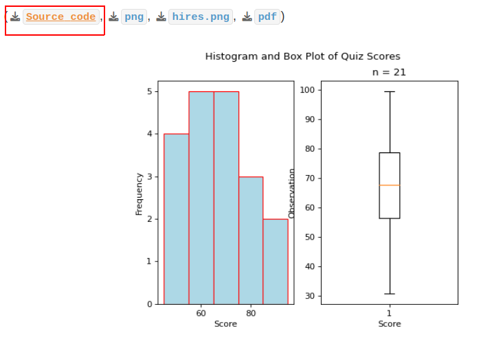

.. _python-reference:

======
Python
======

`Python <https://python.org>`_ is an extremely versatile programming language. **Python** has proven popular due to its ease of use and minimal learning curve. New users do not need to learn the intracacies of data structures and runtime constraints in order to use it. 

For this reason, **Python** is frequently used in statistical applications, as well as a variety of other areas (*this website was generated with Python!*).

We will use **Python** in class to quickly generate :ref:`graphical-representations` and perform statistical analysis. The pages below should serve as a reference.

Furthermore, all of the plots across the pages of this website were generated with simple **Python** scripts that can be downloaded and run on your own computer, after you perform the initial :ref:`setup <python-setup>`,

.. toctree::
   :maxdepth: 2
   :caption: Contents:

   00_shell
   01_setup
   02_basics
   03_sets
   04_functions
   05_plots
   06_files
   07_controls
   08_web
   09_demos
