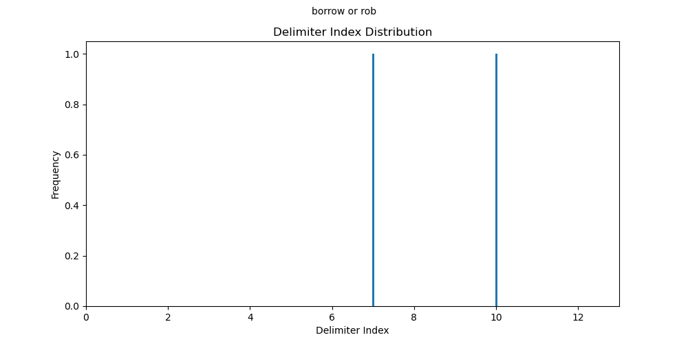
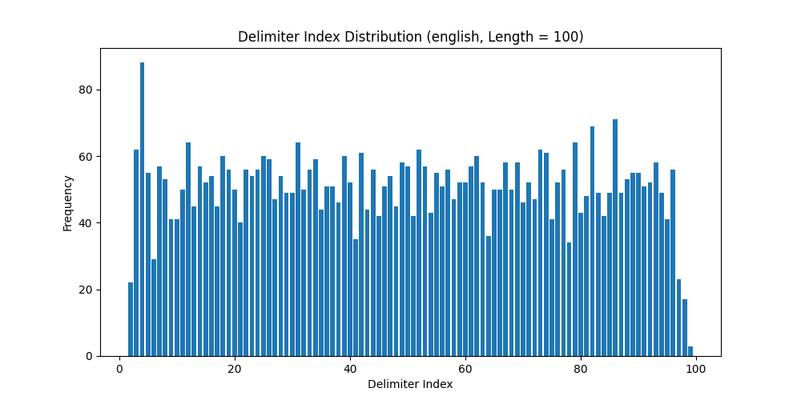

.. _palindromics-section-iv:

====================
Section IV: Analysis 
====================

The study of Palindromes leads directly into the study of Delimiter distributions. The partitioning of Palindromes into the Perfect and Imperfect aspects highlights the asymmetry which separates the latter from the former class. Consider the pair of Perfect Palindromes, 

- god lived on no devil dog
- i am civic am i

Since, by :ref:`Definition 2.3.2 <palindromics-definition-2-3-2>`, Perfect Palindromes are exactly the class of Sentences that are equal to their own Inverses, the Delimiters in a Perfect Palindrome display symmetry. The following barcharts show the Character indices of Delimiters for these examples. Note the horizontal axes are scaled to the Sentence String Length,

Notice the Delimiter indices are symmetrical about the center. Now consider the pair of Imperfect Palindromes, 

- goddesses so pay a possessed dog 
- borrow or rob

According to :ref:`Definition 2.3.1 <palindromics-definition-2-3-1>`, Imperfect Palindromes must first be reduced to restore their symmetry. An examination of the corresponding barcharts for these examples show why,

.. image:: ../../../_static/img/results/sentences/palindromes/delimiter_indices_imperfect_palindrome_1.png
  :width: 400
  :alt: Delimiter Indices, Imperfect Palindrome, Example #1

Imperfect Palindromes are exactly those class of Palindromes which do not have symmetrical Delimiter distributions. 

The goal of this section is to understand the Delimiter symmetry displayed by Perfect Palindromes, in order to help further classify Imperfect Palindromes according to the type of Delimiter asymmetry found in a particular instance. In other words, the analysis seeks a method for quantifying a Perfect Palindrome's Delimiter symmetry in order to apply the same method to Imperfect Palindromes, with the hope of gaining greater insight into the syntactical obstacles preventing direct formal access to the class of Imperfect Palindromes.

The essential problem of modelling Delimiter distributions is the method of approach. Analytical methods, if not well constructed, are liable to lead to seemingly well-supported, but logically flawed conclusions. 

Define the following set as the set of Delimiter indices,

.. math::

   D_{\zeta} = { i \mid \zeta[i] = \sigma

Consider taking Sentences from a Corpus and for each one, calculating and returning the Delimiter indices, as in the following,

.. math::

  ᚠ = \text{"error is the price we pay for progress"}

.. math::

  D_ᚠ = \{ 6, 9, 13, 19, 22, 26, 30 \}

If a large Corpus is analyzed so that each Sentence is reduced to a set of Delimiter indices, and then the frequency of Delimiter Counts is plotted, an interesting, but potentially misleading result is obtained. The following histograms show the result of this technique for Sentences of various fixed lengths. 

.. image:: ../../../_static/img/results/sentences/english/delimiter_distribution_n50.png
  :width: 400
  :alt: Delimiter Distribution, Sentence String Length = 50

.. image:: ../../../_static/img/results/sentences/english/delimiter_distribution_n200.png
  :width: 400
  :alt: Delimiter Distribution, Sentence String Length = 200

As can be seen from the shape of the histograms, the Delimiter index distribution for Sentences of fixed length is roughly uniform (with a potentially significant spike in the far left tail of each distribution). These graphs suggest the Delimiter Count of a single Character, :math:`\zeta[k]`, can be approximated by a discrete, uniform random variable, conditional on the Sentence String Length,

.. math::

  P(\Delta(\hat{\zeta}[k]) | l(\zeta) = \lambda) = \frac{1}{\lambda}

Where :math:`P()` represents the probability of an event, :math:`\hat{\zeta[k]}` represents a random varaible and :math:`\lambda` represents a fixed String Length. However alluring, there is a subtle, but important assumption going into the generation of these histograms that prevents the acceptance of this conclusion.

When Sentences are reduced to Delimiter indices and plotted in aggregate, information related to the relative order of the Delimiter in the Sentence is lost. In other words, the method of construction used to generate these histogram implicitly assumes,

.. math::

  P(\Delta(\hat{zeta}[k]) | \Delta(\zeta[k-1]) = \delta_{k-1}, \Delta(\zeta[k-2]) = \delta_{k-2}, ... , \Delta(\zeta[1]) = \delta_1 ) = P(\Delta(\zeta[k]))

To provide a more concrete example, consider the Sentences, 

.. math::

  ᚢ = \text{"the dog runs across the field"}

.. math::
  
  ᚦ = \text{"the child laughs at the joke"}

In each case,

.. math::

  \Delta(ᚢ[4]) = \Delta(ᚦ[4]) = 1

The presence of the Delimiter after the article *"the"* affects the subsequent appearance of Delimiters in the Sentences. Due to grammatical rules, a noun must follow the article and this has tangible, measureable effects. Given the information :math:`\Delta(ᚢ[4]) = 1`, this fact greatly decreases (perhaps even nullifies) the event of :math:`\Delta(ᚢ[5]) = 1`. In fact, a probability model that describes linguistic entities might take it as an axiom,

.. math::

  P(\Delta(\hat{zeta}[k]) \mid \Delta(\zeta[k-1]) = 1 ) = 0

In summary, it cannot be discounted that knowing where a single Delimiter occurs in a Sentence influences the possible locations where other Delimiters in the same Sentence might occur. However, accounting for this contingency presents computational challenges. A Sentence with 100 Characters will have :math:`2^100` possible Delimiter configurations, by the Fundamental Counting Principle. Tracking the Delimiter distribution across different Sentence String Lengths becomes impossible. Enumerating and tallying these outcomes is a prohibitively expensive task, if abstraction is not employed to summarize the Delimiter *"mass"* of a Sentence. 

.. toctree::
   :maxdepth: 2
   :caption: Contents:

   iv-i_integration
   iv-ii_probability
   iv-iii_summary

