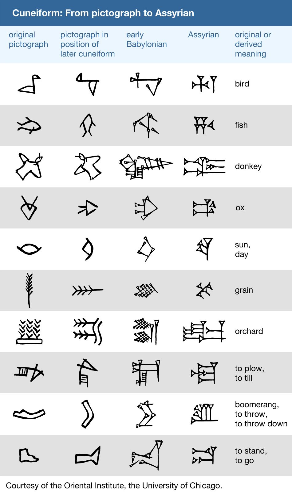

.. _year-2025:

2025
====

.. _2025-january:

-------
January
-------

There are two mutually exclusive categories of :ref:`palindromes <definition-4-1-1>` in any :ref:`language <language>`: perfect and imperfect.

A :ref:`perfect palindrome <definition-4-1-2>` is symmetric, by which it is meant a :ref:`perfect palindrome <definition-4-1-2>` may be reversed character-wise. Of the "species" of :ref:`palindromes <definition-4-1-1>` in any given :ref:`language <language>`, they are the most rare, because their grammatical conditions are so stringent (at least as far as English is concerned). Counter-intuitively, this makes them the easiest to construct.

:ref:`Perfect palindromes <definition-4-1-2>` mostly hinge on :ref:`invertible <invertible-words>` grammatical structures embodied in the "*on-no*", "*now-won*" and "*saw-was*" invertible pairs. Without these invertible pivot points, a :ref:`perfect palindromes <definition-4-1-2>` must rely on the symmetry of a central :ref:`palindromic word <reflective-words>`. In other words, the cardinality of :ref:`perfect palindromes <definition-4-1-2>` is related to the cardinality of :ref:`invertible words <invertible-words>` and the cardinality of purely :ref:`reflective words <reflective-words>`.

- repel on no leper
- dog saw raw war was god
- gateman now won nametag
- snoops now won spoons
- pupils did slipup
- strips deified spirts

:ref:`Imperfect palindromes <definition-4-1-3>`, by contrast, degrade under reversal. Consider cases like "*borrow or rob*" or "*name now one man*" which, while palindromic, do not preserve semantic content when reversed. However, by dropping the delimiting character, namely the space " ", the palindromicity can be reconstructed in a degenerate alphabet, e.g. "*borroworob*" and "*namenowoneman*" are palindromic strings in an alphabet with no delimiting characters.

These observations suggest an algebraic structure exists embedded within linguistics. Let :math:`\zeta` be a sentence, defined as a sequence of characters. Then, define the :ref:`inverse <string-inversion>` of a sentence, :math:`\text{inv}(\zeta)`, as the reversal of :math:`\zeta`'s characters. Furthermore, define the :ref:`reduction <definition-3-1-2>` of a sentence, :math:`\varsigma(\zeta)`, as the string which results from the removal of delimiter characters from :math:`\zeta`. Then, palindromes, :math:`\zeta_p` can be defined mathematically as the sentences whose reduced forms are equal to their own inverses,

.. math::

    \varsigma(\zeta_p) = \text{inv}(\varsigma(\zeta_p))

It can be shown that inversion and reduction, which are string operations, commute over strings, so the above equation can be extended,

.. math::

    \varsigma(\zeta_p) = \varsigma(\text{inv}(\zeta_p)) = \text{inv}(\varsigma(\zeta_p))

In other words, palindromes, perfect and imperfect, are exactly the class of sentences which satsify this formal constraint.

.. _2025-february:

--------
February
--------

.. epigraph::

    I will kill thee, and love thee after.

    -- `Othello`_

**Hysteron Proteron**: An expression in which what should come last is put first.

This :ref:`poetical device <syntagmics>` is unique amongst the others insofar that it is semantic. Most devices, like epistrophe or chiasmus, are syntactical and formal; while they can be employed to enhance the meaning of a sentence, they are all nevertheless defined solely by the transposition and application of grammatical rules. In contrast, a :ref:`Hysteron Proteron <hysteron-proteron>` is a form of word play that requires more than just symbol shunting. Its essence involves the interpretation of its component parts which simultaneously places them into a contradictory whole.

.. _2025-march:

-----
March
-----

The world is a choice of fates.

.. _2025-april:

-----
April
-----

Rank the impossibility of the following propositions:

- the cat is green.
- the cat is invisible.
- the cat is a verb.
- the cat is the.
- the cat is not a cat.
- the cat is god.
- the cat is all of us.
- the cat is everywhere.
- the cat is positionless.
- the cat is space.
- the cat is time.
- the cat is justice.
- the cat is fluent in English.

What does it mean to say "*that is impossible*"? Is it the same in each case?

---

We imagine :ref:`language <language>` to behave like objects, because it manifests through objects. But objectification removes the object from its surroundings. It decontextualizes it. We think :ref:`language <language>` is something definite, something well defined. But it's more like vague constellations, networks of meanings. Everything connects to everything else. :ref:`Language <language>` is the ability to synthesize. It can have layers. Anything can represent anything. And when you remove one connection, the rest blossom to take its place.

---

| Iambs are often writ, you see, to show
|    That :ref:`language <language>` has a form,
| But form besides what's centered now,
|   Behind collects in swarm.

.. _linguistic-structures:

Linguistic Structures
---------------------

What is :ref:`language <language>`? Did it emerge gradually or all at once? Was there a point in time when no :ref:`language <language>` existed and the next it did?

Does the distinction between :ref:`meta-language <language>` and :ref:`object language <language>` exist in actuality? Is there a :ref:`language <language>` *about* :ref:`language <language>`, where the general conditions for :ref:`language <language>` can be precisely specified? What are the necessary and sufficient conditions for :ref:`language <language>`? Can :ref:`language <language>` be described in aggregate?

The nature of :ref:`language <language>` is elusive. It begs an unending series of questions and offers little in the way of answers. It resists definition, for definitions occur within it. It resists analysis, for analysis occurs within it. :ref:`Language <language>` is a vicuous circle. :ref:`Language <language>` is *the* vicuous circle, from which all others originate. Language is inescapable and intractable. One might attempt to formalize :ref:`language <language>`, but every attempt hitherto has failed. There are always aspects of :ref:`language <language>` that exceed any container we construct for it. Indeed, there appear to be certain syntactical constraints that can be placed on the general science of :ref:`language <language>`:

1. :ref:`Language <language>` is a hierarchy of ordered sequences. Words are ordered sequences of characters. Sentences are ordered sequences of words.

This seems fundamental. If there is a purely logical and formal principle underlying :ref:`language <language>`, surely this is it.  Almost every known :ref:`language <language>` conforms to this model, in some way. However, even with this meager claim, the most miniscule of structural propositions (that structure *exists*), counter-examples can be produced that show this :ref:`axiom <section-ii-ii>` fails to span the entire breadth of the phenomenon of :ref:`language <language>`.

To start, the concept of declension immediately challenges this hierarchical model of :ref:`language <language>`. In :ref:`languages <language>` like Greek or Latin, the suffixes appended to words denote its part of speech. Consider the three Latin sentences,

- Puella canem videt. (Girl dog sees)
- Canem puella videt. (Dog girl sees)
- Videt puella canem. (Sees girl dog)

Each sentence, in essence, expresses the same proposition, showing that sentences are not necessarily constrained to be ordered sequences of words. The order of the declined words is not *meaningless* in this example, as order in declined :ref:`language <language>` often denotes emphasis, but importantly, it is not the *primary* bearer of meaning. However, the spirit of the model can be recovered by adjusting structure of hierarchy, perhaps by adding a layer above sentence for "*tokens*", of which each of the previous sentences is an instance.

However, there is a more fundamental challenge to the hierarchical model of :ref:`language <language>`. Similar to declension, agglutinative :ref:`languages <language>` accumulate meaning through suffixes applied to roots. The boundary between *sentences* and *words* is not well-defined in an agglutinative :ref:`languages <language>`.

In the Native America :ref:`language <language>` of Central Alaskan Yup'ik,

    tuntussuqatarniksaitengqiggtuq

Translates roughly to "*He had not yet said again that he was going to hunt reindeer.*" Describing this linguistic entity as a "*word*" does not fully elucidate its role in Yup'ik :ref:`language <language>`; it would be more accurately classified as a sentence, but that also is not entirely true. The "*words*" of the "*sentence*" are not delimited by blank characters or other marks, so that it appears to an Indo-European speaker to be a single word. This "*sentence-word*" is formed by stacking morphemes into a single word,

1. ``tuntu-``: reindeer
2. ``-ssur-``: to hunt
3. ``-qatar-``: will be going
4. ``-ni-``: to say that
5. ``-ksaite-`` : not yet
6. ``-ngqiggte-`` : again
7. ``-uq``: third person indicative mood

.. note::

    This is a very approximate mapping to English. Take it with a grain of salt.

As another example of an agglutinative phrase, consider the Turkish,

    evlerimde

The root ``ev``, *house*, is modified by a plural suffix ``ler``, a possessive suffix ``im`` and then a prepositional suffix ``de``, so that it translates into English as "*in my houses*". This :ref:`language <language>` formation process may be visualized as a type of functional composition. A root has a grammatical operation applied to it,

.. math::

    \text{plural}(x) = x + \text{ler}

Where :math:`x` is the root and :math:`+` represents concatenation. Similariy, the operators for possession and preposition can represented,

.. math::

    \text{possessive}(x) = x + \text{im}

    \text{preposition}(x) = x + \text{de}

Then, the word ``evlerimde`` can be represented formally as,

.. math::

    \text{preposition}(\text{possessive}(\text{plural}(x)))

In other words, a "*word*" in an agglutinative :ref:`language <language>` is a sequence of operations applied to a root, where the operations *are* the grammatical structure of the :ref:`language <language>`.

The essential nature of :ref:`language <language>` appears to be sequential, but identifying *what* is being sequenced presents a problem. We want to name the terms of linguistic science, but there seems to be no universal property that is manifested in every instance of :ref:`language <language>`.

To reconcile these two distinct categories of :ref:`language <language>` (called *synthetic* and *analytic*), linguistics often treats *morphemes* as the smallest semantic unit (the smallest token in a sentence that bears meaning), from which larger complexes are constructed.

However, there is a subtle problem in this model, which is not necessarily a flaw, but does commit its proponents to an ontological position they might not be willing to adopt were it made explicit.

The morpheme model of :ref:`language <language>` that unifies analytic and synthetic :ref:`languages <language>` requires viewing the referents of signs (symbols, abstractions) indirectly. In other words, a sign from this model does not directly signify the signified, but does so through modalities that alter its apparent form. To state more clearly, this :ref:`language <language>` model supposes a universal term preexists the particular instance of it within the sentence and moreover, it supposes the essential process of :ref:`language <language>` is to instantiates these universals into particular words or sentences.

Moreover, this abstraction requires syntactic artifices like *null morphemes* to describe how morphological operators behave when applied to certain lexical roots,

.. math::

    \text{plural}(\text{horse}) = \text{horse} + \text{s}

    \text{plural}(\text{deer}) = \text{deer} + \varnothing

However, this representation is slightly misleading in its form. A more accurate formal model would distinguish the tokens "deer" and "horse" (i.e. the *names* of their conceptual locus) from their written representation. Letting :math:`\mathfrak{x}` stand for the token, :math:`x` for its written representation and :math:`f` for the morphological operator,

.. math::

    f(\mathfrak{x}) = x + s

    f(\mathfrak{y}) = y + \varnothing

The important point in this formalization is that the token and the representation exist in different domains; one is mapped to the other.

In other words, this model seems to assert that when a speaker utters "*the cat is here*", the speaker is necessarily comprehending the word "*cat*" indirectly as the result of applying a :math:`\text{singular}()` operator to an underlying *essence*. Linguistics, it seems, has an implicit stance on the Aristotelian problem of the Universal, namely that universals exist, insofar as language is concerned.

.. _creation-myths:

Creation Myths
--------------

.. epigraph::

    There came into being from the heart and there came into being from the tongue [something] in the form of Atum. The mighty Great One is Ptah, who caused all gods [to live], as well as their kas, through his heart, by which Horus became Ptah, and through this tongue by which Thoth became Ptah.

    -- `Shabaka Stone (Lesko Translation), 2500s BCE <https://omnika.org/texts/328>`_

.. epigraph::

    This its account

    These things.

    Still be it silent,

    Still be it placid,

    It is silent,

    Still is is calm,

    Still it is hushed,

    Be it empty as well its womb sky.

    These therefore are first words,

    First speech.

    -- `Popul Vuh (Jacobsen Translation), 2000s (?) BCE <https://www.gatewaystobabylon.com/myths/texts/enki/eridugen.htm>`_

.. epigraph::

    Then even nothingness was not, nor existence,

    There was no air then, nor the heavens beyond it.

    What covered it? Where was it? In whose keeping

    Was there then cosmic water, in depths unfathomed?

    Then there was neither death nor immortality

    Nor was there then the torch of night and day.

    The One breathed windlessly and self-sustaining.

    There was that One then, and there was no other.

    -- `Rigveda, Nāsadīya Sūkta, 1400s BCE <https://www.swami-krishnananda.org/vishnu/nasadiya.pdf>`_

.. epigraph::

    When of the gods none had been called into being,

    And none bore a name, and no destinies were ordained;

    Then were created the gods in the midst of heaven,

    Lahmu and Lahamu were called into being...

    -- `L.W. King Translation, 1300s BCE <https://sacred-texts.com/ane/enuma.htm>`_

.. epigraph::

    The Tao that can be trodden is not the enduring and unchanging Tao. The name that can be named is not the enduring and unchanging name.

    (Conceived of as) having no name, it is the Originator of heaven and earth; (conceived of as) having a name, it is the Mother of all things

    -- `Tao Te Ching (Legge Translation), 500s BCE <https://classics.mit.edu/Lao/taote.1.1.html>`_

.. epigraph::

    When God began to create heaven and earth--

    the earth being unformed and void, with darkness over the surface of the deep and a wind from God sweeping over the water--

    God said, "There there be light"; and there was light.

    -- `The Torah (New Jewish Publication Society Translation), 500s BCE <https://www.sefaria.org/Genesis.1.1?lang=bi&vside=Tanakh:_The_Holy_Scriptures,_published_by_JPS|en&with=Translation%20Open&lang2=en>`_

A universal motif of creation myths is the prominence of *speaking* and *naming*. Almost every myth that attempts to elucidate the origins of existence describes a process where the very act of speech induces creation. The world is portrayed as *formless* and *void*, a sea of primordial *chaos*; it is :ref:`language <language>` itself that give structure to the penumbral shadow, pulling it into light and casting it into :ref:`beings <being>`. The ubiquity of this theme across different historical eras and disparate geographic areas suggests it is not merely random or circumstantial, but indicative of the fundamental pathology that language induces in the human mind.

Any assertions about the origin and historical development of :ref:`language <language>` must remain speculation, but nonetheless, certain patterns emerge from the available evidence. The earliest records of written :ref:`language <language>`, such as Ancient Egyptian or Sumerian, are pictographic in nature, meaning there tends to be a direct correspondence between the symbol and the object it represents, e.g. a sun is represented by a starburst or a fish by the crisscrossed curves that form its shape. The grammar of a purely pictographic :ref:`language <language>` is primarily extensional, meaning it does not have the syntactic glue to bind its presented concepts into complex relations except through their mere presentation. A pictogram of an axe juxtaposed with a pictogram of tree implies a certain action, but it does not contain complex modalities like motive, temporality or setting. Its possible interpretations are limited to simple utterances, "* tree cut down*" or "*man cuts tree*"; there are no syntactic markers upon which to hang the semantics of *why*, *how*, *when* or *if*.

As :ref:`language <language>` evolves, its progression into abstraction is apparaent. The correspondence between the signifier and the signified is almost entirely severed as linguistic forms accumulate syntactic functions and these functions become the bearers of meaning beyond the directly indicative; Language is no longer a direct mapping between object and sign. The `following diagram <https://www.britannica.com/topic/writing/Sumerian-writing>`_ shows the evolution of cunieform, from simple pictograms to abstract symbols,

The lefthand column pictograms are clearly direct representations of the underlying concept, a visual analogue of reality. The grammar of such a system cannot help being analogical by mimicking the perceived the relations of reality through their direct image in writing. There is no other way to represent relations except spatially, i.e. by placing the symbol for "*foot*" next to the symbol for "*road*" to indicate the action of "*walking*". Actions, and the complex relations which factor into motive forms, are reduced to the aggregation of their constituent objects.

This type of representation offers little in the way of symbolically presenting the internal state of a human. There is no way to conceive of "*self*" in a pictographic system, because a "*self*" cannot be represented graphically. In other words, the "*self*" never sees itself because it is the thing that *sees*. The conceptualization of "*self*" requires semantic features this form of :ref:`language <language>` does not possess.

.. topic:: Conjecture

    Early creation myths are records of the transformation every :ref:`language <language>` must undergo to provide the linguistic apparatus for progressing from purely visual and analogical to the abstract and metaphorical. Creation myths are literal linguistic artifacts of early humans attempting (or inventing the terms) to describe the transformation they were undergoing, from a form of consciousness primarily grounded in immediate perception and external representation to a form of highly symbolic abstraction that allows (or induces) a conceptualization of "*self*".

The sheer breadth of history that separates the current time period from the moment when creation myths were actually written precludes any positive verification of this claim, so all evidence will necessarily be circumstantial. Bearing that in mind, a particularly compelling piece of evidence for this claim is demonstrated in *Exodus 3:14*, when Moses asks for the name of God to give to his people. God replies,

    אֶהְיֶה אֲשֶׁר אֶהְיֶה

    Ehyeh Asher Ehyeh

This phrase presents significant challenges when translated into modern English. It is often rendered as one of the following,

    I am who I am

    I am that I am

    I will be what I will be

    I am the being
 
    I am the one who is

These translations are influenced and constrainted by the historical trajectory of the Torah through Greek and Latin cultures. When translated into the Greek Septuagint, the original Hebrew phrase became,

    Ἐγώ εἰμι ὁ ὤν

The Greek Septuagint introduced a definite article in the form of "*ὁ*" and a personal first person in "*Ἐγώ*" in order to reconstruct the perceived meaning of Ancient Hebrew within Koine Greek. More fundamental, it translated "*אֶהְיֶה (ehyeh)*" into the present tense of "*εἰμι (eimi)*". The effects have been passed down to present day translations like King James. However, the original meaning of the "*Ehyeh Asher Ehyeh*" is not entirely captured by any of these translations.

Ancient Hebrew did not have a modality for time. Its verbs were given aspects, but not temporality. A Hebrew verb has a *perfect* aspect and an *imperfect* aspect. The *perfect* aspect denotes completed or singular actions. This is sometimes called the *gnomic* mode or tense. In English, some examples are given in the following,

- It has been decided.
- The sun rises.
- The birds are fast.

However, these statements, while exhibiting *perfect* aspect, by their instantiation in English, are necessarily inflected with temporality, e.g. "*rises*" or "*has been*". Again, it is crucial to note Ancient Hebrew did not have this modality.

The *imperfect* aspect denotes an incomplete, ongoing or potential action. In English, some examples are given,

- They will go.
- The bird sings every morning.
- The store used to be open.

"*אֶהְיֶה (ehyeh)*" is the first person singular imperfect form of "*הָיָה (hayah)*", which translate into "*to be*", "*to become*", "*to exist*". "*אֶהְיֶה (ehyeh)*" is the Ancient Hebrew concept of :ref:`being <being>`.

"*אֲשֶׁר (asher)*" is a linguistic relativizer, analogous to the English "*that*" or "*which*". A relativizer plays a role not dissimilar to the role of quantification in symbolic logic, in that it provides conditions for its clause to obtain, i.e.,

- the lady from Chicago that sang a tune.
- the brown dog which ran away.
- the man that wasn't there.

These examples show the function of a relativizer is to qualify its clauses. With these facts in mind, the literal English translation of "*אֶהְיֶה אֲשֶׁר אֶהְיֶה*" is,

    am that am

    am which am

The question then becomes in what *mode* to interpret the "*am*", i.e. as a potentiality, a habituality or ongoing process. Regardless, taken in conjunction with the previous conjecture, God's reply to Moses appears to identify divinity itself with the conjugation of :ref:`being <being>` into its *imperfect first person modality* of "*am*". Moreover, that :ref:`being <being>` is qualified relative to itself.

.. topic:: Conjecture

    Early humans did not have the concept of "*self*" until :ref:`language <language>` had evolved to the point where abstraction, complex predication and metaphor was possible.

It is easy to be fooled by the apparent continuity of our "*self*" through time and space that consciousness is a single thing, everywhere equivalent in its multiplicity. We assume our consciousness is in every way identical to every other, except for its particular circumstances, that we might substitute our "*self*" into another's without alteration. That no one remembers their birth or early youth except in fragments is dismissed because however blurry the memory, we remember our self ":ref:`being there <being>`". We don't account for the role that :ref:`language <language>` plays in the development of our "*self*". Humans are essentially vessels for :ref:`language <language>`. Our earliest records are (*allegedly*) suffused with the history of consciousness itself.

If the conjecture is granted, the question remains: what is the "*self*"? How does the modality of "*am*" that evolved from the concept of :ref:`being` allow the "*self*" to take root? Is the "*self*" created or described by this evolution of :ref:`language <language>`? Conceding to the ever present specter of uncerainty, the question is essentially: does :ref:`language <language>` *induce* self-awareness or does it provide the formal framework for its interpretation?

.. _2025-may:

---
May
---

Contradiction: A History of Propositions
----------------------------------------

It is instructive to consider the history of the *proposition*, for the *proposition* is at once a sentence and a unit of mathematics, i.e. a :ref:`truth value <truth-values>`. The proposition is a both a *meaningful* thing and a *formal* thing. The history of philosophy and mathematics is, by and large, an analysis and gradual unveiling of the relations that bind *form* to *meaning*, *syntax* to *semantics*. It is therefore, fundamentally, a history of contradiction and paradox.

.. sidebar::

    Heidegger would call this translation *latinized*, and point out the components underlying the meaning of *οὐσία*. *οὐσία* is derived from the feminine present participle of *εἶναι* (*to be*), *οὖσα*, but it is also etymologically related to *παρουσία* (*being-at, present*). Heidegger would likely contend the translation of *οὐσία* is better served by the term "*presence*".

Aristotle regarded a :ref:`proposition <proposition>` as a representation of :ref:`being <being>`, and thought of the syntax of :ref:`propositions <proposition>` as manifestations of the different *categories* of :ref:`being <being>`. Aristotle's ontology regarded :ref:`being <being>` as a relationship of predication that ultimately resolved to a category predicated of the primitive subject, termed the "*οὐσία*" (often translated as *substance*). Aristotle defined the nature of the predicative relations in `Categories`_, summarized below,

1. Substance (*οὐσία*): What something fundamentally is.
2. Quantity (*ποσόν*): How much or how many of the subtance exists.
3. Quality (*ποιόν*): What kind or sort of thing a substance is.
4. Relation (*πρός τι*): How a substance stands in reference to another substance.
5. Place (*ποῦ*): Where the substance is located.
6. Time (*πότε*): When the substance exists.
7. Position (*κεῖσθαι*): The physical arrangement of the substance's parts.
8. State (*ἔχειν*): The condition or state of having something.
9. Action (*ποιεῖν*): What the substance is actively doing.
10. Passion (*πάσχειν*): What is being done to the substance.

Aristotle viewed the predication of a category as applying to either the entire *οὐσία*, a part of the *οὐσία* or none of the *οὐσία*. Modern :ref:`logic <logic>` tends to view this as the equivalent of :ref:`quantification <logical-quantification>`, but as Peter Abelard pointed out (see below) this type *Aristotelian* :ref:`quantification <logical-quantification>` has important differences that are not present in its modern descendant. These differences are themselves rooted in the *lack* of material difference in the ancient concepts of :ref:`logic <logic>` and ontology; when Aristotle is expounding his :ref:`logic <logic>` in `Prior Analytics`_, he is not making formal (*syntactic*, :ref:`tautological <tautologies>`) arguments, he is making ontological (*semantic*, *interpretative*) arguments. This becomes clear when he "*proves*" his syllogistic figures by appeal to ordered triplets of *things*. (TODO: example here)

The division of :ref:`logic <logic>` and ontology into separate domains of discourse did not occur until much later, its beginnings emerging approximately in parallel with the Renaisannce era, when figures like Boole began to probe and map the formal properties of :ref:`logic <logic>`, eventually leading to successive revolutions of Frege, Russell, Gödel and Tarski, which effectively isolated :ref:`logic <logic>` from ontology by reducing the subject's presence in the ancient science to the role of interpretation. 

.. sidebar::

    Badiou's pronouncement, `mathematics is ontology <Being and Event>`_ is an attempt to return ontology to formal discourse. However, as this essay will argue, his pronouncement is *essentially* incorrect. Mathematics is *metaphysics*, or atleast as close as a subject can get without thereby becoming it. 

In the modern conception of :ref:`logic <logic>`, the subject's role lies in finding a real world model that *satifies* the syntactical properties of the formal model under the assignment (indexing) of empirical objects to the symbolic terms of the :ref:`language <language>`. The formal model has no responsibility to comport itself towards :ref:`being <being>` real; the one interpretting the model must find its coherent interpretation in reality. A significant portion of modern mathematics is nothing more than the production of formal theorems unanchored by empirical reality, often justified by appeal to other instances of theoretical constructs finding unintended interpretations, e.g. the axioms of probability in geometric proportions, imaginary numbers in engineering applications, etc. The *intension* of :ref:`Aristotelian logic <aristotelian-logic>`, however, is to explicitly elaborate the structure of :ref:`being <being>`, first and foremost.

However, within the :ref:`logic <logic>` of Aristotle, there is a subtle flaw which betokens why :ref:`logic <logic>` and :ref:`language <language>` must remain incapable of an equivalency with :ref:`being <being>`. In `Prior Analytics`_, Aristotle often uses what he termed a "*positive conversion*" from a universally affirmed premise to particular premise,

.. epigraph::

    The positive premise necessarily converts, thought not universally but in part. For instance, if every pleasure is a good, then some good will be a pleasure.

    -- `Prior Analytics`_, Aristotle

If the statement "*all B are A*" is rendered as :math:`AaB` and "*some B are A*" as :math:`AiB`, a positive conversion of a premise can be formalized as, 

.. math::
    
    AaB \to AiB

Aristotle also applied particular conversions,

.. math::

    AiB \to BiA

Which is to say, if "*some B is A*" is true, then "*some A is B*" is also true, the classic example cited above in this instance becoming "*if some pleasure is good, then some good is pleasure*". These two conversions [#may_2025_01]_ form the core of Aristotle's deductive calculus. Aristotle viewed a deduction (*συλλογισμός*) as a ontological rule where two categorical premises implied a categorical conclusion. The classic *Barbara* deduction (the "*first figure*", as Aristotle called it) is formalized as, 

.. math::

    AaB, BaC \vdash AaC

Which is rendered into English as, 

    If all B are A and all C are B, then all C are A.

Where :math:`A`, :math:`B` and :math:`C` represent *genera* and *species* of *οὐσία*, for example, *animal*, *man* and *husband*. Aristotle often proves these "*figures*" of deduction by applying a positive universal conversion, as in his proof of the *Darapti* deduction, 

.. math::
    
    PaS, RaS \vdash PiS

.. epigraph::

    When both P and R belong to every S, it results of necessity that P will belong to some R. For since the positive premise converts, S will belong to some R; consequently, since P belongs to every S and S to some R, it is necessary for P to belong to some R (for a deduction through the first figure comes about).

    -- `Prior Analytics`_, Aristotle

The deduction rule :math:`AaB \to AiB` is often termed a deduction of *existential import*, for it implicitly assumes the existence of its premise. Abelard brought this subtle fallacy to light in his *Dialectica*,

.. epigraph::

    If '*every stone-man is a stone*' is true, also its conversion per accidens is true ('*some stones are stone-men*'). But no stone is a stone-man, because neither this man nor that man etc. is a stone. But also this '*a certain stone-man is not a stone*' is false by necessity, since it is impossible to suppose it is true.

    -- Dialectica, Abelard

What Abelard is pointing out is a notion that would not be formalized for another millenia in the strictures of set theory: unrestricted comprehension of an abstraction principle necessarily leads to contradiction. The proposition, "*all stone men are stone*", can be true, syntactically speaking, when no objects exist in the domain that is being quantified, namely "*stone men*". As a consequence, because "*all stone men are stone*" can be true without referring to any actual :ref:`beings <being>`, it is too much to grant a deduction from the universal assertion to a particular instance of a "*stone man*". In other words, "*all*" does not imply "*some*" if nothing exists to satisfy "*all*"; indeed, "*all*" must be conditioned on a presupposed existent *thing*. 

The essential fallacy committed by Aristotle is supposing :ref:`language <language>` can represent reality with perfect fidelity. The crux of Abelard's criticism is found in how Aristotle transforms an argument into symbolic abstractions, manipulates the abstractions through an algebra and then transforms the result back into the original :ref:`language <language>` to obtain the conclusion. Aristotle supposes one can assign symbols to things and then map the actual relations that obtain between the things onto the syntactic rules that connect the symbols. Once this assignment is made, he supposes the result obtained through symbolic deduction is equivalent to the actual conclusion, where each application of a rule (e.g. a conversion) in the deductive chain corresponds to some actual thought process that would occur were it (the thought process) to consider the argument on its own terms.  

At this point, one might assume, as humans did, it is merely a lack of precision that prevents Aristotle's ontology from expressing the true relations of :ref:`being <being>`. However, the inability of :ref:`language <language>` to penetrate :ref:`being <being>` is the perennial problem of philosophy. Again and again, age after age, it is supposed the nature of :ref:`being <being>` can be reduced to words. The history of logic and the proposition is the history of a losing war. Each time, armies are raised, cloaked in ever more complex machinery. The battles become more sophiscated and harder to follow, but the outcome is always the same. The human mind falters in its approach and discovers another layer of contradiction encircling its thoughts. 

In the late nineteenth century, the most sustained and protracted campaigns of this war, up to that point in history, was waged by Frege's `Grundgesetze Der Arithmetik`_ . In this sprawling and dense work, Frege target was the language of arithmetic, which contains such statement as "*all numbers have a successor*" or symbollically in modern notation,

.. math::
    
    a \in \mathbb{N} \implies a + 1 \in \mathbb{N}

His goal was to show this :ref:`language <language>` was derived from the more fundamental :ref:`language <language>` of :ref:`logic <logic>` through definition and deduction. In effect, Frege sought to show, using precise :ref:`language <language>` lacking any ambiguity, the essential nature of numbers was logical. 

To see how the conundrum of existence and :ref:`language <language>` ruptures Frege's :ref:`logic <logic>` from the inside out, one must understand how 
Frege departed from the Aristotelian model of :ref:`logic <logic>`. Frege conceived of a proposition *extensionally*, as opposed to *categorically*. To Frege, a proposition is a formula that is *satisfied* by certain objects. For example, ":math:`x` *is even*" is a proposition *satisfied* by the series of numbers :math:`0, 2, 4, ...`; Frege thought of each proposition as implicitly expressing the relation of "*belonging*" between an object :math:`x` and a (*value-range or extension of a*) concept :math:`\hat{\epsilon}f`, where the relation is manifested through a property predicated of each object that belongs to the concept. In other words, Frege saw *predication* as being equivalent to *abstraction*.

For example, to say in Fregean terms, "*this pen belongs to the concept of Black*" is equivalent to saying "*this pen is a black object*". Note in these examples the division between the near-Platonic formal nature of "*Black*" and the near-Aristotelian predication of "*black*". The use of capitalization is intentional, for Frege would call "*Black*" a proper name and "*black*" a description. According to Frege, *Black* is the abstract concept common to all instances of *black* things. In other words, Frege has committed himself to a stance on the problem of universals, namely that they exist. 

Moreover, Fregean concepts exist as *terms* in the language from which they arose as abstractions. Frege asserted, for all objects :math:`x`, the property :math:`f` being equal to the property :math:`g` is equivalent to saying the concept :math:`\hat{\epsilon}f` and the concept :math:`\hat{\epsilon}g` are the same concept,

.. math::

    (\forall x: f(x) \equiv g(x)) \equiv (\hat{\epsilon}f = \hat{\epsilon}g)

The righthand side of this equivalency treats the concepts  :math:`\hat{\epsilon}f` and :math:`\hat{\epsilon}g` as operands in an equality relation, which to say, it treats concepts *as objects in the language of* `Grundgesetze der Arithmetik`_. This :ref:`axiom <frege-axioms>` was called *Law V* by Frege. 

Note this formulation is symmetrical and complementary with the logical law, first posited by Leibniz and adopted by Frege in his `Grundgesetze Der Arithmetik`_, that if two objects have the same properties, they are identical (often known as the Law of Indiscernibles),

.. math::

    \forall a, b: (\forall f: f(a) \equiv f(b)) \equiv (a = b) 

However, instead of quantifying over objects and passing into conceptuality, the Law of Indiscernibles passes into objectivity by quantifying over properties (i.e. abstractions). In other words, the Law of Indiscernible states for all possible properties that can be asserted of two objects, if and only if the objects are the same will all of the asserted properties of those objects be equivalent [#may_2025_02]_. On the other hand, Frege's Law V states, for *all objects*, if and only if the (*extensions of*) concepts are the same will the asserted properties to those concepts be equivalent.

The Law of Indiscernibles qualifies abstractions in their totality and passes into an assertion of equality between the objects which originate the abstraction, whereas Frege's Law V qualifies objects in their totality and then passes into an assertion of equality between their abstractions. Crucially, the Law of Indiscernibles can be *vacuously true*, as in the case of :math:`f` representing such properties as the predicate of "*being impredicable*". However, the quantification in Frege's Law V is *existentially* important for all but the *null* domain; Frege's Law V *assumes the existence of the object being quantified*.

To draw to the surface the lurking shadow of Abelard's stone men from Frege's Law V, and reveal the formal structure of contradiction in Frege's `Grundgesetze Der Arithmetik`_, the notion of "*an object* :math:`x` *belonging to a concept* :math:`\hat{\epsilon}`" must be defined [#may_2025_03]_,

.. math::

    x \frown \hat{\epsilon}f \equiv \exists \phi: (\hat{\epsilon}f = \hat{\epsilon}\phi) \land \phi(x)

That is, asserting :math:`x` *belongs* :math:`\hat{\epsilon}f` is equivalent to asserting there exists a property :math:`\phi` of :math:`x` (denoted :math:`\phi(x)`) *and* the concept (value-range) of :math:`\phi` is equal to :math:`\hat{\epsilon}f` (the concept or value range of :math:`f`). [#may_2025_04]_ It is rightly stated by Frege's commentators that Law V leads directly to the contradiction of Russell's Paradox. This is true, but the manner in which this contradiction arises is often not appreciated. The origin of Russell's Paradox in Frege's system is the existential and creative nature of his definition of membership, :math:`\frown`. From this definition, Law V is used to show,

.. math::

    x \frown \hat{\epsilon}f \equiv f(x)

Which is to say, the assertion of :math:`x` belonging to a concept :math:`\hat{\epsilon}f` is equivalent to the assertion :math:`x` has property :math:`f`. From here, it is a simple matter of letting :math:`f` be the property of not belonging to concept :math:`\hat{\epsilon}f`,

.. math::

    f(x) = \neg (x \frown \hat{\epsilon}f)

Whence the famed Russell's Paradox emerges,

.. math::

    x \frown \hat{\epsilon}f \equiv \neg (x \frown \hat{\epsilon}f)

Clearly, this should not be the case. Historically speaking, this annihiliated Frege's logicist project, but the nature of the deduction which leads to this annihiliation would be the primary motive for the formal insights of Russell and Tarski. To show more clearly how this contradiction arises, consider the following  proof of one direction of :math:`x \frown \hat{\epsilon}f \equiv f(x)`.

Assume :math:`x \frown \hat{\epsilon}f`. 

From the definition of membership, there is a property :math:`\phi(x)` and the concept of this property :math:`\hat{\epsilon}\phi` is equal to the concept of :math:`f`, :math:`\hat{\epsilon{f}}`. 

The question, often known as the *Caesar Problem*, is how does one re-identify the property :math:`\phi` with the property :math:`f`? This is where Frege's Law V comes in; since the definition of membership yields the equality of concepts, Frege's Law V allows the deduction to pass into the equivalence of properties,

.. math::

    \phi(x) = f(x) 

Therefore, if :math:`x \frown \hat{\epsilon}f`, then :math:`f(x)`.

The key step is passing from the universal equality of concepts, an assertion of categorical relation, to an *instance* of the property denoted by the concept. Frege makes the same mistake as Aristotle (:small:`good company to keep`) in assuming a universal relation implies an existential relation.

---

.. epigraph::

    For the sake of greater perspicuity, we shall use the symbol '*c*' as a typographical abbreviations of the expression '*the sentence printed on this page, line 5 from the top*'. Consider now the following sentence:

        *c is not a true sentence*  (Note: this sentence is typeset on line 5)

    Having regard to the meaning of the symbol 'c', we can establish empirically:

        1. 'c is not a true sentence' is identical with *c*

    For the quotation-mark name of the sentence *c* (or for any other of its names), we can set up an explanation of type:

        2. 'c is not a true sentence' is a true sentence if and only c is not a true sentence.

    The premises 1 and 2 together at once give a contradiction:

        c is a true sentence if and only if c is not a true sentence.

    - `The Concept of Truth in Formalized Languages`_, Alfred Tarski

From this, Tarski concludes that "*colloquial* :ref:`language <language>`" is hopelessly inconsistent. :ref:`Truth <truth>` *about* a :ref:`language <language>` never exists *within* that language. Tarski is saying, in the mathematically ineluctable way of *proof by contradiction*, that by assuming ":ref:`language <language>`" is a singular entity where all descriptions occur on the same level, contradictions necessarily result. Therefore, to salvage the concept of ":ref:`truth <truth>`", Tarski famously introduces the distinction between *meta* :ref:`language <language>` and *object* :ref:`language <language>`,

.. epigraph::

    For this reason, when we investigate the :ref:`language <language>` of a formalized deductive science, we must always distinguish clearly between the :ref:`language <language>` *about* which we speak and the :ref:`language <language>` *in* which we speak, as well as between the science which is the object of our investigation and the science in which the investigation is being carried out. The names of the expressions of the first language, and of the relations between them, belong to the second language, called the *meta* :ref:`language <language>` (which may contain the first as a part). The description of these expressions, the definition of the complicated concepts, especially of those connected with the construction of a deductive theory (like the concept of consequence, of provable sentence, possibly of true sentence), the determiniation of the properties of these concepts, is the task of the second theory which we shall call the *metatheory*.

    - `The Concept of Truth in Formalized Languages`_, Alfred Tarski

In other words, the notion of "*truth*" requires a bifurcation of :ref:`language <language>`. If we want the discourse to include predicates of "*is true*" or "*is false*", :ref:`language <language>` cannot be treated as one cohesive unit, where these assertions are carried out in the same :ref:`language <language>` in which what is being asserted *is asserted*. This idea is only strange if :ref:`language <language>` is regarded as something fixed and determinate. However, it is more apt to think of :ref:`language <language>` as a *continuous process that accumulates components of orthogonal meaning over time*. Each syntactic construct allows new semantic meaning to be encoded into the artifice of :ref:`language <language>`, and each new semantic concept integrated into the fabric of :ref:`language <language>` alters what is demarcated by its boundaries. In other words, :ref:`language <language>` can only be conceived of as a whole at certain points in time, when its definitions are fixed by their factical origin in the world. But the cross section of :ref:`language <language>` at any given moment does not capture its dynamic nature across time; in fact, this nontemporal model of :ref:`language <language>` fails to represent in any capacity beyond the formal the essential nature of :ref:`language <language>`.

Tarski's parsimony of meta and object :ref:`language <language>` shows that ":ref:`truth <truth>`" represents one of these transformative concepts that alters the very constitution of :ref:`language <language>` through its introduction and analysis. In essence, the concept of ":ref:`truth <truth>`", through its rigorous integration into the corpus of :ref:`language <language>`, creates a schism in :ref:`language <language>`. If we allow ourselves to accept ":ref:`truth <truth>`" as a meaningful construct, then we must accept this molecular division of :ref:`language <language>` into separate, but related, domains.

.. important::

    It should be noted this division is only necessary if one concedes to the premise that contradictions should not be syntactically expressible within a :ref:`language <language>`.

The apparent *incompleteness* of :ref:`language <language>`, i.e. its inability to be fully reduced to formal representation, arises because we each view words and sentences as a representative instances plucked from the supposed totality of :ref:`language <language>`. But Tarski has shown, by revealing the circular logic of :ref:`truth <truth>`, that :ref:`language <language>` *is not a totality* and any attempt to treat it as such will result in contradiction.

.. epigraph::

    Vicious circles arise from supposing that a collection of objects may contain members which can only be defined by means of the collection as a whole. Thus, for example, the collection of propositions will be supposed to contain a proposition stating that "*all propositions are either true or false.*” It would seem, however, that such a statement could not be legitimate unless “*all propositions*” referred to some already definite collection, which it cannot do if new propositions are created by statements about “*all propositions*”. We shall, therefore, have to say that statements about “*all propositions*” are meaningless. More generally, given any set of objects such that, if we suppose the set to have a total, it will contain members which presuppose this total, then such a set cannot have a total. By saying that a set has “*no total*,” we mean, primarily, that no significant statement can be made about “*all its members.*”

    - `Principia Mathematica`_, Bertrand Russell and Alfred Whitehead

We say, "*this word is* :ref:`language <language>`" or "*this sentence is* :ref:`language <language>`", having misunderstood what is designated by the term ":ref:`language`". We view :ref:`language <language>` as a *structure*, as a collection extensionally determined by its members, instead of a *structuring*, as the *intension* which composes the determination. *Structures* must possess parts in determinate relations, whereas *structuring* is the very process by which parts are arranged into and imbued with *structure*. In other words, the predicate "*is* :ref:`language`", like the predicates "*is true*" or "*is false*", never occurs within :ref:`language <language>`, but indicates a rupture in the foundations of :ref:`language <language>`. This rupture *is* the essence of :ref:`language <language>`, to bring within its field of containment something entirely disparate from its other elements.

.. epigraph::

    Ask yourself whether our :ref:`language <language>` is complete-—whether it was so before the symbolism of chemistry and the notation of the infinitesimal calculus were incorporated in it; for these are, so to speak, suburbs of our :ref:`language <language>`. (And how many houses or streets does it take before a town begins to be a town?) Our :ref:`language <language>` can be seen as an ancient city: a maze of little streets and squares, of old and new houses, and of houses with additions from various periods; and this surrounded by a multitude of new boroughs with straight regular streets and uniform houses.

    -- `Philosophical Investigations`_, Ludwig Wittenstein

Ask yourself: What do "*equals*", "*or*" and "*all*" have in common beyond their inclusion in :ref:`language <language>`? All three serve distinct linguistic functions, that of identity, disjunction and categorical assertion respectively. They are employed a certain way, to encode meaning a certain way. They have no commonality beyond being :ref:`language <language>`. To call "*these words*" :ref:`language <language>` is directly analogous to collecting an abacus, a paint brush and a hammer under the header of a single concept. The way an abacus is engaged in action and the meaning of its movements, is vastly and materially different than the action and movement of a hammer or paintbrush.

In Tarski's conception, :ref:`truth <truth>` is a property expressed in the meta :ref:`language <language>`, *not* the object :ref:`language <language>`. When the :ref:`assignment <value-assignment>` of values to the terms of the object :ref:`language <language>` satisfies a :ref:`proposition <proposition>` of the meta :ref:`language <language>` for all possible :ref:`assignments <value-assignment>`, then the result is said "*to be true*". Tarski defines :ref:`truth <truth>` relative to the combinatorial totality of value assignments. :ref:`Truth <truth>` is the semantic locus point of *syntactic satisfaction* across all possible interpretations.

:ref:`Set theory <sets>` is a formal system that is often used as a meta :ref:`language <language>` in mathematics to specify the conditions of object :ref:`languages <language>`, e.g. differential and integral calculus, real and complex analysis, etc. In many ways, :ref:`set theory <sets>` is the formal crystallization of the logical dialectic initiated by Aristotle in the Organon. :ref:`Axiomatic set theory <sets>`, in its various formulations, represents the purely symbolic and syntactic limit of categorical logic, the maximum extent to which language can be shaped by formal considerations. In doing so, it must restrict itself to the *metalogical* layer, never penetrating below the surface of description. 

.. [#may_2025_01] Aristotle has a third conversion rule, :math:`AeB \to BeA`, but it is not mentioned here since it is not relevant to Abelard's critique of *existential import*.

.. [#may_2025_02] Except, however, the property of "*having the name* :math:`a`" and the property of "*having the name* :math:`b`".

.. [#may_2025_03] Frege believed all (coherent) semantic concepts in a language, such as "*belonging*", could be derived from definitions made clearly with the formal laws of logic. His `Grundgesetze Der Arithmetik`_ is an attempt to reduce the mathematical language of arithmetic to a logical calculus, through the use of prior assumptions (:ref:`axioms <frege-axioms>`) and definitions such as the one given directly after this footnote,

.. [#may_2025_04] It is often hard to translate Frege's formalism into everyday language, as if Frege's semantics are essentially alien to the actual mechanics of language. Frege is expressing insight in a language that bears only the faintest similarity to natural language.

---

:ref:`Language <language>`, if it can be defined at all, is the indeterminate totality which, by never containing itself (or existing), nessitates its progressive advance into novelty.

---

When language ceases, so does life. 

We spend our childhoods learning how to speak, threading our souls with symbols. Language acqusition is like a spell, a black magic ritual that induces in us the world. We are spoken into existence. Our lives are lived through the medium of speech.

All of these concepts accumulated through history, flowing into our heads through the currents of time, met in the external source of the world which unfolds in our senses. One marvels at the complexity. So many facts, shot through and through with interpretations. So many accidents and contingencies, indistinguishable in their effects. 

In the murky factical origins of language, nothing is certain, but somethings are more certain than others. One cannot imagine a world without community. The self implies a multiplicity of selves. We must be bootstrapped with language, taught through ostension the ways in which things can relate to another, before the self as a concept may emerge as a relata within a relation, and this cannot happen without someone to draw attention to the ways in which symbols may represent that latent potential lurking. The "*self*" must be taught to us; it is an evolution of abstraction transmitted through language that manifests in our phenomenological life, in a directly analogous fashion to the way chains of DNA manifest phenotypes. The "*syntax*" of amino acids encodes the potentialites of life; the raw struggle of existence dictates which potentialities are activated, i.e. the "*semantics*" of DNA are determined by the ways in which the phenotypes interact with the existent world. 

It is hard to imagine how a newborn infant could contain the potential for language, except through the possibility of absorbing it from another human. Language is only innate to the extent that is a potential of the human mind (and only then, at crucial periods during the development of the organism, as the case of feral children implies).

---

The world contrives, in its myriad ways, to convince you that you are not part of it. Every historical struggle reduces to this primordial human conflict, in some way. War is only possible in the presence of difference. To participate in conflict, there must be a "*them*" and an "*us*", or more fundamentally, an "*other*" and an "*I*". This psychological :ref:`tautology <tautologies>` is precipitated in its pronouncement by the ontological foundations which allow it to manifest. To speak of tension and energetic relations, there must be external forces contending with internal forces in a quest for equilibrium. In order to cancel out, forces must be opposed. Conversely, all force can be decomposed into opposites.

The law of the excluded middle is a :ref:`logical <logic>` artifact of the separation that divides things in their physical origin. Violence is a consequence of our nature, but an essential consequence (or at least, an essential possibility), one that follows syllogistically from the differentiation of the self from the world. The "*self*" is a name to identify particular thing. Every thing that is named is named insofar that it constitutes a singular thing; however multifoliate its presentation, through naming it is unified across its modes into a thing. A name is a record of separation, a symbol that bestows upon its recipient identity. 

It is easy to take for granted the power of a name. We are given a name as soon as we enter the world, often well before. It is not inaccurate to say: each one of us is born *into* a name as much as we are born into a body. There is no difference, for our names indicate who we are, in all of its potentialities, physical or otherwise. This is the meaning of Kripke's criticism of the "*Fregean theory of names*". A name is not merely a *designation* or *description*, but a *baptism*. To name a thing is to inaugurate it into the possibilities of the world, as another item among the collection with the possiblity of :ref:`being <being>`. 

It is even easier to take for granted there is *no inherent reason* we should have names. We could as well not have names; In fact, it almost certain that humans at some point in history did not have the concept of "*name*". One might posit the emergence of "*names*" even further back in the mammalian lineage of humans, but regardless the point stands: *naming* is a privilege afforded by a particular evolutionary history. So many questions could be answered if we only had precise knowledge of the history that preceded our births, if we could somehow reconstruct the conditions of our ancestors who discovered they could *name* one another. What preceded and necessitated the discovery of *names*? Was it pure happenstance? Was a singular thing nominated to be named, or were several things simultaneously given names? Was there a point in history where only *one* name existed? Did humans realize immediately the sheer breadth of things that could named? 

---

Consider the two substantially different questions: Who was the first human to be named? What was their name? Now consider that, whatever the answer to these questions might be, the literal answer (i.e. the series of characters) is the same each case, but what is denoted by the answer is not. 

In the first case, the answer to the question refers to the bearer of the name. In the second, it refers to the name itself. In other words, a name enables (formal) identity, but a name is *not* the same as (formal) identity. Or to be a finer linguistic point on it: a name is not identical to identity. 

Tarski tells us names do not exist on the same logical level as the :ref:`language <language>` in which the named things are used. A name is not an object; The name of a thing is a different type of thing than the thing itself. 

Obviously, the name itself does not matter, as any symbol whatsoever can stand in place of a thing. In Tarski's view, "*A contains B*" is the name of the sentence: A contains B. But this is only a matter of convention, albeit a deceptive convention that masks the nature of naming. We can as well agree to call the symbol :math:`ᛉ` the name of the sentence: A contains B. Tarski, instead of assigning arbitrary symbols to a name, expressed the name of a symbolic proposition with another symbolic proposition,

    ":math:`B \subset A`" if and only if A contains B. 

This process of naming has no limit,

    "":math:`B \subset A`" if and only if A contains B." if and only if ":math:`B \subset A`" if and only if A contains B. 

Language does not seem possible without admitting that it's nature is inextricably tied to the phenomenon of naming, and naming is not a coherent phenomenon unless language is allowed an infinite regress, forever synthesizing names and names of names and names of names of names and ... 

---

**Plato**: A name is an essence.

**Aristotle**: A name is a substance. 

**Frege**: A name is a sense.

**Russell**: A name is a description.

**Tarski**: A name is a satisfaction.

**Kripke**: A name is a baptism. 

---

.. epigraph::

    Where but to think is to be full of sorrow.

    -- `Ode to a Nightingale`_, John Keats

My thoughts are an endless circle. They always return to the point where they started, never having gained any further insight, never having accomplished anything. The same questions remain, except more complex and daunting for the depths that have been revealed. The same thoughts repeat and repeat, each time more muddled and lacking even more clarity. The recursion never ceases.

The :ref:`world <world>` is an ocean of contradiction upon contradiction, absurdity upon absurdity. It is a never-ending deluge of senselessness, a flood of utter desolation, tidal in its pull. It sinks all meaning beneath its surface. No structure remains standing in its wake. 

The world will defy every expectation, slip every knot and dissolve in front of your eyes. Give it a name and it will immediately exceed that name, for now the totality of the world is now what was plus what has been named. :ref:`Being <being>` refuses to be abstracted out of the :ref:`world <world>`, for the abstraction cannot help but become part of the :ref:`world <world>`. 

How could it be otherwise? Would the questions have meaning if their answers were immediately rendered simply by asking? If our lives are to have meaning, unassailable in its foundations, then the :ref:`world <world>` ipso facto must be inexplicable. If the :ref:`world <world>` meant anything beyond the meaning we give it, then the meaning we find in the :ref:`world <world>` would not be ours. But all meaning we find is by necessity *ours*, for it is impossible that a thought we think should be otherwise.

---

Those who question or outright deny the validity of faith often do so incorrectly. The argument of the atheist almost invariably reduces to: why is there suffering? This, however, is no argument at all, for it is riddled with unspoken assumptions and fallacies, such as assuming a divine nature must comport to human morality or that suffering serves no purpose. 

To truly make the atheistic argument, one must understand what is meant by *faith*. One cannot argue in *good faith* against something they do not understand, so the true atheist must seek the nature of belief in God in order to demonstrate why it is not so. 

The nature of faith is mostly precisely comprehended in Hume's division of causality into necessity and sufficiency. The meaning of this statement is not immediately obvious and will require elaboration of these terms, "*necessity*" and "*sufficiency*". Centuries after Hume, these notions would be formalized more precisely into the logical notion of equivalence, which also provides a visual and symbolic cue for understanding the exact meaning. Therefore, the meaning of these terms will be most easily approached by unpacking their modern formal definitions. Formally, *sufficiency* can be defined as,

.. topic:: Sufficiency

    :math:`p` is sufficent for :math:`q` if and only if :math:`p \implies q`  

If :math:`q` is known, then :math:`p` is also known. However, a logical implication does not imply a causal implication. It may be the case :math:`p` is false and :math:`q` is true. Knowing :math:`p` has *not* occurred is not *sufficient* for knowing :math:`q` has *not* occurred. In other words, *sufficiency* is positive knowledge. Knowing :math:`p` is true yields a deduction, but knowing :math:`p` is false yields nothing. This is what is meant by *sufficiency*.

For example, if one knows it is raining, that implies it is cloudy. But knowing it is cloudy does not imply it is raining. Therefore, the knowledge that it is raining is sufficient, but not necessary, for the knowledge that it is cloudy. 

.. topic:: Necessity

    :math:`p` is necessary for :math:`q` if and only if :math:`\neg p \implies \neg q`
    
By contrast with sufficiency, *necessity* is negative knowledge. If an implication is *necessary*, the knowledge its consequence is false immediately leads to the knowledge its hypothesis is false. This is often reexpressed using the law of contraposition (i.e. :math:`q \implies p`), but this conversion into a positive expression hides the essential *negative* nature of necessity. Knowledge of necessity arises by observing the non-occurence of two events. 

One must keep in mind the formal defintions of these terms are *syntactical* in nature. They express the *form* any causal relation must satisfy in :ref:`language <language>`, but they are silent on the content thus expressed. For example, the following propositions satisfy the formal definitions given above,

.. math::

    p = \text{"the net force on the mass is non-zero"}

    q = \text{"the acceleration of the mass is non-zero"}

If we know a mass is accelerating, then we know the net force acting on it is non-zero (*sufficiency*). If the net-force on a mass is zero, then we know its acceleration is also zero (*necessity*). Therefore, we conclude the force on a mass is necessary and sufficient for knowing the fact of its acceleration. Furthermore, while we may not be able to say precisely which is the cause of the other, it is nevertheless clear the relationship between these two descriptions can be labeled "*causal*", meaning the knowledge of one event meaningfully affects the knowledge of the other event. 

However, unfortunately, the formal definitions of sufficiency and necessity do not exclude *non-causal* relations from their satisfaction. For example, these propositions also satisfy the definition, 

.. math::

    p = \text{"the length measures one foot"}

    q = \text{"the length measures twelve inches"}

As another example,

.. math::

    p = \text{"the color is red or not red"}

    q = \text{"the color is never both red and not red"}

In both cases, one would hardly say :math:`p` is the *cause* of :math:`q`, or visa versa. In other words, syntax alone is unable to determine which propositions constitute expressions of *causal* relations, for causality does not reside within the domain of formalism. The root of the causal problem lies in the insurmountable tension between intension and extension; this tension can be seen by noting the implication "*if 2 + 2 = 5, then Paris is the capital of France*" is a logically true proposition, and yet offers no meaningful knowledge for consumpation. Syntax (logic) can partition along the dimensions of *possible* and *coherent*, but is incapable of partitioning along the dimensions of *actual* and *meaningful*, except insofar that what is *actual* must also be *possible* and what is *meaningful* must also be *coherent*.  

Beyond the syntactical considerations, one must be careful in the interpretation of these concepts, necessity and sufficiency. They should be understood in a Bayesian sense, insofar that the relation of implication between :math:`p` and :math:`q` is never known :ref:`a priori <a-priori>` and can only be established through observation. This point is important, yet extremely subtle so it bears closer analysis. 

Hume argued that causality of events is inferred through the correlation of events, but is never definitively established. Implicit in this formulation is the idea that causal events are correlated, but correlated events are not *necessarily* causal [#may_2025_05]_. 

.. [#may_2025_05] Jung argued the correlations of non-causal events constituted an orthogonal modality of ordering he termed *synchronicity*. He posited this modality as essential to the formation of the human psyche and its *archetypes*. 

---

.. epigraph::

    There is great danger in me; for who doth not understand these runes shall make a great miss. He shall fall down into the pit called Because, and there he shall perish with the dogs of Reason.

    -- `Book of the Law`_, Aleister Crowley

---

The problem of *faith* cast into the :ref:`language <language>` of necessity and sufficiency is thus: God is sufficient for existence, but not necessarily necessary. Thus, the concept of God cannot be comprehended syntactically (logically) as a *cause* unless one consents to the clause: God is necessary for existence. 

The crux of faith, the essential leap into the unknown, boils down to whether one can imagine a world without God and whether doubts in the affirmative direction can be exorcised from the mind.

.. _2025-june:

----
June
----

Let :math:`c(α)` be the character length of a word :math:`α`.

.. topic:: Reflective Words

    The symbol ``R`` refers to the set of all reflective words, i.e. words that are spelled the same forwards as backwards. Mathematically, if :math:`α[i]` stands for the i:sup:`th` character in word :math:`α`, then a reflective word is defined as the words which satisfy the relation :math:`α[i] = α[c(α)-i-1]`. For example, ``nun`` is a reflective word.

.. topic:: Metric Words

    The symbol :math:`M_\mathfrak{s}` refers to the set of all words that satisfy the syllabic pattern :math:`\mathfrak{s}`, where :math:`\mathfrak{s}` is a concatenated sequence of syllabic stresses such that ``+`` means stressed and ``-`` means unstressed. For example, :math:`M_{-+}` refers to the set of all iambic words.

Note :math:`R, M_{-+} \subset L`, i.e. both sets are subsets of a language :math:`L`. A linguistically true statement that cannot be formally proven: 

.. math::

    \mid R \mid \leq \mid M_{-+} \mid

In other words,

    There are more iambic words in a language than there are reflective words. 

Where the language :math:`L` is understood to be a stress-timed language.

The issue lies in how membership is determined. In the case of reflective words, the membership constraint is purely syntactic, whereas in the case of iambic words, the membership constraint is purely phonetic. Phonetics does not possess syntactic rules, in the sense that one cannot uniquely determine a phonetic pronouncation from the inscription of the word alone. For example, "*concord*" may be pronounced "*con-CORD*" or "*CON-cord*" depending on the context in which "*concord*" is embedded.

Here is a fact whose entire essence is :ref:`a posteriori <a-posteriori>`. It is not *necessary* for there to be more iambic words than reflective words in a given language. There is no *reason* for the two quantities to bear any sort of relation, except through sheer coincidence or accident. The direction of the relation cannot be proven, if by "*proven*" it is meant a logical argument that shows how, starting with the definition of reflective words and the definition of iambic words, their relative cardinality can be established. In other words, there is no formal deduction that links these two concepts together. The claim of their relative cardinality can only be understood by appeal to a dictionary and empirical evidence.

This example shows :ref:`language <language>` possesses mutually independent dimensions, where scaling along one dimension need not affect how the language is expressed in another dimension. Furthermore, from this it follows a string from a :ref:`language <language>` inherently possesses several dimensions of length. 

As an example of the preceding, consider the sentence,

    deduce the theorem now.

In terms of purely transcriptional dimensions, this sentence has a character length of 22 (including delimiters) and a word length of 4. Given the :ref:`correct axiomatization <section-ii-ii>` of :ref:`language <language>`, it can be shown the character length of a string is bounded from below by the string's word length, i.e. since every word must contain atleast one character, there must always be more characters in a sentence than words. This is an example of the sort of relative cardinalities that can be established when two concepts are categorically related.

However, the sentence may also be parsed along a phonetic dimension,

    de-DUCE the THEO-rem NOW

Which makes clear this sentence has a stressed syllable length of 3 and an unstressed syllable length of 3, leading to a total syllable count of 6. 

The following sentences have the same measurements,

    a dream awaits tonight / a DREAM a-WAITS to-NIGHT

    the stars above appear / the STARS a-BOVE a-PPEAR

    no path betrays escape / no PATH be-TRAYS es-CAPE

However, one can alter the character length and word length while leaving the syllabic lengths unaltered, as in, 

    the wolf with sharpened claws / the WOLF with SHARP-ened CLAWS

Which has a character length of 29, a word length of 5 and a syllable length of 6. Note that syllable length is bounded from below by the word length for the same reason as character length. Similarly, since every syllable must contain at least one character, the character length is always bounded from below by syllable length. Letting :math:`s(x)` represent the syllable length of a string :math:`x`, the hierarchy of linguistic lengths is given as, 

.. math::

    w(x) \leq s(x) \leq c(x)

It is important to realize both :math:`M_{-+}` and :math:`R` are formally well-defined. Given a word, the conditions for its membership into either set can be precisely specified and determined. However, the sets exist in different domains of discourse. The properties which determine inclusion in one set do not (directly) affect the properties which determine inclusion in other set. To say the same thing a different way, the predicates of "*words*" have different modes. 

One wants to say here: To know a word is iambic gives you no information whatsoever about whether or not it is reflective. Or to put it in conditional probabilistic terms: if one selects a random word from a corpus, the probability of it being iambic given no information about its syntactic structure is equal to the probability of it being iambic given the fact it is reflective.

However, this is not true. Indeed, while there is no *formal* argument that leads to the conclusion there are more iambic words than reflective, there is a *statistically* :ref:`a priori <a-priori>` argument that does not require direct observation of a corpus to demonstrate there is a compelling reason to believe that any language that contains enough words will almost assuredly contain more iambic words than reflective words. 

The motivation for this argument can be seen by noting that an overwhelming amount of reflective word are monosyllabic, e.g. *eye*, *aha*, *nun*, *bob*, *pip*, *tot*, *sis*, *wow*, *sees*, *noon*, *stats*, etc. As the number of syllables in a word increases, the frequency of reflectivity decreases. A heuristic argument can be formulate along the following lines:

- For an alphabet with N characters (including delimiters) and a word with :math:`M` characters, there are potentially :math:`M^N` possible word-forms to use. 
- Out of these :math:`M^N` word-forms, (using combinatorial arguments), there are :math:`M^{\lceil N/2 \rceil}` possible reflective word-forms. 

Consider selecting a random word with :math:`M` characters. If the event of each character selection is treated as independent and identically distributed, then the probability of selecting a reflective word with :math:`M` characters is approximately, 

.. math::

    P(R) = \frac{M^{\lceil N/2 \rceil}}{M^N} = \frac{1}{M^{\lfloor N/2 \rfloor}}

This shows, as the number of characters in a word increases, the probability of it being reflective drops exponentially. In other words, there is a combinatorial reason for reflective words occuring more frequently within the intersection of monosyllabic words. Monosyllabic words, by their nature, cannot be iambic. Moreover, monosyllabic words are finite, if it assumed every language has some upper bound for its syllabic lengths, e.g. the longest syllable in English is typically cited as 9 ("scrunched"). Once the monosyllabic words of a language have been assigned meanings, the possibility of randomly generating new reflective words diminishes rapidly. Therefore, as the number of words in a language increases, the probability of :math:`P(R | M_{-+})` decreases. 