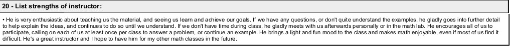

.. MODE: SUBMISSION PACKAGE
..
.. This document contains a collection of poetry and my resume. This comment contains a solitication from a journal and some context surrounding the journal.  Use the context to create a taste profile of the journal. Then create a cover for the letter submission and any other additional material (biography, etc) the solitication requires for submission tailored to the taste profile.

============
Solicitation
============

WE ARE OPEN! We’ll be taking until September 15th, or until we reach our submissions cap of 200 submissions*. We will review submissions as they come in. (*We may extend our open period, but this is to be determined. We’re brand-new and want to be sure everything is working smoothly for the team.)

Submit to Rat Bag Lit

Send us YOUR WEIRDEST FICTION
Fiction that crosses genres and blurs the lines between literary and genre. Work that keeps us up at night, stories that make us laugh, and the strangest dreams that pop out of your odd little noggin. Bold ideas, tight prose, snappy dialogue, speculative elements. Something we haven’t seen and, hell, maybe something we’ll wish we hadn’t. Mysterious, haunted mansions, crackling campfires, electric space stations, lonely abandoned farmhouses. That story that you hold close to your heart but has been rejected a billion times, but you keep sending it out because you believe in it, damnit? Yeah. Send us that one.

Yes to aliens, alternate worlds, apocalyptic game shows, bigfoot, blue collar, cats, cemeteries, coming-of-age, cosmic, cryptids, cults, cursed objects, dark, dating fails, dystopian, elder millennials, embarrassing moments, female narrators, food service, gen x, ghosts, girl power, gothic, grim reapers, grumpy unicorns, fairytale revamps, found family, haunted mansions, hidden worlds, horror, humor, liminal spaces, mermaids, modern-day wizards, mythology revamps, occult, ordinary people finding portals, paranormal, post-apocalyptic, sad robots, secret societies, squishy soft science fiction, shitty roommates, snark, social commentary, silly, steampunk, stoners, swapped gender roles, supernatural, talking animals with bad attitudes, teenagers, time travel, tongue-in-cheek, underdogs, unreliable narrators, urban fantasy, weirdos, witchcraft

Probably no to action / adventure, all vibes no story, boring stories, children’s stories, celebrities, cliches, cozy, dead wife/husband/parent/partner, emotional manipulation, espionage, excessively purple prose, hate of any kind, historical fiction, humor that denigrates, kids with cancer, military fiction, modern politics, mystery, political satire, rage bait, religious fanaticism, sappy romance, sword & sorcery, thriller, tired tropes, tragedy, werewolves, vampires, zombies

We don’t want:

No AI-generated stories. If it didn’t come from the depths of your own weird brain, we don’t want to read it. We will not consider stories written, co-written, created, or assisted by AI and machine-learning languages such as ChatGPT. We do not use AI-generated images.

No hate speech. We aren’t interested in your bigotry, homophobia, racism, sexism, or transphobia, or anything along those lines. We are an inclusive publisher.

No fan fiction. We won’t publish anything that violates someone else’s copyright. We’d prefer you come up with your own characters and worlds. The exception to this being mythological fiction, in which case, make it modern and interesting as you breathe new life into old (public domain) tales.

No hard-core erotica. I mean, if you send us something hot, we’ll read it, but if you make Ratty blush, we probably can’t publish it. That being said, we are not prudes. If you can walk the line without crossing it, by all means, send it in if you think it fits our vibe.

No hard-core violence and gore. We don’t want to read it, even with a trigger warning. Keep it off-page please.

don’t self reject
If you love your story and think it fits our vibes, why not take a shot and send it our way? Worst case, you’ll get another rejection to add to your pile, and maybe we’ll love it. We are an inclusive publisher and welcome submissions from writers of all demographics. We especially want to hear from underrepresented voices

PLANNED PUBLICATION SCHEDULE

We’re brand-new so the schedule may change a bit, but we hope to publish digitally monthly and in print twice a year. We hope to have our first digital content published on October 15th. Our first print publication will have a scheduled release date of March 15, 2026, but this date is subject to change. We will post any updates to our publication schedule here and on our social media.

We accept unsolicited submissions written in English and have a limited number of free submissions each submission cycle. We offer editorial feedback with submissions for an optional charge. We appreciate your tip jar submissions.

We do not charge our authors any fees for publication beyond the optional fees listed above. If free submissions are closed and paying a submission fee presents a financial hardship to you, email us for assistance.

Check back soon for current openings.

We are a paying market
The pay is shit, but it’s better than nothing, right?

We don’t believe in using author’s work without compensation*. If your work wasn’t a part of this project, this project wouldn’t exist. Right now, we offer token payments as detailed below. We recognize it’s not what your work is surely worth, but it’s the best we can offer on our shoestring budget. This is a labor of love..

We accept fiction, creative non-fiction, and poetry in the following categories:

Drabbles – monthly themes, exactly 100 words, no more, no less, with a maximum 15 word title. We will select a maximum 10 each month for digital publication – pays $1. No reprints

Micros – maximum 300 words. We will select a maximum of 10 each month for digital publication – pays $3. No reprints

Flash – between 301 – 1000 words maximum. Pays a penny a word for print/digital publication, up to a maximum of $10. No reprints.

Creative Non-Fiction – 500-1000 words maximum. Pays a penny a word for print/digital publication, up to a maximum of $10. No reprints.

Short Story – 1001 words up to a maximum of 3500 words. Print/digital publication, Pays $20, Reprints $10.

Poetry – We’ll be honest, we aren’t super familiar with poetry, but we’re willing to take a look at what you’ve got. Experimental, non-rhyming, non-traditional… Sure, why not? We won’t know any better. Make it weird, keep it short, maximum 500 words. Pays $5 for print/digital publication. No reprints

Payments will be made via PayPal.

Submit only one story / poem per category at a time, except for Drabbles, which may include two in the same file.

Yes, you can submit in multiple categories, up to a maximum of one story per category. 

Yes, you can submit again if your story is rejected and we’re still open. Please wait for a response before submitting in the same category again.

Yes to simultaneous submissions. Just let us know if your piece is picked up elsewhere.

Yes, we accept reprints. We can only publish stories if your rights have reverted to the author. Please include the original publisher and date of publication in your cover letter when submitting a reprint story. We only accept reprints in the Short Story category at this time and prefer to only accept reprints that are not currently available online.

If your story is rejected, please do not resubmit it, even after revisions, unless we specifically invite you to do so in your rejection letter.

Don’t stress over your cover letter. Please include your name, contact information, the title of your story / poem, up to three previous publications, if any, and any other information relevant to your submission. Feel free to tell us (briefly) about something weird that happened to you this week or a bizarre-but-true fact about yourself, but we won’t judge you if you keep it strictly professional. 

Please also include a 50-word maximum bio statement that will be included with your submission if selected for publication. This can include links to your personal website and social media. Links won’t be included in print, but will be available on the website. (You will be asked if you’d like to provide a profile picture upon acceptance.)

Work should be submitted in Shunn Modern Manuscript Format, or something close to it. (We aren’t going to reject a good story for bad formatting.) We read anonymous submissions — please remove your name and contact information from the document before you submit. Please send your file as an attachment in .docx format.

Response Times

We will answer as quickly as possible. We’ll do our best to respond within 30 days for drabbles and micros, but longer submission may take as many as 60 days to get a response. Pieces held for further consideration will take longer. We are easily distracted, so if you don’t hear from us within 60 days, please feel free to query. We don’t bite. Usually. We will occasionally provide personalized feedback, but most rejections will be form. We know, we hate it, too.

Payment

All payments are made using PayPal at this time. We may explore other payment methods in the future, especially for international submissions. If using PayPal presents a hardship, we’ll figure out a different way to pay you, if necessary. We will send a contract upon acceptance. Authors will be paid upon publication.

Legal

Rat Bag Literary pays for first worldwide electric and print rights and for non-exclusive reprint rights on original stories. For reprints, we ask for non-exclusive archival reprint rights.

By submitting a story / poem to Rat Bag, you understand and agree with the following:

You are the original creator of the story / poem / art you are submitting

You did not use generative AI in the creation of this work

You are the copyright holder of the work you are submitting.

You are eighteen years of age or older. (We may consider submissions from younger authors with parental/guardian approval.)

All information you’ve submitted is accurate and truthful.

You accept full and sole responsibility for any false statement made and any rights that might be infringed upon by the publication of your work.

You have not published this work elsewhere, or the rights have reverted to you, the author, at the time of submission and you have indicated it in your cover letter. You are not prohibited via any prior agreement from transferring the rights of your work to Rat Bag Literary Magazine.

Once your story / poem is published by Rat Bag Literary, we ask for 90 days (3 months) exclusive rights on your work. This means your story / poem cannot appear anywhere else online for 90 days after it appears in Rat Bag. After 90 days, rights revert to the author, with the exception of the non-exclusive archival digital rights.

Your work will be lightly line-edited as needed before publication. You will work with the editor and approve all edits to ensure the copy that goes to print / digital publication is the best it can be.

NOTE: We are a small endeavor with a shoestring budget. This means we will have to reject stories that are excellent, so please do not take a rejection as a reflection of your work or your abilities as a writer. Rejections sucks, we get that, so we’ll be nice about it, promise.

(Speaking of wanting to pay authors more, have you checked out our merch?)

.. _resume:

======
Resume
======

.. image:: ../_static/img/personal/fractal-me.jpg
    :alt: Fractal Me
    :align: center

.. topic:: Contact Information

  Email: chinchalinchin@gmail.com

.. _education:

Education
=========

.. list-table:: Education
  :widths: 15 15 15 15
  :header-rows: 1

  * - School
    - Degree
    - Field of Study
    - Graduation
  * - Towson University
    - Master of Science
    - Mathematics
    - 2013
  * - Frostburg State University
    - Bachelor of Science
    - Physics
    - 2010

.. _experience:

Experience
==========

.. _employment:

Employment
----------

.. list-table:: Employment
  :widths: 15 15 15
  :header-rows: 1

  * - Employer
    - Roles
    - Dates
  * - ProvisionIAM
    - Senior DevOps Engineer
    - March 2025 - Current
  * - MDThink
    - DevOps Lead
    - June 2024 - December 2024
  * - Bishop Walsh
    - Math Teacher
    - September 2023 - March 2024
  * - IHS Markit
    - Software Engineer
    - October 2022 - March 2023
  * - Booz Allen Hamilton
    - Staff Engineer
    - June 2022 - December 2023
  * - Makpar
    - DevOps Engineer
    - October 2021 - May 2022
  * - IBM
    - Full Stack Developer
    - June 2019 - April 2021
  * - Front Range Community College
    - Mathematics Professor
    - January 2018 - December 2018
  * - University of Cincinnati
    - Adjunct Professor
    - August 2017 - December 2017
  * - YTI Career Institute
    - Math Instructor
    - August 2015 - December 2015
  * - Frostburg State University
    - Adjunct Professor
    - August 2015 - May 2017
  * - Allegany College of Maryland
    - Adjunct Professor
    - January 2015 - December 2015
  * - Hamilton Relay
    - Relay Operator
    - April 2014 - December 2014
  * - IBM
    - Conversion Worker
    - November 2013 - April 2014
  * - Walmart
    - Cashier
    - November 2011 - September 2012
  * - Active Network
    - Reservation Specialist
    - January 2011 - August 2011
  * - Savage River Lodge
    - Maintenance
    - June 2010 - November 2010
  * - Burger King
    - Slave
    - March 2009 - August 2009
  * - Fox's Pizza
    - Delivery Driver
    - February 2009 - January 2010
  * - Ruby Tuesday
    - Cook
    - April 2008 - January 2009
  * - Denny's
    - Cook
    - June 2007 - February 2008
  * - Banana Cafe
    - Dish Washer
    - May 2006 - September 2006
    
.. _volunteering:

Volunteering
------------

.. list-table:: Volunteering
  :widths: 15 15 15
  :header-rows: 1

  * - Organization
    - Roles
    - Dates
  * - AmeriCorps
    - Mathematics Tutor
    - August 2014 - August 2016

.. _certifications:

Certifications
--------------

.. list-table:: Certifications
  :header-rows: 1
  :widths: 20 40 40
  :stub-columns: 1

  * - Organization
    - Certification
    - Badge
  * - AWS
    - Developer Associate
    - .. image:: ../_static/img/personal/resume/aws-certified-developer-associate.png
        :alt: AWS Developer Associate
        :height: 50px
        :align: center
  * - AWS
    - DevOps Professional
    - .. image:: ../_static/img/personal/resume/aws-certified-devops-engineer-professional.png
        :alt: AWS DevOps Professional
        :height: 50px
        :align: center
  * - IBM
    - Docker Essentials
    - .. image:: ../_static/img/personal/resume/ibm-docker-introduction.png
        :alt: IBM Docker Essentials
        :height: 50px
        :align: center
  * - IBM
    - Enterprise Design
    - .. image:: ../_static/img/personal/resume/ibm-enterprise-design.png
        :alt: IBM Enterprise Design
        :height: 50px
        :align: center
  * - MTA
    - Database Administration
    - .. image:: ../_static/img/personal/resume/mta-database-fundamentals-certified-2018.png
        :alt: MTA Database Fundamentals
        :height: 50px
        :align: center
  * - MTA
    - Python Programming
    - .. image:: ../_static/img/personal/resume/mta-introduction-to-programming-using-python-certified-2018.png
        :alt: MTA Python Programming
        :height: 50px
        :align: center
  * - MTA
    - Java Programming
    - .. image:: ../_static/img/personal/resume/mta-introduction-to-programming-using-java-certified-2018.png
        :alt: MTA Java Programming
        :height: 50px
        :align: center
  * - MTA
    - Software Development Fundamentals
    - .. image:: ../_static/img/personal/resume/mta-software-development-fundamentals-certified-2018.png
        :alt: MTA Software Development Fundamentals
        :height: 50px
        :align: center

.. _testimonials:

Testimonials
============

.. image:: ../_static/img/personal/resume/testimonial-math-201.jpg
  :alt: MATH 201, Calculus
  :align: center

----

==========
Submission
==========

------------
I: Absurdity
------------

| One lovely Thursday afternoon
|   two billion years ago,
| A star encased by arcs of moon,
|   embraced despair and woe. 
| 
| This sordid joke of yellow-red,
|    This sneering, mocking jape:
| To burn with heat, on axis sped
|    with no hope of escape.
|
| So solace cursed upon a point,
|    it drew its final plan
| As spinning round its lock and joint
|    its ending now began.
| 
| The heaving mass of goo morassed
|    then gurgled once and sighed;
| A rattle scream of flames harassed
|    what silent void belied. 
| 
| The sacrificial rings were flung
|   in sprays across the sky;
| The interstitial threads then wrung
|   as ropes once bound untie. 
|
| And in these fictions fracture facts:
|    A single atom forged
| and bellow blown through heaven's tracts
|    to find itself disgorged. 
| 
| The crush of black, once unobserved,
|    in fire found its sight.
| The atom woke from dreams unnerved
|    in sailing stream of flight. 
| 
| Without a frame, it screamed in vain
|    through parallactic curves
| that weave the sieves with cluttered skein
|    Of dark galactic nerves. 
|
| Commotion drowned, it gazed about
|    along the ends it aimed:
| The bluest gem beyond a doubt
|    the cosmos ever named. 
| 
| It wept to see a brilliant Earth,
|    the fate bestowed by chance,
| and in its cackles rose a mirth
|    expressed in photon's dance. 
|
| It splashed the surface spinning fast,
|    now lost amid the sea. 
| The water rose at what trespassed,
|    mistook it for debris.
|
| The liquid swarm convened in waves,
|    to flood the tiny core.
| They stripped and pried, as hunger craves
|    and always wants for more. 
|
| The terror flashed, as pulled apart,
|   its briefly tasted life
| now disappeared before its start 
|   beneath the wetted knife. 
|
| So bittersweet and incomplete, 
|   resigned into the black,
| the atom braced for ends to meet 
|   in swirling last attack.
|
| But fortune finds where will converged,
|   as snatched from death it gasped
| and saw from depths the land emerged,
|   where brethren all were clasped.
|
| A molecule of carbon made
|   from crystal network cast
| through jointed links of atom braid
|   that helix ghosts amassed. 
|
| Began the age of afterbirths, 
|   of structure spat in space,
| originating blest on Earth's
|   atomic interface. 
|
| Now watch along the webbing sewn
|   the single atom weave
| Through warps and wefts and whetted stone,
|   the knits of stellar sleeve.

- *Original*: February 2025
- *Revised*: June 2025

.. list-table:: Submission History
  :widths: 15 15 15
  :header-rows: 1

  * - Date
    - Publication
    - Status
  * - March 27, 2025
    - Rattle Poetry
    - Rejected
  * - July 15, 2025
    - Space and Time
    - Pending
  * - August 11, 2025
    - The Genre Society
    - Pending