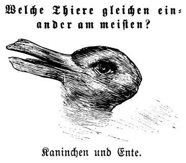
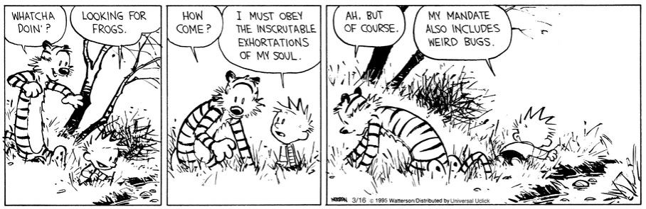

Ἐλάρα
-----

.. toctree::
   :maxdepth: 1
   :caption: Contents:
   :hidden:

   canon/index
   epistemia/index
   pedagogy/index
   theurgy/index
   analecta/index
   oeuvre/index
   fabula/index
   
.. raw:: html

   

      
On serif peels

      
sleep fires, no?

   

--------------

--------------

.. epigraph::

   *ό ποιητα, ἢ πῖθι ἢ ἄπιθι*

   -- Inscription on an Ancient Grecian drinking vessel.

--------------

