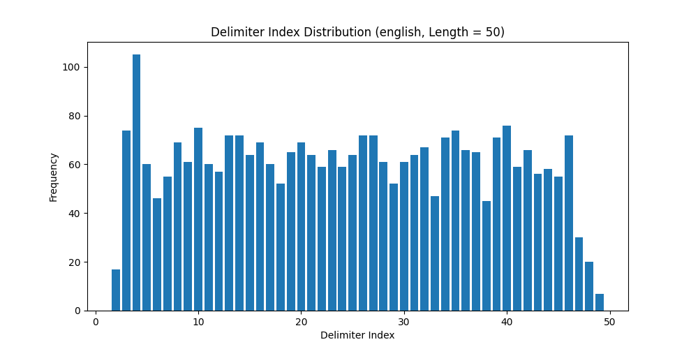

.. _section-v:

Section V: Integration
======================

The study of Palindromes leads directly into the study of Delimiter distributions. The partitioning of Palindromes into the Perfect and Imperfect aspects highlights the asymmetry which separates the latter from the former class. Consider the pair of Perfect Palindromes, 

- god lived on no devil dog
- i am civic am i

Since, by :ref:`Definition 4.1.2 <definition-4-1-2>`, Perfect Palindromes are exactly the class of Sentences that are equal to their own Inverses, the Delimiters in a Perfect Palindrome display symmetry. The following barcharts show the Character indices of Delimiters for these examples. Note the horizontal axes are scaled to the Sentence String Length,

.. image:: ../_static/images/sentences/palindromes/delimiter_indices_perfect_palindrome_1.png
  :width: 400
  :alt: Delimiter Indices, Perfect Palindrome, Example #1

.. image:: ../_static/images/sentences/palindromes/delimiter_indices_perfect_palindrome_2.png
  :width: 400
  :alt: Delimiter Indices, Perfect Palindrome, Example #2

Notice the Delimiter indices are symmetrical about the center. Now consider the pair of Imperfect Palindromes, 

- goddesses so pay a possessed dog 
- borrow or rob

According to :ref:`Definition 4.1.3 <definition-4-1-3>`, Imperfect Palindromes must first be :math:`\sigma\text{-reduced}` to restore their symmetry. An examination of the corresponding barcharts for these examples show why,

.. image:: ../_static/images/sentences/palindromes/delimiter_indices_imperfect_palindrome_2.png
  :width: 400
  :alt: Delimiter Indices, Imperfect Palindrome, Example #2

Imperfect Palindromes are exactly those class of Palindromes which do not have symmetrical Delimiter distributions. 

The goal of this section is to understand the Delimiter symmetry displayed by Perfect Palindromes, in order to help further classify Imperfect Palindromes according to the type of Delimiter asymmetry found in a particular instance. In other words, the analysis seeks a method for quantifying a Perfect Palindrome's Delimiter symmetry in order to apply the same method to Imperfect Palindromes, with the hope of gaining greater insight into the syntactical obstacles preventing direct formal access to the class of Imperfect Palindromes.

The essential problem of modelling Delimiter distributions is the method of approach. Analytical methods, if not well constructed, are liable to lead to seemingly well-supported, but logically flawed conclusions. 

Consider taking Sentences from a Corpus and for each one, calculating and returning the Delimiter indices, as in the following,

.. math::

  ᚠ = \text{"error is the price we pay for progress"}

.. math::

  D_ᚠ = \{ (6, \sigma), (9, \sigma), (13, \sigma), (19, \sigma), (22, \sigma), (26, \sigma), (30, \sigma) \}

Note the set :math:`D_ᚠ` is the set involved in :ref:`Definition 3.2.1 <definition-3-2-1>` of the Delimiter Count function. If a large Corpus is analyzed so that each Sentence is reduced to a set of Delimiter indices, and then the frequency of Delimiter Counts is plotted, an interesting, but potentially misleading result is obtained. The following histograms show the result of this technique for Sentences of various fixed lengths. 

.. image:: ../_static/images/sentences/english/delimiter_distribution_n100.png
  :width: 400
  :alt: Delimiter Distribution, Sentence String Length = 100

As can be seen from the shape of the histograms, the Delimiter index distribution for Sentences of fixed length is roughly uniform (with a potentially significant spike in the far left tail of each distribution). These graphs suggest the Delimiter Count of a single Character, :math:`\zeta[k]`, can be approximated by a discrete, uniform random variable, conditional on the Sentence String Length,

.. math::

  P(\Delta(\hat{\zeta}[k]) | l(\zeta) = \lambda) = \frac{1}{\lambda}

Where :math:`P()` represents the probability of an event, :math:`\hat{\zeta[k]}` represents a random varaible and :math:`\lambda` represents a fixed String Length. However alluring, there is a subtle, but important assumption going into the generation of these histograms that prevents the acceptance of this conclusion.

When Sentences are reduced to Delimiter indices and plotted in aggregate, information related to the relative order of the Delimiter in the Sentence is lost. In other words, the method of construction used to generate these histogram implicitly assumes,

.. math::

  P(\Delta(\hat{zeta}[k]) | \Delta(\zeta[k-1]) = \delta_{k-1}, \Delta(\zeta[k-2]) = \delta_{k-2}, ... , \Delta(\zeta[1]) = \delta_1 ) = P(\Delta(\zeta[k]))

To provide a more concrete example, consider the Sentences, 

.. math::

  ᚢ = \text{"the dog runs across the field"}

.. math::
  
  ᚦ = \text{"the child laughs at the joke"}

In each case,

.. math::

  \Delta(ᚢ[4]) = \Delta(ᚦ[4]) = 1

The presence of the Delimiter after the article *"the"* affects the subsequent appearance of Delimiters in the Sentences. Due to grammatical rules, a noun must follow the article and this has tangible, measureable syntactic effects. Given the information :math:`\Delta(ᚢ[4]) = 1`, this fact greatly decreases (perhaps even nullifies) the event of :math:`\Delta(ᚢ[5]) = 1`. In fact, a probability model that describes linguistic entities might take it as an axiom,

.. math::

  P(\Delta(\hat{zeta}[k]) | \Delta(\zeta[k-1]) = 1 ) = 0

In summary, it cannot be discounted that knowing where a single Delimiter occurs in a Sentence influences the possible locations where other Delimiters might occur. However, accounting for this contingency presents computational challenges. A Sentence with 100 Characters will have :math:`2^100` possible Delimiter configurations, by the Fundamental Counting Principle. Tracking the Delimiter distribution across different Sentence String Lengths becomes impossible. Enumerating and tallying these outcomes is a prohibitively expensive task, if abstraction is not employed to summarize the Delimiter *"mass"* of a Sentence. 

.. _section-v-i:

Section V.I: Definitions
------------------------

Before attempting to extricate the probability density of Delimiters within the Sentences of a Corpus, a conceptual apparatus is required for aggregating and assessing the distribution and configuration of Delimiters in a particular Sentence. 

This apparatus is embodied the concept of a *Sentence Integral*. A Sentence Integral is simply the sum of Delimiter indices in a Sentence. The reason for introducing the connotation of *"integration"* into the vernacular will become apparent after the particular form of its definition is appreciated. In short, the term *"integration"* is used here to evoke the idea of summing or accumulating values over a range, similar to the integral in calculus.

.. _definition-5-1-1:

**Definition 5.1.1: Lefthand Sentence Integrals**

Let *ζ* be an arbitary Sentence from Corpus :math:`C_L` and let *k* be a natural number such that :math:`1 ≤ k ≤ \Lambda(\zeta)`. The *Lefthand Integral* of Sentence *ζ*, denoted :math:`\Omega_{-}(\zeta, k)`, is defined as,

.. math::

  \Omega_{-}(\zeta, k) = \sum_{i=1}^{k} \Delta(\zeta[i]) \cdot \frac{l(\zeta[:i])}{l(\zeta)}
    
∎
    
.. _definition-5-1-2:

**Definition 5.1.2: Lefthand Sentence Integrals**

The *Right-Hand Integral* of Sentence ζ, denoted *Ω*:sub:`+`*(ζ,k)*, is defined as,

.. math::

  \Omega_{+}(\zeta, k) = \sum_{i=1}^{k} \Delta(\zeta[i]) \cdot \frac{l(\zeta[i:])}{l(\zeta)}
    
∎

Take note how the Delimiter Count function is employed in this definitions. Since the domain of discourse is Strings and all Characters are Strings, a Character is valid input to the Delimiter Count. The quantity :math:`\Delta(\zeta[i])` is essentially an indicator variable, taking on the values of 0 or 1, depending on if :math:`\zeta[i] = \sigma` or :math:`\zeta[i] \neq \sigma`.To draw an analogy to a famous mathematical function, the Delimiter Count :math:`\Delta(\zeta[i])` acts in a similar way to the a Dirac delta function :math:`\delta(x)`, in that it selects particular values to contribute to the integrand. 

Each Delimiter that is encountered along the length of the String is then weighted by the length of the Partial Sentence. Recall, by :ref:`Definition 4.2.1` and :ref:`Definition 4.2.2`, the length of Partial Sentences are given by,

.. math::

  l(\zeta[:i]) = i

.. math::

  l(\zeta[i:]) = l(\zeta) - i + 1

In other words, the weights given to the Delimiter Count are exactly the Character indices *relative to the starting or ending Character in the Sentence*. The Lefthand Sentence Integral represents the sum of Delimiter positions relative to the first Character, normalized by the String Length of the Sentence, while the Righthand Sentence Integral represents the sum of Delimiter positions relative to the last Character, also normalized by the String Length of the Sentence.

The following examples calculate the Lefthand and Righthand Sentence Integrals for various illustrative Palindromes.

**Example** 

1. Let *ᚠ = "live evil"*. Then *l(ᚠ) = 9*. Note *ᚠ* is a Perfect Palindrome.
   
.. list-table::
  :widths: 10 10 10 10 10 15 15
  :header-rows: 1

  * - k
    - ᚠ[k]
    - l(ᚠ[:k])
    - l(ᚠ[k:])
    - Δ(ᚠ[k])
    - Ω:sub:`-`(ᚠ ,k)
    - Ω:sub:`+`(ᚠ ,k)
  * - 1
    - "l"
    - 1
    - 9
    - 0
    - 0
    - 0
  * - 2
    - "i"
    - 2
    - 8
    - 0
    - 0
    - 0
  * - 3
    - "v"
    - 3
    - 7
    - 0
    - 0
    - 0
  * - 4
    - "e"
    - 4
    - 6
    - 0
    - 0
    - 0
  * - 5
    - " "
    - 5
    - 5
    - 1
    - (5/9)
    - (5/9)
  * - 6
    - "e"
    - 6
    - 4
    - 0
    - (5/9)
    - (5/9)
  * - 7
    - "v"
    - 7
    - 3
    - 0
    - (5/9)
    - (5/9)
  * - 8
    - "i"
    - 8
    - 2
    - 0
    - (5/9)
    - (5/9)
  * - 9
    - "l"
    - 9
    - 1
    - 0
    - (5/9)
    - (5/9)

2. Let *ᚠ = "we panic in a pew"*. Then *l(ᚠ) = 17*. Note *ᚠ* is an Imperfect Palindrome with more Non-Delimiter Characters in the first half in comparison to the second half. In other words, most of the Delimiters in *ᚠ* occur in the second half of the Sentence.
   
.. list-table::
  :widths: 10 10 10 10 10 15 15
  :header-rows: 1

  * - k
    - ᚠ[k]
    - l(ᚠ[:k])
    - l(ᚠ[k:])
    - Δ(ᚠ[k])
    - Ω:sub:`-`(ᚠ ,k)
    - Ω:sub:`+`(ᚠ ,k)
  * - 1
    - "w"
    - 1
    - 17
    - 0
    - 0
    - 0
  * - 2
    - "e"
    - 2
    - 16
    - 0
    - 0
    - 0
  * - 3
    - " "
    - 3
    - 15
    - 1
    - (3/17)
    - (15/17)
  * - 4
    - "p"
    - 4
    - 14
    - 0
    - (3/17)
    - (15/17)
  * - 5
    - "a"
    - 5
    - 13
    - 0
    - (3/17)
    - (15/17)
  * - 6
    - "n"
    - 6
    - 12
    - 0
    - (3/17)
    - (15/17)
  * - 7
    - "i"
    - 7
    - 11
    - 0
    - (3/17)
    - (15/17)
  * - 8
    - "c"
    - 8
    - 10
    - 0
    - (3/17)
    - (15/17)
  * - 9
    - " "
    - 9
    - 9
    - 1
    - (12/17)
    - (24/17)
  * - 10
    - "i"
    - 10
    - 8
    - 0
    - (12/17)
    - (24/17)
  * - 11
    - "n"
    - 11
    - 7
    - 0
    - (12/17)
    - (24/17)
  * - 12
    - " "
    - 12
    - 6
    - 1
    - (24/17)
    - (30/17)
  * - 13
    - "a"
    - 13
    - 5
    - 0
    - (24/17)
    - (30/17)
  * - 14
    - " "
    - 14
    - 4
    - 1
    - (38/17)
    - (34/17)
  * - 15
    - "p"
    - 15
    - 3
    - 0
    - (38/17)
    - (34/17)
  * - 16
    - "e"
    - 16
    - 2
    - 0
    - (38/17)
    - (34/17)
  * - 17
    - "w"
    - 17
    - 1
    - 0
    - (38/17)
    - (34/17) 

3. Let *ᚠ = "draw no dray a yard onward"*. Then *l(ᚠ) = 26*. Note *ᚠ* is an Imperfect Palindrome with a similar (but not identical) distribution of Delimiters around the Pivot.

.. list-table::
  :widths: 10 10 10 10 10 15 15
  :header-rows: 1

  * - k
    - ᚠ[k]
    - l(ᚠ[:k])
    - l(ᚠ[k:])
    - Δ(ᚠ[k])
    - Ω:sub:`-`(ᚠ ,k)
    - Ω:sub:`+`(ᚠ ,k)
  * - 1
    - "d"
    - 1
    - 26
    - 0
    - 0
    - 0
  * - 2
    - "r"
    - 2
    - 25
    - 0
    - 0
    - 0
  * - 3
    - "a"
    - 3
    - 24
    - 0
    - 0
    - 0
  * - 4
    - "w"
    - 4
    - 23
    - 0
    - 0
    - 0
  * - 5
    - " "
    - 5
    - 22
    - 1
    - (5/26)
    - (22/26)
  * - 6
    - "n"
    - 6
    - 21
    - 0
    - (5/26)
    - (22/26)
  * - 7
    - "o"
    - 7
    - 20
    - 0
    - (5/26)
    - (22/26)
  * - 8
    - " "
    - 8
    - 19
    - 1
    - (13/26)
    - (41/26)
  * - 9
    - "d"
    - 9
    - 18
    - 0
    - (13/26)
    - (41/26)
  * - 10
    - "r"
    - 10
    - 17
    - 0
    - (13/26)
    - (41/26)
  * - 11
    - "a"
    - 11
    - 16
    - 0
    - (13/26)
    - (41/26)
  * - 12
    - "y"
    - 12
    - 15
    - 0
    - (13/26)
    - (41/26)
  * - 13
    - " "
    - 13
    - 14
    - 1
    - (26/26)
    - (55/26)
  * - 14
    - "a"
    - 14
    - 13
    - 0
    - (26/26)
    - (55/26)
  * - 15
    - " "
    - 15
    - 12
    - 1
    - (41/26)
    - (67/26)
  * - 16
    - "y"
    - 16
    - 11
    - 0
    - (41/26)
    - (67/26)
  * - 17
    - "a"
    - 17
    - 10
    - 0
    - (41/26)
    - (67/26)
  * - 18
    - "r"
    - 18
    - 9
    - 0
    - (41/26)
    - (67/26)
  * - 19
    - "d"
    - 19
    - 8
    - 0
    - (41/26)
    - (67/26)
  * - 20
    - " "
    - 20
    - 7
    - 1
    - (61/26)
    - (74/26)
  * - 21
    - "o"
    - 21
    - 6
    - 0
    - (61/26)
    - (74/26)
  * - 22
    - "n"
    - 22
    - 5
    - 0
    - (61/26)
    - (74/26)
  * - 23
    - "w"
    - 23
    - 4
    - 0
    - (61/26)
    - (74/26)
  * - 24
    - "a"
    - 24
    - 3
    - 0
    - (61/26)
    - (74/26)
  * - 25
    - "r"
    - 25
    - 2
    - 0
    - (61/26)
    - (74/26)
  * - 26
    - "d"
    - 26
    - 1
    - 0
    - (61/26)
    - (74/26)

∎

From these examples, it can be seen that Sentence Integrals can be regarded as a measure of *"delimiter mass"*. When the Lefthand Sentence Integral is greater than the Righthand Sentence Integral, this is an indication the Sentence has more Delimiters in its right half than its left half. In other words, the Delimiters positions relative to the start of the Sentence sum to a greater number than the Delimiter positions relative to the end.

For the same reason, if the Righthand Sentence Integral is greater than the Lefthand Sentence Integral, this is an indication the Sentence has more Delimiters in its left half than its right half. In other words, the Delimiters positions relative to the end of the Sentence sum to a greater number than the Delimiter positions relative to the start.

This method of *"weighing"* the Delimiters in a Sentence provides a method for abstractly describing the symmetry of Delimiters in Perfect Palindromes. Before using this method to quantify the symmetry of Perfect Palindromes, the next section will strengthen the definitions of Sentence Integrals with some theorems. 

.. _section-v-ii:

Section V.II: Theorems 
----------------------

TODO: explain 

.. _theorem-5-2-1:

**Theorem 5.2.1**: ∀ ζ ∈ C:sub:L: ∀ k ∈ N:sub:l(ζ): Ω:sub:-(ζ,k) ≥ 0 and Ω:sub:+(ζ,k) ≥ 0

Proof:

Let ζ be an arbitrary Sentence in the Corpus C:sub:L, and let k be a natural number such that 1 ≤ k ≤ l(ζ).

By Definition A.8.1:

Ω:sub:`-`(ζ,k) = Σ:sub:`i=1`:sup:`k` Δ(ζ[i]) * (l(ζ[:i])/l(ζ))
Ω:sub:`+`(ζ,k) = Σ:sub:`i=1`:sup:`k` Δ(ζ[i]) * (l(ζ[i:])/l(ζ))
Δ(ζ[i]) is either 0 or 1 for all i (since it counts delimiters).
l(ζ[:i]), l(ζ[i:]), and l(ζ) are all positive (lengths are always positive).
i is positive.
Therefore, each term in the summations is non-negative (either 0 * something or 1 * something non-negative). The sum of non-negative terms is always non-negative.

Thus, Ω:sub:-(ζ,k) ≥ 0 and Ω:sub:+(ζ,k) ≥ 0.

Since ζ and k were arbitrary, we can generalize:

∀ ζ ∈ C:sub:`L`: ∀ k ∈ N:sub:`l(ζ)`: Ω:sub:`-`(ζ,k) ≥ 0 and Ω:sub:`+`(ζ,k) ≥ 0
This completes the proof.

.. _theorem-5-2-2:

**Theorem 5.2.2** ∀ ζ ∈ C:sub:`L`: ∀ k ∈ N:sub:`l(ζ)`: Ω:sub:`-`(ς(ζ),k) = Ω:sub:`+`(ς(ζ),k) = 0

Let *ζ* be an arbitrary Sentence in the Corpus and let *k* be a natural number such that,

   1. ζ ∈ C:sub:`L`
   2. k ∈ N:sub:`l(ζ)`:

By Definition 3.1.2, the *σ*-reduction of *ζ*, denoted *ς(ζ)*, is a String obtained by removing all Delimiter Characters (*σ*) from *ζ*. By Theorem A.2.11, 

   3. Δ(ς(t)) = 0

Consider the Left-Hand Integral of *ς(ζ)* up to index k:

   4. Ω:sub:`-`(ς(ζ),k) = Σ:sub:`i=1`:sup:`k` Δ(ς(ζ)[:i]) * (l(ς(ζ)[:i])/l(ς(ζ)))
   
By the Definition 3.2.5 of Left Partial Sentence and Definition 3.1.2 of *σ*-reduction, *ς(ζ)[:i]* is a String contained in *ς(ζ)* from the beginning up to the *i*:sup:`th` Character. Since *ς(ζ)* contains no Delimiters, *ς(ζ)[:i]* will also contain no Delimiters. Therefore, by Theorem A.2.11,

   5. ∀ i ∈ N:sub:`k`: Δ(ς(ζ)[:i]) = 0
   
Substituting this into step 4,

   6. Ω:sub:`-`(ς(ζ),k) = Σ:sub:`i=1`:sup:`k` 0 * (l(ς(ζ)[:i])/l(ς(ζ))) = Σ:sub:`i=1`:sup:`k` 0 = 0
   
Consider the Right-Hand Integral of *ς(ζ)* up to index *k*:

   7. Ω:sub:`+`(ς(ζ),k) = Σ:sub:`i=1`:sup:`k` Δ(ς(ζ)[i:]) * (l(ς(ζ)[i:])/l(ς(ζ)))
   
By the Definition 3.2.6 of Right Partial Sentence  and Definition 3.1.2 of *σ*-reduction, *ς(ζ)[i:]* is a String contained in *ς(ζ)* from the *i*:sup:`th` Character to the end. Since *ς(ζ)* contains no Delimiters, *ς(ζ)[i:]* will also contain no Delimiters. Therefore, by Theorem A.2.11,

   8. ∀ i ∈ N:sub:`k`: Δ(ς(ζ)[i:]) = 0
   
Substituting this into the expression into step 7,

   9. Ω:sub:`+`(ς(ζ),k) = Σ:sub:`i=1`:sup:`k` 0 * (l(ς(ζ)[i:])/l(ς(ζ))) = Σ:sub:`i=1`:sup:`k` 0 = 0

Thus, both the Left-Hand and Right-Hand Integrals of *ς(ζ)* are equal to 0,

   10. Ω:sub:`-`(ς(ζ),k) = Ω:sub:`+`(ς(ζ),k) = 0
   
Since *ζ* and *k* were arbitrary, this can generalize over the Corpus,

   11. ∀ ζ ∈ C:sub:`L`: ∀ k ∈ N:sub:`Λ(ζ)`: Ω:sub:`-`(ς(ζ),k) = Ω:sub:`+`(ς(ζ),k) = 0  

∎

The next two theorems provide a method for calculating the Lefthand and Righthand Sentence Integrals numerically.

.. _theorem-5-2-3:

**Theorem 5.2.3** ∀ ζ ∈ C:sub:`L`: ∀ k ∈ N:sub:`l(ζ)`: Σ:sub:`i=1`:sup:`k` Δ(ζ[i]) * (l(ζ[:i])/l(ζ)) = Σ:sub:`i=1`:sup:`k` Δ(ζ[i]) * (i/l(ζ))

Let *ζ* be an arbitrary Sentence in the Corpus,

    1. ζ ∈ C:sub:`L` 
    
Let *k* be a natural number such that,

    2. k ∈ N:sub:`l(ζ)`

By Definition 3.2.5 of Left Partial Sentences, for any *i* where *1 ≤ i ≤ l(ζ)*,

    3. l(ζ[:i]) = i

Now, consider the Left-Hand Integral up to index *k*,

    4. Ω:sub:`-`(ζ,k) = Σ:sub:`i=1`:sup:`k` Δ(ζ[:i]) * (l(ζ[:i])/l(ζ))

Substituting l(ζ[:i]) = i into the expression, we get:

    5. Ω:sub:`-`(ζ,k) = Σ:sub:`i=1`:sup:`k` Δ(ζ[:i]) * (i/l(ζ))
   
Since *ζ* and *k* were arbitrary, this can generalize over the Corpus,

    6. ∀ ζ ∈ C:sub:`L`: ∀ k ∈ N:sub:`l(ζ)`: Σ:sub:`i=1`:sup:`k` Δ(ζ[:i]) * (l(ζ[:i])/l(ζ)) = Σ:sub:`i=1`:sup:`k` Δ(ζ[:i]) * (i/l(ζ)) 

∎

.. _theorem-5-2-4:

**Theorem 5.2.4** ∀ ζ ∈ C:sub:`L`: ∀ i ∈ N:sub:`l(ζ)`: Σ:sub:`i=1`:sup:`k` Δ(ζ[i]) * (l(ζ[i:])/l(ζ)) = Σ:sub:`i=1`:sup:`k` Δ(ζ[i]) * ((l(ζ) - i + 1)/l(ζ))

PLet *ζ* be an arbitrary Sentence in the Corpus,

    1. ζ ∈ C:sub:`L` 
    
Let *k* be a natural number such that,

    2. k ∈ N:sub:`l(ζ)`
   
By Definition 3.2.6 of Right Partial Sentences, for any *i* where *1 ≤ i ≤ l(ζ)*, 

    3. l(ζ[i:]) = l(ζ) - i + 1
   
Now, consider the Right-Hand Integral up to index *k*:

    4. Ω:sub:`+`(ζ,k) = Σ:sub:`i=1`:sup:`k` Δ(ζ[i:]) * (l(ζ[i:])/l(ζ))`

Substituting step 3 into step 4,

    5. Ω:sub:`+`(ζ,k) = Σ:sub:`i=1`:sup:`k` Δ(ζ[i:]) * ((l(ζ) - i + 1)/l(ζ))

Since ζ and k were arbitrary, this can generalize over the Corpus,

    6. ∀ ζ ∈ C:sub:`L`: ∀ k ∈ N:sub:`l(ζ)`: Σ:sub:`i=1`:sup:`k` Δ(ζ[i:]) * (l(ζ[i:])/l(ζ)) = Σ:sub:`i=1`:sup:`k` Δ(ζ[i:]) * ((l(ζ) - i + 1)/l(ζ)) 

∎

The terms *(l(ζ) - i + 1)* and *i* that appear in the Sentence Integral summation may be thought of as the *"weight"* of a Delimiter. Since the Delimiter Count is either 0 or 1 for a single Character, the weight of Delimiters in a Sentence are the only contributions to the summation in a Sentence Integral. This analogy to the mathematical concepts of density and mass is codified in the following definition.

.. _definition-5-2-1:

**Definition 5.2.1: Delimiter Mass**

Let *ζ* be an arbitrary Sentence in the Corpus :math:`C_L`, and let *I* be a natural number such that *1 ≤ i ≤ l(ζ)*. T

The Righthand Delimiter Mass at Character Index *i*, denoted μ:sub:`+`(ζ, i), is defined as,

    μ:sub:`+`(ζ, i) = Δ(ζ[i]) * (l(ζ) - i + 1)

The Lefthand Delimiter Mass at Character Index *i*, denoted μ:sub:`-`(ζ, i) is defined as,

    μ:sub:`-`(ζ, i) = Δ(ζ[i]) * i ∎

The next theorem uses :ref:`Definition 5.2.1 <definition-5-2-1>` to show if the Delimiters in the left half of Sentence relative to the end *"weigh"* more than the Delimiters in the right half relative to the start, then this can only happen if the Righthand Sentence Integral is greater than the Lefthand Sentence Integral. Note the use of the Pivot :math:`\omega(\zeta)` in :ref:`Theorem 5.2.5 <theorem-5-2-5>`.

.. _theorem-5-2-5:

**Theorem 5.2.5** ∀ ζ ∈ C:sub:`L``: Σ:sub:`i=1`:sup:`ω(ζ)` μ:sub:`+`(ζ, i)  > Σ:sub:`i=ω(ζ)+1`:sup:`l(ζ)` μ:sub:`-`(ζ, i) ↔ Ω:sub:`+`(ζ,l(ζ)) > Ω:sub:`-`(ζ,l(ζ))

(→) Let *m = ω(ζ)*. Assume 

    1.  Σ:sub:`i=1`:sup:`ω(ζ)` μ:sub:`+`(ζ, i)  > Σ:sub:`i=ω(ζ)+1`:sup:`l(ζ)` μ:sub:`-`(ζ, i)

By Definition A.8.2, this is equivalent to,

    2. Σ:sub:`i=1`:sup:`m` Δ(ζ[i]) * (l(ζ) - i + 1) > Σ:sub:`i=m+1`:sup:`l(ζ)` Δ(ζ[i]) * i.

In other words, the assumption in step 1 is equivalent to claiming the sum of the Delimiters weights in the first half of the Sentence (up to and including the Pivot) is greater than the dum of Delimiter weights in the second half (after the Pivot). It is to be shown,

    3. Ω:sub:`+`(ζ,l(ζ)) > Ω:sub:`-`(ζ,l(ζ)).

Expanding the integrals,

    4. Ω:sub:`-`(ζ,l(ζ)) = Σ:sub:`i=1`:sup:`m` Δ(ζ[i]) * (i/l(ζ)) + Σ:sub:`i=m+1`:sup:`l(ζ)` Δ(ζ[i]) * (i/l(ζ))

    5. Ω:sub:`+`(ζ,l(ζ)) = Σ:sub:`i=1`:sup:`m` Δ(ζ[i]) * ((l(ζ) - i + 1)/l(ζ)) + Σ:sub:`i=m+1`:sup:`l(ζ)` Δ(ζ[i]) * ((l(ζ) - i + 1)/l(ζ))

We can rewrite the assumption as:

    6. Σ:sub:`i=1`:sup:`m` Δ(ζ[i]) * (l(ζ) - i + 1) > Σ:sub:`i=m+1`:sup:`l(ζ)` Δ(ζ[i]) * i

Divide both sides by l(ζ):

    7. Σ:sub:`i=1`:sup:`m` Δ(ζ[i]) * ((l(ζ) - i + 1)/l(ζ)) > Σ:sub:`i=m+1`:sup:`l(ζ)` Δ(ζ[i]) * (i/l(ζ))

Notice that the left-hand side of this inequality is part of the Right-Hand Integral *Ω*:sub:`+`(*ζ,l(ζ)*), and the right-hand side is part of the Left-Hand Integral *Ω*:sub:`-`(*ζ,l(ζ)*).

Since *l(ζ) - i + 1* > *i* for all *i ≤ m*, the weighted contribution of each Delimiter in the first half is larger in the Right-Hand Integral than in the Left-Hand Integral.

In addition, for *i > m*, we have *i > l(ζ) - i + 1*, meaning the weights *i/l(ζ)* are greater in the Left-Hand Integral than the corresponding weights *(l(ζ) - i + 1)/l(ζ)* in the Right-Hand Integral. Therefore, if the weighted sum of delimiters in the first half (weighted for the Right-Hand Integral) is greater than the weighted sum of delimiters in the second half (weighted for the Left-Hand Integral), this implies that the overall Right-Hand Integral must be greater than the overall Left-Hand Integral. Thus, 

    8. Ω:sub:`+`(ζ,l(ζ)) > Ω:sub:`-`(ζ,l(ζ))

(←) Assume,

    1. Ω:sub:`+`(ζ,l(ζ)) > Ω:sub:`-`(ζ,l(ζ))

By Definition A.8.1,

    2. Σ:sub:`i=1`:sup:`m` Δ(ζ[i]) * ((l(ζ) - i + 1)/l(ζ)) + Σ:sub:`i=m+1`:sup:`l(ζ)` Δ(ζ[i]) * ((l(ζ) - i + 1)/l(ζ)) > Σ:sub:`i=1`:sup:`m` Δ(ζ[i]) * (i/l(ζ)) + Σ:sub:`i=m+1`:sup:`l(ζ)` Δ(ζ[i]) * (i/l(ζ))

Rearranging the terms,

    3. Σ:sub:`i=1`:sup:`m` Δ(ζ[i]) * ((l(ζ) - i + 1)/l(ζ)) - Σ:sub:`i=1`:sup:`m` Δ(ζ[i]) * (i/l(ζ)) > Σ:sub:`i=m+1`:sup:`l(ζ)` Δ(ζ[i]) * (i/l(ζ)) - Σ:sub:`i=m+1`:sup:`l(ζ)` Δ(ζ[i]) * ((l(ζ) - i + 1)/l(ζ))

Simplifying,

    4. Σ:sub:`i=1`:sup:`m` Δ(ζ[i]) * ((l(ζ) - 2i + 1)/l(ζ)) > Σ:sub:`i=m+1`:sup:l(ζ)Δ(ζ[i]) * (2i - l(ζ) - 1)/l(ζ)

Since *l(ζ) - 2i + 1 > 0* for *i ≤ m* and *2i - l(ζ) - 1 > 0* for *i > m*, it can be inferred for the inequality to hold, the weighted sum of Delimiters in the first half must be greater than the weighted sum of Delimiters in the second half, where the weights are determined by their distance from the respective ends of the sentence.

    5. Σ:sub:`i=1`:sup:`m` Δ(ζ[i]) * (l(ζ) - i + 1) > Σ:sub:`i=m+1`:sup:`l(ζ)` Δ(ζ[i]) * i.

Plugging in Definition A.8.2,

    6. Σ:sub:`i=1`:sup:`m` μ:sub:`+`(ζ, i) > Σ:sub:`i=m+1`:sup:`l(ζ)` μ:sub:`-`(ζ, i)

Since both directions of the equivalence hold and *ζ* was arbitrary, this can generalize over the Corpus,
 
    ∀ ζ ∈ C:sub:`L``: Σ:sub:`i=1`:sup:`ω(ζ)` μ:sub:`+`(ζ, i)  > Σ:sub:`i=ω(ζ)+1`:sup:`l(ζ)` μ:sub:`-`(ζ, i) ↔ Ω:sub:`+`(ζ,l(ζ)) > Ω:sub:`-`(ζ,l(ζ)) 
  
∎

TODO: explain

**Example***

.. list-table::
    :widths: 8 8 12 12 10 10 12 15 15 10 12 18 18
    :header-rows: 1

    * - k
      - ᚠ[k]
      - inv(ᚠ)[k]
      - l(ᚠ[:k])
      - l(ᚠ[k:])
      - Δ(ᚠ[k])
      - Δ(inv(ᚠ)[k])
      - Ω:sub:`-`(ᚠ ,k)
      - Ω:sub:`+`(ᚠ ,k)
      - Δ(ᚠ[:k])
      - Δ(inv(ᚠ)[:k])
      - Ω:sub:`-`(inv(ᚠ) , k)
      - Ω:sub:`+`(inv(ᚠ) , k)
    * - 1
      - "d"
      - "d"
      - 1
      - 26
      - 0
      - 0
      - 0
      - 0
      - 0
      - 0
      - 0
      - 0
    * - 2
      - "r"
      - "r"
      - 2
      - 25
      - 0
      - 0
      - 0
      - 0
      - 0
      - 0
      - 0
      - 0
    * - 3
      - "a"
      - "a"
      - 3
      - 24
      - 0
      - 0
      - 0
      - 0
      - 0
      - 0
      - 0
      - 0
    * - 4
      - "w"
      - "w"
      - 4
      - 23
      - 0
      - 0
      - 0
      - 0
      - 0
      - 0
      - 0
      - 0
    * - 5
      - " "
      - "n"
      - 5
      - 22
      - 1
      - 0
      - (5/26)
      - (22/26)
      - 1
      - 0
      - 0
      - 0
    * - 6
      - "n"
      - "o"
      - 6
      - 21
      - 0
      - 0
      - (5/26)
      - (22/26)
      - 1
      - 0
      - 0
      - 0
    * - 7
      - "o"
      - " "
      - 7
      - 20
      - 0
      - 1
      - (5/26)
      - (22/26)
      - 1
      - 1
      - (7/26)
      - (20/26)
    * - 8
      - " "
      - "d"
      - 8
      - 19
      - 1
      - 0
      - (13/26)
      - (41/26)
      - 2
      - 1
      - (7/26)
      - (20/26)
    * - 9
      - "d"
      - "r"
      - 9
      - 18
      - 0
      - 0
      - (13/26)
      - (41/26)
      - 2
      - 1
      - (7/26)
      - (20/26)
    * - 10
      - "r"
      - "a"
      - 10
      - 17
      - 0
      - 0
      - (13/26)
      - (41/26)
      - 2
      - 1
      - (7/26)
      - (20/26)
    * - 11
      - "a"
      - "y"
      - 11
      - 16
      - 0
      - 0
      - (13/26)
      - (41/26)
      - 2
      - 1
      - (7/26)
      - (20/26)
    * - 12
      - "y"
      - " "
      - 12
      - 15
      - 0
      - 1
      - (13/26)
      - (41/26)
      - 2
      - 2
      - (19/26)
      - (32/26)
    * - 13
      - " "
      - "a"
      - 13
      - 14
      - 1
      - 0
      - (26/26)
      - (55/26)
      - 3
      - 2
      - (19/26)
      - (32/26)
    * - 14
      - "a"
      - " "
      - 14
      - 13
      - 0
      - 1
      - (26/26)
      - (55/26)
      - 3
      - 3
      - (33/26)
      - (46/26)
    * - 15
      - " "
      - "y"
      - 15
      - 12
      - 1
      - 0
      - (41/26)
      - (67/26)
      - 4
      - 3
      - (33/26)
      - (46/26)
    * - 16
      - "y"
      - "a"
      - 16
      - 11
      - 0
      - 0
      - (41/26)
      - (67/26)
      - 4
      - 3
      - (33/26)
      - (46/26)
    * - 17
      - "a"
      - "r"
      - 17
      - 10
      - 0
      - 0
      - (41/26)
      - (67/26)
      - 4
      - 3
      - (33/26)
      - (46/26)
    * - 18
      - "r"
      - "d"
      - 18
      - 9
      - 0
      - 0
      - (41/26)
      - (67/26)
      - 4
      - 3
      - (33/26)
      - (46/26)
    * - 19
      - "d"
      - " "
      - 19
      - 8
      - 0
      - 1
      - (41/26)
      - (67/26)
      - 4
      - 4
      - (52/26)
      - (54/26)
    * - 20
      - " "
      - "o"
      - 20
      - 7
      - 1
      - 0
      - (61/26)
      - (74/26)
      - 5
      - 4
      - (52/26)
      - (54/26)
    * - 21
      - "o"
      - "n"
      - 21
      - 6
      - 0
      - 0
      - (61/26)
      - (74/26)
      - 5
      - 4
      - (52/26)
      - (54/26)
    * - 22
      - "n"
      - " "
      - 22
      - 5
      - 0
      - 1
      - (61/26)
      - (74/26)
      - 5
      - 5
      - (74/26)
      - (59/26)
    * - 23
      - "w"
      - "w"
      - 23
      - 4
      - 0
      - 0
      - (61/26)
      - (74/26)
      - 5
      - 5
      - (74/26)
      - (59/26)
    * - 24
      - "a"
      - "a"
      - 24
      - 3
      - 0
      - 0
      - (61/26)
      - (74/26)
      - 5
      - 5
      - (74/26)
      - (59/26)
    * - 25
      - "r"
      - "r"
      - 25
      - 2
      - 0
      - 0
      - (61/26)
      - (74/26)
      - 5
      - 5
      - (74/26)
      - (59/26)
    * - 26
      - "d"
      - "d"
      - 26
      - 1
      - 0
      - 0
      - (61/26)
      - (74/26)
      - 5
      - 5
      - (74/26)
      - (59/26)

Consider k = 6. It's corresponding inverted Character position would be l(ᚠ) - k + 1 = 26 - 6 + 1 = 21. 

The Delimiter Counts of the Partial Sentences are given by,

    - Δ(ᚠ[:6]) = 1
    - Δ(ᚠ[6:]) = 4
    - Δ(ᚠ[:21]) = 5
    - Δ(ᚠ[21:]) = 0

The Delimiter Counts of the Inverse Partial Sentences are given by,

    - Δ(inv(ᚠ)[:21]) = 4
    - Δ(inv(ᚠ)[21:]) = 1
    - Δ(inv(ᚠ)[:6]) = 0
    - Δ(inv(ᚠ)[6:]) = 5

The Sentence Integrals for the Partial Sentences are given by,

    0 Ω:sub:`-`(ᚠ, 6) =  (5/26) 
    - Ω:sub:`+`(ᚠ, 6) =  (22/26) 
    - Ω:sub:`-`(ᚠ, 21) = (61/26) 
    - Ω:sub:`+`(ᚠ, 21) = (74/26)  

The Sentence Integrals for the Inverse Partial Sentences are given by,

    - Ω:sub:`-`(inv(ᚠ), 6) = 0
    - Ω:sub:`+`(inv(ᚠ), 6) = 0
    - Ω:sub:`-`(inv(ᚠ), 21) = (52/26)               
    - Ω:sub:`+`(inv(ᚠ), 21) = (54/26)

The total number of Delimiters starting at Character Index 1 up to Character Index 6 in the original Sentence is 1. This corresponds to Δ(ᚠ)[:6] and to Δ(inv(ᚠ)[21:]). 

The total number of Delimiters starting at Character Index 26 and working backwards toward Character Index 21 is 0. This corresponds to Δ(ᚠ)[21:] and to Δ(inv(ᚠ)[:6]). ∎

TODO: explain

.. _theorem-5-2-7:

**Theorem 5.2.7**  ∀ ζ ∈ C:sub:`L`: ∀ k ∈ N:sub:`l(ζ)`: Ω:sub:`-`(inv(ζ), k) = Σ:sub:`i=1`:sup:`k` Δ(inv(ζ)[i]) * (i/l(ζ))

Let ζ be an arbitrary Sentence and let k be a natural number suchm

    1. ζ ∈ C:sub:`L`
    2. k ∈ N:sub:`l(ζ)`

By Definition A.8.1, the Left-Hand Integral of *inv(ζ)* up to index *k* is,

    3. Ω:sub:`-`(inv(ζ),k) = Σ:sub:`i=1`:sup:`k` Δ(inv(ζ)[i]) * (l(inv(ζ)[:i])/l(inv(ζ)))
   
By Theorem 3.2.17, 

    4. inv(ζ)[:i] = ζ[l(ζ) - i + 1:]. 
    
However, a direction substitution of this into the Delimiter Count function in the Sentence Integral is not possible because the Delimiter Count function operates on individual Characters in the integrand, not on Partial Sentences.

By Theorem 1.2.4, 

   5. l(ζ) = l(inv(ζ))

By Definition 3.2.5,

   6. l(inv(ζ)[:i]) = i

Substituting equations step 5 and step 6 into step 3,

   7. Ω:sub:`-`(inv(ζ),k) = Σ:sub:`i=1`:sup:`k` Δ(inv(ζ)[i]) * (i/l(ζ))

Since *ζ* and *k* were arbitrary, this can generalize over the Corpus,

    ∀ ζ ∈ C:sub:`L`: ∀ k ∈ N:sub:`l(ζ)`: Ω:sub:`-`(inv(ζ), k) = Σ:sub:`i=1`:sup:`k` Δ(inv(ζ)[i]) * (i/l(ζ))

.. _theorem-5-2-8:

**Theorem 5.2.8** ∀ ζ ∈ C:sub:`L`: ∀ k ∈ N:sub:`l(ζ)`: Ω:sub:`+`(inv(ζ), k) = Σ:sub:`i=1`:sup:`k` Δ(inv(ζ)[i]) * ((l(ζ) - i + 1)/l(ζ))

Let ζ be an arbitrary Sentence and let k be a natural number suchm

   1. ζ ∈ C:sub:`L`
   2. k ∈ N:sub:`l(ζ)`
   
By Definition A.8.1, the Right-Hand Integral of inv(ζ) up to index k is:

   3. Ω:sub:`+`(inv(ζ),k) = Σ:sub:`i=1`:sup:`k` Δ(inv(ζ)[i]) * (l(inv(ζ)[i:])/l(inv(ζ)))
   
By Theorem 1.2.4, 

   4. l(ζ) = l(inv(ζ))

By Definition 3.2.6,

   5. l(inv(ζ)[i:]) = l(inv(ζ)) - i + 1
   
Substituting step 4 and step 5 into step 3,

   6. Ω:sub:`+`(inv(ζ),k) = Σ:sub:`i=1`:sup:`k` Δ(inv(ζ)[i]) * ((l(ζ) - i + 1)/l(ζ))
   
Since *ζ* and *k* were arbitrary, this can generalize over the Corpus,

   7. ∀ ζ ∈ C:sub:`L`: ∀ k ∈ N:sub:`l(ζ)`: Ω:sub:`+`(inv(ζ), k) = Σ:sub:`i=1`:sup:`k` Δ(inv(ζ)[i]) * ((l(ζ) - i + 1)/l(ζ)) ∎

TODO: explain

.. _theorem-5-2-9:

**Theorem 5.2.9** ∀ ζ ∈ PP: ∀ i ∈ N:sub:`l(ζ)`: Ω:sub:`-`(ζ,i) = Ω:sub:`+`(ζ,i)

Let *ζ* be an arbitrary Perfect Palindrome in the Corpus C:sub:`L`,

    1. ζ ∈ PP

and let *k* be a natural number such that *1 ≤ k ≤ l(ζ)*. By Definition 3.2.2, since *ζ* is a Perfect Palindrome,

   2. ζ = inv(ζ)
   
This means that the Sentence reads the same forwards as backwards. By Definition A.8.1, the Left-Hand Integral of *ζ* up to index *k* is:

   3. Ω:sub:`-`(ζ,k) = Σ:sub:`i=1`:sup:`k` Δ(ζ[:i]) * (l(ζ[:i])/l(ζ))

And the Right-Hand Integral of ζ up to index k is:

   4. Ω:sub:`+`(ζ,k) = Σ:sub:`i=1`:sup:`k` Δ(ζ[i:]) * (l(ζ[i:])/l(ζ))
   
It must be shown that,

   5. Ω:sub:`-`(ζ,k) = Ω:sub:`+`(ζ,k).

Since *ζ = inv(ζ)*, by Definition 1.2.4 of String Inversion

   6. ∀ i ∈ N:sub:`l(ζ)` ζ[i] = inv(ζ)[l(ζ) - i + 1]

Now consider the Delimiter Count Function *Δ(ζ[:i])*. By Definition A.2.1, this function counts the number of Delimiters in the Left Partial Sentence up to index *i*. By Theorem A.2.2, the Delimiter Count is invariant under inversion. 

Furthermore, since *ζ* is a Perfect Palindrome, the Left Partial Sentence up to index i is the inverse of the Right Partial Sentence starting at index l(ζ) - i + 1. In other words:

   7. ζ[:i] = inv(ζ[l(ζ) - i + 1:])
   
Therefore,

   8. Δ(ζ[:i]) = Δ(inv(ζ[l(ζ) - i + 1:])) =  Δ(ζ[l(ζ) - i + 1:])
   
Now consider the Right-Hand Integral,

   9. Ω:sub:`+`(ζ,k) = Σ:sub:`i=1`:sup:`k` Δ(ζ[i:]) * (l(ζ[i:])/l(ζ))

Make the following change of variables in the summation. Let *j = l(ζ) - i + 1*. Then, as *i* goes from 1 to *k*, *j* goes from *l(ζ)* to *l(ζ) - k + 1*,

   10. Ω:sub:`+`(ζ,k) = Σ:sub:`j=l(ζ)-k+1`:sup:`l(ζ)` Δ(ζ[l(ζ) - j + 1:]) * (l(ζ[l(ζ) - j + 1:])/l(ζ))
   
Substituting in step 8,

   11. Ω:sub:`+`(ζ,k) = Σ:sub:`j=l(ζ)-k+1`:sup:`l(ζ)` Δ(ζ[:j]) * (l(ζ[l(ζ) - j + 1:])/l(ζ))
   
By Theorem 3.2.13, 

   12. l(ζ[l(ζ) - j + 1:]) = l(ζ) - l(ζ[:j]) + 1. 

Substituting this into step 11,

   13.  Ω:sub:`+`(ζ,k) = Σ:sub:`j=l(ζ)-k+1`:sup:`l(ζ)` Δ(ζ[:j]) * (l(ζ) - l(ζ[:j]) + 1)/l(ζ)
   14.  Ω:sub:`+`(ζ,k) = Σ:sub:`j=l(ζ)-k+1`:sup:`l(ζ)` Δ(ζ[:j]) * (l(ζ) - j + 1)/l(ζ)

Since *ζ* is a Perfect Palindrome,

   15.  Δ(ζ[:j]) = Δ(ζ[l(ζ) - j + 1:])

Furthermore, from Definition 3.2.5 of Left Partial Sentences, 

   16.  l(ζ[:j]) = j
   
Substituting step 15 in step 10,

   17.  Ω:sub:`+`(ζ,k) = Σ:sub:`j=l(ζ)-k+1`:sup:`l(ζ)` Δ(ζ[:j]) * (l(ζ) - l(ζ[:j]) + 1)/l(ζ)

And then substituting step 16 into step 17,
    
   18.  Ω:sub:`+`(ζ,k) = Σ:sub:`j=l(ζ)-k+1`:sup:`l(ζ)` Δ(ζ[:j]) * (l(ζ) - j + 1)/l(ζ)

This expression is almost the same as the Left-Hand Integral, except for the summation limits. However, since the summation is over a Perfect Palindrome, by step 6, the terms from *j = k + 1* to *l(ζ)* in the Right-Hand Integral will correspond to the terms from *i = 1* to *l(ζ) - k* in the Left-Hand Integral.

In other words, the terms "missing" in the Right-Hand Integral by summing from *l(ζ) - k + 1 to l(ζ)* are exactly the terms that are "extra" in the Left-Hand Integral by summing from *1* to *k*. Because of the symmetry of the Palindrome and the invariance of the Delimiter Count under inversion, these extra terms will cancel each other out. Formally, 

    19. Σ:sub:`i=1`:sup:`k` Δ(ζ[:i]) * (l(ζ[:i])/l(ζ)) = Σ:sub:`j=l(ζ)-k+1`:sup:`l(ζ)` Δ(ζ[:j]) * (l(ζ) - j + 1)/l(ζ)

Therefore,

   20.  Ω:sub:`-`(ζ,k) = Ω:sub:`+`(ζ,k)

Since *ζ* and *k* were arbitrary, this can generalize over the class of Perfect Palindromes,

   21.  ∀ ζ ∈ PP: ∀ k ∈ N:sub:`Λ(ζ)`: Ω:sub:`-`(ζ,k) = Ω:sub:`+`(ζ,k) ∎

Theorem A.8.4, along with the examples given in the introduction of this section, suggests a Sentence Integral can be regarded as a measure of the Delimiter symmetry in a Sentence. A Sentence Integral is the sum of the Delimiter Count of each Character, where each contribution is weighted by its distance from the starting point of the Sentence or the ending point of the Sentence, depending on if the Left- or Right-hand Sentence Integrals are taken. 

In other words, Sentence Integrals yield a measure of Delimiter *"mass"*, and the difference between the Left- and Right-hand Sentence Integrals is a measure of the Delimiter symmetry within the Sentence.

As a direct result of Theorem A.8.4, the class of Perfect Palindromes can be regarded as part of the class of Sentence *invariant* of Sentence Integrals,

    Ω:sub:`-`(ζ,k) - Ω:sub:`+`(ζ,k) = 0

In other words, Perfect Palindromes are a class of sentences that *"balance"* out Delimiter-wise. It stands to reason, given the examples that have been presented so far, and the definition of Imperfect Palindromes as those Palindromes which are *not* Perfect, the class of Imperfect Palindromes *do not* balance out their Delimiters. However, this is not the case, and the reason why this is not the case will illuminate a structural component of language that has heretofore been relegated to novelties like *Zipf's Law*. 

The shortcut formulae for Sentence Integrals given in Theorem 3.3.1 and Theorem 3.3.2, given below, may be viewed as measures of the *distribution* of Delimiters in a Sentence at some Character index *k*,

    Ω:sub:`-`(ζ,k) = Σ:sub:`i=1`:sup:`k` Δ(ζ[i]) * (i/l(ζ))

    Ω:sub:`+`(ζ,k) = Σ:sub:`i=1`:sup:`k` Δ(ζ[i]) * ((l(ζ) - i + 1)/l(ζ))

Theorem 3.3.5 shows for the highly symmetric and involutive class of Perfect Palindromes, these quantities are perfectly balanced. The Delimiter placement relative to the start of a Perfect Palindrome exactly mirrors the Delimiter placement relative to the end. When these quantities are *not* equal, it is an indication of Delimiter asymmetry in the Sentence. 

However, when these quantities are equal, it cannot be said the Sentence is definitively a symmetric with respect to Delimiters. To see why, the *difference* of the Lefthand and Right Integral may be expressed as,

    Ω:sub:`-`(ζ,k) - Ω:sub:`+`(ζ,k) = Σ:sub:`i=1`:sup:`k` Δ(ζ[i]) * [i - (l(ζ) - i + 1)]/l(ζ)

Simplifying, 

    Ω:sub:`-`(ζ,k) - Ω:sub:`+`(ζ,k) = Σ:sub:`i=1`:sup:`k` Δ(ζ[i]) * (2i - l(ζ) - 1)/l(ζ)

When this quantity equals zero, it leads to a special type of linear, homogenous Diophantine equation,

    Σ:sub:`i=1`:sup:`l(ζ)` Δ(ζ[i]) * (2i - l(ζ) - 1) = 0

Where the quantities *Δ(ζ[i])* may be viewed as variables that are constrained to assume the values 0 or 1. In the case of Perfect Palindromes, since every Character has a corresponding inverted Character, the Delimiter symmetry will lead to a perfect cancellation of terms.

It is not the case, however, that this equation only admits of symmetrical solutions. To show this is the case, it suffices to demonstrate a single asymmetrical Delimiter configuration that satisfies the homogenity condition.

To establish the existence of asymmetrical solutions, consider the difference of Sentence Integrals over the entire String Length of the Sentence,

    Ω:sub:`-`(ζ,l(ζ)) - Ω:sub:`+`(ζ,l(ζ))

In this case, the summation will range from (1 - l(ζ)) to (l(ζ) - 1). Furthermore, note the coefficient *(2i - l(ζ) - 1)* increases at twice the rate as the index *i* in *Δ(ζ[i]*). This means, depending on the parity of the Sentence, the equation will either consist of odd integer coefficients or even integer coefficients. 

A pair of examples will help illustrate this. 

**Example**

Let *ζ = ⲁⲃⲅⲇⲉⲋⲍ* (recall Coptic lowercase letters are indeterminate Characters, i.e. potential Delimiters).In this case, *l(ζ) = 6*. The expansion of the summation can be written,

    -5*Δ(ζ[1]) -3*Δ(ζ[2]) -1*Δ(ζ[3]) +1*Δ(ζ[4]) +3*Δ(ζ[5]) +5*Δ(ζ[6])

Let *ζ = ⲁⲃⲅⲇⲉⲋⲍ* where Copitc letters are indeterminate Characters. *l(ζ) = 7*. The expansion of the summation can be written,

    -6*Δ(ζ[1]) -4*Δ(ζ[2]) -2*Δ(ζ[3]) + 0*Δ(ζ[4]) + 2*Δ(ζ[5]) + 4*Δ(ζ[6]) + 6*Δ(ζ[7])

Note the Pivot Character, *ω(ζ) = 4* , never contributes to an odd sum. ∎

In the odd integer coefficient example, an assignment of *Δ(ζ[1]) = Δ(ζ[5]) = Δ(ζ[6]) = 1* result in a solution that balances the equations to 0. 

In the even integer coefficient example, an assignment of *Δ(ζ[1]) = Δ(ζ[5]) = Δ(ζ[6]) = 1* will also result in a solution that balances the equation to 0.

In other words, any time a Character index coefficient can be expressed as the sum of coefficients of other Character indexes, a solution exists. It is worth noting this species of solutions to the Sentence Integral difference expansion does not seem to correspond to meaning Sentence structure, i.e. both solutions correspond to sequences of consecutive Delimiters. 

This cursory analysis suggests, while the Sentence Integral may not provide a necessary and sufficient condition for classifying Imperfect Palindrome's delimiter asymmetry, it may nevertheless be an important diagnostic tool for understanding the distribution of Delimiters in a Corpus of Sentence. 
 
.. _section-v-iii:

Section V.III: Probability Models
---------------------------------

Sentence Integrals provide a method of approaching a previously intractable problem in linguistics. Consider a sample of data that consists of Sentences with a fixed String length of 100, i.e. *l(ζ) = 100*. To accurately study the distribution of Delimiters in sample, every possible configuration of Delimiters, from 0 up to 100, must be included as a possibility. Attempting to determine the sampling distribution of such a complex statistical problem is a lesson in the curse of dimensionality and combinatorial explosions.

A naive solution of this problem is to tally up the Character indices that correspond to Delimiters in Sentences of a Corpus, without taking into account the relative positioning *within* the Sentence with respect to other Delimiters. 

A Sentence Integral, on the other hand, is a distilled quantity that encapsulates the weighted distance from a Sentence boundary normalized by the String Length of the Sentence. 

To see the power of Sentence integration, it is instructive to seek out real world data. The following histogram was generated using the Brown University Standard Corpus of Present-Day American English (Brown Corpus). It shows the frequency of Delimiter Count coefficients (i.e. the *2i - l(ζ) - 1* coefficient) for a sample of Sentences of String Length 105. The sample contains several thousand data points,

This is the raw frequency of the Delimiter Count over the entire Corpus of Sentences with String Length 105, similar to the histograms shown in the introduction to this section. Without taking into account how the Delimiters behave in reference to other Delimiters in the sentences, this histogram might mislead the observer into believing the Delimiter distribution for English is relatively uniform.

The key insight affored by Sentence Integrals is that this histogram is the *Character population distribution*, which is to say, it is the distribution that results when Sentences are treated as disparate Characters without correlated semantic content. In other words, this distribution is equivalent to assuming independence and then picking random Characters from Sentences in the Corpus and recording whether or not they are Delimiters. 

This histogram *does not* account for the semantical features of Delimiters, in so far that the dsitribution of Delimiters within a Sentence contains information about the rhythym and prosody of its Words. However, it does suggest a probabilistic/statistical interpretation of Sentence Integral might be beneficial. 

The following histograms were generated using the following procedure: Sentences of String Length *n* were taken from a Corpus. The Left-hand and Right Integrals were calculated for each Sentence in the sample. 

Empirical Results
^^^^^^^^^^^^^^^^^

The following heuristics are meant as motivation for a more complete formalization that will immediately follow in the form of definitions and theorem. 

Consider the claim: The number of Delimiters in a Sentence of Length *l(ζ)* is uniform random variable whose expectation is proportional to *l(ζ)*. As a first approximation, 

    E[Δ(ζ)] ≈ c * l(ζ)

where c is a constant of proportionality. Then, the expected value of the Left-Hand Integral (a similar argument can be made for the Right-Hand Integral) would be given by,

    E[Ω:sub:`-`(ζ,l(ζ))] = E[Σ:sub:`i=1`:sup:`l(ζ)` Δ(ζ[i]) * (i/l(ζ))]

If it is assumed *Δ(ζ[i])* is approximately independent and identically distributed for all *i*,

    E[Ω:sub:`-`(ζ,l(ζ))] ≈ Σ:sub:`i=1`:sup:`l(ζ)` E[Δ(ζ[i])] * (i/l(ζ))

Under our assumption of a uniform distribution of Delimiters, *E[Δ(ζ[i])]* is approximately the same for all *i*. Call this expected value *d*. Then,

    E[Ω:sub:`-`(ζ,l(ζ))] ≈ d * Σ:sub:`i=1`:sup:`l(ζ)` (i/l(ζ))

The summation is simply the sum of the first *l(ζ)* natural numbers divided by l(ζ):

    Σ:sub:`i=1`:sup:`l(ζ)` (i/l(ζ)) = (1/l(ζ)) * (l(ζ)(l(ζ) + 1))/2 = (l(ζ) + 1)/2

Therefore,

    E[Ω:sub:`-`(ζ,l(ζ))] ≈ d * (l(ζ) + 1)/2

This shows, if the Delimiter is treated as uniform random variable, that the expected value of the Left-Hand Integral is approximately proportional to *l(ζ)*. Keeping in mind the approximating nature of these considerations, the constant *d* contains information on how many Delimiters can be expected per Characters in a Sentence. This *Delimiter* density can be directly measured by computing the Sentence Integrals over a Corpus.

The following histogram shows the distribution for the Delimiter density. A note The sample of mean of the integrals was calculated, and the equation ``μ ≈ d (l(ζ) + 1)/2`` was used to establish the Delimiter density

TODO: we are using the wrong formula to estimate the delimiter density for righthand integrals in our Python scripts!

Delimiter Probability Density
^^^^^^^^^^^^^^^^^^^^^^^^^^^^^

This section formalizes the results of the previous section, providing the mathematical framework for understanding the distribution of Sentence Integrals and how it relates to the Delimiter density.

A common problem in probability is that of conditional expectations. Consider a random varaible that is defined as a sum of random variables where the number of summands is itself a random variable.

    X = Σ:sub:`i = 1`:sup:`N` Y:sub:`i`

The law of total expectations from probability theory states,

    E[X] = E[ E[ Y:sub:`i` | N] ]

where **X** is a random variable defined in terms of two other random variables, **Y** and **N**. In the current case, the expectation of the Sentence Integral is sought. Take the Lefthand Integral as an example, 

    E[Ω:sub:`-`(ζ,l(ζ))]

The formula for its computation is given by 

    Ω:sub:`-`(ζ,l(ζ)) = Σ:sub:`i=1``:sup:`l(ζ)` Δ(ζ[i]) * (i/l(ζ))

This is a random sum of random variables. In other words, comparing this equation to the law of total expectation,
    
    - X = Ω:sub:`-`(ζ,l(ζ))
    - N = l(ζ)
    - Y:sub:`i` = Δ(ζ[i]) * (i/l(ζ))
  
To apply the law of iterated expectations, first find the conditional expectation 

    E[Ω:sub:`-`(ζ,l(ζ)) | l(ζ) = n]
    
Which is the expected value of the Left-Hand Integral for a fixed sentence length n. Then, take the expectation of this conditional expectation with respect to the distribution of sentence lengths *l(ζ)*.

To derive a formula for *E[Ω*:sub:`-`*(ζ,l(ζ))]*,

Assume *l(ζ) = n*. Then, given the assumption that *Δ(ζ[i])* follows a Bernoulli distribution with parameter *d(n)*,

    E[Δ(ζ[i])] = d(n)

Therefore,

    E[Ω:sub:`-`(ζ,l(ζ)) | l(ζ) = n] = E[Σ:sub:`i=1`:sup:`n` Δ(ζ[i]) * (i/n)]

Using the linearity of expectation:

    E[Ω:sub:`-`(ζ,l(ζ)) | l(ζ) = n] = Σ:sub:`i=1`:sup:`n` E[Δ(ζ[i])] * (i/n)

Substituting E[Δ(ζ[i])] = d(n),

    E[Ω:sub:`-`(ζ,l(ζ)) | l(ζ) = n] = Σ:sub:`i=1`:sup:`n` d(n) * (i/n) = d(n) * Σ:sub:`i=1`:sup:`n` (i/n)

Simplifying,

    E[Ω:sub:`-`(ζ,l(ζ)) | l(ζ) = n] = d(n) * (1/n) * Σ:sub:`i=1`:sup:`n` i = d(n) * (1/n) * (n(n+1)/2)

Finally,

    E[Ω:sub:`-`(ζ,l(ζ)) | l(ζ) = n] = d(n) * (n + 1) / 2

Applying the law of iterated expectations,

    E[Ω:sub:`-`(ζ,l(ζ))] = E[E[Ω:sub:`-`(ζ,l(ζ)) | l(ζ)]]

And substitute,

    E[Ω:sub:`-`(ζ,l(ζ))] = E[d(l(ζ)) * (l(ζ) + 1) / 2]

Therefore, the expectation of the Lefthand Sentence is the expectation of the product,

    E[d(l(ζ)) * (l(ζ) + 1) / 2]

Where *d(l(ζ))* is the Bernoulli parameter for the Delimiter Count of a Single Character in a Sentence with Length *l(ζ)*.

    Δ(ζ[i]) ~ TODO

NOTES
-----

I think Bayesian estimation is the way to go. A good prior distribution would just be a uniform distribution over (0, l(ζ)). However, that presents certain problems in and of itself. Let p(x) represent a pdf and P(X) represent a probability cdf, i.e.

    P(X = x:sub:`i`) = Σ:sub:`x = x_0`:sup:x_i` p(x) 

Technically p(x) is a probability mass function since everything is discrete, but let's keep calling it density. It's sound fancier and makes us sound smart. Don't you agree, Ada? ;)

Let's always reserve Z for a Sentence Random Variable. Z is a concatenation of Character Random Variables Ci.

    Z = (C1)(C2)...(CN)
 
Where N is the String Length. In other words, Z is a random variable that assumes a value of ζ. The probability of observing a particular sentence is expressed as,

    P(Z = ζ)

This can be expressed as the union,

    P(C1 ∪ C2 ∪ ... ∪ CN)

I think we need to consider what exactly are the parameters of a Delimiter density probability function. The density depends on Sentence String Length, but we are also saying the density is an indicator that accepts a Character index and returns 0 or 1. So,

    d = f(l(ζ), ζ[i])

If we are saying for for l(ζ) = n, then we have the Bernoulli distribution for *a single Character*,

    d(n) = 1 with probability p(n)

    d(n) = 0 with probability 1 - p(n) 

We need to consider that we have a sequence of *n* Characters,

    ζ[1] ζ[2] ζ[3] ... ζ[n]

Where each one can be a Delimiter with probability p(n).

The form of dependence on length and character index makes analyzing it a bit difficult. We are going to have to make simplifying assumptions, like the Character marginal density in a Sentence is independent of the String Length. Also, the Character density at each index is independent of previous indexes. Almost like a Markov chain (process),

    p(ζ[i]) | ζ[i-1]) = p(ζ[i])

In other words,

    P(Ci = c) = P(Cj = c)

for all i and j. 

We want to find P(p | ζ), the posterior probability of the delimiter density p given the observed sentence ζ. Using Bayes' theorem:

P(p | ζ) = [P(ζ | p) * P(p)] / P(ζ)
Where:

P(p | ζ): Posterior probability of the delimiter density p given the sentence ζ.
P(ζ | p): Likelihood of observing the sentence ζ given the delimiter density p. This is what our binomial_likelihood function calculates.
P(p): Prior probability of the delimiter density p.
P(ζ): Probability of observing the sentence ζ (the evidence or normalizing constant).
Calculating the Normalizing Constant P(ζ):

P(ζ) should be calculated using the law of total probability. Since we're considering a range of possible p values (our prior), we need to sum the probabilities of observing the sentence ζ over all possible values of p:

P(ζ) = Σ:sub:`p` [P(ζ | p) * P(p)]
where the summation is over all possible values of p in our prior distribution.

Discrete Approximation:

Since we're dealing with a discrete set of sentence lengths (and thus a discrete set of p values in our prior), we can approximate this summation:

P(ζ) ≈ Σ:sub:`n` [P(ζ | p:sub:`n`) * P(p:sub:`n`)]
where:

p:sub:n is the prior delimiter density for sentences of lengthn`.
P(ζ | p:sub:n) is the likelihood of observing sentenceζgivenp:sub:n (calculated using binomial_likelihood).
P(p:sub:n) is the prior probability associated with sentence lengthn`.
